<div align="center">

**🌐 Choose Language / Selecione o Idioma / Elija el Idioma**

[](README.md)&nbsp;&nbsp;&nbsp;[](README_PT.md)&nbsp;&nbsp;&nbsp;[](README_ES.md)

</div>

---

<div align="center">


# 📸 AppCamera — Android Camera & Video Capture App

**A native Android application, written in Java, that demonstrates how to trigger**
**the device camera to take photos and record videos via Android Intents.**

<br>


-brightgreen?style=for-the-badge)


</div>

---

## 📑 Table of Contents

<details>
<summary>▶️ <strong>Click to expand / collapse this section</strong></summary>

**🏗️ Project**
- [About the Project](#-about-the-project)
- [Main Features](#-main-features)
- [Technology Stack](#️-technology-stack)
- [Implementation Highlights](#-implementation-highlights)
- [Repository Structure](#-repository-structure)
- [How to Run](#-how-to-run)
- [How to Contribute](#-how-to-contribute)
- [Author](#-author)
- [License](#-license)

**📋 Product & Engineering Documentation**
- [1. Requirements](#1-requirements)
- [2. UML Diagrams](#2-uml-diagrams)
- [3. Data Modeling](#3-data-modeling)
- [4. Architecture](#4-architecture)
- [5. Business Processes](#5-business-processes)
- [6. UX/UI & Prototypes](#6-uxui--prototypes)
- [7. Technical Documentation](#7-technical-documentation)
- [8. Project Management](#8-project-management)
- [9. Business Analysis](#9-business-analysis)
- [10. Security & Compliance](#10-security--compliance)

</details>

---

## 📖 About the Project

> **AppCamera** is an Android demo project that illustrates one of the most common features of the mobile ecosystem: **interacting with the device camera** in a simple, safe, and lightweight way.

Instead of building a camera UI from scratch (using low-level APIs such as `CameraX` or `Camera2`), this app uses **Android Intents via `MediaStore`** — the recommended approach to delegate the request to the device's native camera app, taking advantage of all its stability and compatibility.

After capture, the photo is shown in an `ImageView` and the recorded video is received by `onActivityResult` and played directly in a `VideoView` on the main screen.

---

## ✨ Main Features

| Icon | Feature | Intent Used | Description |
|:-----:|:---------------|:----------------:|:----------|
| 📸 | **Take Photo** | `ACTION_IMAGE_CAPTURE` | Opens the device's native camera in photo mode and saves the result via `MediaStore`. |
| 📹 | **Record Video** | `ACTION_VIDEO_CAPTURE` | Opens the native camera in video mode (high quality, 60s limit). |
| 📺 | **Result Preview** | `onActivityResult` | Captures the returned media and displays it automatically in `ImageView`/`VideoView`. |
| 🔐 | **Runtime Permissions** | `ActivityCompat.requestPermissions` | Requests `CAMERA`, `RECORD_AUDIO`, and (pre-Android 10) `WRITE_EXTERNAL_STORAGE`. |
| 🎨 | **Custom UI** | — | Gradient background (`bg_gradient.xml`) and vector icons (`ic_camera.xml`, `ic_videocam.xml`). |

> ⚠️ **Implementation Note:** The current version is fully wired to receive and play back recorded video. Displaying the returned photo via `ImageView` after `ACTION_IMAGE_CAPTURE` is implemented via `imageView.setImageURI(photoUri)`.

---

## 🛠️ Technology Stack

| Technology | Role in the Project |
|:-----------|:------------------|
| **Java 11** | Main language for all application logic. |
| **Android SDK (API 24–35)** | Native framework for Android development. |
| **XML (Layouts)** | Defines the UI: buttons, `VideoView`/`ImageView`, and visual structure. |
| **Android Intents (MediaStore)** | `ACTION_IMAGE_CAPTURE` and `ACTION_VIDEO_CAPTURE` to delegate to the native camera. |
| **ImageView / VideoView** | Native components for displaying captured photo/video. |
| **AndroidManifest.xml** | Declares permissions and required hardware features. |
| **Gradle (Kotlin DSL)** | Build system and dependency management. |

### 🔐 Declared Permissions

| Permission | Purpose |
|:----------|:-----------|
| `android.permission.CAMERA` | Access to the device camera. |
| `android.permission.RECORD_AUDIO` | Audio capture during video recording. |
| `android.permission.WRITE_EXTERNAL_STORAGE` (≤ API 28) | Writing media files on legacy storage. |
| `android.hardware.camera` / `android.hardware.microphone` | Hardware features required by the app. |

---

## 🔑 Implementation Highlights

### 📷 Flow via Android Intents

> The Intent-based approach is the simplest, safest, and most compatible way to use the camera on Android — without the complexity of managing a full camera preview pipeline or its lifecycle.

```java
// Example: trigger the camera to record a video
Intent intent = new Intent(MediaStore.ACTION_VIDEO_CAPTURE);
intent.putExtra(MediaStore.EXTRA_OUTPUT, videoUri);
intent.putExtra(MediaStore.EXTRA_VIDEO_QUALITY, 1);
intent.putExtra(MediaStore.EXTRA_DURATION_LIMIT, 60);
startActivityForResult(intent, REQ_CAPTURE_VIDEO);

// Receive the recorded video back
@Override
protected void onActivityResult(int req, int res, @Nullable Intent d) {
    super.onActivityResult(req, res, d);
    if (res != RESULT_OK) return;

    if (req == REQ_CAPTURE_VIDEO) {
        videoView.setVideoURI(videoUri);
        videoView.start();
    }
}
```

**Summarized flow:**

```
👆 User taps "Record Video"
          ↓
🔐 checkPermissionsAndOpen() validates CAMERA / RECORD_AUDIO / STORAGE
          ↓
📤 startActivityForResult() fires the Intent
          ↓
📹 The device's native camera opens
          ↓
✅ User finishes recording
          ↓
📥 onActivityResult() receives the result
          ↓
📺 VideoView loads and plays the video
```

---

## 📂 Repository Structure

```plaintext
appcamera/
│
├── 📄 build.gradle.kts                    # ⚙️  Project-level configuration
├── 📄 settings.gradle.kts                 # ⚙️  Gradle settings
│
└── 📁 app/
    ├── 📄 build.gradle.kts                # ⚙️  'app' module configuration (minSdk 24, targetSdk 35)
    │
    └── 📁 src/main/
        │
        ├── 📄 AndroidManifest.xml         # 🔐 Permissions, features, and activities
        │
        ├── 📁 java/com/example/appcamera/
        │   └── 📄 MainActivity.java       # 🧠 Core logic — Intents and Views ← CORE
        │
        └── 📁 res/
            ├── 📁 layout/
            │   └── 📄 activity_main.xml   # 🖼️  UI (buttons + ImageView/VideoView)
            └── 📁 drawable/
                ├── 📄 bg_gradient.xml     # 🎨 Gradient background
                ├── 📄 ic_camera.xml       # 📸 Camera vector icon
                └── 📄 ic_videocam.xml     # 🎥 Video vector icon
```

---

## 🚀 How to Run

### 📋 Prerequisites

| Requirement | Detail |
|:----------|:--------|
| **Android Studio** | Version **Hedgehog** or later, installed and configured. |
| **JDK** | Version **11 or later** (usually bundled with Android Studio). |
| **Device or Emulator** | Physical Android device (USB + debugging enabled) or AVD with camera configured. |

### 🔧 Step by Step

**1. Clone the repository:**

```bash
git clone https://github.com/VictorHJesusSantiago/appcamera.git
```

**2. Open in Android Studio:**

```
Android Studio → File → Open → Select the 'appcamera' folder
```

**3. Sync Gradle:**

```
Build → Sync Project with Gradle Files
```

**4. Run the application:**

```
Run → Run 'app'  (or click the ▶️ button on the toolbar)
```

**5. Grant the permissions:**

> On first launch, Android will request **camera** and **audio** permissions. Grant them to enable all features.

### 📱 Testing on the Emulator

| Feature | How to Test on AVD |
|:---------------|:-------------------|
| 📸 **Take Photo** | The emulator has a configurable virtual camera under `Extended Controls → Camera`. |
| 📹 **Record Video** | Available in the AVD's virtual camera; use `Extended Controls` to simulate. |
| 📺 **Playback** | The video plays automatically in `VideoView` after recording. |

---

## 🤝 How to Contribute

| Step | Action | Command |
|:-----:|:-----|:--------|
| 1️⃣ | **Fork** | Create a fork of the repository. | — |
| 2️⃣ | **Branch** | Create a feature branch from `main`. | `git checkout -b feature/NewFeature` |
| 3️⃣ | **Commit** | Save changes with a clear, semantic message. | `git commit -m 'feat: Add NewFeature'` |
| 4️⃣ | **Push** | Push the branch to the remote repository. | `git push origin feature/NewFeature` |
| 5️⃣ | **Pull Request** | Open a PR describing the changes. | — |

<div align="center">

**If this project was useful for your studies, leave a ⭐️ on the repository!**

</div>

---

## 👨‍💻 Author

<div align="center">

**Victor H. J. Santiago**

[](https://github.com/VictorHJesusSantiago)
[](https://www.linkedin.com/in/victor-henrique-de-jesus-santiago/)

</div>

---

## 📄 License

<div align="center">

This project is distributed under the **MIT License**.
See the [`LICENSE`](./LICENSE) file in the repository for details.


</div>

---

# 📋 Product & Engineering Documentation

> The sections below document **AppCamera** using the same artifacts and notations applied to enterprise-grade projects (requirements engineering, UML, architecture, BPMN, UX, project management, security), **scaled down to the size and scope of this educational/demo application**. Each artifact is adapted in depth to the project's real complexity (a single-screen, single-Activity Android app) while keeping the same structure used across the author's portfolio.

---

## 1. Requirements

<details>
<summary>▶️ <strong>Click to expand / collapse this section</strong></summary>

### 1.1 Functional Requirements (FR)

| ID | Requirement |
|----|-------------|
| FR01 | The system shall display a main screen with two buttons: "Take Photo" and "Record Video". |
| FR02 | The system shall request `CAMERA` permission before any camera action. |
| FR03 | The system shall request `RECORD_AUDIO` permission before starting a video recording. |
| FR04 | On Android versions below API 29 (Q), the system shall request `WRITE_EXTERNAL_STORAGE` permission before saving media. |
| FR05 | When "Take Photo" is tapped and permissions are granted, the system shall launch `ACTION_IMAGE_CAPTURE` with a `MediaStore`-generated output `Uri`. |
| FR06 | When "Record Video" is tapped and permissions are granted, the system shall launch `ACTION_VIDEO_CAPTURE` with quality = high (1) and a 60-second duration limit. |
| FR07 | On a successful photo result (`RESULT_OK`), the system shall hide `VideoView`, show `ImageView`, load the photo via `setImageURI`, and display a "Photo saved!" toast. |
| FR08 | On a successful video result (`RESULT_OK`), the system shall hide `ImageView`, show `VideoView`, load and auto-play the video, and display a "Video saved!" toast. |
| FR09 | If any required permission is denied, the system shall display a "Permission denied" toast and abort the capture flow. |
| FR10 | Captured files shall be stored under `Pictures/AppCamera` (photos) or `Movies/AppCamera` (videos), via `MediaStore` on Android 10+ or the public directory on older versions. |

### 1.2 Non-Functional Requirements (NFR)

| Category | ID | Requirement |
|----------|----|-------------|
| 🎯 Compatibility | NFR01 | The app must run on Android 7.0 (API 24) through Android 15 (API 35). |
| ⚡ Performance | NFR02 | Camera launch must add no perceptible overhead beyond the native camera app's own startup time. |
| 🖥️ Usability | NFR03 | Any capture action must be reachable in at most two taps from the main screen. |
| 🔐 Security | NFR04 | The app must never request a permission it does not immediately use. |
| 🧩 Maintainability | NFR05 | All capture logic must remain in a single `Activity` with named request-code constants for readability. |
| 🛡️ Reliability | NFR06 | Denied permissions must degrade gracefully (toast message), never crash the app. |
| 💾 Storage | NFR07 | On Android 10+, the app must use Scoped Storage (`MediaStore` `insert`) instead of direct file paths. |
| 🌍 Portability | NFR08 | The project must build with a single Gradle module, no external backend dependency. |

### 1.3 Business Rules (BR)

| ID | Rule |
|----|------|
| BR01 | Camera permission is mandatory — without it, neither photo nor video capture can proceed. |
| BR02 | Audio permission is required **only** for video capture, not for photos. |
| BR03 | On Android < 10, storage permission is mandatory to persist captured media. |
| BR04 | Every recorded video is limited to **60 seconds** and recorded at **high quality**. |
| BR05 | Only the **most recently captured** photo or video is shown in the preview area (no history/gallery). |
| BR06 | Media files are namespaced under an `AppCamera` sub-folder inside `Pictures`/`Movies`. |

### 1.4 Domain Requirements

The application operates within the **mobile media capture** domain. Core domain concepts:

| Concept | Description |
|---------|-------------|
| **Capture Session** | A single user-initiated attempt to take a photo or record a video. |
| **Media Output** | The resulting `Photo` or `Video` artifact, represented by a `Uri`. |
| **Permission Grant** | The OS-level authorization state (`CAMERA`, `RECORD_AUDIO`, `WRITE_EXTERNAL_STORAGE`) required before a Capture Session can start. |
| **Native Camera App** | The external Android component that performs the actual capture, delegated to via Intent. |

### 1.5 Data Requirements

- No application-level database is used; all persisted data are **MediaStore entries**.
- Each entry stores `DISPLAY_NAME`, `MIME_TYPE`, and `RELATIVE_PATH` (`Pictures/AppCamera` or `Movies/AppCamera`).
- No personal data is collected, transmitted, or stored beyond the media files themselves, which remain on-device.
- The app does not require network access and has no remote data requirements.

### 1.6 Interface Requirements

- Single `Activity` (`MainActivity`) with a vertical `LinearLayout`.
- Title (`TextView`), preview area (`CardView` containing `ImageView` + `VideoView`, mutually exclusive visibility), and two `MaterialButton`s ("Take Photo", "Record Video").
- Visual identity: gradient background (`bg_gradient.xml`), vector icons for camera and video actions.
- Feedback exclusively via Android `Toast` messages (no custom dialogs).

### 1.7 Legal / Regulatory Requirements

| Requirement | Description |
|-------------|-------------|
| Runtime Permissions Model | Must comply with Android's runtime permission model (API 23+) for `CAMERA`, `RECORD_AUDIO`, and `WRITE_EXTERNAL_STORAGE`. |
| Manifest Declarations | All used permissions/features must be explicitly declared in `AndroidManifest.xml` with the minimum scope necessary. |
| LGPD / GDPR | Camera and microphone capture personal data (images/audio of the user or third parties). Since AppCamera stores data **locally only**, with no transmission to servers or third parties, the data-controller obligations under LGPD (Brazil) / GDPR (EU) are minimal, but the app must not silently add cloud sync without informing the user. |
| Play Store Policy | If published, the app must declare camera/microphone usage in the Play Console Data Safety form. |

### 1.8 User Stories

| ID | As a... | I want to... | So that... |
|----|---------|---------------|------------|
| US01 | mobile user | tap a "Take Photo" button | I can quickly capture a picture without leaving the app |
| US02 | mobile user | tap a "Record Video" button | I can record a short video clip directly from the app |
| US03 | mobile user | be asked for camera/audio permissions only when needed | I understand why the app needs each permission |
| US04 | mobile user | see the photo I just took immediately on screen | I can confirm the capture worked |
| US05 | mobile user | see the video I just recorded play automatically | I can review the recording without extra steps |
| US06 | mobile user | be notified when a permission is denied | I understand why the action did not happen |

### 1.9 Epics

| Epic | Description | Related Stories |
|------|-------------|------------------|
| EP01 — Media Capture | Enable photo and video capture via the native camera. | US01, US02 |
| EP02 — Permission Management | Handle all runtime permission requests gracefully. | US03, US06 |
| EP03 — Media Preview | Display the captured media immediately after capture. | US04, US05 |

### 1.10 Features

| Feature | Epic | Status |
|---------|------|--------|
| Take Photo button + `ACTION_IMAGE_CAPTURE` | EP01 | ✅ Implemented |
| Record Video button + `ACTION_VIDEO_CAPTURE` (60s, high quality) | EP01 | ✅ Implemented |
| Runtime permission requests (Camera/Audio/Storage) | EP02 | ✅ Implemented |
| Permission-denied feedback (Toast) | EP02 | ✅ Implemented |
| Auto-display of captured photo in `ImageView` | EP03 | ✅ Implemented |
| Auto-play of recorded video in `VideoView` | EP03 | ✅ Implemented |
| Media gallery / history of past captures | EP03 | 🔲 Backlog |

### 1.11 Use Cases

#### UC01 — Take a Photo

- **Actor:** App User
- **Precondition:** App is open on the main screen.
- **Main flow:**
  1. User taps "Take Photo".
  2. System checks `CAMERA` permission; requests it if missing.
  3. System (on Android Q+) creates a `MediaStore` entry and obtains a `photoUri`.
  4. System launches `ACTION_IMAGE_CAPTURE` with `EXTRA_OUTPUT = photoUri`.
  5. Native camera app opens; user takes the photo.
  6. `onActivityResult` receives `RESULT_OK`; system shows the photo in `ImageView`.
- **Alternative flow:** Permission denied → Toast "Permission denied", flow ends.

#### UC02 — Record a Video

- **Actor:** App User
- **Precondition:** App is open on the main screen.
- **Main flow:**
  1. User taps "Record Video".
  2. System checks `CAMERA` and `RECORD_AUDIO` permissions; requests any missing.
  3. System creates a `MediaStore` video entry and obtains a `videoUri`.
  4. System launches `ACTION_VIDEO_CAPTURE` (quality=1, duration limit=60s).
  5. Native camera app opens; user records and finishes the video.
  6. `onActivityResult` receives `RESULT_OK`; system shows and auto-plays the video in `VideoView`.
- **Alternative flow:** Permission denied → Toast "Permission denied", flow ends.

#### UC03 — Grant Runtime Permissions

- **Actor:** App User, Android OS
- **Main flow:**
  1. System detects a missing permission and calls `requestPermissions`.
  2. OS shows the system permission dialog.
  3. User grants or denies.
  4. `onRequestPermissionsResult` re-attempts the camera flow on grant, or shows a Toast on denial.

### 1.12 Acceptance Criteria

| Story | Acceptance Criteria |
|-------|----------------------|
| US01 | Given the app is open, when the user taps "Take Photo" and grants Camera permission, then the native camera opens in photo mode. |
| US02 | Given the app is open, when the user taps "Record Video" and grants Camera + Audio permissions, then the native camera opens in video mode with a 60s limit. |
| US04 | Given a photo was just captured, when control returns to the app, then `ImageView` is visible, `VideoView` is hidden, and the photo is displayed. |
| US05 | Given a video was just recorded, when control returns to the app, then `VideoView` is visible, `ImageView` is hidden, and the video starts playing automatically. |
| US06 | Given a required permission is denied, when the user attempts a capture, then a "Permission denied" toast is shown and no camera intent is launched. |

### 1.13 BDD Scenarios (Given/When/Then)

```gherkin
Feature: Photo capture via native camera

  Scenario: Successful photo capture
    Given the app is on the main screen
    And the user has granted the CAMERA permission
    When the user taps "Take Photo"
    And completes the capture in the native camera app
    Then the app displays the captured photo in the preview area
    And shows the message "Photo saved!"

  Scenario: Video capture with audio permission denied
    Given the app is on the main screen
    And the user has NOT granted the RECORD_AUDIO permission
    When the user taps "Record Video"
    Then the system requests the RECORD_AUDIO permission
    And if the user denies it
    Then the app shows the message "Permission denied"
    And does not launch the video capture intent

  Scenario: Video capture exceeds the configured limit
    Given the user is recording a video via the native camera
    When the recording reaches 60 seconds
    Then the native camera automatically stops the recording
    And returns the video file to AppCamera
```

### 1.14 Product Backlog

| Priority | Item | Type |
|----------|------|------|
| 1 | Take Photo via `ACTION_IMAGE_CAPTURE` | Feature (done) |
| 2 | Record Video via `ACTION_VIDEO_CAPTURE` | Feature (done) |
| 3 | Runtime permission handling | Feature (done) |
| 4 | Preview of last captured media | Feature (done) |
| 5 | In-app gallery of previously captured media | Feature (backlog) |
| 6 | Switch front/back camera before capture | Enhancement (backlog) |
| 7 | Share captured media via `Intent.ACTION_SEND` | Enhancement (backlog) |
| 8 | Configurable video duration limit (UI control) | Enhancement (backlog) |
| 9 | Unit tests for permission-checking logic | Tech debt (backlog) |
| 10 | Dark mode support | Enhancement (backlog) |

### 1.15 Domain Glossary

| Term | Definition |
|------|------------|
| **Intent** | Android messaging object used to request an action from another app component (here, the native camera). |
| **MediaStore** | Android content provider that indexes shared media files (images, videos, audio). |
| **Uri** | Uniform Resource Identifier pointing to a content/file location, used to read/write media. |
| **ContentResolver** | API used to interact with content providers such as `MediaStore`. |
| **Activity Result** | The mechanism (`startActivityForResult`/`onActivityResult`) by which a launched Activity returns data to the caller. |
| **Scoped Storage** | Android 10+ storage model restricting direct file-path access in favor of `MediaStore`/`ContentResolver`. |
| **Toast** | Small, transient Android UI message shown to the user. |
| **Runtime Permission** | A permission that must be requested from the user at execution time (Android 6.0+). |

### 1.16 Requirements Traceability Matrix

| Requirement | User Story | Use Case | Acceptance Criteria | Verified By |
|-------------|------------|----------|----------------------|-------------|
| FR01, FR05 | US01 | UC01 | US01 AC | Manual test on emulator/device |
| FR06, FR08 | US02, US05 | UC02 | US02, US05 AC | Manual test on emulator/device |
| FR02–FR04, FR09 | US03, US06 | UC03 | US06 AC | Manual test (deny permission) |
| FR07 | US04 | UC01 | US04 AC | Manual test on emulator/device |
| FR10, BR06 | — | UC01, UC02 | — | Inspect `Pictures/AppCamera`, `Movies/AppCamera` |

### 1.17 Software Requirements Specification (SRS) — Summary

| SRS Section (IEEE 830-style) | Reference |
|-------------------------------|-----------|
| 1. Introduction / Purpose | [About the Project](#-about-the-project), [Vision Document](#118-vision-document) |
| 2. Overall Description | [Domain Requirements](#14-domain-requirements), [Architecture](#4-architecture) |
| 3. Specific Requirements (Functional) | [1.1 Functional Requirements](#11-functional-requirements-fr) |
| 4. Non-Functional Requirements | [1.2 Non-Functional Requirements](#12-non-functional-requirements-nfr) |
| 5. External Interface Requirements | [1.6 Interface Requirements](#16-interface-requirements) |
| 6. Data Requirements | [1.5 Data Requirements](#15-data-requirements), [3. Data Modeling](#3-data-modeling) |
| 7. Constraints & Compliance | [1.7 Legal/Regulatory Requirements](#17-legal--regulatory-requirements) |
| 8. Appendices (Glossary, Traceability) | [1.15 Glossary](#115-domain-glossary), [1.16 Traceability Matrix](#116-requirements-traceability-matrix) |

### 1.18 Vision Document

| Item | Description |
|------|-------------|
| **Product Name** | AppCamera |
| **Vision Statement** | Provide a minimal, reliable reference implementation of camera/video capture on Android using Intents, suitable as a learning resource and as a starting point for apps that need quick media-capture capability. |
| **Target Users** | Android developers learning Intent-based media capture; students; recruiters reviewing the author's portfolio. |
| **Business Goals** | Demonstrate solid understanding of Android permissions, Intents, MediaStore, and Activity result handling. |
| **Success Metrics** | App builds and runs on a clean Android Studio install; both capture flows work end-to-end on an emulator with virtual camera. |
| **Out of Scope** | Cloud storage/sync, social sharing, image/video editing, multi-camera support. |

### 1.19 Prioritization Matrix (MoSCoW)

| Item | M | S | C | W |
|------|---|---|---|---|
| Take Photo via native camera | ✅ | | | |
| Record Video via native camera | ✅ | | | |
| Runtime permission handling | ✅ | | | |
| Auto preview of captured media | ✅ | | | |
| In-app media gallery | | ✅ | | |
| Share captured media | | ✅ | | |
| Front/back camera switch | | | ✅ | |
| Cloud backup of media | | | | ✅ |

> **M**ust have · **S**hould have · **C**ould have · **W**on't have (this release)

</details>

---

## 2. UML Diagrams

<details>
<summary>▶️ <strong>Click to expand / collapse this section</strong></summary>

### 2.1 Use Case Diagram

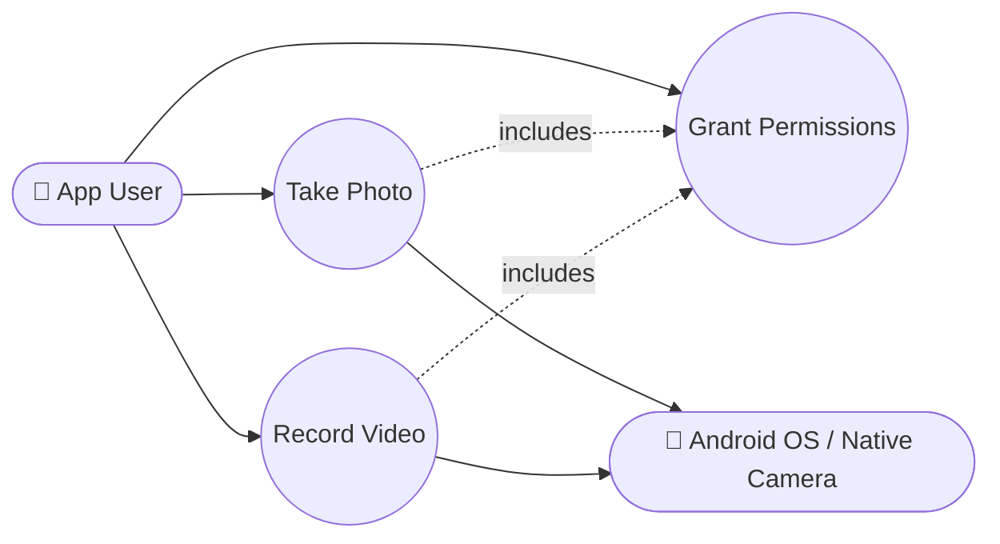

### 2.2 Class Diagram

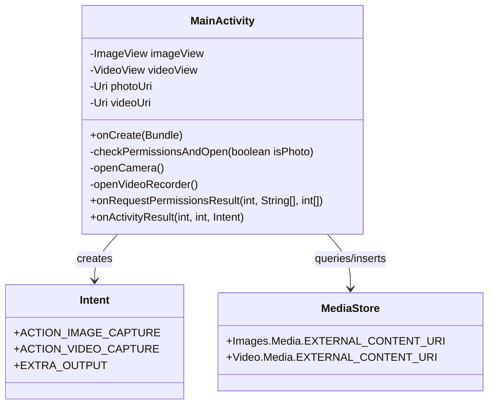

### 2.3 Object Diagram

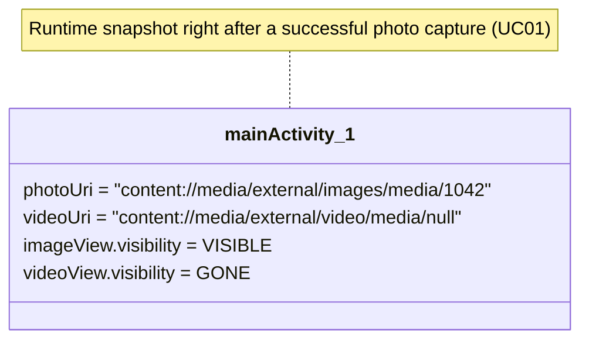

### 2.4 Sequence Diagram — Take Photo

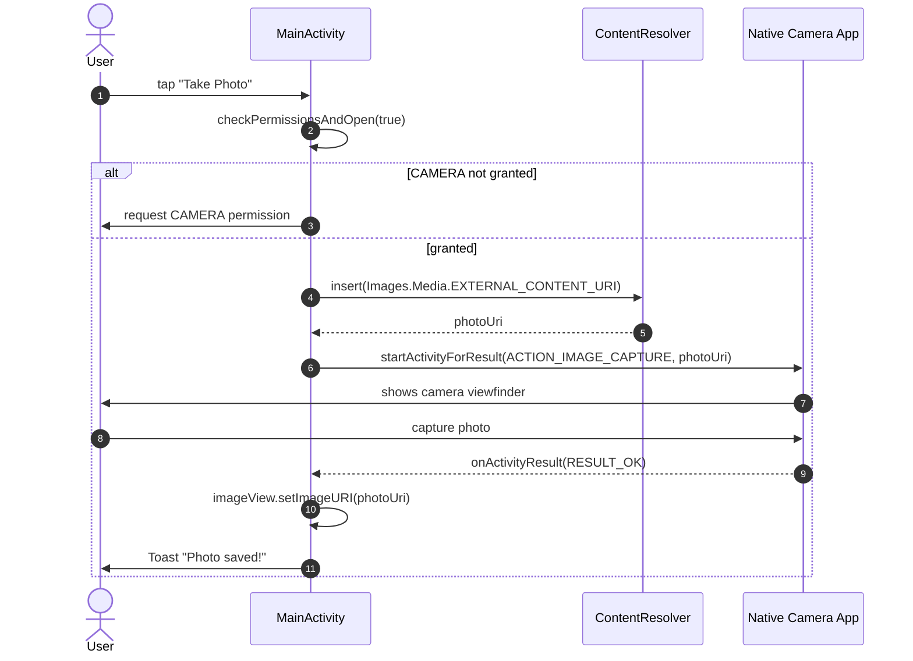

### 2.5 Communication Diagram

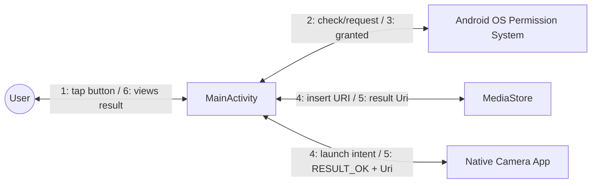

### 2.6 Activity Diagram — `checkPermissionsAndOpen`

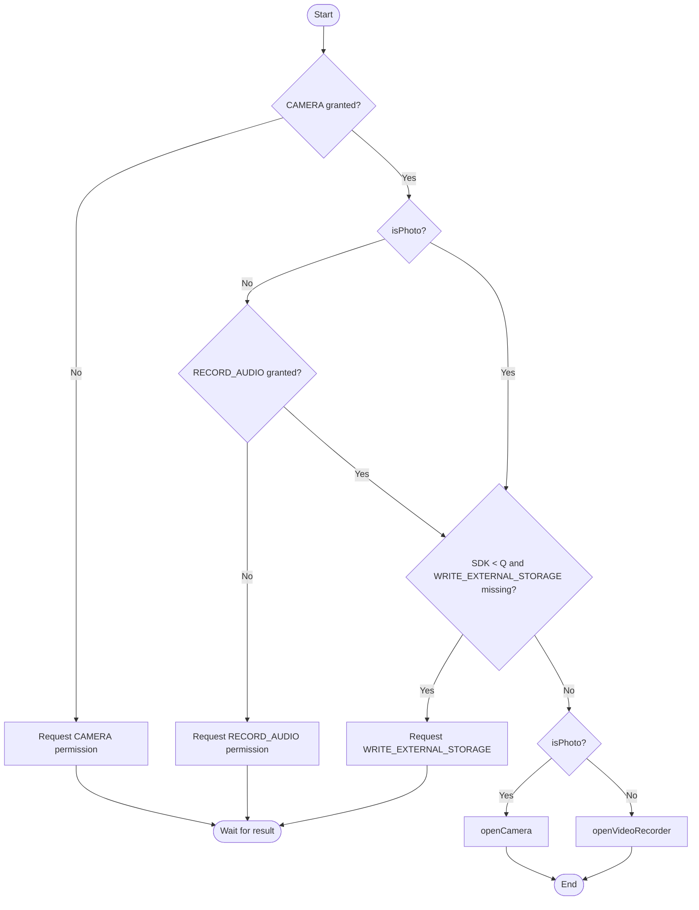

### 2.7 State Machine Diagram — Capture Session

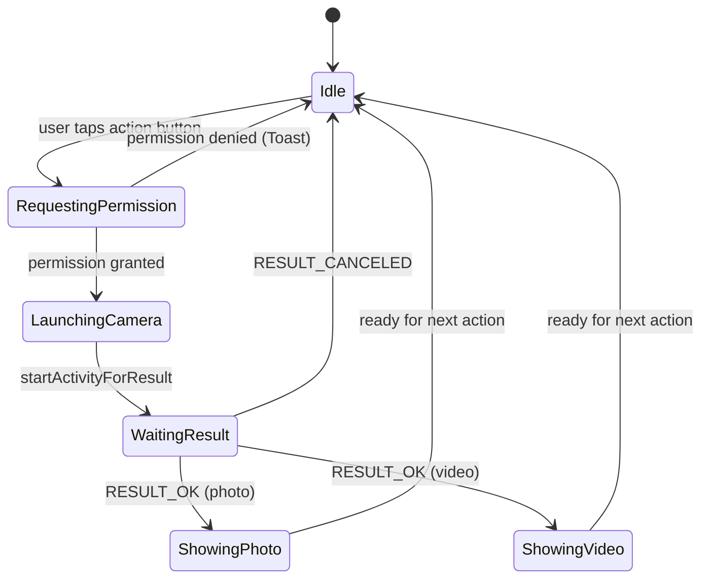

### 2.8 Component Diagram

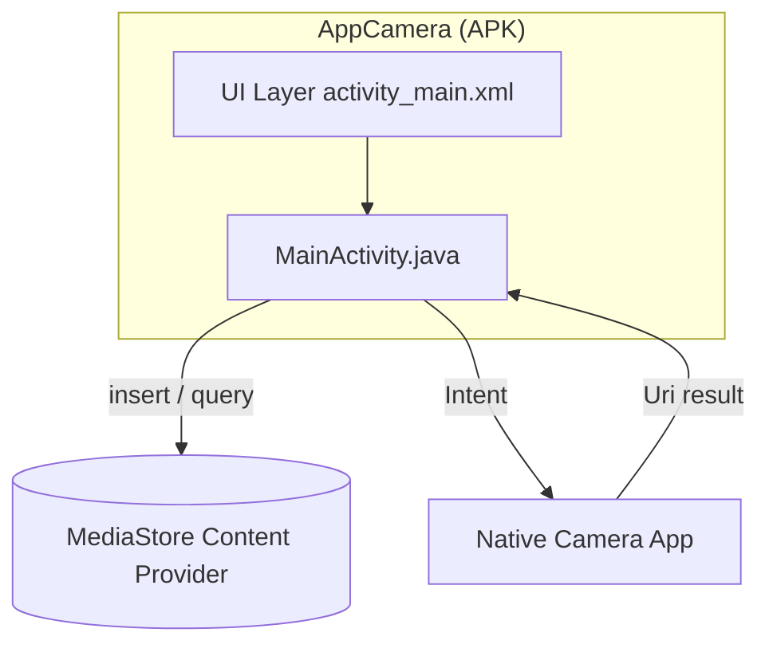

### 2.9 Deployment Diagram

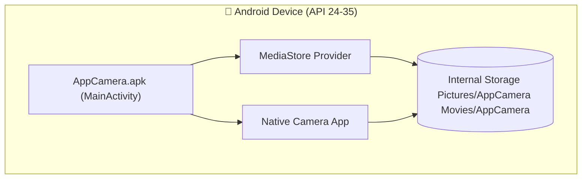

### 2.10 Package Diagram

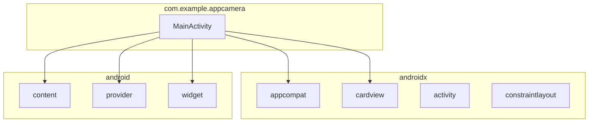

### 2.11 Composite Structure Diagram — MainActivity

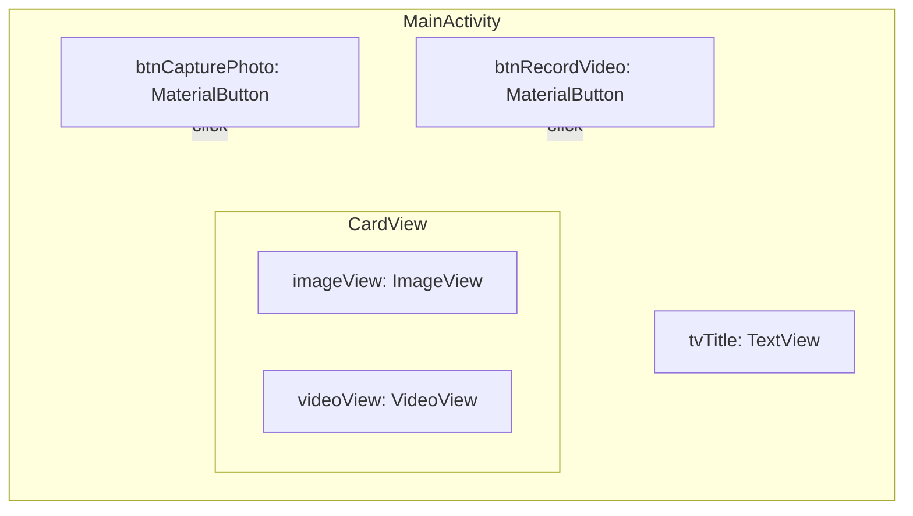

### 2.12 Interaction Overview Diagram

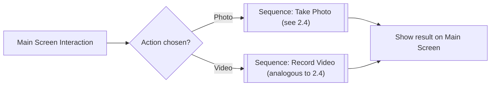

### 2.13 Timing Diagram — Permission Request

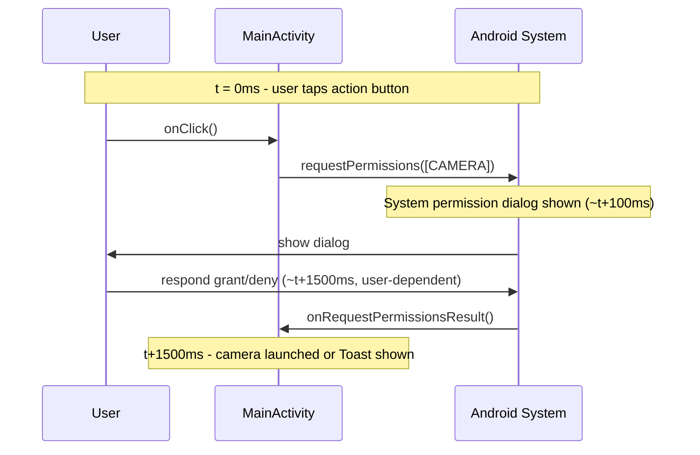

</details>

---

## 3. Data Modeling

<details>
<summary>▶️ <strong>Click to expand / collapse this section</strong></summary>

> AppCamera has no private database. The "data model" below describes the **MediaStore** records the app creates/reads, modeled as if they were entities for documentation completeness.

### 3.1 Entity-Relationship Diagram (DER)

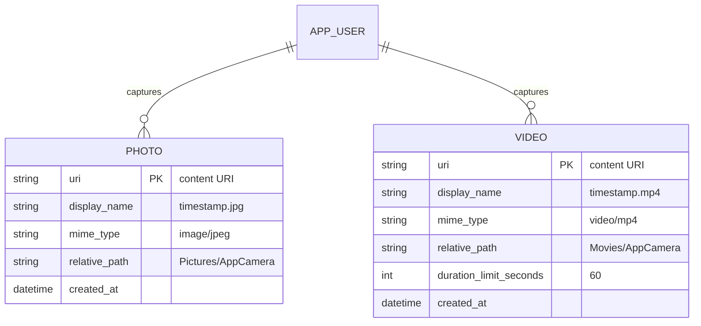

### 3.2 Conceptual Data Model

- A **User** captures **Media**, specialized as **Photo** or **Video**.
- Each **Media** item belongs to an **Album folder** (`AppCamera`) within the device's shared media collection.

### 3.3 Logical Data Model

| Entity | Attribute | Type | Notes |
|--------|-----------|------|-------|
| Photo | uri | URI | Primary identifier, generated by `MediaStore.insert` |
| Photo | display_name | String | `<timestamp>.jpg` |
| Photo | mime_type | String | `image/jpeg` |
| Photo | relative_path | String | `Pictures/AppCamera` |
| Video | uri | URI | Primary identifier, generated by `MediaStore.insert` |
| Video | display_name | String | `<timestamp>.mp4` |
| Video | mime_type | String | `video/mp4` |
| Video | relative_path | String | `Movies/AppCamera` |
| Video | duration_limit | Integer | 60 (seconds), passed as Intent extra, not persisted |

### 3.4 Physical Data Model

On Android Q+ these map to rows in the system `MediaProvider` SQLite database (outside the app's control), accessible via:

```
content://media/external/images/media   (table: images)
content://media/external/video/media     (table: video)
```

Relevant physical columns used by the app: `DISPLAY_NAME`, `MIME_TYPE`, `RELATIVE_PATH`. On Android < 10, files are written directly to `Environment.DIRECTORY_PICTURES/AppCamera` and `DIRECTORY_MOVIES/AppCamera` on the public external storage filesystem.

### 3.5 Data Dictionary

| Field | Source | Type | Format/Domain | Description |
|-------|--------|------|----------------|-------------|
| `photoUri` | `ContentResolver.insert` | `Uri` | `content://...` | Output location for the captured photo |
| `videoUri` | `ContentResolver.insert` | `Uri` | `content://...` | Output location for the captured video |
| `DISPLAY_NAME` | `MediaStore` column | String | `<epoch_ms>.jpg` / `.mp4` | File name shown in galleries |
| `MIME_TYPE` | `MediaStore` column | String | `image/jpeg`, `video/mp4` | Media type |
| `RELATIVE_PATH` | `MediaStore` column | String | `Pictures/AppCamera`, `Movies/AppCamera` | Storage sub-folder |
| `EXTRA_VIDEO_QUALITY` | Intent extra | Int | `1` (high) | Requested recording quality |
| `EXTRA_DURATION_LIMIT` | Intent extra | Int | `60` | Max recording length in seconds |

### 3.6 Data Flow Diagram (DFD)

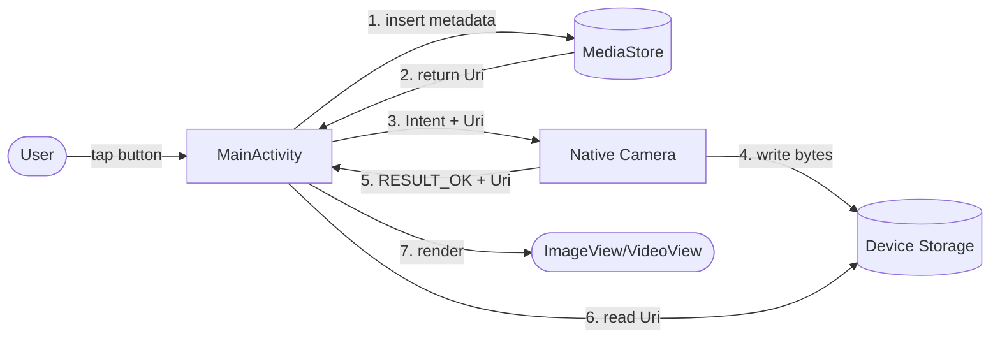

### 3.7 Data Lineage Diagram

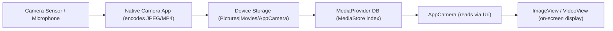

</details>

---

## 4. Architecture

<details>
<summary>▶️ <strong>Click to expand / collapse this section</strong></summary>

### 4.1 Architecture Overview

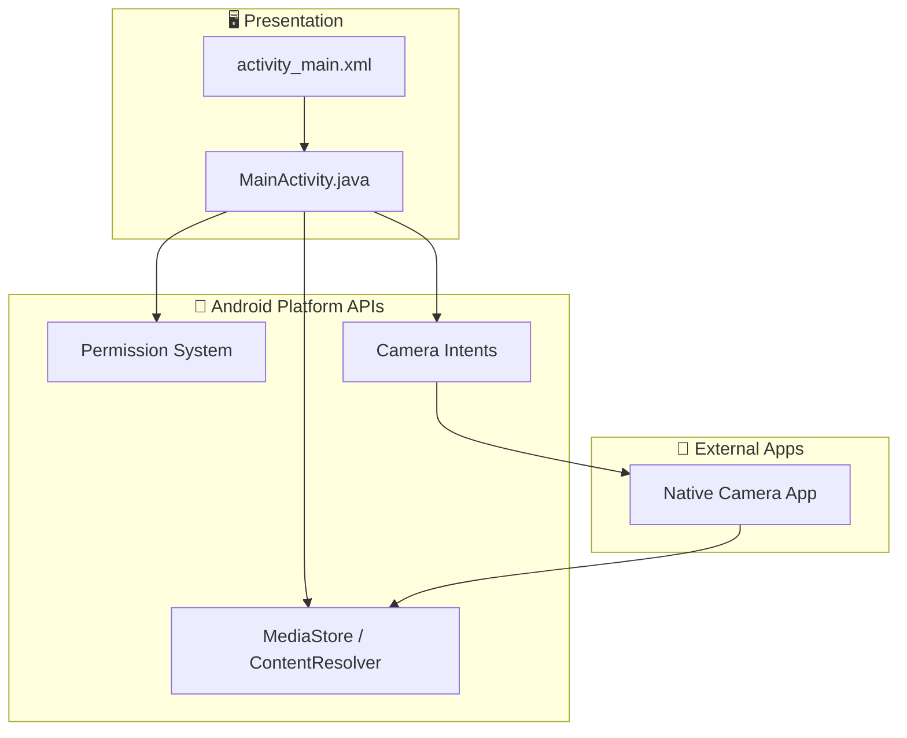

### 4.2 C4 Model

#### Level 1 — Context

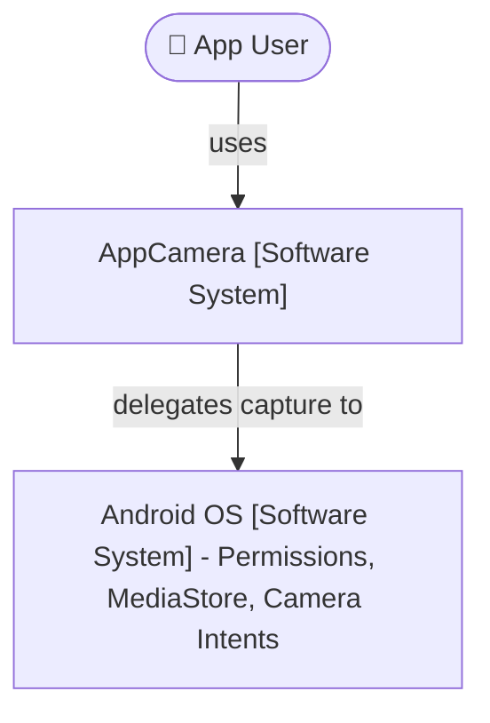

#### Level 2 — Containers

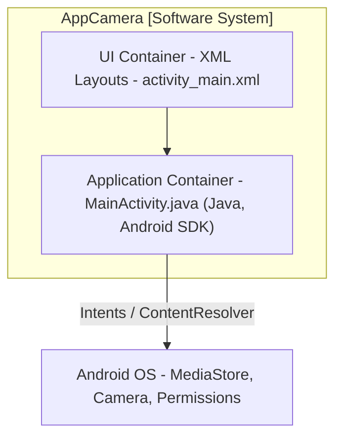

#### Level 3 — Components (MainActivity)

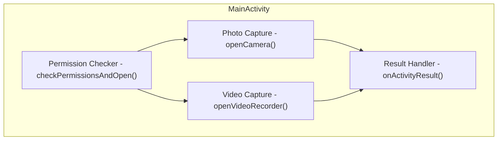

#### Level 4 — Code (key method)

```mermaid
classDiagram
    class MainActivity {
        -openVideoRecorder() void
    }
    note for MainActivity "openVideoRecorder(): 1. Build ContentValues (name, mime, path) 2. resolver.insert(Video.Media.EXTERNAL_CONTENT_URI, vals) 3. new Intent(ACTION_VIDEO_CAPTURE) 4. putExtra(EXTRA_OUTPUT, videoUri) 5. putExtra(EXTRA_VIDEO_QUALITY, 1) 6. putExtra(EXTRA_DURATION_LIMIT, 60) 7. startActivityForResult(intent, REQ_CAPTURE_VIDEO)"
```

### 4.3 Layered Architecture Diagram

```mermaid
flowchart TB
    L1["Presentation Layer - XML Layouts, Views"] --> L2["Application Layer - MainActivity (event handling)"]
    L2 --> L3["Platform Integration Layer - Intents, Permissions, ContentResolver"]
    L3 --> L4["OS / Hardware Layer - Camera, Microphone, Storage"]
```

### 4.4 Microservices Diagram

> **Not applicable.** AppCamera is a single offline mobile application with no backend services — there is no microservices topology. This section is documented for completeness across the author's portfolio.

```mermaid
flowchart LR
    Monolith["AppCamera (single Android module, no services)"]
```

### 4.5 Infrastructure / Network Diagram

```mermaid
flowchart LR
    subgraph Device["Android Device"]
        AppCamera
        OSServices["OS Services (MediaStore, Camera HAL)"]
    end
    AppCamera <--> OSServices
```

> No network connectivity is required by the application.

### 4.6 Cloud Deployment Diagram

> **Not applicable for runtime** (fully offline app). Distribution-only diagram:

```mermaid
flowchart LR
    Dev["Developer Machine (Android Studio)"] -->|build .apk/.aab| Store["Google Play Console (or direct APK distribution)"]
    Store -->|install| Device["End-user Android Device"]
```

### 4.7 Architecture Decision Records (ADR)

#### ADR-001: Use Camera Intents (MediaStore) instead of CameraX/Camera2

- **Status:** Accepted
- **Context:** The app needs to take photos and record videos with minimal complexity.
- **Decision:** Use `ACTION_IMAGE_CAPTURE` / `ACTION_VIDEO_CAPTURE` Intents delegating to the device's native camera app, with output redirected via `MediaStore`.
- **Consequences:** ✅ Much less code, no preview/lifecycle management, automatic compatibility across devices. ❌ Less control over capture UI/UX, no live preview inside the app, no custom filters.

#### ADR-002: Scoped Storage via MediaStore for Android Q+

- **Status:** Accepted
- **Context:** Android 10 (API 29) introduced Scoped Storage, restricting direct file path access.
- **Decision:** Use `ContentResolver.insert()` with `MediaStore.Images/Video.Media.EXTERNAL_CONTENT_URI` on API ≥ 29, falling back to `Environment.getExternalStoragePublicDirectory` on older versions.
- **Consequences:** ✅ Forward-compatible storage strategy. ❌ Two code paths (version-gated `if`) increase branching complexity.

### 4.8 System Integration Diagram

```mermaid
flowchart LR
    AppCamera -->|Intent ACTION_IMAGE_CAPTURE / ACTION_VIDEO_CAPTURE| AndroidCameraSubsystem["Android Camera Subsystem"]
    AppCamera -->|ContentResolver.insert/query| MediaStoreSystem["MediaStore System Service"]
    AppCamera -->|requestPermissions| PermissionSystem["Android Permission System"]
```

### 4.9 Event-Driven Flow Diagram

```mermaid
flowchart TB
    E1["Event: onClick (Take Photo)"] --> H1["Handler: checkPermissionsAndOpen(true)"]
    H1 --> E2["Event: onRequestPermissionsResult"]
    E2 --> H2["Handler: openCamera()"]
    H2 --> E3["Event: onActivityResult (REQ_CAPTURE_PHOTO)"]
    E3 --> H3["Handler: update ImageView + Toast"]
```

### 4.10 CI/CD Pipeline Diagram

> Suggested pipeline (not currently configured in the repository):

```mermaid
flowchart LR
    A[Push to main/feature branch] --> B[CI: Gradle build]
    B --> C[CI: Unit tests - app/src/test]
    C --> D[CI: Lint / Static analysis]
    D --> E[CI: Assemble debug APK]
    E --> F[Manual: Install on device/emulator]
    F --> G[Release: Assemble signed AAB]
    G --> H[Publish to Play Console - Internal Testing]
```

</details>

---

## 5. Business Processes

<details>
<summary>▶️ <strong>Click to expand / collapse this section</strong></summary>

### 5.1 BPMN — Capture Process

```mermaid
flowchart LR
    Start(("Start")) --> T1[/User selects capture type/]
    T1 --> G1{Permissions OK?}
    G1 -- No --> T2[Request permissions]
    T2 --> G1
    G1 -- Yes --> T3[Launch native camera]
    T3 --> T4[User captures media]
    T4 --> T5[App displays result]
    T5 --> End(("End"))
```

### 5.2 Flowchart — Overall App Flow

```mermaid
flowchart TD
    Open[Open AppCamera] --> Choose{Choose action}
    Choose -->|Take Photo| Photo[Photo capture flow]
    Choose -->|Record Video| Video[Video capture flow]
    Photo --> Preview[Show preview]
    Video --> Preview
    Preview --> Choose
```

### 5.3 As-Is Process Map (Before AppCamera)

```mermaid
flowchart LR
    A[User wants a quick photo/video] --> B[Open OS default Camera app]
    B --> C[Switch between photo/video mode manually]
    C --> D[Capture media]
    D --> E[Open Gallery app separately to review]
```

### 5.4 To-Be Process Map (With AppCamera)

```mermaid
flowchart LR
    A[User wants a quick photo/video] --> B[Open AppCamera]
    B --> C[Tap dedicated Photo or Video button]
    C --> D[Native camera opens pre-configured - video: 60s/high quality]
    D --> E[Result auto-displayed inside AppCamera]
```

### 5.5 SIPOC

| Suppliers | Inputs | Process | Outputs | Customers |
|-----------|--------|---------|---------|-----------|
| Android OS, Camera Hardware | User tap, runtime permissions | Capture Photo/Video via Intent | Photo (.jpg) / Video (.mp4) file + on-screen preview | App User |

</details>

---

## 6. UX/UI & Prototypes

<details>
<summary>▶️ <strong>Click to expand / collapse this section</strong></summary>

### 6.1 Persona

| Attribute | Value |
|-----------|-------|
| **Name** | Marcos, 24 |
| **Role** | Computer Science student / junior Android developer |
| **Goal** | Quickly capture a photo or short video to test/demo an app feature |
| **Frustration** | Heavyweight camera libraries with steep learning curves for simple capture needs |
| **How AppCamera helps** | Provides a copy-paste-ready, minimal Intent-based capture flow |

### 6.2 User Journey Map

```mermaid
journey
    title Take a Photo with AppCamera
    section Discover
      Open app: 5: User
    section Act
      Tap Take Photo: 5: User
      Grant Camera permission: 3: User
    section Capture
      Native camera opens: 5: User
      Take the photo: 5: User
    section Review
      Return to AppCamera: 5: User
      See photo preview and toast: 5: User
```

### 6.3 Wireframe (ASCII)

```
┌──────────────────────────────┐
│           AppCamera           │
├──────────────────────────────┤
│                                │
│      [ Image / Video      ]   │
│      [    Preview Area    ]   │
│                                │
├──────────────────────────────┤
│   📸  Take Photo               │
├──────────────────────────────┤
│   📹  Record Video             │
└──────────────────────────────┘
```

### 6.4 Mockup

> High-fidelity mockup reference: gradient background (`bg_gradient.xml`), rounded `CardView` preview (16dp radius, 8dp elevation), Material buttons with leading icons (`ic_camera`, `ic_videocam`) and 24dp corner radius, per `activity_main.xml`.

### 6.5 Navigable Prototype

> Not published as an external prototype file. The running app itself **is** the high-fidelity, navigable prototype — build and run via [How to Run](#-how-to-run) to navigate the real (single-screen) flow.

### 6.6 Screen Flow / Navigation Map

```mermaid
flowchart LR
    Main["Main Screen (MainActivity)"] -->|Take Photo| NativeCam1["OS Camera (Photo)"]
    Main -->|Record Video| NativeCam2["OS Camera (Video)"]
    NativeCam1 -->|result| Main
    NativeCam2 -->|result| Main
```

### 6.7 Design System / Style Guide

| Token | Value | Usage |
|-------|-------|-------|
| Background | `bg_gradient.xml` (gradient drawable) | Root layout background |
| Primary text color | `@color/textPrimary` | Title text |
| Accent color | `@color/buttonAccent` | Button background tint |
| Corner radius (buttons) | `24dp` | `MaterialButton` `app:cornerRadius` |
| Corner radius (preview card) | `16dp` | `CardView` `app:cardCornerRadius` |
| Elevation (preview card) | `8dp` | `CardView` `app:cardElevation` |
| Iconography | `ic_camera.xml`, `ic_videocam.xml` | Button leading icons |
| Typography | 24sp bold (title), 16sp (buttons) | `tvTitle`, `MaterialButton` |

### 6.8 Card Sorting

> With a single screen and two primary actions, a formal card-sorting exercise is not applicable. The two actions ("Take Photo" / "Record Video") were grouped as **siblings under a single "Capture" category**, both equally prominent, which is the natural outcome a card-sorting session would produce for this scope.

### 6.9 Empathy Map

| Quadrant | Content |
|----------|---------|
| **Says** | "I just want to quickly snap a photo to test this." |
| **Thinks** | "Will this app ask for a million permissions?" |
| **Does** | Taps the button, grants the permission dialog, captures media. |
| **Feels** | Reassured when the preview appears immediately and only relevant permissions are requested. |

### 6.10 Product Roadmap

```mermaid
gantt
    title AppCamera Roadmap
    dateFormat YYYY-MM-DD
    section v1.0 (Current)
    Photo capture (Intent)       :done, 2024-01-01, 30d
    Video capture (Intent)       :done, 2024-01-15, 30d
    Permission handling          :done, 2024-01-15, 30d
    section v1.1 (Planned)
    In-app media gallery         :2026-07-01, 30d
    Share captured media         :2026-07-15, 20d
    section v1.2 (Backlog)
    Camera switch front/back      :2026-09-01, 30d
    Dark mode                    :2026-09-15, 15d
```

</details>

---

## 7. Technical Documentation

<details>
<summary>▶️ <strong>Click to expand / collapse this section</strong></summary>

### 7.1 API Documentation

> AppCamera exposes **no network/REST API**. The relevant "API surface" is the **Android Intent contract** it consumes:

| Intent Action | Required Extras | Returns |
|---------------|------------------|---------|
| `MediaStore.ACTION_IMAGE_CAPTURE` | `EXTRA_OUTPUT` (Uri) | `RESULT_OK` + photo written to `EXTRA_OUTPUT` |
| `MediaStore.ACTION_VIDEO_CAPTURE` | `EXTRA_OUTPUT` (Uri), `EXTRA_VIDEO_QUALITY`, `EXTRA_DURATION_LIMIT` | `RESULT_OK` + video written to `EXTRA_OUTPUT` |

### 7.2 User Manual

1. Open the **AppCamera** app.
2. Tap **📸 Take Photo** to capture a picture, or **📹 Record Video** to record a clip (max 60s).
3. Grant the requested permissions on first use (Camera, and Audio for video).
4. Use the device's native camera UI to capture and confirm.
5. Return automatically to AppCamera to view the result in the preview area.

### 7.3 Technical / Operational Manual

| Topic | Detail |
|-------|--------|
| Build tool | Gradle (Kotlin DSL), via `gradlew` / `gradlew.bat` |
| Min/Target/Compile SDK | 24 / 35 / 35 |
| Java version | 11 |
| Key dependencies | `appcompat`, `material`, `activity`, `constraintlayout` |
| Required runtime permissions | `CAMERA`, `RECORD_AUDIO`, `WRITE_EXTERNAL_STORAGE` (≤ API 28) |
| Common issue: camera does not open | Verify CAMERA permission was granted in system settings. |
| Common issue: video not playing | Verify the emulator's virtual camera produced a valid `.mp4` (some AVDs require webcam passthrough enabled). |

### 7.4 Changelog

```markdown
## [1.0.0] - Initial Release
### Added
- Take Photo via ACTION_IMAGE_CAPTURE with MediaStore output.
- Record Video via ACTION_VIDEO_CAPTURE (60s limit, high quality).
- Runtime permission handling for CAMERA, RECORD_AUDIO, WRITE_EXTERNAL_STORAGE.
- Auto preview of captured photo/video in ImageView/VideoView.
- Custom gradient UI with vector icons.
```

### 7.5 Installation / Deploy Guide

See [How to Run](#-how-to-run) — clone, open in Android Studio, sync Gradle, run on device/emulator, grant permissions.

### 7.6 Runbook / Operations Playbook

| Symptom | Likely Cause | Action |
|---------|--------------|--------|
| App crashes on launch | Missing dependency / Gradle sync failure | Re-run `Build → Sync Project with Gradle Files`; check `libs.versions.toml` |
| "Permission denied" toast on every attempt | User permanently denied a permission ("Don't ask again") | Manually enable Camera/Microphone permission in Android system Settings → Apps → AppCamera |
| Camera opens but result is blank | Emulator without configured virtual camera | Enable webcam/virtual camera in AVD `Extended Controls → Camera` |
| Video does not autoplay | `VideoView` codec issue on emulator | Test on a physical device, or use an AVD image with Google Play services |

### 7.7 Coding Standards

- Java naming conventions: `PascalCase` for classes (`MainActivity`), `camelCase` for methods/fields.
- Request codes defined as named `private static final int` constants (`REQ_CAM`, `REQ_CAPTURE_PHOTO`, etc.).
- One `Activity` per screen; UI defined declaratively in XML layouts, not built programmatically.
- Permission checks centralized in a single method (`checkPermissionsAndOpen`) to avoid duplication.

### 7.8 Database Documentation

> No application-managed database. All persisted state lives in the OS-managed **MediaStore** (`MediaProvider`), accessed exclusively through `ContentResolver`. See [3. Data Modeling](#3-data-modeling) for the relevant schema fields.

</details>

---

## 8. Project Management

<details>
<summary>▶️ <strong>Click to expand / collapse this section</strong></summary>

### 8.1 Project Charter

| Item | Description |
|------|-------------|
| Project Name | AppCamera |
| Sponsor | Self-directed learning project (portfolio) |
| Project Manager / Developer | Victor H. J. Santiago |
| Objective | Build a working reference for Android camera/video capture via Intents |
| Success Criteria | App compiles, runs, and both capture flows work on emulator/device |
| Timeline | Single development iteration (see [Roadmap](#610-product-roadmap)) |

### 8.2 Project Scope

- **In scope:** Photo capture, video capture (60s/high quality), runtime permission handling, result preview, custom UI styling.
- **Out of scope:** In-app gallery, editing, sharing, cloud sync, multi-camera support, automated UI tests.

### 8.3 Work Breakdown Structure (WBS)

```
1. AppCamera
   1.1 UI Layer
       1.1.1 activity_main.xml layout
       1.1.2 Gradient background & icons
   1.2 Capture Logic
       1.2.1 Permission handling
       1.2.2 Photo capture (openCamera)
       1.2.3 Video capture (openVideoRecorder)
       1.2.4 Result handling (onActivityResult)
   1.3 Build & Config
       1.3.1 Gradle setup (build.gradle.kts)
       1.3.2 AndroidManifest permissions/features
   1.4 Documentation
       1.4.1 README (EN/PT/ES)
```

### 8.4 Schedule (Gantt)

```mermaid
gantt
    title AppCamera - Development Schedule
    dateFormat YYYY-MM-DD
    section Setup
    Project scaffolding              :done, 2024-01-01, 5d
    section Core
    UI layout                        :done, 2024-01-06, 5d
    Permission handling              :done, 2024-01-11, 4d
    Photo capture                    :done, 2024-01-15, 5d
    Video capture                    :done, 2024-01-20, 5d
    section Wrap-up
    Manual testing on emulator       :done, 2024-01-25, 3d
    Documentation                    :active, 2026-06-13, 3d
```

### 8.5 Risk Management Plan

| Risk | Probability | Impact | Mitigation |
|------|------------|--------|------------|
| Permission denied permanently by user | Medium | High (feature unusable) | Show clear Toast explaining required permission; document in user manual |
| Emulator without virtual camera | Medium | Medium (cannot test) | Document AVD camera setup in [Runbook](#76-runbook--operations-playbook) |
| Android version fragmentation (storage API) | Low | Medium | Version-gated code path (`Build.VERSION.SDK_INT >= Q`) |

### 8.6 Risk Matrix

```mermaid
quadrantChart
    title Risk Matrix
    x-axis Low Impact --> High Impact
    y-axis Low Probability --> High Probability
    quadrant-1 Monitor
    quadrant-2 Mitigate Urgently
    quadrant-3 Accept
    quadrant-4 Mitigate
    Permission denied permanently: [0.7, 0.5]
    Emulator camera missing: [0.4, 0.5]
    Storage API fragmentation: [0.5, 0.2]
```

### 8.7 Communication Plan

| Audience | Channel | Frequency |
|----------|---------|-----------|
| Recruiters / reviewers | GitHub README (this document) | On demand |
| Future contributors | GitHub Issues / PRs | As needed |

### 8.8 RACI Matrix

| Activity | Developer (Victor) | Reviewer | End User |
|----------|:---:|:---:|:---:|
| Design UI | R/A | C | I |
| Implement capture logic | R/A | C | I |
| Test on emulator/device | R/A | I | I |
| Approve documentation | R/A | C | I |

> R = Responsible, A = Accountable, C = Consulted, I = Informed

### 8.9 SWOT Analysis

| Strengths | Weaknesses |
|-----------|------------|
| Simple, well-understood Intent-based approach; minimal dependencies | No custom camera preview/UX; limited to native camera UI |

| Opportunities | Threats |
|----------------|---------|
| Extendable to gallery/sharing features; good teaching example | OS-level API changes (Scoped Storage) may require future updates |

### 8.10 Business Case

A minimal-effort, high-clarity demonstration of Android media-capture fundamentals, useful as: (1) a portfolio artifact showing Intent/permission handling competence, (2) a starter template for apps needing quick capture functionality without camera-library overhead.

### 8.11 Feasibility / ROI Analysis

| Factor | Assessment |
|--------|------------|
| Technical feasibility | High — relies entirely on stable, well-documented Android APIs |
| Effort (ROI) | Very low effort (single Activity) for high educational/demo value |
| Maintenance cost | Low — no backend, no external services |

### 8.12 Change Management Plan

- All changes proposed via feature branches and Pull Requests (see [How to Contribute](#-how-to-contribute)).
- Breaking changes to the permission flow or Intent contracts must update [1.1 Functional Requirements](#11-functional-requirements-fr) and the [Changelog](#74-changelog).

### 8.13 Contingency Plan

| Scenario | Contingency |
|----------|-------------|
| Native camera app unavailable on device | App cannot proceed (no fallback camera implementation); documented as a known limitation. |
| `MediaStore.insert` returns `null` | Defensive check recommended before launching the Intent (currently not implemented — see [Product Backlog](#114-product-backlog) for tech-debt item). |

### 8.14 Lessons Learned

- Delegating to native camera apps via Intents dramatically reduces implementation complexity versus CameraX/Camera2.
- Scoped Storage requires explicit version-gated logic (`Build.VERSION_CODES.Q`) — a recurring pattern across Android media apps.
- Centralizing permission checks in one method avoids duplicated, error-prone permission logic across multiple entry points.

</details>

---

## 9. Business Analysis

<details>
<summary>▶️ <strong>Click to expand / collapse this section</strong></summary>

### 9.1 Business Model Canvas

| Block | Content |
|-------|---------|
| **Key Partners** | Android OS / OEM camera apps |
| **Key Activities** | Maintaining Intent-based capture flow, permission handling |
| **Value Proposition** | Minimal, reliable photo/video capture reference implementation |
| **Customer Relationships** | Open-source repository, documentation-driven |
| **Customer Segments** | Android developers, students, portfolio reviewers |
| **Key Resources** | Java/Android SDK knowledge, MediaStore APIs |
| **Channels** | GitHub repository |
| **Cost Structure** | Developer time only (no infrastructure cost) |
| **Revenue Streams** | Non-commercial (portfolio/educational) |

### 9.2 Stakeholder Analysis

| Stakeholder | Interest | Influence |
|-------------|----------|-----------|
| Developer (Victor H. J. Santiago) | Build portfolio, demonstrate Android skills | High |
| Recruiters / Reviewers | Assess code quality and documentation | Medium |
| End Users / Students | Learn from / reuse the implementation | Low |

### 9.3 Impact Analysis

| Change | Affected Areas |
|--------|-----------------|
| Adding an in-app gallery | UI layout, new Activity/Fragment, MediaStore query logic |
| Targeting a higher `minSdk` | Removal of pre-Q storage code path, simplified permission logic |
| Adding cloud backup | New permissions (INTERNET), privacy policy update, LGPD/GDPR review |

### 9.4 Business Capability Model

```mermaid
flowchart TB
    subgraph Capabilities["AppCamera Capabilities"]
        C1[Media Capture]
        C2[Permission Management]
        C3[Media Presentation]
    end
    C1 --> C3
    C2 --> C1
```

</details>

---

## 10. Security & Compliance

<details>
<summary>▶️ <strong>Click to expand / collapse this section</strong></summary>

### 10.1 Threat Modeling (STRIDE)

| Threat Category | Applicable? | Notes / Mitigation |
|------------------|-------------|---------------------|
| **S**poofing | Low | No authentication subsystem exists. |
| **T**ampering | Low | Media files stored via `MediaStore`, governed by OS file permissions. |
| **R**epudiation | N/A | Single-user local app, no audit requirements. |
| **I**nformation Disclosure | Medium | Captured photos/videos may contain sensitive personal data; stored unencrypted in shared storage (`Pictures/AppCamera`, `Movies/AppCamera`), readable by other apps with media permissions. |
| **D**enial of Service | Low | No server component; local resource exhaustion only (device storage full). |
| **E**levation of Privilege | Low | App only requests the minimum permissions it uses (`CAMERA`, `RECORD_AUDIO`, `WRITE_EXTERNAL_STORAGE`). |

### 10.2 Access Control / Permission Matrix (RBAC-style)

| "Role" | CAMERA | RECORD_AUDIO | WRITE_EXTERNAL_STORAGE |
|--------|:---:|:---:|:---:|
| App User (grants at runtime) | ✅ required for any capture | ✅ required for video only | ✅ required on API ≤ 28 |
| AppCamera (declared in Manifest) | ✅ | ✅ | ✅ (maxSdkVersion 28) |
| Other apps | ❌ no access to AppCamera's runtime state | ❌ | ⚠️ may read `Pictures/AppCamera` if they hold storage/media permissions (shared storage) |

### 10.3 Information Security Policy (Project-Level)

- The app must request only the permissions strictly necessary for the features in use ([1.1 FR](#11-functional-requirements-fr)).
- No telemetry, analytics SDK, or network transmission of captured media is included.
- Captured media remains under the user's control in standard shared storage locations, removable via the device's Gallery/Files app like any other media.

### 10.4 LGPD / GDPR Compliance Notes

| Aspect | Status |
|--------|--------|
| Personal data collected | Images/audio captured by the user via device camera/microphone (potentially containing personal data of the user or third parties). |
| Data controller | The end user (data stays on their device — AppCamera does not transmit or process it server-side). |
| Legal basis | Not applicable in the traditional sense — purely local, user-initiated capture, no processing by the app developer. |
| User rights (access/deletion) | Fully available via the OS Gallery/Files app, since data is stored as standard media files. |
| Recommendation if cloud features are added later | Re-assess this section; add explicit consent flows, a privacy policy, and Play Console Data Safety disclosures. |

### 10.5 Incident Response Plan

| Step | Action |
|------|--------|
| 1. Detection | Issue reported via GitHub Issues (e.g., a permission/security bug). |
| 2. Triage | Developer assesses severity (e.g., does it expose user media unexpectedly?). |
| 3. Containment | Revert/disable the offending code path via a hotfix branch. |
| 4. Remediation | Patch released, [Changelog](#74-changelog) updated. |
| 5. Post-mortem | Add entry to [Lessons Learned](#814-lessons-learned). |

</details>

---

<div align="center">

*Made with 📸 and Java by **Victor H. J. Santiago***

</div>
