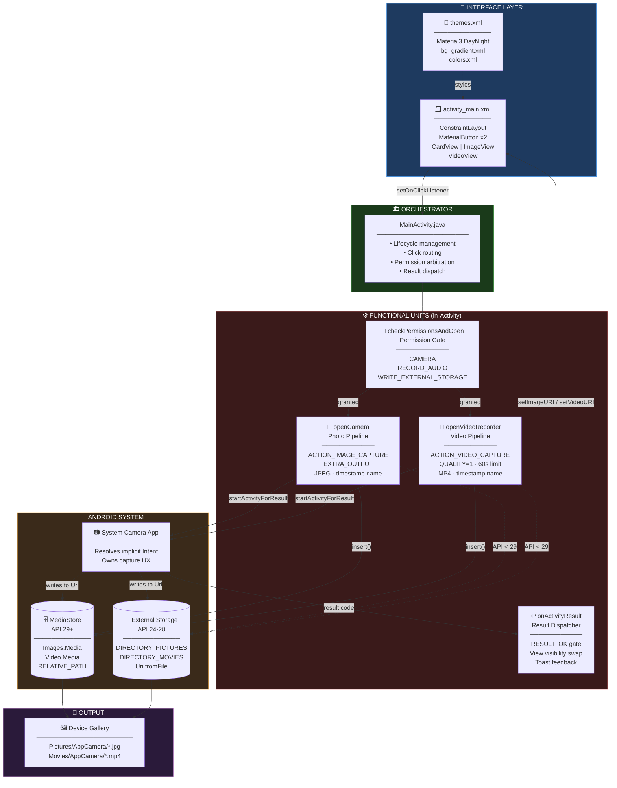
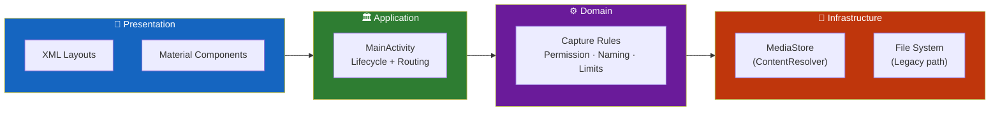
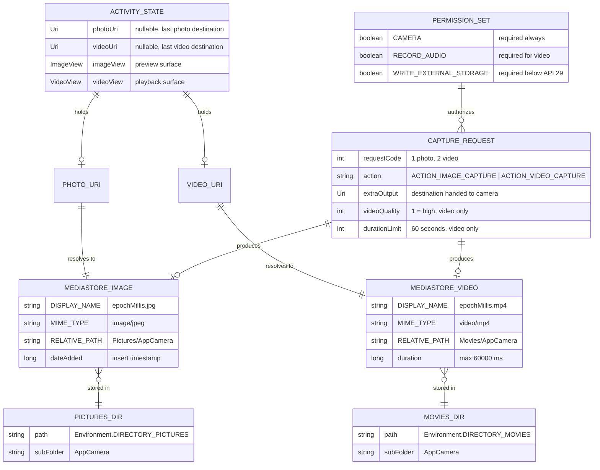
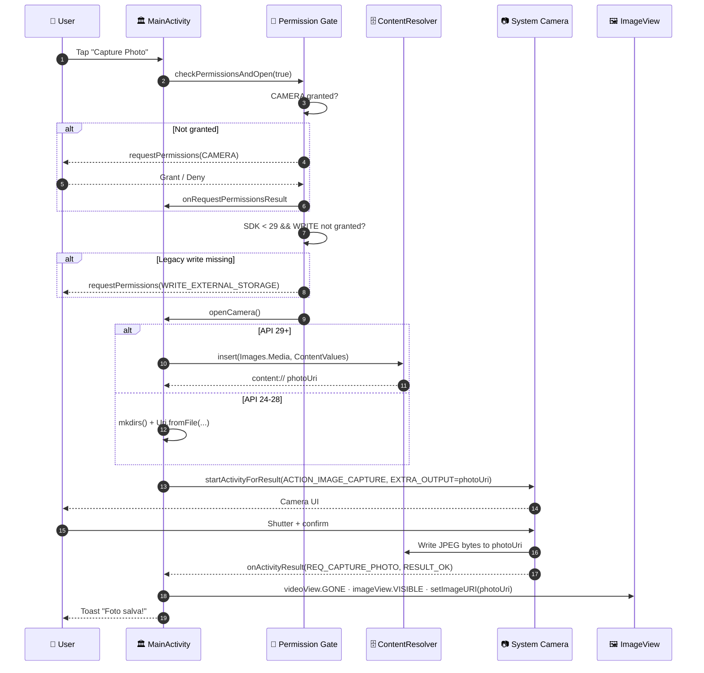
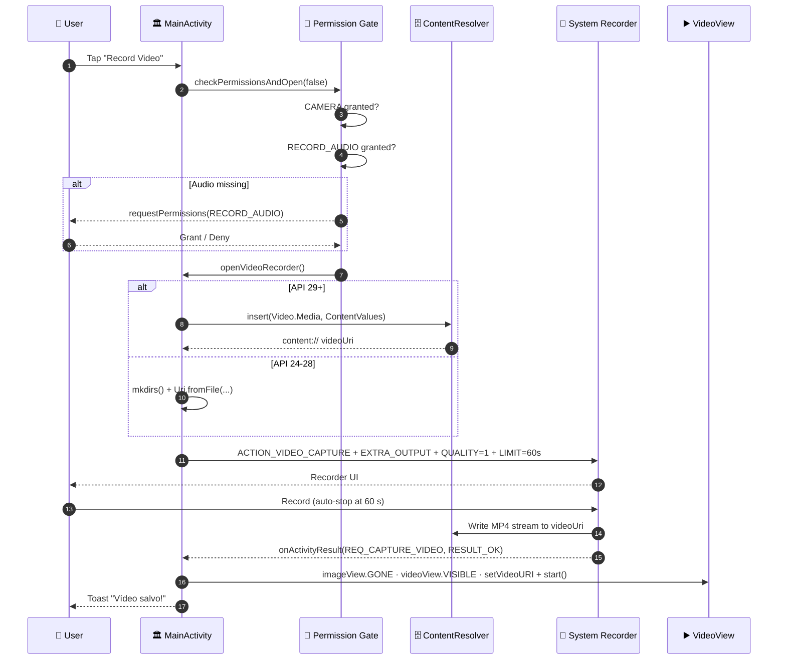
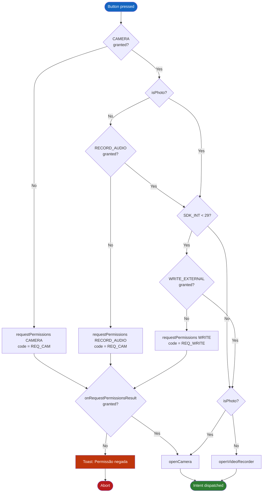
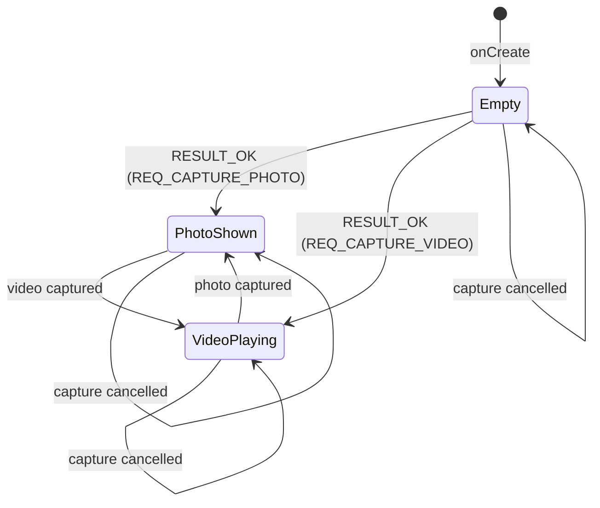
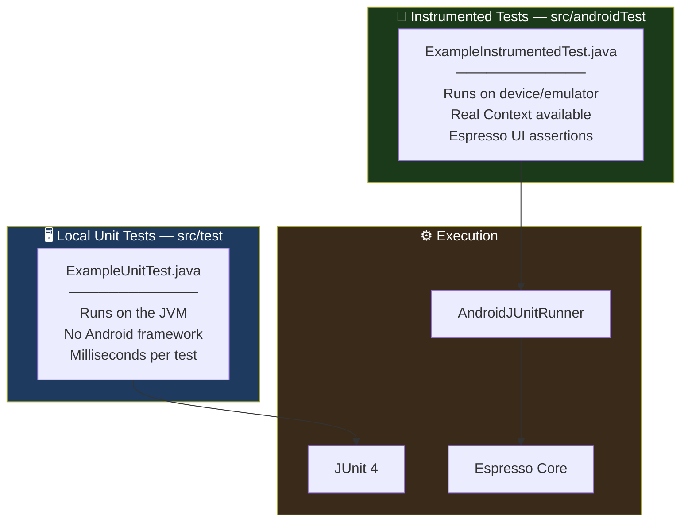

<div align="center">

**🌐 Choose Language / Selecione o Idioma / Elija el Idioma**

[](README.md)&nbsp;&nbsp;&nbsp;[](README_PT.md)&nbsp;&nbsp;&nbsp;[](README_ES.md)

</div>

---

<div align="center">

```
 █████╗ ██████╗ ██████╗  ██████╗ █████╗ ███╗   ███╗███████╗██████╗  █████╗
██╔══██╗██╔══██╗██╔══██╗██╔════╝██╔══██╗████╗ ████║██╔════╝██╔══██╗██╔══██╗
███████║██████╔╝██████╔╝██║     ███████║██╔████╔██║█████╗  ██████╔╝███████║
██╔══██║██╔═══╝ ██╔═══╝ ██║     ██╔══██║██║╚██╔╝██║██╔══╝  ██╔══██╗██╔══██║
██║  ██║██║     ██║     ╚██████╗██║  ██║██║ ╚═╝ ██║███████╗██║  ██║██║  ██║
╚═╝  ╚═╝╚═╝     ╚═╝      ╚═════╝╚═╝  ╚═╝╚═╝     ╚═╝╚══════╝╚═╝  ╚═╝╚═╝  ╚═╝
                Native Android Photo & Video Capture Application
```

---

[](https://developer.android.com/)
[](https://openjdk.org/)
[](https://gradle.org/)
[](https://m3.material.io/)
[](https://developer.android.com/training/data-storage/shared/media)
[]()
[]()

<br/>

> **A native Android application for capturing photos and recording video**
> built on Intent delegation, runtime permissions, and scoped storage via MediaStore.

<br/>


-10B981?style=flat-square)
-FF6B35?style=flat-square)


</div>

---

## 📑 Table of Contents

<details>
<summary>▶️ <strong>Click to expand / collapse this section</strong></summary>

<table>
<tr>
<td valign="top" width="50%">

**🏗️ System**
- [Overview](#-overview)
- [System Architecture](#-system-architecture)
- [Technology Stack](#-technology-stack)
- [Design Patterns](#-design-patterns-applied)
- [Project Structure](#-project-structure)

**📦 Modules**
- [MainActivity — Orchestrator](#-mainactivity--main-orchestrator)
- [Permission Gate](#-permission-gate--runtime-authorization)
- [Photo Capture](#-photo-capture--image-pipeline)
- [Video Capture](#-video-capture--recording-pipeline)
- [Media Preview](#-media-preview--playback-surface)
- [Storage Adapter](#-storage-adapter--mediastore--legacy)
- [Theme & Resources](#-theme--resources--material-design-3)

</td>
<td valign="top" width="50%">

**💼 Business**
- [Business Rules](#-business-rules)
- [Functional Requirements](#-functional-requirements)
- [Non-Functional Requirements](#-non-functional-requirements)

**📐 Design**
- [Data Model](#-data-model)
- [System Flows](#-system-flows)
- [Photo Capture Flow](#photo-capture-flow)
- [Video Capture Flow](#video-capture-flow)
- [Permission Flow](#permission-request-flow)

**🔐 Security & Ops**
- [Security](#-security)
- [Installation & Execution](#-installation--execution)
- [Automated Tests](#-automated-tests)
- [Metrics & Monitoring](#-metrics--monitoring)
- [Known Limitations](#-known-limitations)

</td>
</tr>
</table>

---

</details>

## 🌟 Overview

<details>
<summary>▶️ <strong>Click to expand / collapse this section</strong></summary>

**AppCamera** is a native Android application written in **Java** that captures photographs and records video by delegating to the device's system camera application through **implicit Intents**, then persists the resulting media into the public gallery using the **MediaStore** API.

Rather than reimplementing a camera preview stack (CameraX/Camera2), the application deliberately adopts the **Intent delegation model**: the OS camera app — already optimized, already trusted by the user, already handling autofocus, HDR, stabilization and lens selection — performs the capture, and AppCamera owns the *destination*, the *permission contract*, and the *preview surface*.

The result is an application that is small, dependency-light, forward-compatible across **Android 7.0 (API 24) through Android 15 (API 35)**, and correct with respect to the **scoped storage** rules introduced in Android 10 (API 29).

### 🎯 System Objectives

| Objective | Description |
|-----------|-------------|
| 📸 **Photo Capture** | Capture still images at full device resolution via `ACTION_IMAGE_CAPTURE` |
| 🎥 **Video Recording** | Record video with a 60-second cap and high-quality profile via `ACTION_VIDEO_CAPTURE` |
| 🔐 **Runtime Permissions** | Sequential, non-blocking request of `CAMERA`, `RECORD_AUDIO` and legacy `WRITE_EXTERNAL_STORAGE` |
| 🗄️ **Scoped Storage** | Dual-path persistence: `MediaStore` on API 29+, direct `File` I/O on API 24–28 |
| 🖼️ **Instant Preview** | In-app display of the captured photo (`ImageView`) or playback of the recording (`VideoView`) |
| 🎨 **Material Design 3** | Material components, gradient background, adaptive icons, light and dark themes |
| 📁 **Gallery Integration** | Media written to `Pictures/AppCamera` and `Movies/AppCamera`, visible to every gallery app |
| 🧪 **Quality** | Instrumented and unit test scaffolding via JUnit 4 and Espresso |

---

</details>

## 🏗️ System Architecture

<details>
<summary>▶️ <strong>Click to expand / collapse this section</strong></summary>

### Module Diagram


```mermaid
flowchart TB
    subgraph UI["📱  INTERFACE LAYER"]
        direction LR
        LAYOUT["🪟 activity_main.xml\n─────────────\nConstraintLayout\nMaterialButton x2\nCardView | ImageView\nVideoView"]
        THEME["🎨 themes.xml\n─────────────\nMaterial3 DayNight\nbg_gradient.xml\ncolors.xml"]
    end

    subgraph ORCH["🏛️  ORCHESTRATOR"]
        MAIN["MainActivity.java\n─────────────────────\n• Lifecycle management\n• Click routing\n• Permission arbitration\n• Result dispatch"]
    end

    subgraph CORE["⚙️  FUNCTIONAL UNITS  (in-Activity)"]
        direction TB
        PERM["🔐 checkPermissionsAndOpen\nPermission Gate\n────────────\nCAMERA\nRECORD_AUDIO\nWRITE_EXTERNAL_STORAGE"]
        PHOTO["📸 openCamera\nPhoto Pipeline\n────────────\nACTION_IMAGE_CAPTURE\nEXTRA_OUTPUT\nJPEG · timestamp name"]
        VIDEO["🎥 openVideoRecorder\nVideo Pipeline\n────────────\nACTION_VIDEO_CAPTURE\nQUALITY=1 · 60s limit\nMP4 · timestamp name"]
        RESULT["↩️ onActivityResult\nResult Dispatcher\n────────────\nRESULT_OK gate\nView visibility swap\nToast feedback"]
    end

    subgraph SYS["🤖  ANDROID SYSTEM"]
        direction LR
        CAMAPP["📷 System Camera App\n─────────────\nResolves implicit Intent\nOwns capture UX"]
        MSTORE[("🗄️ MediaStore\nAPI 29+\n─────────────\nImages.Media\nVideo.Media\nRELATIVE_PATH")]
        FILESYS[("📂 External Storage\nAPI 24-28\n─────────────\nDIRECTORY_PICTURES\nDIRECTORY_MOVIES\nUri.fromFile")]
    end

    subgraph OUT["💾  OUTPUT"]
        GALLERY["🖼️ Device Gallery\n──────────────────────\nPictures/AppCamera/*.jpg\nMovies/AppCamera/*.mp4"]
    end

    LAYOUT -->|"setOnClickListener"| MAIN
    THEME -.->|"styles"| LAYOUT
    MAIN --> PERM
    PERM -->|"granted"| PHOTO & VIDEO
    PHOTO -->|"startActivityForResult"| CAMAPP
    VIDEO -->|"startActivityForResult"| CAMAPP
    PHOTO -->|"insert()"| MSTORE
    VIDEO -->|"insert()"| MSTORE
    PHOTO -.->|"API < 29"| FILESYS
    VIDEO -.->|"API < 29"| FILESYS
    CAMAPP -->|"writes to Uri"| MSTORE & FILESYS
    CAMAPP -->|"result code"| RESULT
    RESULT -->|"setImageURI / setVideoURI"| LAYOUT
    MSTORE --> GALLERY
    FILESYS --> GALLERY

    style UI fill:#1e3a5f,color:#fff,stroke:#4a90d9
    style ORCH fill:#1a3a1a,color:#fff,stroke:#4caf50
    style CORE fill:#3a1a1a,color:#fff,stroke:#e57373
    style SYS fill:#3a2a1a,color:#fff,stroke:#ffb74d
    style OUT fill:#2a1a3a,color:#fff,stroke:#ce93d8
```

### Architecture Layers


```mermaid
flowchart LR
    subgraph L1["📱 Presentation"]
        A1["XML Layouts"]
        A2["Material Components"]
    end
    subgraph L2["🏛️ Application"]
        B1["MainActivity\nLifecycle + Routing"]
    end
    subgraph L3["⚙️ Domain"]
        C1["Capture Rules\nPermission · Naming · Limits"]
    end
    subgraph L4["💾 Infrastructure"]
        D1["MediaStore\n(ContentResolver)"]
        D2["File System\n(Legacy path)"]
    end

    L1 --> L2 --> L3 --> L4

    style L1 fill:#1565C0,color:#fff
    style L2 fill:#2E7D32,color:#fff
    style L3 fill:#6A1B9A,color:#fff
    style L4 fill:#BF360C,color:#fff
```

---

</details>

## 🛠️ Technology Stack

<details>
<summary>▶️ <strong>Click to expand / collapse this section</strong></summary>

<table>
<thead>
<tr>
<th>Layer</th>
<th>Technology</th>
<th>Version</th>
<th>Purpose</th>
</tr>
</thead>
<tbody>
<tr>
<td rowspan="2"><strong>🧠 Language</strong></td>
<td>Java</td>
<td>11</td>
<td>Application source language (<code>sourceCompatibility</code> / <code>targetCompatibility</code>)</td>
</tr>
<tr>
<td>XML</td>
<td>—</td>
<td>Layouts, themes, colors, drawables, manifest</td>
</tr>
<tr>
<td rowspan="3"><strong>🤖 Platform</strong></td>
<td>Android SDK</td>
<td>compile 35</td>
<td>Compilation target (Android 15)</td>
</tr>
<tr>
<td>Min SDK</td>
<td>24</td>
<td>Android 7.0 Nougat floor</td>
</tr>
<tr>
<td>Target SDK</td>
<td>35</td>
<td>Behaviour opt-in for Android 15</td>
</tr>
<tr>
<td rowspan="4"><strong>🎨 UI</strong></td>
<td>Material Components</td>
<td>Material 3</td>
<td><code>MaterialButton</code>, theming, ripple, elevation</td>
</tr>
<tr>
<td>ConstraintLayout</td>
<td>latest</td>
<td>Flat, responsive layout hierarchy</td>
</tr>
<tr>
<td>CardView</td>
<td>AndroidX</td>
<td>Elevated preview container</td>
</tr>
<tr>
<td>EdgeToEdge</td>
<td>androidx.activity</td>
<td>Immersive edge-to-edge window insets</td>
</tr>
<tr>
<td rowspan="3"><strong>💾 Storage</strong></td>
<td>MediaStore</td>
<td>API 29+</td>
<td>Scoped storage inserts via <code>ContentResolver</code></td>
</tr>
<tr>
<td>Environment / File</td>
<td>API 24–28</td>
<td>Legacy public-directory writes</td>
</tr>
<tr>
<td>ContentValues</td>
<td>—</td>
<td><code>DISPLAY_NAME</code>, <code>MIME_TYPE</code>, <code>RELATIVE_PATH</code> metadata</td>
</tr>
<tr>
<td rowspan="2"><strong>🔧 Build</strong></td>
<td>Gradle</td>
<td>Kotlin DSL</td>
<td><code>build.gradle.kts</code> + version catalog</td>
</tr>
<tr>
<td>Version Catalog</td>
<td><code>libs.versions.toml</code></td>
<td>Centralized dependency coordinates</td>
</tr>
<tr>
<td rowspan="2"><strong>🧪 Testing</strong></td>
<td>JUnit</td>
<td>4</td>
<td>Local unit tests (<code>src/test</code>)</td>
</tr>
<tr>
<td>Espresso + AndroidX Test</td>
<td>latest</td>
<td>Instrumented UI tests (<code>src/androidTest</code>)</td>
</tr>
</tbody>
</table>

---

</details>

## 🎨 Design Patterns Applied

<details>
<summary>▶️ <strong>Click to expand / collapse this section</strong></summary>

| Pattern | Where | Rationale |
|---------|-------|-----------|
| 🎯 **Delegation** | `openCamera()` / `openVideoRecorder()` | Capture is delegated to the system camera app rather than reimplemented |
| 🧭 **Facade** | `checkPermissionsAndOpen(boolean)` | One entry point hides permission checks, SDK branching and Intent construction |
| 🔀 **Strategy (runtime branch)** | `Build.VERSION.SDK_INT >= Q` | MediaStore strategy vs. legacy `File` strategy selected at runtime |
| 👂 **Observer / Callback** | `setOnClickListener`, `onActivityResult`, `onRequestPermissionsResult` | Event-driven reaction to UI and system callbacks |
| 🚦 **Guard Clause** | Permission gate, `if (res != RESULT_OK) return;` | Early exit keeps the happy path flat and readable |
| 🏷️ **Constant Registry** | `REQ_CAM`, `REQ_WRITE`, `REQ_CAPTURE_PHOTO`, `REQ_CAPTURE_VIDEO` | Named request codes make callback dispatch self-documenting |
| 🔄 **State Toggle** | `ImageView` / `VideoView` visibility swap | A single preview slot alternates between two media types |
| 🧱 **Template Resource** | `themes.xml` + `values-night/themes.xml` | The same theme name resolves differently per system appearance |

---

</details>

## 📁 Project Structure

<details>
<summary>▶️ <strong>Click to expand / collapse this section</strong></summary>

```
AppCamera/
│
├── 📄 build.gradle.kts                  # Root build script (plugin declarations)
├── 📄 settings.gradle.kts               # Module inclusion + repository config
├── 📄 gradle.properties                 # JVM args, AndroidX flags
├── 📄 local.properties                  # Local SDK path (not versioned)
├── 📄 gradlew / gradlew.bat             # Gradle wrapper launchers
│
├── 📂 gradle/
│   ├── 📄 libs.versions.toml            # Version catalog — single source of dependency truth
│   └── 📂 wrapper/
│       ├── gradle-wrapper.jar
│       └── gradle-wrapper.properties    # Pinned Gradle distribution
│
├── 📂 app/
│   ├── 📄 build.gradle.kts              # Module build: SDKs, buildTypes, dependencies
│   ├── 📄 proguard-rules.pro            # R8/ProGuard keep rules (release)
│   │
│   └── 📂 src/
│       ├── 📂 main/
│       │   ├── 📄 AndroidManifest.xml    # Permissions, features, activity registration
│       │   │
│       │   ├── 📂 java/com/example/appcamera/
│       │   │   └── 📄 MainActivity.java  # ★ Entire application logic (161 lines)
│       │   │
│       │   └── 📂 res/
│       │       ├── 📂 layout/
│       │       │   └── activity_main.xml       # Root ConstraintLayout + preview + buttons
│       │       ├── 📂 drawable/
│       │       │   ├── bg_gradient.xml         # Gradient window background
│       │       │   ├── ic_camera.xml           # Photo button vector icon
│       │       │   ├── ic_videocam.xml         # Video button vector icon
│       │       │   ├── ic_launcher_background.xml
│       │       │   └── ic_launcher_foreground.xml
│       │       ├── 📂 mipmap-anydpi-v26/
│       │       │   ├── ic_launcher.xml         # Adaptive icon (API 26+)
│       │       │   └── ic_launcher_round.xml
│       │       ├── 📂 mipmap-{m,h,xh,xxh,xxxh}dpi/
│       │       │   └── ic_launcher*.webp       # Density-bucketed raster icons
│       │       ├── 📂 values/
│       │       │   ├── colors.xml              # Palette tokens
│       │       │   ├── strings.xml             # Externalized UI strings
│       │       │   └── themes.xml              # Light theme (Material 3)
│       │       ├── 📂 values-night/
│       │       │   └── themes.xml              # Dark theme override
│       │       └── 📂 xml/
│       │           ├── backup_rules.xml        # Auto Backup inclusion rules
│       │           └── data_extraction_rules.xml # Device-transfer rules (API 31+)
│       │
│       ├── 📂 test/java/com/example/appcamera/
│       │   └── ExampleUnitTest.java      # JVM-local unit test
│       │
│       └── 📂 androidTest/java/com/example/appcamera/
│           └── ExampleInstrumentedTest.java  # On-device instrumented test
│
├── 📄 README.md                          # 🇺🇸 English (primary)
├── 📄 README_PT.md                       # 🇧🇷 Português
└── 📄 README_ES.md                       # 🇪🇸 Español
```

---

</details>

## 📦 System Modules

<details>
<summary>▶️ <strong>Click to expand / collapse this section</strong></summary>

### 🏛️ MainActivity — Main Orchestrator

The single `Activity` of the application. It owns the lifecycle, resolves view references, wires click listeners, and dispatches every system callback.

| Responsibility | Implementation |
|----------------|----------------|
| Lifecycle entry | `onCreate(Bundle)` — enables edge-to-edge, inflates `activity_main` |
| View binding | `findViewById` for `imageView`, `videoView`, `btnCapturePhoto`, `btnRecordVideo` |
| Click routing | Lambda listeners → `checkPermissionsAndOpen(true \| false)` |
| Permission callback | `onRequestPermissionsResult(int, String[], int[])` |
| Result callback | `onActivityResult(int, int, Intent)` |
| Held state | `Uri photoUri`, `Uri videoUri` — the destination handed to the camera app |

**Request-code registry**

| Constant | Value | Meaning |
|----------|-------|---------|
| `REQ_CAM` | `100` | Camera / audio permission request |
| `REQ_WRITE` | `101` | Legacy storage permission request |
| `REQ_CAPTURE_PHOTO` | `1` | Photo capture activity result |
| `REQ_CAPTURE_VIDEO` | `2` | Video capture activity result |

---

### 🔐 Permission Gate — Runtime Authorization

`checkPermissionsAndOpen(boolean isPhoto)` implements a **sequential guard chain**. Each check either returns early to request a missing permission, or falls through to the next.

| Order | Permission | Condition | Request code |
|-------|-----------|-----------|--------------|
| 1 | `Manifest.permission.CAMERA` | Always required | `REQ_CAM` |
| 2 | `Manifest.permission.RECORD_AUDIO` | Only when `isPhoto == false` | `REQ_CAM` |
| 3 | `Manifest.permission.WRITE_EXTERNAL_STORAGE` | Only when `SDK_INT < Q` (API 29) | `REQ_WRITE` |

Once the chain is fully satisfied, control branches to `openCamera()` or `openVideoRecorder()`.

> [!NOTE]
> The chain requests **one permission per invocation**. The user therefore sees dialogs one at a time, and the flow resumes from `onRequestPermissionsResult`.

---

### 📸 Photo Capture — Image Pipeline

`openCamera()` prepares a writable destination and hands it to the system camera.

| Step | API 29+ (Scoped Storage) | API 24–28 (Legacy) |
|------|--------------------------|--------------------|
| Metadata | `ContentValues` with `DISPLAY_NAME`, `MIME_TYPE`, `RELATIVE_PATH` | — |
| Filename | `System.currentTimeMillis() + ".jpg"` | `System.currentTimeMillis() + ".jpg"` |
| MIME type | `image/jpeg` | implicit |
| Location | `Environment.DIRECTORY_PICTURES + "/AppCamera"` | `getExternalStoragePublicDirectory(DIRECTORY_PICTURES)/AppCamera` |
| Uri source | `contentResolver.insert(Images.Media.EXTERNAL_CONTENT_URI, vals)` | `Uri.fromFile(file)` |
| Directory creation | Handled by MediaStore | `dir.mkdirs()` when absent |

The Intent is then dispatched:

```java
Intent i = new Intent(MediaStore.ACTION_IMAGE_CAPTURE);
i.putExtra(MediaStore.EXTRA_OUTPUT, photoUri);
startActivityForResult(i, REQ_CAPTURE_PHOTO);
```

Because `EXTRA_OUTPUT` is supplied, the camera writes the **full-resolution** image to the given `Uri` instead of returning a downscaled thumbnail in the result `Intent`.

---

### 🎥 Video Capture — Recording Pipeline

`openVideoRecorder()` mirrors the photo pipeline against the video collection, then adds two recording constraints.

| Parameter | Value | Effect |
|-----------|-------|--------|
| Action | `MediaStore.ACTION_VIDEO_CAPTURE` | Opens the system recorder |
| `EXTRA_OUTPUT` | `videoUri` | Destination for the encoded file |
| `EXTRA_VIDEO_QUALITY` | `1` | High-quality profile (`0` would be low) |
| `EXTRA_DURATION_LIMIT` | `60` | Hard stop at 60 seconds |
| Filename | `System.currentTimeMillis() + ".mp4"` | Collision-free, chronologically sortable |
| MIME type | `video/mp4` | Registered with MediaStore |
| Location | `Movies/AppCamera` | Gallery-visible directory |

---

### 🖼️ Media Preview — Playback Surface

`onActivityResult` is the single point where captured media becomes visible. It first applies a guard — `if (res != RESULT_OK) return;` — so a cancelled capture leaves the previous preview untouched.

| Request | View shown | View hidden | Action | Feedback |
|---------|-----------|-------------|--------|----------|
| `REQ_CAPTURE_PHOTO` | `imageView` (`VISIBLE`) | `videoView` (`GONE`) | `imageView.setImageURI(photoUri)` | Toast: *Foto salva!* |
| `REQ_CAPTURE_VIDEO` | `videoView` (`VISIBLE`) | `imageView` (`GONE`) | `setVideoURI(videoUri)` + `start()` | Toast: *Vídeo salvo!* |

The two views occupy the same slot inside a `CardView`; only one is ever visible, which keeps the layout height stable.

---

### 🗄️ Storage Adapter — MediaStore / Legacy

The SDK branch is duplicated deliberately in both capture methods so that each pipeline owns its own collection URI and directory constant.

| Concern | API 29+ | API 24–28 |
|---------|---------|-----------|
| Permission needed to write | None (own-app inserts) | `WRITE_EXTERNAL_STORAGE` |
| Collection (photo) | `MediaStore.Images.Media.EXTERNAL_CONTENT_URI` | `Environment.DIRECTORY_PICTURES` |
| Collection (video) | `MediaStore.Video.Media.EXTERNAL_CONTENT_URI` | `Environment.DIRECTORY_MOVIES` |
| Sub-folder mechanism | `RELATIVE_PATH` column | Physical `File` + `mkdirs()` |
| Media-scanner indexing | Automatic | Automatic on most OEM builds |
| Uri scheme | `content://` | `file://` |

---

### 🎨 Theme & Resources — Material Design 3

| Resource | File | Role |
|----------|------|------|
| Light theme | `values/themes.xml` | Material 3 DayNight parent, brand colors |
| Dark theme | `values-night/themes.xml` | Overrides resolved automatically by the system |
| Palette | `values/colors.xml` | Named color tokens shared by both themes |
| Strings | `values/strings.xml` | Externalized labels — translation-ready |
| Background | `drawable/bg_gradient.xml` | Vector gradient applied to the root layout |
| Icons | `drawable/ic_camera.xml`, `ic_videocam.xml` | Vector button glyphs, tint-aware |
| Launcher | `mipmap-anydpi-v26/ic_launcher.xml` | Adaptive icon (background + foreground layers) |
| Backup policy | `xml/backup_rules.xml`, `xml/data_extraction_rules.xml` | Declares what is included in Auto Backup / device transfer |

---

</details>

## 💼 Business Rules

<details>
<summary>▶️ <strong>Click to expand / collapse this section</strong></summary>

### 📸 Capture Rules

| # | Rule | Enforcement |
|---|------|-------------|
| BR-01 | Photo capture requires `CAMERA` permission | Guard chain returns before Intent dispatch |
| BR-02 | Video recording requires `CAMERA` **and** `RECORD_AUDIO` | Second guard applies only when `isPhoto == false` |
| BR-03 | On API < 29, writing also requires `WRITE_EXTERNAL_STORAGE` | Third guard, SDK-conditioned |
| BR-04 | A capture destination `Uri` must exist **before** the Intent is dispatched | `photoUri` / `videoUri` assigned in the same method |
| BR-05 | Video recordings are capped at 60 seconds | `EXTRA_DURATION_LIMIT = 60` |
| BR-06 | Video is recorded at the high-quality profile | `EXTRA_VIDEO_QUALITY = 1` |
| BR-07 | A cancelled or failed capture must not alter the preview | `if (res != RESULT_OK) return;` |
| BR-08 | Photo and video previews are mutually exclusive | Visibility swap in `onActivityResult` |

### 🏷️ File Naming Rules

| # | Rule | Detail |
|---|------|--------|
| BR-09 | Filenames are epoch-millisecond timestamps | `System.currentTimeMillis()` |
| BR-10 | Photo extension is always `.jpg`, MIME `image/jpeg` | Fixed by the pipeline |
| BR-11 | Video extension is always `.mp4`, MIME `video/mp4` | Fixed by the pipeline |
| BR-12 | Photos live under `Pictures/AppCamera` | `RELATIVE_PATH` or physical folder |
| BR-13 | Videos live under `Movies/AppCamera` | `RELATIVE_PATH` or physical folder |
| BR-14 | Collision is avoided by monotonic time, not by counter | Two captures in the same millisecond are treated as improbable |

### 🔐 Permission Denial Rules

| # | Rule | Behaviour |
|---|------|-----------|
| BR-15 | Any denial produces a user-visible message | `Toast` — *Permissão negada* |
| BR-16 | Denial aborts the capture attempt | No Intent is dispatched |
| BR-17 | The user may retry simply by pressing the button again | The gate re-evaluates on every click |

---

</details>

## ✅ Functional Requirements

<details>
<summary>▶️ <strong>Click to expand / collapse this section</strong></summary>

| ID | Requirement | Priority | Status |
|----|-------------|----------|--------|
| **RF-01** | The system shall present a main screen with a photo button and a video button | 🔴 High | ✅ Implemented |
| **RF-02** | The system shall request `CAMERA` permission at runtime before any capture | 🔴 High | ✅ Implemented |
| **RF-03** | The system shall request `RECORD_AUDIO` permission before video recording | 🔴 High | ✅ Implemented |
| **RF-04** | The system shall request `WRITE_EXTERNAL_STORAGE` on API levels below 29 | 🟡 Medium | ✅ Implemented |
| **RF-05** | The system shall open the device camera application for still capture | 🔴 High | ✅ Implemented |
| **RF-06** | The system shall open the device recorder application for video capture | 🔴 High | ✅ Implemented |
| **RF-07** | The system shall persist photos to `Pictures/AppCamera` | 🔴 High | ✅ Implemented |
| **RF-08** | The system shall persist videos to `Movies/AppCamera` | 🔴 High | ✅ Implemented |
| **RF-09** | The system shall name each file with a millisecond timestamp | 🟡 Medium | ✅ Implemented |
| **RF-10** | The system shall display the captured photo in-app immediately | 🔴 High | ✅ Implemented |
| **RF-11** | The system shall auto-play the recorded video in-app immediately | 🔴 High | ✅ Implemented |
| **RF-12** | The system shall hide the inactive preview view | 🟢 Low | ✅ Implemented |
| **RF-13** | The system shall limit recordings to 60 seconds | 🟡 Medium | ✅ Implemented |
| **RF-14** | The system shall request the high-quality video profile | 🟢 Low | ✅ Implemented |
| **RF-15** | The system shall confirm each successful save with a toast | 🟢 Low | ✅ Implemented |
| **RF-16** | The system shall notify the user when a permission is denied | 🟡 Medium | ✅ Implemented |
| **RF-17** | The system shall ignore results whose code is not `RESULT_OK` | 🟡 Medium | ✅ Implemented |
| **RF-18** | The system shall render edge-to-edge under the status and navigation bars | 🟢 Low | ✅ Implemented |
| **RF-19** | The system shall follow the device light/dark appearance setting | 🟢 Low | ✅ Implemented |
| **RF-20** | The system shall expose captured media to third-party gallery applications | 🔴 High | ✅ Implemented |

---

</details>

## ⚡ Non-Functional Requirements

<details>
<summary>▶️ <strong>Click to expand / collapse this section</strong></summary>

| ID | Category | Requirement | Target |
|----|----------|-------------|--------|
| **RNF-01** | ⚡ Performance | Cold start to interactive main screen | < 1.5 s on mid-range hardware |
| **RNF-02** | ⚡ Performance | Button tap to camera app visible | < 800 ms |
| **RNF-03** | 📦 Footprint | Installed APK size | < 5 MB (no minification) |
| **RNF-04** | 🧠 Memory | Resident heap while previewing | < 60 MB |
| **RNF-05** | 🔋 Battery | No background service, no wake lock | 0 background drain |
| **RNF-06** | 📱 Compatibility | Android version range | API 24 → API 35 |
| **RNF-07** | 📱 Compatibility | Screen support | Phone portrait, ConstraintLayout-responsive |
| **RNF-08** | 🎨 Usability | Controls reachable with one hand | Buttons anchored to the lower half |
| **RNF-09** | 🎨 Usability | Every action produces visible feedback | Toast on success and on denial |
| **RNF-10** | ♿ Accessibility | All actionable views carry content descriptions | 100 % coverage target |
| **RNF-11** | 🌍 Internationalization | UI strings externalized to `strings.xml` | Translation-ready |
| **RNF-12** | 🔐 Privacy | No network permission declared | Media never leaves the device |
| **RNF-13** | 🔐 Privacy | No analytics, no telemetry, no third-party SDK | Zero data collection |
| **RNF-14** | 🧱 Maintainability | Single-file logic, no external architecture framework | < 200 lines of Java |
| **RNF-15** | 🔧 Build | Reproducible builds via Gradle wrapper + version catalog | Pinned distribution |
| **RNF-16** | 🧪 Testability | Unit and instrumented source sets present | JUnit 4 + Espresso |

---

</details>

## 🗄️ Data Model

<details>
<summary>▶️ <strong>Click to expand / collapse this section</strong></summary>

### Entity-Relationship Diagram


```mermaid
erDiagram
    ACTIVITY_STATE ||--o| PHOTO_URI : "holds"
    ACTIVITY_STATE ||--o| VIDEO_URI : "holds"
    PHOTO_URI ||--|| MEDIASTORE_IMAGE : "resolves to"
    VIDEO_URI ||--|| MEDIASTORE_VIDEO : "resolves to"
    MEDIASTORE_IMAGE }o--|| PICTURES_DIR : "stored in"
    MEDIASTORE_VIDEO }o--|| MOVIES_DIR : "stored in"
    PERMISSION_SET ||--o{ CAPTURE_REQUEST : "authorizes"
    CAPTURE_REQUEST ||--o| MEDIASTORE_IMAGE : "produces"
    CAPTURE_REQUEST ||--o| MEDIASTORE_VIDEO : "produces"

    ACTIVITY_STATE {
        Uri photoUri "nullable, last photo destination"
        Uri videoUri "nullable, last video destination"
        ImageView imageView "preview surface"
        VideoView videoView "playback surface"
    }

    PERMISSION_SET {
        boolean CAMERA "required always"
        boolean RECORD_AUDIO "required for video"
        boolean WRITE_EXTERNAL_STORAGE "required below API 29"
    }

    CAPTURE_REQUEST {
        int requestCode "1 photo, 2 video"
        string action "ACTION_IMAGE_CAPTURE | ACTION_VIDEO_CAPTURE"
        Uri extraOutput "destination handed to camera"
        int videoQuality "1 = high, video only"
        int durationLimit "60 seconds, video only"
    }

    MEDIASTORE_IMAGE {
        string DISPLAY_NAME "epochMillis.jpg"
        string MIME_TYPE "image/jpeg"
        string RELATIVE_PATH "Pictures/AppCamera"
        long dateAdded "insert timestamp"
    }

    MEDIASTORE_VIDEO {
        string DISPLAY_NAME "epochMillis.mp4"
        string MIME_TYPE "video/mp4"
        string RELATIVE_PATH "Movies/AppCamera"
        long duration "max 60000 ms"
    }

    PICTURES_DIR {
        string path "Environment.DIRECTORY_PICTURES"
        string subFolder "AppCamera"
    }

    MOVIES_DIR {
        string path "Environment.DIRECTORY_MOVIES"
        string subFolder "AppCamera"
    }
```

### MediaStore Record Specification

| Column | Photo value | Video value | Notes |
|--------|-------------|-------------|-------|
| `DISPLAY_NAME` | `<epochMillis>.jpg` | `<epochMillis>.mp4` | Set by AppCamera |
| `MIME_TYPE` | `image/jpeg` | `video/mp4` | Set by AppCamera |
| `RELATIVE_PATH` | `Pictures/AppCamera` | `Movies/AppCamera` | Set by AppCamera (API 29+) |
| `_ID` | auto | auto | Assigned by MediaStore |
| `DATE_ADDED` | auto | auto | Assigned by MediaStore |
| `SIZE` | auto | auto | Written by the camera app |
| `WIDTH` / `HEIGHT` | auto | auto | Extracted by the media scanner |
| `DURATION` | — | auto | ≤ 60 000 ms |
| `OWNER_PACKAGE_NAME` | `com.example.appcamera` | `com.example.appcamera` | Grants delete/update rights |

### Legacy File Specification (API 24–28)

| Property | Photo | Video |
|----------|-------|-------|
| Base directory | `getExternalStoragePublicDirectory(DIRECTORY_PICTURES)` | `getExternalStoragePublicDirectory(DIRECTORY_MOVIES)` |
| Sub-directory | `AppCamera` (created with `mkdirs()`) | `AppCamera` (created with `mkdirs()`) |
| Uri scheme | `file://` | `file://` |
| Ownership | Filesystem-level, survives uninstall | Filesystem-level, survives uninstall |

---

</details>

## 🔄 System Flows

<details>
<summary>▶️ <strong>Click to expand / collapse this section</strong></summary>

### Photo Capture Flow


```mermaid
sequenceDiagram
    autonumber
    participant U as 👤 User
    participant A as 🏛️ MainActivity
    participant P as 🔐 Permission Gate
    participant R as 🗄️ ContentResolver
    participant C as 📷 System Camera
    participant V as 🖼️ ImageView

    U->>A: Tap "Capture Photo"
    A->>P: checkPermissionsAndOpen(true)
    P->>P: CAMERA granted?
    alt Not granted
        P-->>U: requestPermissions(CAMERA)
        U-->>P: Grant / Deny
        P->>A: onRequestPermissionsResult
    end
    P->>P: SDK < 29 && WRITE not granted?
    alt Legacy write missing
        P-->>U: requestPermissions(WRITE_EXTERNAL_STORAGE)
    end
    P->>A: openCamera()
    alt API 29+
        A->>R: insert(Images.Media, ContentValues)
        R-->>A: content:// photoUri
    else API 24-28
        A->>A: mkdirs() + Uri.fromFile(...)
    end
    A->>C: startActivityForResult(ACTION_IMAGE_CAPTURE, EXTRA_OUTPUT=photoUri)
    C-->>U: Camera UI
    U->>C: Shutter + confirm
    C->>R: Write JPEG bytes to photoUri
    C-->>A: onActivityResult(REQ_CAPTURE_PHOTO, RESULT_OK)
    A->>V: videoView.GONE · imageView.VISIBLE · setImageURI(photoUri)
    A-->>U: Toast "Foto salva!"
```

### Video Capture Flow


```mermaid
sequenceDiagram
    autonumber
    participant U as 👤 User
    participant A as 🏛️ MainActivity
    participant P as 🔐 Permission Gate
    participant R as 🗄️ ContentResolver
    participant C as 🎥 System Recorder
    participant V as ▶️ VideoView

    U->>A: Tap "Record Video"
    A->>P: checkPermissionsAndOpen(false)
    P->>P: CAMERA granted?
    P->>P: RECORD_AUDIO granted?
    alt Audio missing
        P-->>U: requestPermissions(RECORD_AUDIO)
        U-->>P: Grant / Deny
    end
    P->>A: openVideoRecorder()
    alt API 29+
        A->>R: insert(Video.Media, ContentValues)
        R-->>A: content:// videoUri
    else API 24-28
        A->>A: mkdirs() + Uri.fromFile(...)
    end
    A->>C: ACTION_VIDEO_CAPTURE + EXTRA_OUTPUT + QUALITY=1 + LIMIT=60s
    C-->>U: Recorder UI
    U->>C: Record (auto-stop at 60 s)
    C->>R: Write MP4 stream to videoUri
    C-->>A: onActivityResult(REQ_CAPTURE_VIDEO, RESULT_OK)
    A->>V: imageView.GONE · videoView.VISIBLE · setVideoURI + start()
    A-->>U: Toast "Vídeo salvo!"
```

### Permission Request Flow


```mermaid
flowchart TD
    START([Button pressed]) --> CAM{CAMERA<br/>granted?}
    CAM -- No --> REQCAM[requestPermissions CAMERA<br/>code = REQ_CAM]
    REQCAM --> CB{onRequestPermissionsResult<br/>granted?}
    CB -- No --> TOAST[Toast: Permissão negada]
    TOAST --> END([Abort])
    CB -- Yes --> OPEN
    CAM -- Yes --> ISPHOTO{isPhoto?}
    ISPHOTO -- No --> AUD{RECORD_AUDIO<br/>granted?}
    AUD -- No --> REQAUD[requestPermissions RECORD_AUDIO<br/>code = REQ_CAM]
    REQAUD --> CB
    AUD -- Yes --> SDK
    ISPHOTO -- Yes --> SDK{SDK_INT < 29?}
    SDK -- No --> BRANCH
    SDK -- Yes --> WRT{WRITE_EXTERNAL<br/>granted?}
    WRT -- No --> REQWRT[requestPermissions WRITE<br/>code = REQ_WRITE]
    REQWRT --> CB
    WRT -- Yes --> BRANCH
    BRANCH{isPhoto?} -- Yes --> OPEN[openCamera]
    BRANCH -- No --> OPENV[openVideoRecorder]
    OPEN --> DONE([Intent dispatched])
    OPENV --> DONE

    style START fill:#1565C0,color:#fff
    style DONE fill:#2E7D32,color:#fff
    style END fill:#B71C1C,color:#fff
    style TOAST fill:#BF360C,color:#fff
```

### Storage Strategy Selection Flow

```mermaid
flowchart LR
    IN([Capture requested]) --> Q{Build.VERSION.SDK_INT<br/>>= Q (29)?}
    Q -- Yes --> CV[Build ContentValues<br/>DISPLAY_NAME · MIME_TYPE · RELATIVE_PATH]
    CV --> INS[contentResolver.insert]
    INS --> URI1[content:// Uri]
    Q -- No --> DIR[getExternalStoragePublicDirectory]
    DIR --> MK{Folder exists?}
    MK -- No --> MKD[mkdirs]
    MKD --> FL
    MK -- Yes --> FL[new File dir, epochMillis.ext]
    FL --> URI2[file:// Uri]
    URI1 --> OUT([EXTRA_OUTPUT])
    URI2 --> OUT

    style IN fill:#1565C0,color:#fff
    style OUT fill:#2E7D32,color:#fff
```

### Preview State Machine


```mermaid
stateDiagram-v2
    [*] --> Empty: onCreate
    Empty --> PhotoShown: RESULT_OK (REQ_CAPTURE_PHOTO)
    Empty --> VideoPlaying: RESULT_OK (REQ_CAPTURE_VIDEO)
    PhotoShown --> VideoPlaying: video captured
    VideoPlaying --> PhotoShown: photo captured
    PhotoShown --> PhotoShown: another photo
    VideoPlaying --> VideoPlaying: another video
    Empty --> Empty: capture cancelled
    PhotoShown --> PhotoShown: capture cancelled
    VideoPlaying --> VideoPlaying: capture cancelled
```

---

</details>

## 🔐 Security

<details>
<summary>▶️ <strong>Click to expand / collapse this section</strong></summary>

### Implemented Controls

| Control | Implementation | Effect |
|---------|---------------|--------|
| 🔐 **Runtime permission model** | `ContextCompat.checkSelfPermission` + `ActivityCompat.requestPermissions` | Camera and microphone are never accessed without explicit consent |
| 🚦 **Fail-closed gate** | Every guard returns before Intent dispatch | A missing permission aborts the operation rather than degrading it |
| 🗄️ **Scoped storage** | MediaStore inserts on API 29+ | The app never holds broad filesystem access on modern Android |
| 🏷️ **Owned records** | `OWNER_PACKAGE_NAME` set implicitly on insert | Only AppCamera may modify or delete its own MediaStore rows without extra consent |
| 🌐 **No network permission** | `INTERNET` absent from the manifest | Captured media is physically incapable of leaving the device via this app |
| 📵 **No third-party SDK** | Dependency set limited to AndroidX + Material | No analytics, ad, or crash-reporting data egress |
| 🧾 **Backup policy declared** | `backup_rules.xml`, `data_extraction_rules.xml` | Explicit control over what Auto Backup and device transfer may copy |
| ✅ **Result validation** | `if (res != RESULT_OK) return;` | Malformed or cancelled results cannot drive UI state |
| 🔒 **Delegated capture** | System camera owns the sensor session | AppCamera never holds an open camera handle it could leak |

### Known Security Limitations

> [!WARNING]
> The following are inherent to the current design and should be understood before reuse in a production context.

| Limitation | Risk | Mitigation path |
|------------|------|-----------------|
| 🗂️ **Media stored in public collections** | Any app with media read permission can read the captured files | Write to `getExternalFilesDir()` or app-private storage if confidentiality is required |
| 🔓 **No encryption at rest** | Files are plain JPEG/MP4 on shared storage | Encrypt with Jetpack Security (`EncryptedFile`) before persisting |
| 🧭 **`file://` Uri on API < 29** | Legacy scheme; `FileUriExposedException` risk if shared to another app | Adopt `FileProvider` for cross-app sharing on legacy devices |
| 🔁 **Permanent denial not detected** | "Don't ask again" produces the same toast as a normal denial | Call `shouldShowRequestPermissionRationale` and deep-link to app settings |
| 🕳️ **No `resolveActivity` guard** | A device with no camera app would throw `ActivityNotFoundException` | Check `intent.resolveActivity(packageManager) != null` before dispatch |
| 🧹 **Orphan MediaStore rows** | A cancelled capture leaves an empty inserted row on API 29+ | Delete the pending `Uri` when `res != RESULT_OK` |
| 🔏 **No `IS_PENDING` flag** | Other apps can observe the row while it is still being written | Set `MediaStore.MediaColumns.IS_PENDING = 1` during write, clear it afterwards |
| 🧬 **Release build unminified** | `isMinifyEnabled = false` ships readable bytecode | Enable R8 with the existing `proguard-rules.pro` |

---

</details>

## 🚀 Installation & Execution

<details>
<summary>▶️ <strong>Click to expand / collapse this section</strong></summary>

### Prerequisites

```bash
# Java Development Kit 11 or newer
java -version        # expect 11+

# Android SDK Platform 35 + Build-Tools
# Install via Android Studio > SDK Manager, or sdkmanager CLI:
sdkmanager "platforms;android-35" "build-tools;35.0.0" "platform-tools"

# A physical device (recommended — emulators have limited camera support)
# with USB debugging enabled, or an emulator with a virtual camera configured.
adb devices          # confirm the device is listed
```

Create `local.properties` in the project root if Android Studio has not already:

```properties
sdk.dir=/absolute/path/to/Android/Sdk
```

### Build

```bash
# Assemble the debug APK
./gradlew assembleDebug
# Output: app/build/outputs/apk/debug/app-debug.apk

# Assemble the release APK (unsigned by default)
./gradlew assembleRelease

# Clean all build artifacts
./gradlew clean

# Full verification: compile + lint + unit tests
./gradlew build
```

### Execution

```bash
# Build and install onto the connected device in one step
./gradlew installDebug

# Launch the main activity
adb shell am start -n com.example.appcamera/.MainActivity

# Or simply press ▶ Run in Android Studio.
```

**In-app usage**

1. Launch **AppCamera**.
2. Press **Capture Photo** → grant `CAMERA` if prompted → the system camera opens.
3. Take the shot and confirm → the photo appears in the in-app preview card.
4. Press **Record Video** → grant `RECORD_AUDIO` if prompted → the recorder opens.
5. Record (auto-stops at 60 s) and confirm → the video plays back in the card.
6. Open the device gallery and inspect `Pictures/AppCamera` and `Movies/AppCamera`.

### Gradle Targets

| Target | Purpose |
|--------|---------|
| `./gradlew tasks` | List every available task |
| `./gradlew assembleDebug` | Build the debug APK |
| `./gradlew assembleRelease` | Build the release APK |
| `./gradlew installDebug` | Build + install on the connected device |
| `./gradlew uninstallDebug` | Remove the debug build from the device |
| `./gradlew test` | Run JVM-local unit tests |
| `./gradlew connectedAndroidTest` | Run instrumented tests on a device |
| `./gradlew lint` | Run Android Lint static analysis |
| `./gradlew clean` | Delete `build/` directories |

### Build Configuration

| Setting | Value | Declared in |
|---------|-------|-------------|
| `namespace` | `com.example.appcamera` | `app/build.gradle.kts` |
| `applicationId` | `com.example.appcamera` | `app/build.gradle.kts` |
| `compileSdk` | `35` | `app/build.gradle.kts` |
| `minSdk` | `24` | `app/build.gradle.kts` |
| `targetSdk` | `35` | `app/build.gradle.kts` |
| `versionCode` / `versionName` | `1` / `1.0` | `app/build.gradle.kts` |
| `sourceCompatibility` | `JavaVersion.VERSION_11` | `compileOptions` |
| `isMinifyEnabled` (release) | `false` | `buildTypes.release` |
| `testInstrumentationRunner` | `androidx.test.runner.AndroidJUnitRunner` | `defaultConfig` |

---

</details>

## 🧪 Automated Tests

<details>
<summary>▶️ <strong>Click to expand / collapse this section</strong></summary>

### Test Architecture


```mermaid
flowchart TB
    subgraph LOCAL["🖥️ Local Unit Tests — src/test"]
        U1["ExampleUnitTest.java\n─────────────\nRuns on the JVM\nNo Android framework\nMilliseconds per test"]
    end
    subgraph INSTR["📱 Instrumented Tests — src/androidTest"]
        I1["ExampleInstrumentedTest.java\n─────────────\nRuns on device/emulator\nReal Context available\nEspresso UI assertions"]
    end
    subgraph RUNNER["⚙️ Execution"]
        R1["JUnit 4"]
        R2["AndroidJUnitRunner"]
        R3["Espresso Core"]
    end

    U1 --> R1
    I1 --> R2 --> R3

    style LOCAL fill:#1e3a5f,color:#fff
    style INSTR fill:#1a3a1a,color:#fff
    style RUNNER fill:#3a2a1a,color:#fff
```

| Source set | Location | Runtime | Dependency |
|------------|----------|---------|------------|
| Unit | `app/src/test/java/com/example/appcamera/` | Local JVM | `junit:junit:4` |
| Instrumented | `app/src/androidTest/java/com/example/appcamera/` | Device / emulator | `androidx.test.ext:junit`, `androidx.test.espresso:espresso-core` |

### Running the Tests

```bash
# JVM-local unit tests — no device required
./gradlew test

# Instrumented tests — requires a connected device or running emulator
./gradlew connectedAndroidTest

# HTML reports
# Unit:         app/build/reports/tests/testDebugUnitTest/index.html
# Instrumented: app/build/reports/androidTests/connected/index.html
```

### Manual Acceptance Checklist

| # | Scenario | Expected result |
|---|----------|-----------------|
| 1 | First launch → tap photo | `CAMERA` dialog appears |
| 2 | Grant camera → camera app opens | Full-screen system camera |
| 3 | Take photo → confirm | Preview card shows the image, toast *Foto salva!* |
| 4 | Open gallery | File present in `Pictures/AppCamera` |
| 5 | Tap video (first time) | `RECORD_AUDIO` dialog appears |
| 6 | Record 5 s → confirm | Video auto-plays in the card, toast *Vídeo salvo!* |
| 7 | Record past 60 s | Recording stops automatically at the limit |
| 8 | Cancel a capture | Previous preview remains unchanged, no toast |
| 9 | Deny camera permission | Toast *Permissão negada*, no camera opens |
| 10 | Toggle system dark mode | Colors invert per `values-night/themes.xml` |
| 11 | Photo then video | `ImageView` hides, `VideoView` shows |
| 12 | Rotate the device | App remains usable (state reset is expected) |

---

</details>

## 📊 Metrics & Monitoring

<details>
<summary>▶️ <strong>Click to expand / collapse this section</strong></summary>

### Codebase Metrics

| Metric | Value |
|--------|-------|
| Java source files | 1 production + 2 test |
| Lines of Java (production) | 161 |
| Activities | 1 |
| Layout files | 1 |
| Drawable resources | 5 vectors |
| Theme variants | 2 (light, night) |
| Declared runtime permissions | 3 |
| Direct dependencies | 4 implementation + 3 test |
| Cyclomatic hot spot | `checkPermissionsAndOpen` — 4 branches |

### Runtime Signals

| Signal | Source | Where to observe |
|--------|--------|------------------|
| Permission grant/deny | `onRequestPermissionsResult` | Toast + `adb logcat` |
| Capture success | `onActivityResult` with `RESULT_OK` | Toast + preview swap |
| Capture cancellation | `onActivityResult` with `RESULT_CANCELED` | Silent (no state change) |
| MediaStore insert | `ContentResolver.insert` return value | `adb shell content query --uri content://media/external/images/media` |
| App lifecycle | Android framework | `adb logcat -s ActivityManager` |

### Useful ADB Commands

```bash
# Watch application logs only
adb logcat --pid=$(adb shell pidof -s com.example.appcamera)

# Inspect currently granted permissions
adb shell dumpsys package com.example.appcamera | grep -A 20 "runtime permissions"

# List captured photos on the device
adb shell ls -l /sdcard/Pictures/AppCamera/

# List captured videos on the device
adb shell ls -l /sdcard/Movies/AppCamera/

# Reset all permissions to first-launch state
adb shell pm reset-permissions com.example.appcamera
```

### Standardized Result Codes

| Code | Constant | Meaning |
|------|----------|---------|
| `-1` | `RESULT_OK` | Capture completed and written to the destination Uri |
| `0` | `RESULT_CANCELED` | User backed out or the camera app aborted |
| `100` | `REQ_CAM` | Camera / audio permission request in flight |
| `101` | `REQ_WRITE` | Legacy storage permission request in flight |
| `1` | `REQ_CAPTURE_PHOTO` | Photo capture result channel |
| `2` | `REQ_CAPTURE_VIDEO` | Video capture result channel |

---

</details>

## ⚠️ Known Limitations

<details>
<summary>▶️ <strong>Click to expand / collapse this section</strong></summary>

> [!IMPORTANT]
> This application was developed for educational purposes, to demonstrate the Android Intent-delegation capture model and correct scoped-storage handling.

| Category | Issue | Status |
|----------|-------|--------|
| 🔄 **Deprecated API** | `startActivityForResult` / `onActivityResult` are deprecated in favour of the Activity Result API | ⚠️ Open — migrate to `registerForActivityResult(ActivityResultContracts.TakePicture())` |
| 💾 **Orphan rows** | A cancelled capture on API 29+ leaves an empty MediaStore record | ⚠️ Open — delete the pending Uri on `RESULT_CANCELED` |
| 🔁 **Permission callback** | `onRequestPermissionsResult` always calls `openCamera()`, even when the user was recording video | ⚠️ Open — remember the requested mode and resume the correct branch |
| 📱 **Rotation** | `photoUri` / `videoUri` are not written to `onSaveInstanceState`; a configuration change during capture loses the destination | ⚠️ Open — persist both Uris in the saved state bundle |
| 🕳️ **Intent resolution** | No `resolveActivity` check before dispatch | ⚠️ Open — guard against devices with no camera application |
| 🌍 **Hardcoded strings** | Toast messages are Portuguese literals inside `MainActivity.java` | ⚠️ Open — move to `strings.xml` with locale variants |
| 🧬 **Minification** | Release builds ship with R8 disabled | ⚠️ Open — flip `isMinifyEnabled = true` |
| 🧪 **Test coverage** | Only the generated example tests exist | ⚠️ Open — add Espresso coverage for the permission and preview flows |
| 📐 **Architecture** | All logic lives in the Activity — no ViewModel, no repository | ➕ Intentional — the project's scope is the capture mechanism itself |

> [!TIP]
> The single highest-value modernization is migrating to the **Activity Result API**, which simultaneously removes the deprecation, fixes the permission-callback branch bug, and survives configuration changes without manual state plumbing.

</details>

---

<div align="center">

---

### 📸 AppCamera

*Delegate the capture, own the destination*

[](https://developer.android.com/)
[](https://openjdk.org/)
[](https://m3.material.io/)
[](https://developer.android.com/training/data-storage/shared/media)
[]()

<br/>

```
"The best camera is the one that's with you —
 and the best camera code is the code you didn't have to write."
```

</div>
