<div align="center">

**🌐 Choose Language / Selecione o Idioma / Elija el Idioma**

[](README.md)&nbsp;&nbsp;&nbsp;[](README_PT.md)&nbsp;&nbsp;&nbsp;[](README_ES.md)

</div>

---

<div align="center">


# 📸 AppCamera — App Android de Captura de Foto y Video

**Una aplicación Android nativa, escrita en Java, que demuestra cómo activar**
**la cámara del dispositivo para tomar fotos y grabar videos mediante Intents de Android.**

<br>


-brightgreen?style=for-the-badge)


</div>

---

## 📑 Índice

<details>
<summary>▶️ <strong>Haz clic para expandir / colapsar esta sección</strong></summary>

**🏗️ Proyecto**
- [Sobre el Proyecto](#-sobre-el-proyecto)
- [Funcionalidades Principales](#-funcionalidades-principales)
- [Pila Tecnológica](#️-pila-tecnológica)
- [Aspectos Destacados de la Implementación](#-aspectos-destacados-de-la-implementación)
- [Estructura del Repositorio](#-estructura-del-repositorio)
- [Cómo Ejecutar](#-cómo-ejecutar)
- [Cómo Contribuir](#-cómo-contribuir)
- [Autor](#-autor)
- [Licencia](#-licencia)

**📋 Documentación de Producto e Ingeniería**
- [1. Requisitos](#1-requisitos)
- [2. Diagramas UML](#2-diagramas-uml)
- [3. Modelado de Datos](#3-modelado-de-datos)
- [4. Arquitectura](#4-arquitectura)
- [5. Procesos de Negocio](#5-procesos-de-negocio)
- [6. UX/UI y Prototipos](#6-uxui-y-prototipos)
- [7. Documentación Técnica](#7-documentación-técnica)
- [8. Gestión de Proyecto](#8-gestión-de-proyecto)
- [9. Análisis de Negocio](#9-análisis-de-negocio)
- [10. Seguridad y Cumplimiento](#10-seguridad-y-cumplimiento)

</details>

---

## 📖 Sobre el Proyecto

> **AppCamera** es un proyecto de demostración Android que ilustra una de las funcionalidades más comunes del ecosistema móvil: **interactuar con la cámara del dispositivo** de forma simple, segura y ligera.

En lugar de construir una UI de cámara desde cero (usando APIs de bajo nivel como `CameraX` o `Camera2`), esta app usa **Intents de Android mediante `MediaStore`** — el enfoque recomendado para delegar la solicitud a la app de cámara nativa del dispositivo, aprovechando toda su estabilidad y compatibilidad.

Después de la captura, la foto se muestra en un `ImageView` y el video grabado se recibe mediante `onActivityResult` y se reproduce directamente en un `VideoView` en la pantalla principal.

---

## ✨ Funcionalidades Principales

| Icono | Funcionalidad | Intent Utilizado | Descripción |
|:-----:|:---------------|:----------------:|:----------|
| 📸 | **Tomar Foto** | `ACTION_IMAGE_CAPTURE` | Abre la cámara nativa del dispositivo en modo foto y guarda el resultado vía `MediaStore`. |
| 📹 | **Grabar Video** | `ACTION_VIDEO_CAPTURE` | Abre la cámara nativa en modo video (alta calidad, límite de 60s). |
| 📺 | **Vista Previa del Resultado** | `onActivityResult` | Captura el medio retornado y lo muestra automáticamente en `ImageView`/`VideoView`. |
| 🔐 | **Permisos en Tiempo de Ejecución** | `ActivityCompat.requestPermissions` | Solicita `CAMERA`, `RECORD_AUDIO` y (pre-Android 10) `WRITE_EXTERNAL_STORAGE`. |
| 🎨 | **UI Personalizada** | — | Fondo en degradado (`bg_gradient.xml`) e iconos vectoriales (`ic_camera.xml`, `ic_videocam.xml`). |

> ⚠️ **Nota de Implementación:** La versión actual está totalmente preparada para recibir y reproducir el video grabado. La visualización de la foto retornada vía `ImageView` después de `ACTION_IMAGE_CAPTURE` se implementa mediante `imageView.setImageURI(photoUri)`.

---

## 🛠️ Pila Tecnológica

| Tecnología | Rol en el Proyecto |
|:-----------|:------------------|
| **Java 11** | Lenguaje principal de toda la lógica de la aplicación. |
| **Android SDK (API 24–35)** | Framework nativo para desarrollo Android. |
| **XML (Layouts)** | Define la UI: botones, `VideoView`/`ImageView` y estructura visual. |
| **Intents de Android (MediaStore)** | `ACTION_IMAGE_CAPTURE` y `ACTION_VIDEO_CAPTURE` para delegar a la cámara nativa. |
| **ImageView / VideoView** | Componentes nativos para mostrar la foto/video capturado. |
| **AndroidManifest.xml** | Declara permisos y características de hardware necesarias. |
| **Gradle (Kotlin DSL)** | Sistema de build y gestión de dependencias. |

### 🔐 Permisos Declarados

| Permiso | Propósito |
|:----------|:-----------|
| `android.permission.CAMERA` | Acceso a la cámara del dispositivo. |
| `android.permission.RECORD_AUDIO` | Captura de audio durante la grabación de video. |
| `android.permission.WRITE_EXTERNAL_STORAGE` (≤ API 28) | Escritura de archivos multimedia en almacenamiento heredado. |
| `android.hardware.camera` / `android.hardware.microphone` | Características de hardware requeridas por la app. |

---

## 🔑 Aspectos Destacados de la Implementación

### 📷 Flujo mediante Intents de Android

> El enfoque basado en Intents es la forma más simple, segura y compatible de usar la cámara en Android — sin la complejidad de gestionar un pipeline completo de vista previa de cámara ni su ciclo de vida.

```java
// Ejemplo: activa la cámara para grabar un video
Intent intent = new Intent(MediaStore.ACTION_VIDEO_CAPTURE);
intent.putExtra(MediaStore.EXTRA_OUTPUT, videoUri);
intent.putExtra(MediaStore.EXTRA_VIDEO_QUALITY, 1);
intent.putExtra(MediaStore.EXTRA_DURATION_LIMIT, 60);
startActivityForResult(intent, REQ_CAPTURE_VIDEO);

// Recibe el video grabado de vuelta
@Override
protected void onActivityResult(int req, int res, @Nullable Intent d) {
    super.onActivityResult(req, res, d);
    if (res != RESULT_OK) return;

    if (req == REQ_CAPTURE_VIDEO) {
        videoView.setVideoURI(videoUri);
        videoView.start();
    }
}
```

**Flujo resumido:**

```
👆 El usuario toca "Grabar Video"
          ↓
🔐 checkPermissionsAndOpen() valida CAMERA / RECORD_AUDIO / STORAGE
          ↓
📤 startActivityForResult() lanza la Intent
          ↓
📹 Se abre la cámara nativa del dispositivo
          ↓
✅ El usuario finaliza la grabación
          ↓
📥 onActivityResult() recibe el resultado
          ↓
📺 VideoView carga y reproduce el video
```

---

## 📂 Estructura del Repositorio

```plaintext
appcamera/
│
├── 📄 build.gradle.kts                    # ⚙️  Configuración a nivel de proyecto
├── 📄 settings.gradle.kts                 # ⚙️  Configuración de Gradle
│
└── 📁 app/
    ├── 📄 build.gradle.kts                # ⚙️  Configuración del módulo 'app' (minSdk 24, targetSdk 35)
    │
    └── 📁 src/main/
        │
        ├── 📄 AndroidManifest.xml         # 🔐 Permisos, características y activities
        │
        ├── 📁 java/com/example/appcamera/
        │   └── 📄 MainActivity.java       # 🧠 Lógica principal — Intents y Views ← NÚCLEO
        │
        └── 📁 res/
            ├── 📁 layout/
            │   └── 📄 activity_main.xml   # 🖼️  UI (botones + ImageView/VideoView)
            └── 📁 drawable/
                ├── 📄 bg_gradient.xml     # 🎨 Fondo en degradado
                ├── 📄 ic_camera.xml       # 📸 Icono vectorial de cámara
                └── 📄 ic_videocam.xml     # 🎥 Icono vectorial de video
```

---

## 🚀 Cómo Ejecutar

### 📋 Requisitos Previos

| Requisito | Detalle |
|:----------|:--------|
| **Android Studio** | Versión **Hedgehog** o superior, instalado y configurado. |
| **JDK** | Versión **11 o superior** (generalmente incluido con Android Studio). |
| **Dispositivo o Emulador** | Dispositivo Android físico (USB + depuración habilitada) o AVD con cámara configurada. |

### 🔧 Paso a Paso

**1. Clona el repositorio:**

```bash
git clone https://github.com/VictorHJesusSantiago/appcamera.git
```

**2. Ábrelo en Android Studio:**

```
Android Studio → File → Open → Selecciona la carpeta 'appcamera'
```

**3. Sincroniza Gradle:**

```
Build → Sync Project with Gradle Files
```

**4. Ejecuta la aplicación:**

```
Run → Run 'app'  (o haz clic en el botón ▶️ en la barra de herramientas)
```

**5. Concede los permisos:**

> En el primer inicio, Android solicitará permisos de **cámara** y **audio**. Conceélos para habilitar todas las funcionalidades.

### 📱 Pruebas en el Emulador

| Funcionalidad | Cómo Probar en AVD |
|:---------------|:-------------------|
| 📸 **Tomar Foto** | El emulador tiene una cámara virtual configurable en `Extended Controls → Camera`. |
| 📹 **Grabar Video** | Disponible en la cámara virtual del AVD; usa `Extended Controls` para simular. |
| 📺 **Reproducción** | El video se reproduce automáticamente en `VideoView` después de la grabación. |

---

## 🤝 Cómo Contribuir

| Paso | Acción | Comando |
|:-----:|:-----|:--------|
| 1️⃣ | **Fork** | Crea un fork del repositorio. | — |
| 2️⃣ | **Branch** | Crea una rama de funcionalidad desde `main`. | `git checkout -b feature/NuevaFuncionalidad` |
| 3️⃣ | **Commit** | Guarda los cambios con un mensaje claro y semántico. | `git commit -m 'feat: Agrega NuevaFuncionalidad'` |
| 4️⃣ | **Push** | Sube la rama al repositorio remoto. | `git push origin feature/NuevaFuncionalidad` |
| 5️⃣ | **Pull Request** | Abre un PR describiendo los cambios. | — |

<div align="center">

**¡Si este proyecto fue útil para tus estudios, deja una ⭐️ en el repositorio!**

</div>

---

## 👨‍💻 Autor

<div align="center">

**Victor H. J. Santiago**

[](https://github.com/VictorHJesusSantiago)
[](https://www.linkedin.com/in/victor-henrique-de-jesus-santiago/)

</div>

---

## 📄 Licencia

<div align="center">

Este proyecto se distribuye bajo la **Licencia MIT**.
Consulta el archivo [`LICENSE`](./LICENSE) en el repositorio para más detalles.


</div>

---

# 📋 Documentación de Producto e Ingeniería

> Las siguientes secciones documentan **AppCamera** usando los mismos artefactos y notaciones aplicados a proyectos de nivel empresarial (ingeniería de requisitos, UML, arquitectura, BPMN, UX, gestión de proyectos, seguridad), **adaptados al tamaño y alcance de esta aplicación educativa/demo**. Cada artefacto se ajusta en profundidad a la complejidad real del proyecto (una app Android de una sola pantalla y una sola Activity), manteniendo la misma estructura usada en todo el portafolio del autor.

---

## 1. Requisitos

<details>
<summary>▶️ <strong>Haz clic para expandir / colapsar esta sección</strong></summary>

### 1.1 Requisitos Funcionales (RF)

| ID | Requisito |
|----|-------------|
| RF01 | El sistema debe mostrar una pantalla principal con dos botones: "Tomar Foto" y "Grabar Video". |
| RF02 | El sistema debe solicitar el permiso `CAMERA` antes de cualquier acción de cámara. |
| RF03 | El sistema debe solicitar el permiso `RECORD_AUDIO` antes de iniciar una grabación de video. |
| RF04 | En versiones de Android anteriores a la API 29 (Q), el sistema debe solicitar el permiso `WRITE_EXTERNAL_STORAGE` antes de guardar medios. |
| RF05 | Al tocar "Tomar Foto" con los permisos concedidos, el sistema debe lanzar `ACTION_IMAGE_CAPTURE` con una `Uri` de salida generada por `MediaStore`. |
| RF06 | Al tocar "Grabar Video" con los permisos concedidos, el sistema debe lanzar `ACTION_VIDEO_CAPTURE` con calidad = alta (1) y un límite de duración de 60 segundos. |
| RF07 | Ante un resultado de foto exitoso (`RESULT_OK`), el sistema debe ocultar `VideoView`, mostrar `ImageView`, cargar la foto vía `setImageURI` y mostrar el mensaje "¡Foto guardada!". |
| RF08 | Ante un resultado de video exitoso (`RESULT_OK`), el sistema debe ocultar `ImageView`, mostrar `VideoView`, cargar y reproducir automáticamente el video, y mostrar el mensaje "¡Video guardado!". |
| RF09 | Si se niega cualquier permiso requerido, el sistema debe mostrar el mensaje "Permiso denegado" y abortar el flujo de captura. |
| RF10 | Los archivos capturados deben almacenarse en `Pictures/AppCamera` (fotos) o `Movies/AppCamera` (videos), vía `MediaStore` en Android 10+ o en el directorio público en versiones anteriores. |

### 1.2 Requisitos No Funcionales (RNF)

| Categoría | ID | Requisito |
|----------|----|-------------|
| 🎯 Compatibilidad | RNF01 | La app debe funcionar desde Android 7.0 (API 24) hasta Android 15 (API 35). |
| ⚡ Rendimiento | RNF02 | La apertura de la cámara no debe agregar sobrecarga perceptible más allá del tiempo de inicio de la propia app de cámara nativa. |
| 🖥️ Usabilidad | RNF03 | Cualquier acción de captura debe alcanzarse en máximo dos toques desde la pantalla principal. |
| 🔐 Seguridad | RNF04 | La app nunca debe solicitar un permiso que no use de inmediato. |
| 🧩 Mantenibilidad | RNF05 | Toda la lógica de captura debe permanecer en una única `Activity`, con constantes de código de solicitud nombradas para legibilidad. |
| 🛡️ Confiabilidad | RNF06 | Los permisos denegados deben degradarse de forma elegante (mensaje toast), sin nunca bloquear la app. |
| 💾 Almacenamiento | RNF07 | En Android 10+, la app debe usar Scoped Storage (`MediaStore` `insert`) en lugar de rutas de archivo directas. |
| 🌍 Portabilidad | RNF08 | El proyecto debe compilar con un único módulo Gradle, sin dependencia de backend externo. |

### 1.3 Reglas de Negocio (RN)

| ID | Regla |
|----|------|
| RN01 | El permiso de cámara es obligatorio — sin él, ni la captura de foto ni la de video pueden proceder. |
| RN02 | El permiso de audio se requiere **únicamente** para la captura de video, no para fotos. |
| RN03 | En Android < 10, el permiso de almacenamiento es obligatorio para persistir los medios capturados. |
| RN04 | Todo video grabado está limitado a **60 segundos** y se grava en **alta calidad**. |
| RN05 | Solo la foto o video **capturado más recientemente** se muestra en el área de vista previa (sin historial/galería). |
| RN06 | Los archivos multimedia se organizan en una subcarpeta `AppCamera` dentro de `Pictures`/`Movies`. |

### 1.4 Requisitos de Dominio

La aplicación opera dentro del dominio de **captura de medios móviles**. Conceptos centrales del dominio:

| Concepto | Descripción |
|---------|-------------|
| **Sesión de Captura** | Un intento único, iniciado por el usuario, de tomar una foto o grabar un video. |
| **Medio de Salida** | El artefacto `Photo` o `Video` resultante, representado por una `Uri`. |
| **Concesión de Permiso** | El estado de autorización a nivel de SO (`CAMERA`, `RECORD_AUDIO`, `WRITE_EXTERNAL_STORAGE`) requerido antes de que una Sesión de Captura pueda iniciar. |
| **App de Cámara Nativa** | El componente externo de Android que realiza la captura real, delegado mediante Intent. |

### 1.5 Requisitos de Datos

- No se utiliza ninguna base de datos a nivel de aplicación; todos los datos persistidos son **entradas de MediaStore**.
- Cada entrada almacena `DISPLAY_NAME`, `MIME_TYPE` y `RELATIVE_PATH` (`Pictures/AppCamera` o `Movies/AppCamera`).
- No se recopilan, transmiten ni almacenan datos personales más allá de los propios archivos multimedia, que permanecen en el dispositivo.
- La app no requiere acceso a la red y no tiene requisitos de datos remotos.

### 1.6 Requisitos de Interfaz

- `Activity` única (`MainActivity`) con un `LinearLayout` vertical.
- Título (`TextView`), área de vista previa (`CardView` que contiene `ImageView` + `VideoView`, con visibilidad mutuamente excluyente) y dos `MaterialButton`s ("Tomar Foto", "Grabar Video").
- Identidad visual: fondo en degradado (`bg_gradient.xml`), iconos vectoriales para las acciones de cámara y video.
- Retroalimentación exclusivamente mediante mensajes `Toast` de Android (sin diálogos personalizados).

### 1.7 Requisitos Legales / Regulatorios

| Requisito | Descripción |
|-------------|-------------|
| Modelo de Permisos en Tiempo de Ejecución | Debe cumplir con el modelo de permisos en tiempo de ejecución de Android (API 23+) para `CAMERA`, `RECORD_AUDIO` y `WRITE_EXTERNAL_STORAGE`. |
| Declaraciones en el Manifest | Todos los permisos/características usados deben declararse explícitamente en `AndroidManifest.xml` con el alcance mínimo necesario. |
| LGPD / GDPR | La cámara y el micrófono capturan datos personales (imágenes/audio del usuario o de terceros). Como AppCamera almacena los datos **solo localmente**, sin transmisión a servidores o terceros, las obligaciones del responsable de datos bajo la LGPD (Brasil) / GDPR (UE) son mínimas, pero la app no debe agregar sincronización en la nube de forma silenciosa sin informar al usuario. |
| Política de Play Store | Si se publica, la app debe declarar el uso de cámara/micrófono en el formulario de Seguridad de Datos de Play Console. |

### 1.8 Historias de Usuario

| ID | Como... | Quiero... | Para que... |
|----|---------|---------------|------------|
| US01 | usuario móvil | tocar un botón "Tomar Foto" | pueda capturar rápidamente una imagen sin salir de la app |
| US02 | usuario móvil | tocar un botón "Grabar Video" | pueda grabar un clip corto directamente desde la app |
| US03 | usuario móvil | que se me pidan permisos de cámara/audio solo cuando sea necesario | entienda por qué la app necesita cada permiso |
| US04 | usuario móvil | ver la foto que acabo de tomar inmediatamente en pantalla | pueda confirmar que la captura funcionó |
| US05 | usuario móvil | ver el video que acabo de grabar reproducirse automáticamente | pueda revisar la grabación sin pasos adicionales |
| US06 | usuario móvil | ser notificado cuando se niegue un permiso | entienda por qué no ocurrió la acción |

### 1.9 Épicas

| Épica | Descripción | Historias Relacionadas |
|------|-------------|------------------|
| EP01 — Captura de Medios | Habilitar la captura de foto y video mediante la cámara nativa. | US01, US02 |
| EP02 — Gestión de Permisos | Manejar todas las solicitudes de permisos en tiempo de ejecución de forma elegante. | US03, US06 |
| EP03 — Vista Previa de Medios | Mostrar el medio capturado inmediatamente después de la captura. | US04, US05 |

### 1.10 Funcionalidades (Features)

| Funcionalidad | Épica | Estado |
|---------|------|--------|
| Botón Tomar Foto + `ACTION_IMAGE_CAPTURE` | EP01 | ✅ Implementado |
| Botón Grabar Video + `ACTION_VIDEO_CAPTURE` (60s, alta calidad) | EP01 | ✅ Implementado |
| Solicitudes de permisos en tiempo de ejecución (Cámara/Audio/Almacenamiento) | EP02 | ✅ Implementado |
| Retroalimentación de permiso denegado (Toast) | EP02 | ✅ Implementado |
| Visualización automática de la foto capturada en `ImageView` | EP03 | ✅ Implementado |
| Reproducción automática del video grabado en `VideoView` | EP03 | ✅ Implementado |
| Galería/historial de capturas anteriores | EP03 | 🔲 Backlog |

### 1.11 Casos de Uso

#### UC01 — Tomar una Foto

- **Actor:** Usuario de la App
- **Precondición:** La app está abierta en la pantalla principal.
- **Flujo principal:**
  1. El usuario toca "Tomar Foto".
  2. El sistema verifica el permiso `CAMERA`; lo solicita si falta.
  3. El sistema (en Android Q+) crea una entrada en `MediaStore` y obtiene una `photoUri`.
  4. El sistema lanza `ACTION_IMAGE_CAPTURE` con `EXTRA_OUTPUT = photoUri`.
  5. Se abre la app de cámara nativa; el usuario toma la foto.
  6. `onActivityResult` recibe `RESULT_OK`; el sistema muestra la foto en `ImageView`.
- **Flujo alternativo:** Permiso denegado → Toast "Permiso denegado", el flujo termina.

#### UC02 — Grabar un Video

- **Actor:** Usuario de la App
- **Precondición:** La app está abierta en la pantalla principal.
- **Flujo principal:**
  1. El usuario toca "Grabar Video".
  2. El sistema verifica los permisos `CAMERA` y `RECORD_AUDIO`; solicita los que falten.
  3. El sistema crea una entrada de video en `MediaStore` y obtiene una `videoUri`.
  4. El sistema lanza `ACTION_VIDEO_CAPTURE` (calidad=1, límite de duración=60s).
  5. Se abre la app de cámara nativa; el usuario grava y finaliza el video.
  6. `onActivityResult` recibe `RESULT_OK`; el sistema muestra y reproduce automáticamente el video en `VideoView`.
- **Flujo alternativo:** Permiso denegado → Toast "Permiso denegado", el flujo termina.

#### UC03 — Conceder Permisos en Tiempo de Ejecución

- **Actor:** Usuario de la App, Sistema Operativo Android
- **Flujo principal:**
  1. El sistema detecta un permiso faltante y llama a `requestPermissions`.
  2. El SO muestra el diálogo de permiso del sistema.
  3. El usuario concede o niega.
  4. `onRequestPermissionsResult` reintenta el flujo de cámara si se concede, o muestra un Toast si se niega.

### 1.12 Criterios de Aceptación

| Historia | Criterio de Aceptación |
|-------|----------------------|
| US01 | Dado que la app está abierta, cuando el usuario toca "Tomar Foto" y concede el permiso de Cámara, entonces la cámara nativa se abre en modo foto. |
| US02 | Dado que la app está abierta, cuando el usuario toca "Grabar Video" y concede los permisos de Cámara + Audio, entonces la cámara nativa se abre en modo video con un límite de 60s. |
| US04 | Dado que se acaba de capturar una foto, cuando el control regresa a la app, entonces `ImageView` está visible, `VideoView` está oculto y la foto se muestra. |
| US05 | Dado que se acaba de grabar un video, cuando el control regresa a la app, entonces `VideoView` está visible, `ImageView` está oculto y el video comienza a reproducirse automáticamente. |
| US06 | Dado que se niega un permiso requerido, cuando el usuario intenta una captura, entonces se muestra un Toast "Permiso denegado" y no se lanza ninguna intent de cámara. |

### 1.13 Escenarios BDD (Given/When/Then)

```gherkin
Feature: Captura de foto mediante cámara nativa

  Scenario: Captura de foto exitosa
    Given la app está en la pantalla principal
    And el usuario ha concedido el permiso CAMERA
    When el usuario toca "Tomar Foto"
    And completa la captura en la app de cámara nativa
    Then la app muestra la foto capturada en el área de vista previa
    And muestra el mensaje "¡Foto guardada!"

  Scenario: Captura de video con permiso de audio denegado
    Given la app está en la pantalla principal
    And el usuario NO ha concedido el permiso RECORD_AUDIO
    When el usuario toca "Grabar Video"
    Then el sistema solicita el permiso RECORD_AUDIO
    And si el usuario lo niega
    Then la app muestra el mensaje "Permiso denegado"
    And no lanza la intent de captura de video

  Scenario: La captura de video excede el límite configurado
    Given el usuario está grabando un video mediante la cámara nativa
    When la grabación alcanza los 60 segundos
    Then la cámara nativa detiene automáticamente la grabación
    And devuelve el archivo de video a AppCamera
```

### 1.14 Backlog del Producto

| Prioridad | Ítem | Tipo |
|----------|------|------|
| 1 | Tomar Foto vía `ACTION_IMAGE_CAPTURE` | Funcionalidad (completada) |
| 2 | Grabar Video vía `ACTION_VIDEO_CAPTURE` | Funcionalidad (completada) |
| 3 | Manejo de permisos en tiempo de ejecución | Funcionalidad (completada) |
| 4 | Vista previa del último medio capturado | Funcionalidad (completada) |
| 5 | Galería interna de medios capturados previamente | Funcionalidad (backlog) |
| 6 | Cambiar entre cámara frontal/trasera antes de capturar | Mejora (backlog) |
| 7 | Compartir medios capturados vía `Intent.ACTION_SEND` | Mejora (backlog) |
| 8 | Límite de duración de video configurable (control de UI) | Mejora (backlog) |
| 9 | Pruebas unitarias para la lógica de verificación de permisos | Deuda técnica (backlog) |
| 10 | Soporte para modo oscuro | Mejora (backlog) |

### 1.15 Glosario del Dominio

| Término | Definición |
|------|------------|
| **Intent** | Objeto de mensajería de Android usado para solicitar una acción de otro componente de la app (aquí, la app de cámara nativa). |
| **MediaStore** | Proveedor de contenido de Android que indexa archivos multimedia compartidos (imágenes, videos, audio). |
| **Uri** | Identificador uniforme de recursos que apunta a una ubicación de contenido/archivo, usado para leer/escribir medios. |
| **ContentResolver** | API usada para interactuar con proveedores de contenido como `MediaStore`. |
| **Activity Result** | El mecanismo (`startActivityForResult`/`onActivityResult`) mediante el cual una Activity lanzada devuelve datos al llamador. |
| **Scoped Storage** | Modelo de almacenamiento de Android 10+ que restringe el acceso directo a rutas de archivo en favor de `MediaStore`/`ContentResolver`. |
| **Toast** | Mensaje de UI de Android pequeño y transitorio mostrado al usuario. |
| **Permiso en Tiempo de Ejecución** | Un permiso que debe solicitarse al usuario en tiempo de ejecución (Android 6.0+). |

### 1.16 Matriz de Trazabilidad de Requisitos

| Requisito | Historia de Usuario | Caso de Uso | Criterio de Aceptación | Verificado Por |
|-------------|------------|----------|----------------------|-------------|
| RF01, RF05 | US01 | UC01 | CA US01 | Prueba manual en emulador/dispositivo |
| RF06, RF08 | US02, US05 | UC02 | CA US02, US05 | Prueba manual en emulador/dispositivo |
| RF02–RF04, RF09 | US03, US06 | UC03 | CA US06 | Prueba manual (negar permiso) |
| RF07 | US04 | UC01 | CA US04 | Prueba manual en emulador/dispositivo |
| RF10, RN06 | — | UC01, UC02 | — | Inspeccionar `Pictures/AppCamera`, `Movies/AppCamera` |

### 1.17 Especificación de Requisitos de Software (SRS) — Resumen

| Sección del SRS (estilo IEEE 830) | Referencia |
|-------------------------------|-----------|
| 1. Introducción / Propósito | [Sobre el Proyecto](#-sobre-el-proyecto), [Documento de Visión](#118-documento-de-visión) |
| 2. Descripción General | [Requisitos de Dominio](#14-requisitos-de-dominio), [Arquitectura](#4-arquitectura) |
| 3. Requisitos Específicos (Funcionales) | [1.1 Requisitos Funcionales](#11-requisitos-funcionales-rf) |
| 4. Requisitos No Funcionales | [1.2 Requisitos No Funcionales](#12-requisitos-no-funcionales-rnf) |
| 5. Requisitos de Interfaz Externa | [1.6 Requisitos de Interfaz](#16-requisitos-de-interfaz) |
| 6. Requisitos de Datos | [1.5 Requisitos de Datos](#15-requisitos-de-datos), [3. Modelado de Datos](#3-modelado-de-datos) |
| 7. Restricciones y Cumplimiento | [1.7 Requisitos Legales/Regulatorios](#17-requisitos-legales--regulatorios) |
| 8. Apéndices (Glosario, Trazabilidad) | [1.15 Glosario](#115-glosario-del-dominio), [1.16 Matriz de Trazabilidad](#116-matriz-de-trazabilidad-de-requisitos) |

### 1.18 Documento de Visión

| Ítem | Descripción |
|------|-------------|
| **Nombre del Producto** | AppCamera |
| **Declaración de Visión** | Proporcionar una implementación de referencia mínima y confiable para la captura de foto/video en Android usando Intents, adecuada como recurso de aprendizaje y punto de partida para apps que necesiten capacidad de captura de medios rápida. |
| **Usuarios Objetivo** | Desarrolladores Android que aprenden captura de medios basada en Intents; estudiantes; reclutadores que revisan el portafolio del autor. |
| **Objetivos de Negocio** | Demostrar un sólido entendimiento de permisos de Android, Intents, MediaStore y manejo de resultados de Activity. |
| **Métricas de Éxito** | La app compila y se ejecuta en una instalación limpia de Android Studio; ambos flujos de captura funcionan de extremo a extremo en un emulador con cámara virtual. |
| **Fuera de Alcance** | Almacenamiento/sincronización en la nube, compartición social, edición de imagen/video, soporte multi-cámara. |

### 1.19 Matriz de Priorización (MoSCoW)

| Ítem | M | S | C | W |
|------|---|---|---|---|
| Tomar Foto mediante cámara nativa | ✅ | | | |
| Grabar Video mediante cámara nativa | ✅ | | | |
| Manejo de permisos en tiempo de ejecución | ✅ | | | |
| Vista previa automática del medio capturado | ✅ | | | |
| Galería de medios interna | | ✅ | | |
| Compartir medios capturados | | ✅ | | |
| Cambio de cámara frontal/trasera | | | ✅ | |
| Respaldo de medios en la nube | | | | ✅ |

> **M**ust have (debe tener) · **S**hould have (debería tener) · **C**ould have (podría tener) · **W**on't have (no tendrá en esta versión)

</details>

---

## 2. Diagramas UML

<details>
<summary>▶️ <strong>Haz clic para expandir / colapsar esta sección</strong></summary>

### 2.1 Diagrama de Casos de Uso

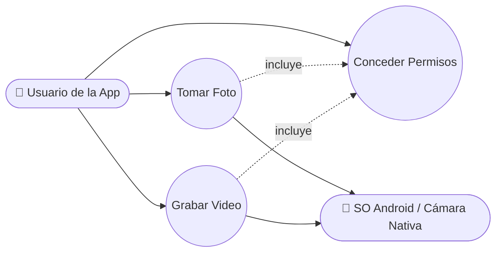

### 2.2 Diagrama de Clases

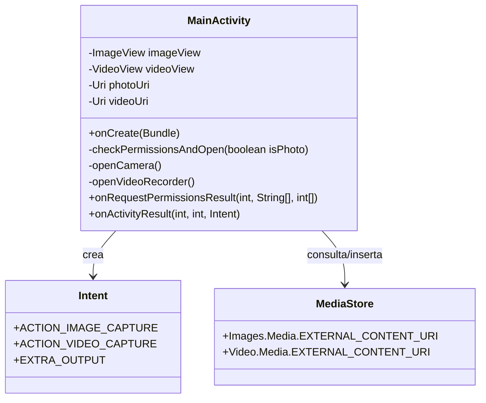

### 2.3 Diagrama de Objetos

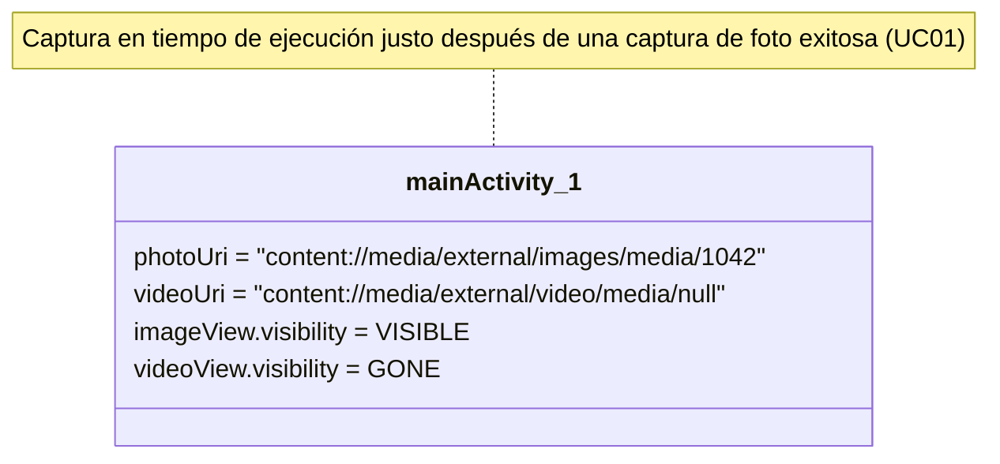

### 2.4 Diagrama de Secuencia — Tomar Foto

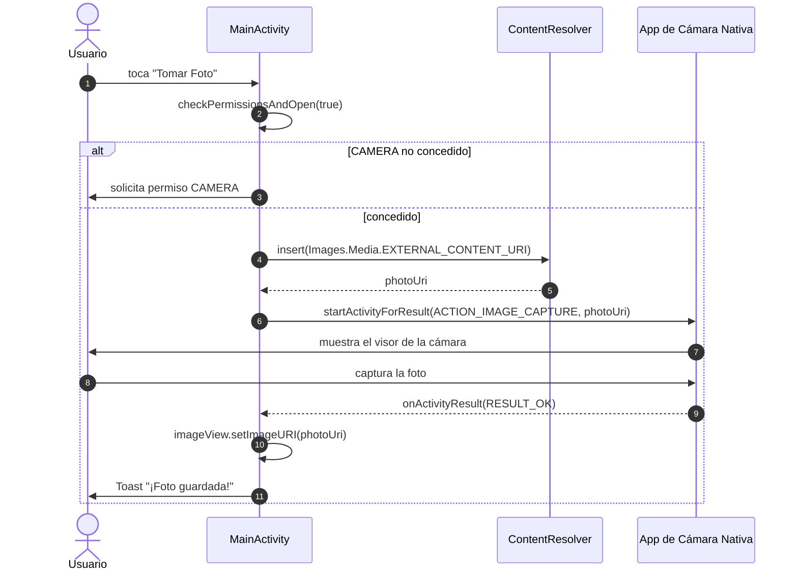

### 2.5 Diagrama de Comunicación

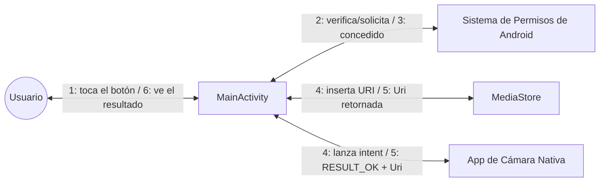

### 2.6 Diagrama de Actividades — `checkPermissionsAndOpen`

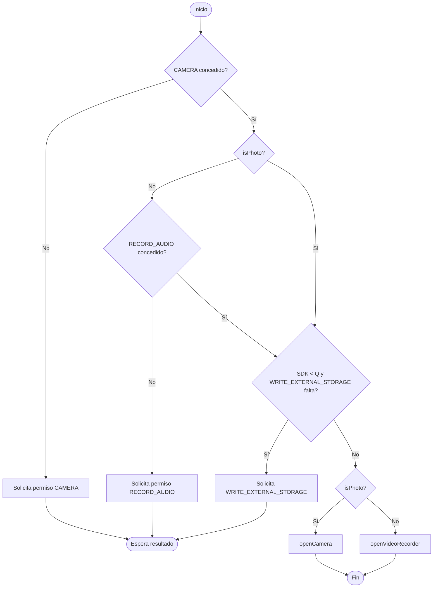

### 2.7 Diagrama de Máquina de Estados — Sesión de Captura

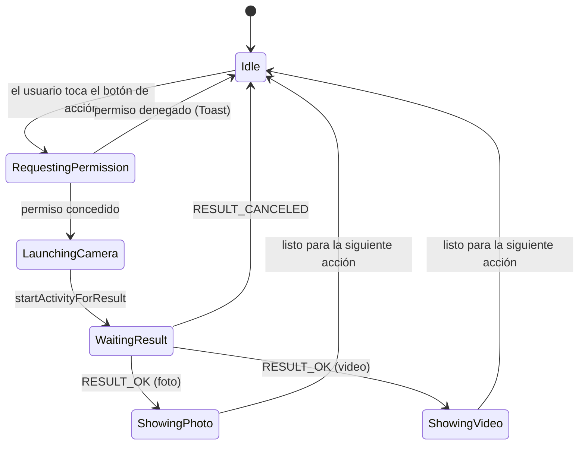

### 2.8 Diagrama de Componentes

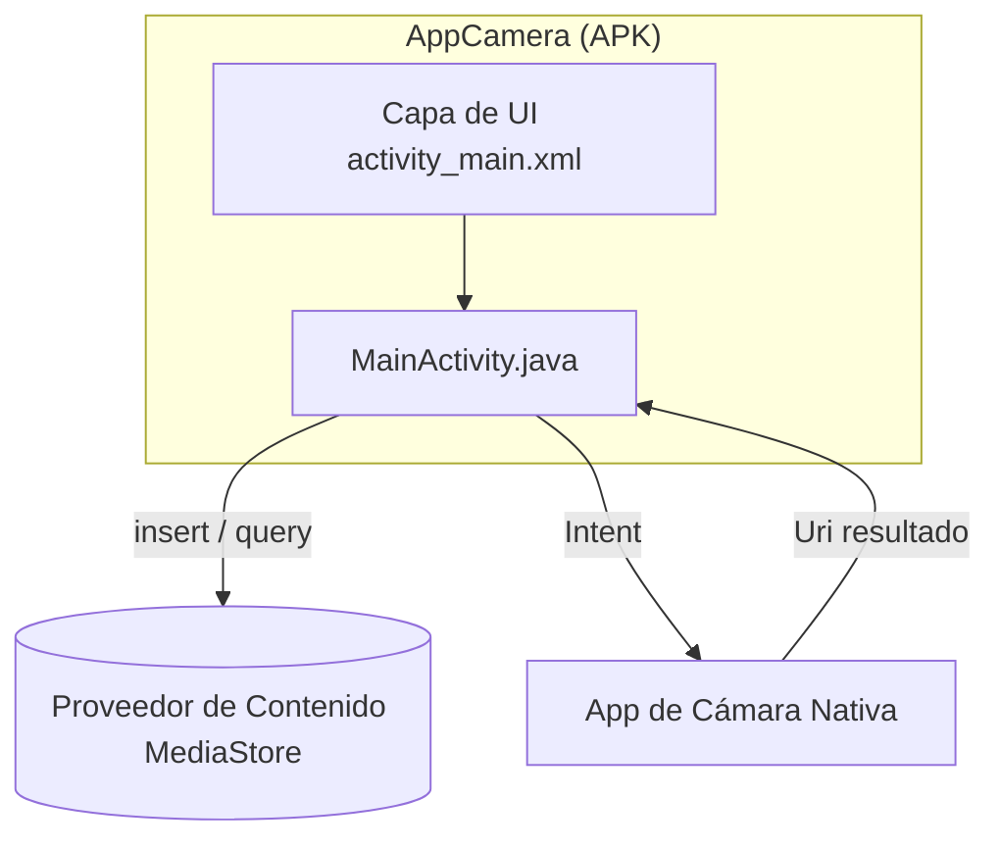

### 2.9 Diagrama de Despliegue

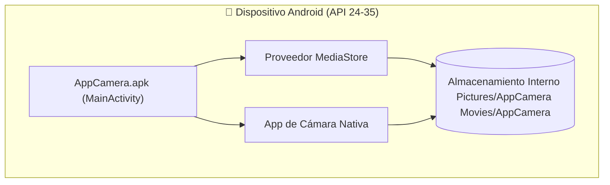

### 2.10 Diagrama de Paquetes

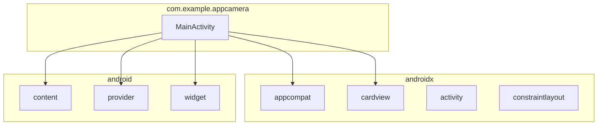

### 2.11 Diagrama de Estructura Compuesta — MainActivity

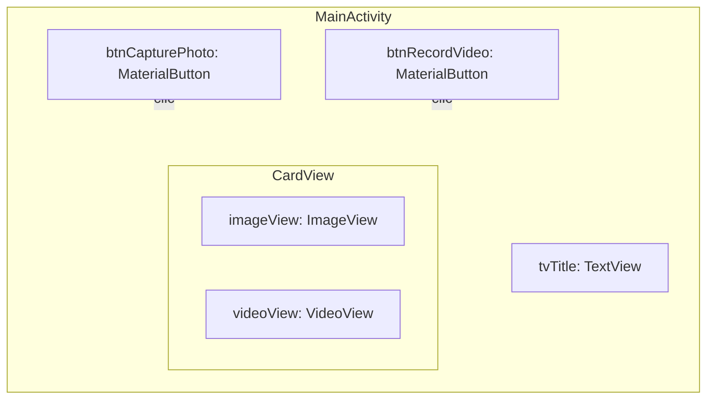

### 2.12 Diagrama de Visión General de Interacción

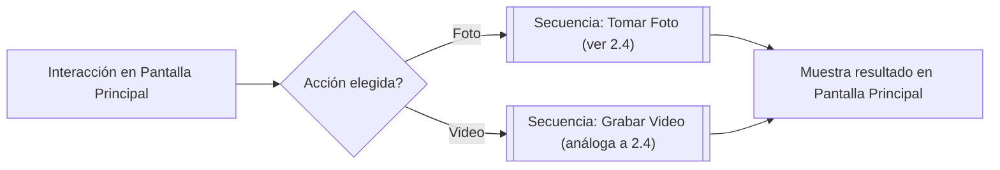

### 2.13 Diagrama de Tiempo — Solicitud de Permiso

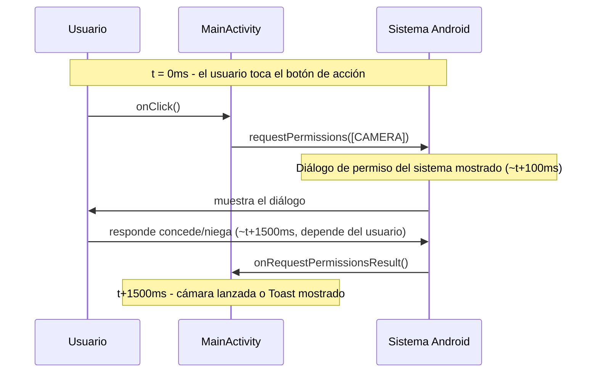

</details>

---

## 3. Modelado de Datos

<details>
<summary>▶️ <strong>Haz clic para expandir / colapsar esta sección</strong></summary>

> AppCamera no tiene una base de datos propia. El "modelo de datos" a continuación describe los registros de **MediaStore** que la app crea/lee, modelados como si fueran entidades para completitud de la documentación.

### 3.1 Diagrama Entidad-Relación (DER)

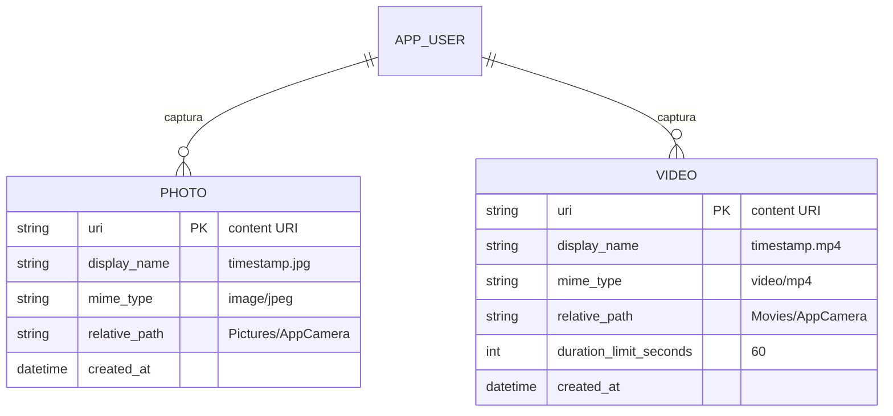

### 3.2 Modelo Conceptual de Datos

- Un **Usuario** captura **Medios**, especializados como **Foto** o **Video**.
- Cada elemento de **Medio** pertenece a una **carpeta de álbum** (`AppCamera`) dentro de la colección de medios compartida del dispositivo.

### 3.3 Modelo Lógico de Datos

| Entidad | Atributo | Tipo | Notas |
|--------|-----------|------|-------|
| Photo | uri | URI | Identificador primario, generado por `MediaStore.insert` |
| Photo | display_name | String | `<timestamp>.jpg` |
| Photo | mime_type | String | `image/jpeg` |
| Photo | relative_path | String | `Pictures/AppCamera` |
| Video | uri | URI | Identificador primario, generado por `MediaStore.insert` |
| Video | display_name | String | `<timestamp>.mp4` |
| Video | mime_type | String | `video/mp4` |
| Video | relative_path | String | `Movies/AppCamera` |
| Video | duration_limit | Integer | 60 (segundos), pasado como extra de la Intent, no persistido |

### 3.4 Modelo Físico de Datos

En Android Q+ estos datos corresponden a filas en la base de datos SQLite del `MediaProvider` del sistema (fuera del control de la app), accesible vía:

```
content://media/external/images/media   (tabla: images)
content://media/external/video/media     (tabla: video)
```

Columnas físicas relevantes utilizadas por la app: `DISPLAY_NAME`, `MIME_TYPE`, `RELATIVE_PATH`. En Android < 10, los archivos se escriben directamente en `Environment.DIRECTORY_PICTURES/AppCamera` y `DIRECTORY_MOVIES/AppCamera` en el sistema de archivos de almacenamiento externo público.

### 3.5 Diccionario de Datos

| Campo | Origen | Tipo | Formato/Dominio | Descripción |
|-------|--------|------|----------------|-------------|
| `photoUri` | `ContentResolver.insert` | `Uri` | `content://...` | Ubicación de salida para la foto capturada |
| `videoUri` | `ContentResolver.insert` | `Uri` | `content://...` | Ubicación de salida para el video capturado |
| `DISPLAY_NAME` | Columna de `MediaStore` | String | `<epoch_ms>.jpg` / `.mp4` | Nombre de archivo mostrado en galerías |
| `MIME_TYPE` | Columna de `MediaStore` | String | `image/jpeg`, `video/mp4` | Tipo de medio |
| `RELATIVE_PATH` | Columna de `MediaStore` | String | `Pictures/AppCamera`, `Movies/AppCamera` | Subcarpeta de almacenamiento |
| `EXTRA_VIDEO_QUALITY` | Extra de la Intent | Int | `1` (alta) | Calidad de grabación solicitada |
| `EXTRA_DURATION_LIMIT` | Extra de la Intent | Int | `60` | Duración máxima de grabación en segundos |

### 3.6 Diagrama de Flujo de Datos (DFD)

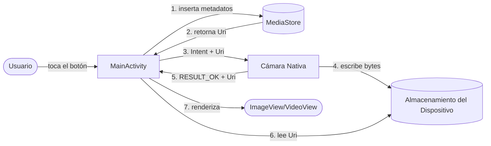

### 3.7 Diagrama de Linaje de Datos

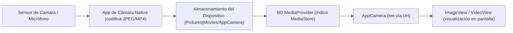

</details>

---

## 4. Arquitectura

<details>
<summary>▶️ <strong>Haz clic para expandir / colapsar esta sección</strong></summary>

### 4.1 Visión General de la Arquitectura

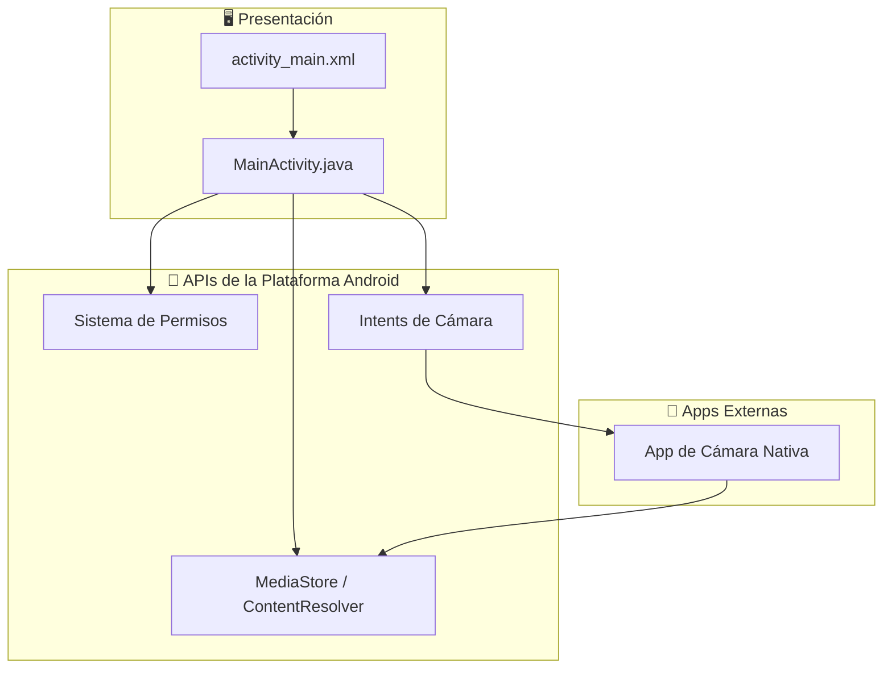

### 4.2 Modelo C4

#### Nivel 1 — Contexto

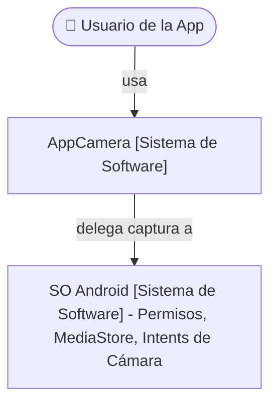

#### Nivel 2 — Contenedores

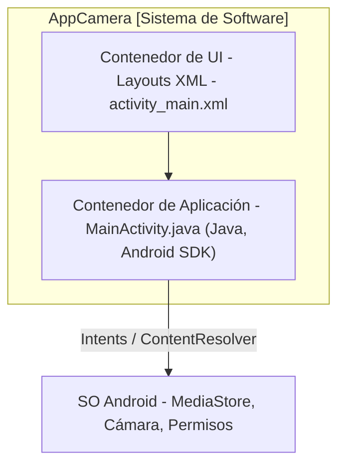

#### Nivel 3 — Componentes (MainActivity)

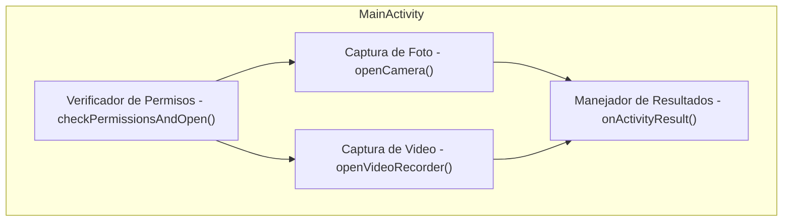

#### Nivel 4 — Código (método clave)

```mermaid
classDiagram
    class MainActivity {
        -openVideoRecorder() void
    }
    note for MainActivity "openVideoRecorder(): 1. Construye ContentValues (nombre, mime, ruta) 2. resolver.insert(Video.Media.EXTERNAL_CONTENT_URI, vals) 3. new Intent(ACTION_VIDEO_CAPTURE) 4. putExtra(EXTRA_OUTPUT, videoUri) 5. putExtra(EXTRA_VIDEO_QUALITY, 1) 6. putExtra(EXTRA_DURATION_LIMIT, 60) 7. startActivityForResult(intent, REQ_CAPTURE_VIDEO)"
```

### 4.3 Diagrama de Arquitectura en Capas

```mermaid
flowchart TB
    L1["Capa de Presentación - Layouts XML, Views"] --> L2["Capa de Aplicación - MainActivity (manejo de eventos)"]
    L2 --> L3["Capa de Integración con la Plataforma - Intents, Permisos, ContentResolver"]
    L3 --> L4["Capa de SO / Hardware - Cámara, Micrófono, Almacenamiento"]
```

### 4.4 Diagrama de Microservicios

> **No aplicable.** AppCamera es una aplicación móvil única, sin conexión, sin servicios de backend — no existe una topología de microservicios. Esta sección se documenta por completitud en todo el portafolio del autor.

```mermaid
flowchart LR
    Monolith["AppCamera (módulo Android único, sin servicios)"]
```

### 4.5 Diagrama de Infraestructura / Red

```mermaid
flowchart LR
    subgraph Device["Dispositivo Android"]
        AppCamera
        OSServices["Servicios del SO (MediaStore, Camera HAL)"]
    end
    AppCamera <--> OSServices
```

> La aplicación no requiere conectividad de red.

### 4.6 Diagrama de Despliegue en la Nube

> **No aplicable en tiempo de ejecución** (app completamente offline). Diagrama solo de distribución:

```mermaid
flowchart LR
    Dev["Máquina del Desarrollador (Android Studio)"] -->|genera .apk/.aab| Store["Google Play Console (o distribución directa de APK)"]
    Store -->|instala| Device["Dispositivo Android del Usuario Final"]
```

### 4.7 Registros de Decisiones de Arquitectura (ADR)

#### ADR-001: Usar Intents de Cámara (MediaStore) en lugar de CameraX/Camera2

- **Estado:** Aceptado
- **Contexto:** La app necesita tomar fotos y grabar videos con la mínima complejidad posible.
- **Decisión:** Usar las Intents `ACTION_IMAGE_CAPTURE` / `ACTION_VIDEO_CAPTURE`, delegando a la app de cámara nativa del dispositivo, con la salida redirigida vía `MediaStore`.
- **Consecuencias:** ✅ Mucho menos código, sin gestión de vista previa/ciclo de vida, compatibilidad automática entre dispositivos. ❌ Menos control sobre la UI/UX de captura, sin vista previa en vivo dentro de la app, sin filtros personalizados.

#### ADR-002: Scoped Storage mediante MediaStore para Android Q+

- **Estado:** Aceptado
- **Contexto:** Android 10 (API 29) introdujo Scoped Storage, restringiendo el acceso directo a rutas de archivo.
- **Decisión:** Usar `ContentResolver.insert()` con `MediaStore.Images/Video.Media.EXTERNAL_CONTENT_URI` en API ≥ 29, recurriendo a `Environment.getExternalStoragePublicDirectory` en versiones anteriores.
- **Consecuencias:** ✅ Estrategia de almacenamiento compatible con versiones futuras. ❌ Dos rutas de código (`if` condicionado por versión) aumentan la complejidad de ramificación.

### 4.8 Diagrama de Integración de Sistemas

```mermaid
flowchart LR
    AppCamera -->|Intent ACTION_IMAGE_CAPTURE / ACTION_VIDEO_CAPTURE| AndroidCameraSubsystem["Subsistema de Cámara de Android"]
    AppCamera -->|ContentResolver.insert/query| MediaStoreSystem["Servicio del Sistema MediaStore"]
    AppCamera -->|requestPermissions| PermissionSystem["Sistema de Permisos de Android"]
```

### 4.9 Diagrama de Flujo Basado en Eventos

```mermaid
flowchart TB
    E1["Evento: onClick (Tomar Foto)"] --> H1["Manejador: checkPermissionsAndOpen(true)"]
    H1 --> E2["Evento: onRequestPermissionsResult"]
    E2 --> H2["Manejador: openCamera()"]
    H2 --> E3["Evento: onActivityResult (REQ_CAPTURE_PHOTO)"]
    E3 --> H3["Manejador: actualiza ImageView + Toast"]
```

### 4.10 Diagrama de Pipeline CI/CD

> Pipeline sugerido (no configurado actualmente en el repositorio):

```mermaid
flowchart LR
    A[Push a rama main/feature] --> B[CI: build de Gradle]
    B --> C[CI: pruebas unitarias - app/src/test]
    C --> D[CI: lint / análisis estático]
    D --> E[CI: generar APK de depuración]
    E --> F[Manual: instalar en dispositivo/emulador]
    F --> G[Release: generar AAB firmado]
    G --> H[Publicar en Play Console - Pruebas Internas]
```

</details>

---

## 5. Procesos de Negocio

<details>
<summary>▶️ <strong>Haz clic para expandir / colapsar esta sección</strong></summary>

### 5.1 BPMN — Proceso de Captura

```mermaid
flowchart LR
    Start(("Inicio")) --> T1[/Usuario selecciona tipo de captura/]
    T1 --> G1{Permisos OK?}
    G1 -- No --> T2[Solicita permisos]
    T2 --> G1
    G1 -- Sí --> T3[Abre cámara nativa]
    T3 --> T4[Usuario captura el medio]
    T4 --> T5[App muestra el resultado]
    T5 --> End(("Fin"))
```

### 5.2 Diagrama de Flujo — Flujo General de la App

```mermaid
flowchart TD
    Open[Abrir AppCamera] --> Choose{Elegir acción}
    Choose -->|Tomar Foto| Photo[Flujo de captura de foto]
    Choose -->|Grabar Video| Video[Flujo de captura de video]
    Photo --> Preview[Muestra vista previa]
    Video --> Preview
    Preview --> Choose
```

### 5.3 Mapa de Proceso As-Is (Antes de AppCamera)

```mermaid
flowchart LR
    A[Usuario quiere una foto/video rápido] --> B[Abre la app de Cámara predeterminada del SO]
    B --> C[Cambia manualmente entre modo foto/video]
    C --> D[Captura el medio]
    D --> E[Abre la app de Galería por separado para revisar]
```

### 5.4 Mapa de Proceso To-Be (Con AppCamera)

```mermaid
flowchart LR
    A[Usuario quiere una foto/video rápido] --> B[Abre AppCamera]
    B --> C[Toca el botón dedicado de Foto o Video]
    C --> D[Cámara nativa abre pre-configurada - video: 60s/alta calidad]
    D --> E[Resultado mostrado automáticamente dentro de AppCamera]
```

### 5.5 SIPOC

| Proveedores | Entradas | Proceso | Salidas | Clientes |
|-----------|--------|---------|---------|-----------|
| SO Android, Hardware de Cámara | Toque del usuario, permisos en tiempo de ejecución | Captura de Foto/Video vía Intent | Archivo de Foto (.jpg) / Video (.mp4) + vista previa en pantalla | Usuario de la App |

</details>

---

## 6. UX/UI y Prototipos

<details>
<summary>▶️ <strong>Haz clic para expandir / colapsar esta sección</strong></summary>

### 6.1 Persona

| Atributo | Valor |
|-----------|-------|
| **Nombre** | Marcos, 24 |
| **Rol** | Estudiante de Ciencias de la Computación / desarrollador Android junior |
| **Objetivo** | Capturar rápidamente una foto o un video corto para probar/demostrar una funcionalidad de la app |
| **Frustración** | Bibliotecas de cámara pesadas con curvas de aprendizaje pronunciadas para necesidades de captura simples |
| **Cómo ayuda AppCamera** | Proporciona un flujo de captura mínimo, basado en Intent y listo para copiar y pegar |

### 6.2 Mapa de Recorrido del Usuario

```mermaid
journey
    title Tomar una Foto con AppCamera
    section Descubrimiento
      Abrir la app: 5: Usuario
    section Acción
      Tocar Tomar Foto: 5: Usuario
      Conceder permiso de Cámara: 3: Usuario
    section Captura
      Se abre la cámara nativa: 5: Usuario
      Tomar la foto: 5: Usuario
    section Revisión
      Volver a AppCamera: 5: Usuario
      Ver la vista previa de la foto y el toast: 5: Usuario
```

### 6.3 Wireframe (ASCII)

```
┌──────────────────────────────┐
│           AppCamera           │
├──────────────────────────────┤
│                                │
│      [ Imagen / Video     ]   │
│      [   Área de Vista    ]   │
│      [      Previa        ]   │
├──────────────────────────────┤
│   📸  Tomar Foto                │
├──────────────────────────────┤
│   📹  Grabar Video              │
└──────────────────────────────┘
```

### 6.4 Mockup

> Referencia de mockup de alta fidelidad: fondo en degradado (`bg_gradient.xml`), `CardView` de vista previa con esquinas redondeadas (radio de 16dp, elevación de 8dp), botones Material con iconos a la izquierda (`ic_camera`, `ic_videocam`) y radio de esquina de 24dp, según `activity_main.xml`.

### 6.5 Prototipo Navegable

> No publicado como un archivo de prototipo externo. La propia app en ejecución **es** el prototipo navegable de alta fidelidad — compila y ejecuta vía [Cómo Ejecutar](#-cómo-ejecutar) para navegar el flujo real (de pantalla única).

### 6.6 Flujo de Pantallas / Mapa de Navegación

```mermaid
flowchart LR
    Main["Pantalla Principal (MainActivity)"] -->|Tomar Foto| NativeCam1["Cámara del SO (Foto)"]
    Main -->|Grabar Video| NativeCam2["Cámara del SO (Video)"]
    NativeCam1 -->|resultado| Main
    NativeCam2 -->|resultado| Main
```

### 6.7 Design System / Guía de Estilo

| Token | Valor | Uso |
|-------|-------|-------|
| Fondo | `bg_gradient.xml` (drawable en degradado) | Fondo del layout raíz |
| Color de texto primario | `@color/textPrimary` | Texto del título |
| Color de acento | `@color/buttonAccent` | Tinte de fondo de los botones |
| Radio de esquina (botones) | `24dp` | `MaterialButton` `app:cornerRadius` |
| Radio de esquina (card de vista previa) | `16dp` | `CardView` `app:cardCornerRadius` |
| Elevación (card de vista previa) | `8dp` | `CardView` `app:cardElevation` |
| Iconografía | `ic_camera.xml`, `ic_videocam.xml` | Iconos a la izquierda de los botones |
| Tipografía | 24sp negrita (título), 16sp (botones) | `tvTitle`, `MaterialButton` |

### 6.8 Card Sorting

> Con una sola pantalla y dos acciones principales, un ejercicio formal de card sorting no es aplicable. Las dos acciones ("Tomar Foto" / "Grabar Video") se agruparon como **elementos hermanos bajo una única categoría "Captura"**, ambas igualmente prominentes, que es el resultado natural que produciría una sesión de card sorting para este alcance.

### 6.9 Mapa de Empatía

| Cuadrante | Contenido |
|----------|---------|
| **Dice** | "Solo quiero tomar una foto rápidamente para probar esto." |
| **Piensa** | "¿Esta app me pedirá un millón de permisos?" |
| **Hace** | Toca el botón, concede el diálogo de permiso, captura el medio. |
| **Siente** | Tranquilidad cuando la vista previa aparece de inmediato y solo se solicitan los permisos relevantes. |

### 6.10 Roadmap del Producto

```mermaid
gantt
    title Roadmap de AppCamera
    dateFormat YYYY-MM-DD
    section v1.0 (Actual)
    Captura de foto (Intent)     :done, 2024-01-01, 30d
    Captura de video (Intent)    :done, 2024-01-15, 30d
    Manejo de permisos           :done, 2024-01-15, 30d
    section v1.1 (Planificado)
    Galería de medios interna     :2026-07-01, 30d
    Compartir medios capturados   :2026-07-15, 20d
    section v1.2 (Backlog)
    Cambio de cámara frontal/trasera :2026-09-01, 30d
    Modo oscuro                   :2026-09-15, 15d
```

</details>

---

## 7. Documentación Técnica

<details>
<summary>▶️ <strong>Haz clic para expandir / colapsar esta sección</strong></summary>

### 7.1 Documentación de API

> AppCamera no expone **ninguna API de red/REST**. La "superficie de API" relevante es el **contrato de Intent de Android** que consume:

| Acción de la Intent | Extras Requeridos | Retorno |
|---------------|------------------|---------|
| `MediaStore.ACTION_IMAGE_CAPTURE` | `EXTRA_OUTPUT` (Uri) | `RESULT_OK` + foto escrita en `EXTRA_OUTPUT` |
| `MediaStore.ACTION_VIDEO_CAPTURE` | `EXTRA_OUTPUT` (Uri), `EXTRA_VIDEO_QUALITY`, `EXTRA_DURATION_LIMIT` | `RESULT_OK` + video escrito en `EXTRA_OUTPUT` |

### 7.2 Manual de Usuario

1. Abre la app **AppCamera**.
2. Toca **📸 Tomar Foto** para capturar una imagen, o **📹 Grabar Video** para grabar un clip (máx. 60s).
3. Concede los permisos solicitados en el primer uso (Cámara, y Audio para video).
4. Usa la UI de cámara nativa del dispositivo para capturar y confirmar.
5. Regresa automáticamente a AppCamera para ver el resultado en el área de vista previa.

### 7.3 Manual Técnico / Operativo

| Tema | Detalle |
|-------|--------|
| Herramienta de build | Gradle (Kotlin DSL), vía `gradlew` / `gradlew.bat` |
| SDK Min/Target/Compile | 24 / 35 / 35 |
| Versión de Java | 11 |
| Dependencias clave | `appcompat`, `material`, `activity`, `constraintlayout` |
| Permisos de tiempo de ejecución requeridos | `CAMERA`, `RECORD_AUDIO`, `WRITE_EXTERNAL_STORAGE` (≤ API 28) |
| Problema común: la cámara no abre | Verificar que el permiso CAMERA fue concedido en la configuración del sistema. |
| Problema común: el video no se reproduce | Verificar que la cámara virtual del emulador produjo un `.mp4` válido (algunos AVD requieren passthrough de webcam habilitado). |

### 7.4 Changelog

```markdown
## [1.0.0] - Versión Inicial
### Agregado
- Tomar Foto vía ACTION_IMAGE_CAPTURE con salida en MediaStore.
- Grabar Video vía ACTION_VIDEO_CAPTURE (límite de 60s, alta calidad).
- Manejo de permisos en tiempo de ejecución para CAMERA, RECORD_AUDIO, WRITE_EXTERNAL_STORAGE.
- Vista previa automática de la foto/video capturado en ImageView/VideoView.
- UI personalizada con degradado e iconos vectoriales.
```

### 7.5 Guía de Instalación / Despliegue

Ver [Cómo Ejecutar](#-cómo-ejecutar) — clona, abre en Android Studio, sincroniza Gradle, ejecuta en dispositivo/emulador, concede los permisos.

### 7.6 Runbook / Manual de Operaciones

| Síntoma | Causa Probable | Acción |
|---------|--------------|--------|
| La app se cierra al iniciar | Dependencia faltante / fallo en la sincronización de Gradle | Vuelve a ejecutar `Build → Sync Project with Gradle Files`; verifica `libs.versions.toml` |
| Toast "Permiso denegado" en cada intento | El usuario denegó permanentemente un permiso ("No volver a preguntar") | Habilita manualmente el permiso de Cámara/Micrófono en Configuración de Android → Apps → AppCamera |
| La cámara abre pero el resultado está en blanco | Emulador sin cámara virtual configurada | Habilita la webcam/cámara virtual en el AVD en `Extended Controls → Camera` |
| El video no se reproduce automáticamente | Problema de codec de `VideoView` en el emulador | Prueba en un dispositivo físico, o usa una imagen AVD con Google Play Services |

### 7.7 Estándares de Codificación

- Convenciones de nomenclatura Java: `PascalCase` para clases (`MainActivity`), `camelCase` para métodos/campos.
- Códigos de solicitud definidos como constantes `private static final int` nombradas (`REQ_CAM`, `REQ_CAPTURE_PHOTO`, etc.).
- Una `Activity` por pantalla; UI definida declarativamente en layouts XML, no construida programáticamente.
- Verificaciones de permisos centralizadas en un único método (`checkPermissionsAndOpen`) para evitar duplicación.

### 7.8 Documentación de Base de Datos

> No hay una base de datos gestionada por la aplicación. Todo el estado persistido vive en el **MediaStore** (`MediaProvider`) gestionado por el SO, accedido exclusivamente mediante `ContentResolver`. Ver [3. Modelado de Datos](#3-modelado-de-datos) para los campos de esquema relevantes.

</details>

---

## 8. Gestión de Proyecto

<details>
<summary>▶️ <strong>Haz clic para expandir / colapsar esta sección</strong></summary>

### 8.1 Acta de Constitución del Proyecto (Project Charter)

| Ítem | Descripción |
|------|-------------|
| Nombre del Proyecto | AppCamera |
| Patrocinador | Proyecto de aprendizaje autodirigido (portafolio) |
| Gerente de Proyecto / Desarrollador | Victor H. J. Santiago |
| Objetivo | Construir una referencia funcional para la captura de foto/video en Android mediante Intents |
| Criterios de Éxito | La app compila, se ejecuta, y ambos flujos de captura funcionan en emulador/dispositivo |
| Cronograma | Iteración de desarrollo única (ver [Roadmap](#610-roadmap-del-producto)) |

### 8.2 Alcance del Proyecto

- **Dentro del alcance:** Captura de foto, captura de video (60s/alta calidad), manejo de permisos en tiempo de ejecución, vista previa del resultado, estilización personalizada de la UI.
- **Fuera del alcance:** Galería interna, edición, compartición, sincronización en la nube, soporte multi-cámara, pruebas de UI automatizadas.

### 8.3 Estructura de Desglose del Trabajo (EDT/WBS)

```
1. AppCamera
   1.1 Capa de UI
       1.1.1 Layout activity_main.xml
       1.1.2 Fondo en degradado e iconos
   1.2 Lógica de Captura
       1.2.1 Manejo de permisos
       1.2.2 Captura de foto (openCamera)
       1.2.3 Captura de video (openVideoRecorder)
       1.2.4 Manejo de resultados (onActivityResult)
   1.3 Build y Configuración
       1.3.1 Configuración de Gradle (build.gradle.kts)
       1.3.2 Permisos/características del AndroidManifest
   1.4 Documentación
       1.4.1 README (EN/PT/ES)
```

### 8.4 Cronograma (Gantt)

```mermaid
gantt
    title AppCamera - Cronograma de Desarrollo
    dateFormat YYYY-MM-DD
    section Configuración Inicial
    Estructuración del proyecto      :done, 2024-01-01, 5d
    section Núcleo
    Layout de UI                     :done, 2024-01-06, 5d
    Manejo de permisos               :done, 2024-01-11, 4d
    Captura de foto                  :done, 2024-01-15, 5d
    Captura de video                 :done, 2024-01-20, 5d
    section Cierre
    Pruebas manuales en emulador     :done, 2024-01-25, 3d
    Documentación                    :active, 2026-06-13, 3d
```

### 8.5 Plan de Gestión de Riesgos

| Riesgo | Probabilidad | Impacto | Mitigación |
|------|------------|--------|------------|
| Permiso denegado permanentemente por el usuario | Media | Alto (funcionalidad inutilizable) | Mostrar un Toast claro explicando el permiso requerido; documentar en el manual de usuario |
| Emulador sin cámara virtual | Media | Medio (no se puede probar) | Documentar la configuración de cámara del AVD en el [Runbook](#76-runbook--manual-de-operaciones) |
| Fragmentación de versiones de Android (API de almacenamiento) | Baja | Medio | Ruta de código condicionada por versión (`Build.VERSION.SDK_INT >= Q`) |

### 8.6 Matriz de Riesgos

```mermaid
quadrantChart
    title Matriz de Riesgos
    x-axis Bajo Impacto --> Alto Impacto
    y-axis Baja Probabilidad --> Alta Probabilidad
    quadrant-1 Monitorear
    quadrant-2 Mitigar Urgentemente
    quadrant-3 Aceptar
    quadrant-4 Mitigar
    Permiso denegado permanentemente: [0.7, 0.5]
    Camara del emulador ausente: [0.4, 0.5]
    Fragmentacion de la API de almacenamiento: [0.5, 0.2]
```

### 8.7 Plan de Comunicación

| Audiencia | Canal | Frecuencia |
|----------|---------|-----------|
| Reclutadores / revisores | README de GitHub (este documento) | Bajo demanda |
| Futuros colaboradores | Issues / PRs de GitHub | Según sea necesario |

### 8.8 Matriz RACI

| Actividad | Desarrollador (Victor) | Revisor | Usuario Final |
|----------|:---:|:---:|:---:|
| Diseñar UI | R/A | C | I |
| Implementar lógica de captura | R/A | C | I |
| Probar en emulador/dispositivo | R/A | I | I |
| Aprobar documentación | R/A | C | I |

> R = Responsable, A = Aprobador (Accountable), C = Consultado, I = Informado

### 8.9 Análisis FODA (SWOT)

| Fortalezas | Debilidades |
|-----------|------------|
| Enfoque simple y bien entendido basado en Intents; dependencias mínimas | Sin vista previa/UX de cámara personalizada; limitado a la UI de la cámara nativa |

| Oportunidades | Amenazas |
|----------------|---------|
| Extensible a funcionalidades de galería/compartición; buen ejemplo didáctico | Cambios en las APIs del SO (Scoped Storage) pueden requerir actualizaciones futuras |

### 8.10 Caso de Negocio

Una demostración de mínimo esfuerzo y alta claridad de los fundamentos de captura de medios en Android, útil como: (1) artefacto de portafolio que muestra competencia en el manejo de Intents/permisos, (2) plantilla inicial para apps que necesitan funcionalidad de captura rápida sin la sobrecarga de bibliotecas de cámara.

### 8.11 Análisis de Viabilidad / ROI

| Factor | Evaluación |
|--------|------------|
| Viabilidad técnica | Alta — depende enteramente de APIs de Android estables y bien documentadas |
| Esfuerzo (ROI) | Esfuerzo muy bajo (Activity única) para un alto valor educativo/demo |
| Costo de mantenimiento | Bajo — sin backend, sin servicios externos |

### 8.12 Plan de Gestión de Cambios

- Todos los cambios se proponen mediante ramas de funcionalidad y Pull Requests (ver [Cómo Contribuir](#-cómo-contribuir)).
- Los cambios que impacten el flujo de permisos o los contratos de Intent deben actualizar [1.1 Requisitos Funcionales](#11-requisitos-funcionales-rf) y el [Changelog](#74-changelog).

### 8.13 Plan de Contingencia

| Escenario | Contingencia |
|----------|-------------|
| App de cámara nativa no disponible en el dispositivo | La app no puede continuar (sin implementación de cámara alternativa); documentado como una limitación conocida. |
| `MediaStore.insert` retorna `null` | Se recomienda una verificación defensiva antes de lanzar la Intent (actualmente no implementada — ver [Backlog del Producto](#114-backlog-del-producto) para el ítem de deuda técnica). |

### 8.14 Lecciones Aprendidas

- Delegar a apps de cámara nativas mediante Intents reduce drásticamente la complejidad de implementación frente a CameraX/Camera2.
- Scoped Storage requiere lógica explícita condicionada por versión (`Build.VERSION_CODES.Q`) — un patrón recurrente en apps de medios de Android.
- Centralizar las verificaciones de permisos en un único método evita lógica de permisos duplicada y propensa a errores en múltiples puntos de entrada.

</details>

---

## 9. Análisis de Negocio

<details>
<summary>▶️ <strong>Haz clic para expandir / colapsar esta sección</strong></summary>

### 9.1 Business Model Canvas

| Bloque | Contenido |
|-------|---------|
| **Socios Clave** | SO Android / apps de cámara de fabricantes (OEM) |
| **Actividades Clave** | Mantenimiento del flujo de captura basado en Intent, manejo de permisos |
| **Propuesta de Valor** | Implementación de referencia mínima y confiable para captura de foto/video |
| **Relación con Clientes** | Repositorio de código abierto, impulsado por documentación |
| **Segmentos de Clientes** | Desarrolladores Android, estudiantes, revisores de portafolio |
| **Recursos Clave** | Conocimiento de Java/Android SDK, APIs de MediaStore |
| **Canales** | Repositorio de GitHub |
| **Estructura de Costos** | Solo tiempo del desarrollador (sin costo de infraestructura) |
| **Fuentes de Ingresos** | No comercial (portafolio/educativo) |

### 9.2 Análisis de Interesados (Stakeholders)

| Interesado | Interés | Influencia |
|-------------|----------|-----------|
| Desarrollador (Victor H. J. Santiago) | Construir portafolio, demostrar habilidades Android | Alta |
| Reclutadores / Revisores | Evaluar calidad del código y la documentación | Media |
| Usuarios Finales / Estudiantes | Aprender de / reutilizar la implementación | Baja |

### 9.3 Análisis de Impacto

| Cambio | Áreas Afectadas |
|--------|-----------------|
| Agregar una galería interna | Layout de UI, nueva Activity/Fragment, lógica de consulta a MediaStore |
| Aumentar el `minSdk` | Eliminación de la ruta de código de almacenamiento pre-Q, lógica de permisos simplificada |
| Agregar respaldo en la nube | Nuevo permiso (INTERNET), actualización de la política de privacidad, revisión LGPD/GDPR |

### 9.4 Modelo de Capacidades de Negocio

```mermaid
flowchart TB
    subgraph Capabilities["Capacidades de AppCamera"]
        C1[Captura de Medios]
        C2[Gestión de Permisos]
        C3[Presentación de Medios]
    end
    C1 --> C3
    C2 --> C1
```

</details>

---

## 10. Seguridad y Cumplimiento

<details>
<summary>▶️ <strong>Haz clic para expandir / colapsar esta sección</strong></summary>

### 10.1 Modelado de Amenazas (STRIDE)

| Categoría de Amenaza | ¿Aplicable? | Notas / Mitigación |
|------------------|-------------|---------------------|
| **S**poofing (Suplantación) | Baja | No existe ningún subsistema de autenticación. |
| **T**ampering (Manipulación) | Baja | Archivos multimedia almacenados vía `MediaStore`, regidos por los permisos de archivo del SO. |
| **R**epudiation (Repudio) | N/A | App local de un solo usuario, sin requisitos de auditoría. |
| **I**nformation Disclosure (Divulgación de Información) | Media | Las fotos/videos capturados pueden contener datos personales sensibles; se almacenan sin cifrar en almacenamiento compartido (`Pictures/AppCamera`, `Movies/AppCamera`), legibles por otras apps con permisos de medios. |
| **D**enial of Service (Denegación de Servicio) | Baja | Sin componente de servidor; solo agotamiento de recursos locales (almacenamiento del dispositivo lleno). |
| **E**levation of Privilege (Elevación de Privilegios) | Baja | La app solo solicita los permisos mínimos que utiliza (`CAMERA`, `RECORD_AUDIO`, `WRITE_EXTERNAL_STORAGE`). |

### 10.2 Matriz de Control de Acceso / Permisos (estilo RBAC)

| "Rol" | CAMERA | RECORD_AUDIO | WRITE_EXTERNAL_STORAGE |
|--------|:---:|:---:|:---:|
| Usuario de la App (concede en tiempo de ejecución) | ✅ requerido para cualquier captura | ✅ requerido solo para video | ✅ requerido en API ≤ 28 |
| AppCamera (declarado en el Manifest) | ✅ | ✅ | ✅ (maxSdkVersion 28) |
| Otras apps | ❌ sin acceso al estado de runtime de AppCamera | ❌ | ⚠️ pueden leer `Pictures/AppCamera` si poseen permisos de almacenamiento/medios (almacenamiento compartido) |

### 10.3 Política de Seguridad de la Información (Nivel de Proyecto)

- La app debe solicitar solo los permisos estrictamente necesarios para las funcionalidades en uso ([1.1 RF](#11-requisitos-funcionales-rf)).
- No se incluye telemetría, SDK de analítica ni transmisión por red de los medios capturados.
- Los medios capturados permanecen bajo el control del usuario en ubicaciones de almacenamiento compartido estándar, removibles vía la app de Galería/Archivos del dispositivo como cualquier otro medio.

### 10.4 Notas de Cumplimiento LGPD / GDPR

| Aspecto | Estado |
|--------|--------|
| Datos personales recopilados | Imágenes/audio capturados por el usuario mediante la cámara/micrófono del dispositivo (potencialmente con datos personales del usuario o de terceros). |
| Responsable de los datos | El usuario final (los datos permanecen en su dispositivo — AppCamera no los transmite ni procesa en el servidor). |
| Base legal | No aplicable en el sentido tradicional — captura puramente local, iniciada por el usuario, sin procesamiento por parte del desarrollador de la app. |
| Derechos del usuario (acceso/eliminación) | Totalmente disponibles vía la app de Galería/Archivos del SO, ya que los datos se almacenan como archivos multimedia estándar. |
| Recomendación si se agregan funcionalidades en la nube más adelante | Reevaluar esta sección; agregar flujos de consentimiento explícito, una política de privacidad y divulgaciones de Seguridad de Datos en Play Console. |

### 10.5 Plan de Respuesta a Incidentes

| Paso | Acción |
|------|--------|
| 1. Detección | Problema reportado vía GitHub Issues (ej., un error de permiso/seguridad). |
| 2. Triaje | El desarrollador evalúa la severidad (ej., ¿expone los medios del usuario de forma inesperada?). |
| 3. Contención | Se revierte/deshabilita la ruta de código problemática mediante una rama de hotfix. |
| 4. Remediación | Se publica un parche, se actualiza el [Changelog](#74-changelog). |
| 5. Post-mortem | Agregar entrada en [Lecciones Aprendidas](#814-lecciones-aprendidas). |

</details>

---

<div align="center">

*Hecho con 📸 y Java por **Victor H. J. Santiago***

</div>
