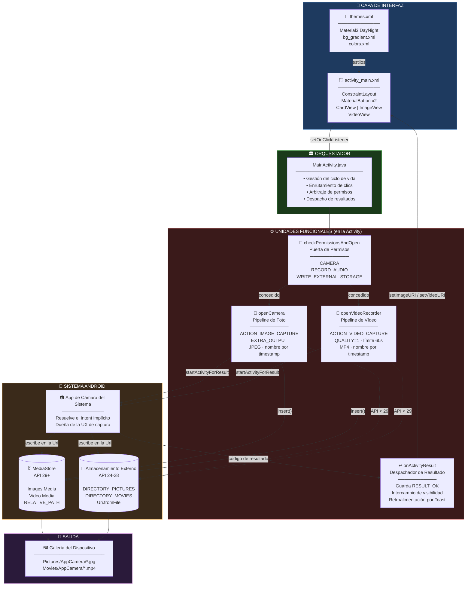
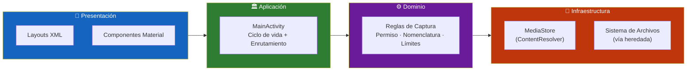
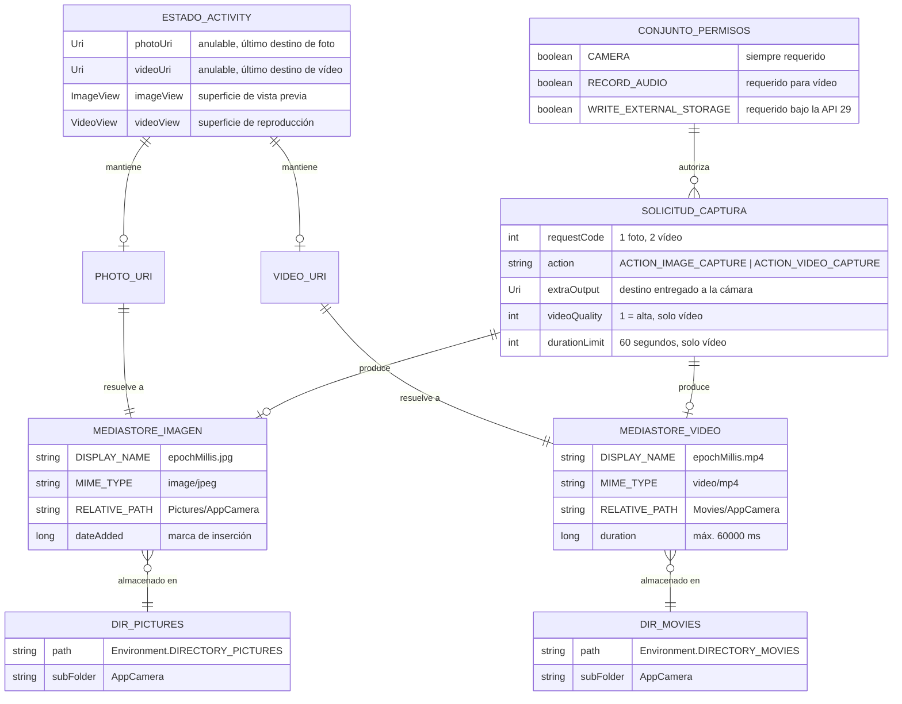
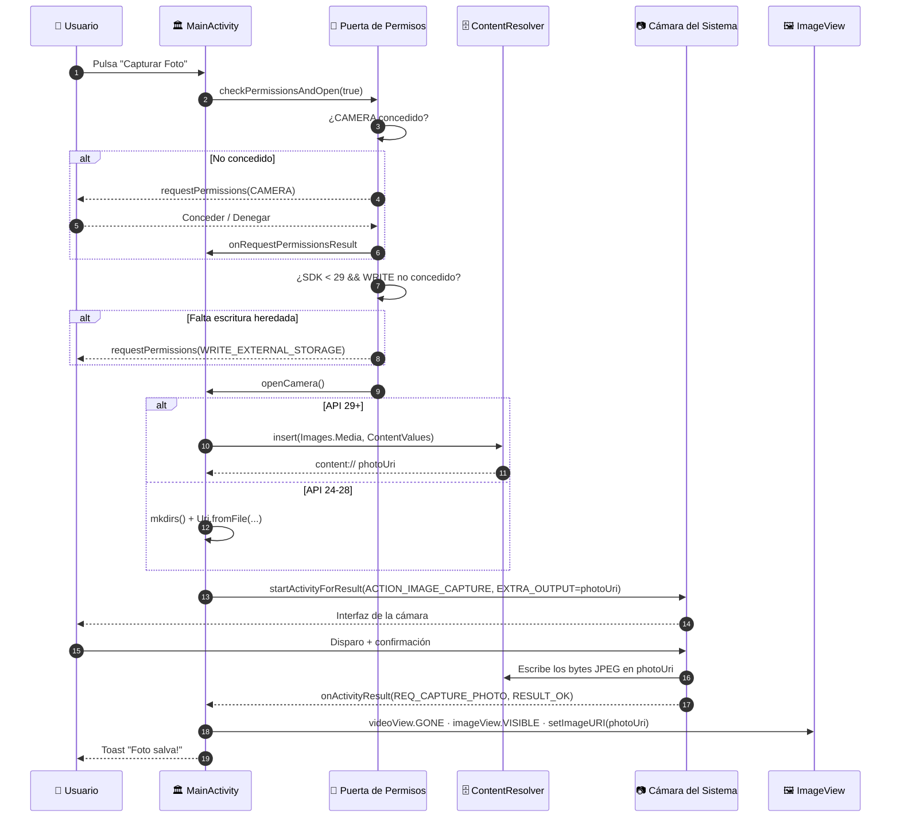
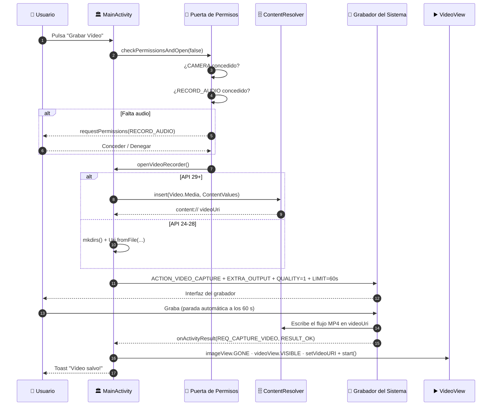
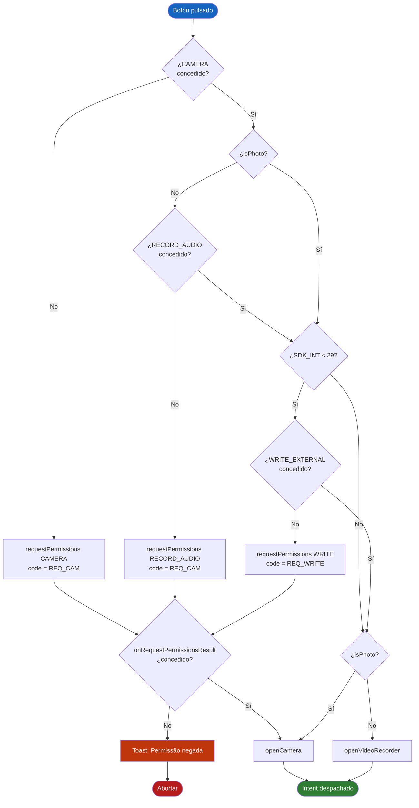
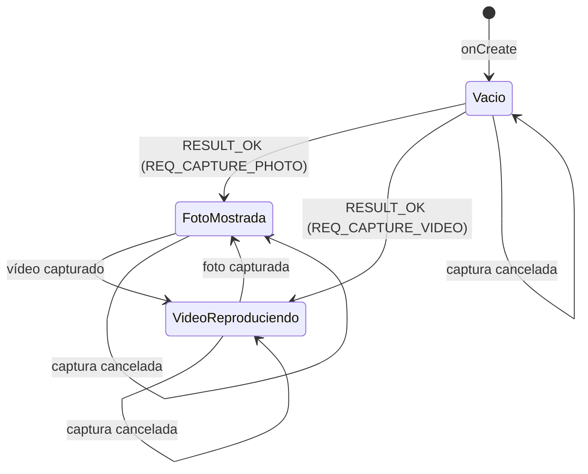
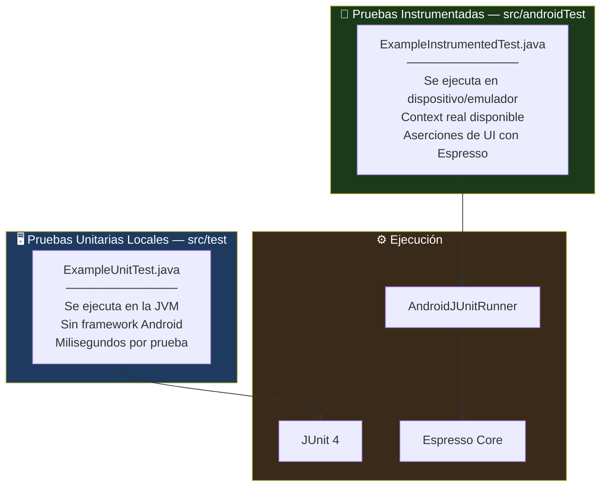

<div align="center">

**🌐 Choose Language / Selecione o Idioma / Elija el Idioma**

[](README.md)&nbsp;&nbsp;&nbsp;[](README_PT.md)&nbsp;&nbsp;&nbsp;[](README_ES.md)

</div>

---

<div align="center">

```
 █████╗ ██████╗ ██████╗  ██████╗ █████╗ ███╗   ███╗███████╗██████╗  █████╗
██╔══██╗██╔══██╗██╔══██╗██╔════╝██╔══██╗████╗ ████║██╔════╝██╔══██╗██╔══██╗
███████║██████╔╝██████╔╝██║     ███████║██╔████╔██║█████╗  ██████╔╝███████║
██╔══██║██╔═══╝ ██╔═══╝ ██║     ██╔══██║██║╚██╔╝██║██╔══╝  ██╔══██╗██╔══██║
██║  ██║██║     ██║     ╚██████╗██║  ██║██║ ╚═╝ ██║███████╗██║  ██║██║  ██║
╚═╝  ╚═╝╚═╝     ╚═╝      ╚═════╝╚═╝  ╚═╝╚═╝     ╚═╝╚══════╝╚═╝  ╚═╝╚═╝  ╚═╝
            Aplicación Android Nativa de Captura de Foto y Vídeo
```

---

[](https://developer.android.com/)
[](https://openjdk.org/)
[](https://gradle.org/)
[](https://m3.material.io/)
[](https://developer.android.com/training/data-storage/shared/media)
[]()
[]()

<br/>

> **Una aplicación Android nativa para capturar fotos y grabar vídeo**
> construida sobre delegación por Intent, permisos en tiempo de ejecución y almacenamiento con ámbito vía MediaStore.

<br/>


-10B981?style=flat-square)
-FF6B35?style=flat-square)


</div>

---

## 📑 Tabla de Contenidos

<details>
<summary>▶️ <strong>Haga clic para expandir / contraer esta sección</strong></summary>

<table>
<tr>
<td valign="top" width="50%">

**🏗️ Sistema**
- [Visión General](#-visión-general)
- [Arquitectura del Sistema](#️-arquitectura-del-sistema)
- [Stack Tecnológico](#️-stack-tecnológico)
- [Patrones de Diseño](#-patrones-de-diseño-aplicados)
- [Estructura del Proyecto](#-estructura-del-proyecto)

**📦 Módulos**
- [MainActivity — Orquestador](#️-mainactivity--orquestador-principal)
- [Puerta de Permisos](#-puerta-de-permisos--autorización-en-runtime)
- [Captura de Foto](#-captura-de-foto--pipeline-de-imagen)
- [Captura de Vídeo](#-captura-de-vídeo--pipeline-de-grabación)
- [Vista Previa de Medios](#️-vista-previa-de-medios--superficie-de-reproducción)
- [Adaptador de Almacenamiento](#️-adaptador-de-almacenamiento--mediastore--heredado)
- [Tema y Recursos](#-tema-y-recursos--material-design-3)

</td>
<td valign="top" width="50%">

**💼 Negocio**
- [Reglas de Negocio](#-reglas-de-negocio)
- [Requisitos Funcionales](#-requisitos-funcionales)
- [Requisitos No Funcionales](#-requisitos-no-funcionales)

**📐 Diseño**
- [Modelo de Datos](#️-modelo-de-datos)
- [Flujos del Sistema](#-flujos-del-sistema)
- [Flujo de Captura de Foto](#flujo-de-captura-de-foto)
- [Flujo de Captura de Vídeo](#flujo-de-captura-de-vídeo)
- [Flujo de Permisos](#flujo-de-solicitud-de-permisos)

**🔐 Seguridad & Operación**
- [Seguridad](#-seguridad)
- [Instalación & Ejecución](#-instalación--ejecución)
- [Pruebas Automatizadas](#-pruebas-automatizadas)
- [Métricas & Monitoreo](#-métricas--monitoreo)
- [Limitaciones Conocidas](#️-limitaciones-conocidas)

</td>
</tr>
</table>

---

</details>

## 🌟 Visión General

<details>
<summary>▶️ <strong>Haga clic para expandir / contraer esta sección</strong></summary>

**AppCamera** es una aplicación Android nativa escrita en **Java** que captura fotografías y graba vídeo delegando la operación a la aplicación de cámara del sistema mediante **Intents implícitos**, y luego persiste los medios resultantes en la galería pública utilizando la API **MediaStore**.

En lugar de reimplementar una pila de vista previa de cámara (CameraX/Camera2), la aplicación adopta deliberadamente el **modelo de delegación por Intent**: la app de cámara del sistema — ya optimizada, ya confiable para el usuario, ya encargada del autoenfoque, HDR, estabilización y selección de lente — realiza la captura, y AppCamera es dueña del *destino*, del *contrato de permisos* y de la *superficie de vista previa*.

El resultado es una aplicación pequeña, con pocas dependencias, compatible desde **Android 7.0 (API 24) hasta Android 15 (API 35)** y correcta respecto a las reglas de **almacenamiento con ámbito** introducidas en Android 10 (API 29).

### 🎯 Objetivos del Sistema

| Objetivo | Descripción |
|----------|-------------|
| 📸 **Captura de Foto** | Capturar imágenes fijas a resolución plena vía `ACTION_IMAGE_CAPTURE` |
| 🎥 **Grabación de Vídeo** | Grabar vídeo con límite de 60 segundos y perfil de alta calidad vía `ACTION_VIDEO_CAPTURE` |
| 🔐 **Permisos en Runtime** | Solicitud secuencial y no bloqueante de `CAMERA`, `RECORD_AUDIO` y `WRITE_EXTERNAL_STORAGE` heredado |
| 🗄️ **Almacenamiento con Ámbito** | Persistencia de doble vía: `MediaStore` en API 29+, E/S directa de `File` en API 24–28 |
| 🖼️ **Vista Previa Inmediata** | Visualización en la app de la foto capturada (`ImageView`) o reproducción de la grabación (`VideoView`) |
| 🎨 **Material Design 3** | Componentes Material, fondo degradado, iconos adaptativos, temas claro y oscuro |
| 📁 **Integración con la Galería** | Medios escritos en `Pictures/AppCamera` y `Movies/AppCamera`, visibles para cualquier app de galería |
| 🧪 **Calidad** | Andamiaje de pruebas instrumentadas y unitarias con JUnit 4 y Espresso |

---

</details>

## 🏗️ Arquitectura del Sistema

<details>
<summary>▶️ <strong>Haga clic para expandir / contraer esta sección</strong></summary>

### Diagrama de Módulos


```mermaid
flowchart TB
    subgraph UI["📱  CAPA DE INTERFAZ"]
        direction LR
        LAYOUT["🪟 activity_main.xml\n─────────────\nConstraintLayout\nMaterialButton x2\nCardView | ImageView\nVideoView"]
        THEME["🎨 themes.xml\n─────────────\nMaterial3 DayNight\nbg_gradient.xml\ncolors.xml"]
    end

    subgraph ORCH["🏛️  ORQUESTADOR"]
        MAIN["MainActivity.java\n─────────────────────\n• Gestión del ciclo de vida\n• Enrutamiento de clics\n• Arbitraje de permisos\n• Despacho de resultados"]
    end

    subgraph CORE["⚙️  UNIDADES FUNCIONALES  (en la Activity)"]
        direction TB
        PERM["🔐 checkPermissionsAndOpen\nPuerta de Permisos\n────────────\nCAMERA\nRECORD_AUDIO\nWRITE_EXTERNAL_STORAGE"]
        PHOTO["📸 openCamera\nPipeline de Foto\n────────────\nACTION_IMAGE_CAPTURE\nEXTRA_OUTPUT\nJPEG · nombre por timestamp"]
        VIDEO["🎥 openVideoRecorder\nPipeline de Vídeo\n────────────\nACTION_VIDEO_CAPTURE\nQUALITY=1 · límite 60s\nMP4 · nombre por timestamp"]
        RESULT["↩️ onActivityResult\nDespachador de Resultado\n────────────\nGuarda RESULT_OK\nIntercambio de visibilidad\nRetroalimentación por Toast"]
    end

    subgraph SYS["🤖  SISTEMA ANDROID"]
        direction LR
        CAMAPP["📷 App de Cámara del Sistema\n─────────────\nResuelve el Intent implícito\nDueña de la UX de captura"]
        MSTORE[("🗄️ MediaStore\nAPI 29+\n─────────────\nImages.Media\nVideo.Media\nRELATIVE_PATH")]
        FILESYS[("📂 Almacenamiento Externo\nAPI 24-28\n─────────────\nDIRECTORY_PICTURES\nDIRECTORY_MOVIES\nUri.fromFile")]
    end

    subgraph OUT["💾  SALIDA"]
        GALLERY["🖼️ Galería del Dispositivo\n──────────────────────\nPictures/AppCamera/*.jpg\nMovies/AppCamera/*.mp4"]
    end

    LAYOUT -->|"setOnClickListener"| MAIN
    THEME -.->|"estilos"| LAYOUT
    MAIN --> PERM
    PERM -->|"concedido"| PHOTO & VIDEO
    PHOTO -->|"startActivityForResult"| CAMAPP
    VIDEO -->|"startActivityForResult"| CAMAPP
    PHOTO -->|"insert()"| MSTORE
    VIDEO -->|"insert()"| MSTORE
    PHOTO -.->|"API < 29"| FILESYS
    VIDEO -.->|"API < 29"| FILESYS
    CAMAPP -->|"escribe en la Uri"| MSTORE & FILESYS
    CAMAPP -->|"código de resultado"| RESULT
    RESULT -->|"setImageURI / setVideoURI"| LAYOUT
    MSTORE --> GALLERY
    FILESYS --> GALLERY

    style UI fill:#1e3a5f,color:#fff,stroke:#4a90d9
    style ORCH fill:#1a3a1a,color:#fff,stroke:#4caf50
    style CORE fill:#3a1a1a,color:#fff,stroke:#e57373
    style SYS fill:#3a2a1a,color:#fff,stroke:#ffb74d
    style OUT fill:#2a1a3a,color:#fff,stroke:#ce93d8
```

### Capas de la Arquitectura


```mermaid
flowchart LR
    subgraph L1["📱 Presentación"]
        A1["Layouts XML"]
        A2["Componentes Material"]
    end
    subgraph L2["🏛️ Aplicación"]
        B1["MainActivity\nCiclo de vida + Enrutamiento"]
    end
    subgraph L3["⚙️ Dominio"]
        C1["Reglas de Captura\nPermiso · Nomenclatura · Límites"]
    end
    subgraph L4["💾 Infraestructura"]
        D1["MediaStore\n(ContentResolver)"]
        D2["Sistema de Archivos\n(vía heredada)"]
    end

    L1 --> L2 --> L3 --> L4

    style L1 fill:#1565C0,color:#fff
    style L2 fill:#2E7D32,color:#fff
    style L3 fill:#6A1B9A,color:#fff
    style L4 fill:#BF360C,color:#fff
```

---

</details>

## 🛠️ Stack Tecnológico

<details>
<summary>▶️ <strong>Haga clic para expandir / contraer esta sección</strong></summary>

<table>
<thead>
<tr>
<th>Capa</th>
<th>Tecnología</th>
<th>Versión</th>
<th>Finalidad</th>
</tr>
</thead>
<tbody>
<tr>
<td rowspan="2"><strong>🧠 Lenguaje</strong></td>
<td>Java</td>
<td>11</td>
<td>Lenguaje fuente de la aplicación (<code>sourceCompatibility</code> / <code>targetCompatibility</code>)</td>
</tr>
<tr>
<td>XML</td>
<td>—</td>
<td>Layouts, temas, colores, drawables, manifiesto</td>
</tr>
<tr>
<td rowspan="3"><strong>🤖 Plataforma</strong></td>
<td>Android SDK</td>
<td>compile 35</td>
<td>Objetivo de compilación (Android 15)</td>
</tr>
<tr>
<td>SDK Mínimo</td>
<td>24</td>
<td>Piso Android 7.0 Nougat</td>
</tr>
<tr>
<td>SDK Objetivo</td>
<td>35</td>
<td>Adhesión a los comportamientos de Android 15</td>
</tr>
<tr>
<td rowspan="4"><strong>🎨 Interfaz</strong></td>
<td>Material Components</td>
<td>Material 3</td>
<td><code>MaterialButton</code>, tematización, ripple, elevación</td>
</tr>
<tr>
<td>ConstraintLayout</td>
<td>más reciente</td>
<td>Jerarquía de layout plana y adaptable</td>
</tr>
<tr>
<td>CardView</td>
<td>AndroidX</td>
<td>Contenedor elevado de la vista previa</td>
</tr>
<tr>
<td>EdgeToEdge</td>
<td>androidx.activity</td>
<td>Insets de ventana inmersivos de borde a borde</td>
</tr>
<tr>
<td rowspan="3"><strong>💾 Almacenamiento</strong></td>
<td>MediaStore</td>
<td>API 29+</td>
<td>Inserciones con ámbito vía <code>ContentResolver</code></td>
</tr>
<tr>
<td>Environment / File</td>
<td>API 24–28</td>
<td>Escrituras heredadas en directorios públicos</td>
</tr>
<tr>
<td>ContentValues</td>
<td>—</td>
<td>Metadatos <code>DISPLAY_NAME</code>, <code>MIME_TYPE</code>, <code>RELATIVE_PATH</code></td>
</tr>
<tr>
<td rowspan="2"><strong>🔧 Build</strong></td>
<td>Gradle</td>
<td>Kotlin DSL</td>
<td><code>build.gradle.kts</code> + catálogo de versiones</td>
</tr>
<tr>
<td>Catálogo de Versiones</td>
<td><code>libs.versions.toml</code></td>
<td>Coordenadas de dependencias centralizadas</td>
</tr>
<tr>
<td rowspan="2"><strong>🧪 Pruebas</strong></td>
<td>JUnit</td>
<td>4</td>
<td>Pruebas unitarias locales (<code>src/test</code>)</td>
</tr>
<tr>
<td>Espresso + AndroidX Test</td>
<td>más reciente</td>
<td>Pruebas de UI instrumentadas (<code>src/androidTest</code>)</td>
</tr>
</tbody>
</table>

---

</details>

## 🎨 Patrones de Diseño Aplicados

<details>
<summary>▶️ <strong>Haga clic para expandir / contraer esta sección</strong></summary>

| Patrón | Dónde | Justificación |
|--------|-------|---------------|
| 🎯 **Delegación** | `openCamera()` / `openVideoRecorder()` | La captura se delega a la app de cámara del sistema en vez de reimplementarse |
| 🧭 **Facade** | `checkPermissionsAndOpen(boolean)` | Un único punto de entrada oculta verificaciones, ramificación por SDK y construcción del Intent |
| 🔀 **Strategy (ramificación en runtime)** | `Build.VERSION.SDK_INT >= Q` | Estrategia MediaStore vs. estrategia `File` heredada, elegida en tiempo de ejecución |
| 👂 **Observer / Callback** | `setOnClickListener`, `onActivityResult`, `onRequestPermissionsResult` | Reacción orientada a eventos de UI y del sistema |
| 🚦 **Guard Clause** | Puerta de permisos, `if (res != RESULT_OK) return;` | La salida temprana mantiene el camino feliz plano y legible |
| 🏷️ **Registro de Constantes** | `REQ_CAM`, `REQ_WRITE`, `REQ_CAPTURE_PHOTO`, `REQ_CAPTURE_VIDEO` | Los códigos nombrados hacen autoexplicativo el despacho de callbacks |
| 🔄 **Alternancia de Estado** | Intercambio de visibilidad `ImageView` / `VideoView` | Un único espacio de vista previa alterna entre dos tipos de medios |
| 🧱 **Recurso-Plantilla** | `themes.xml` + `values-night/themes.xml` | El mismo nombre de tema se resuelve distinto según la apariencia del sistema |

---

</details>

## 📁 Estructura del Proyecto

<details>
<summary>▶️ <strong>Haga clic para expandir / contraer esta sección</strong></summary>

```
AppCamera/
│
├── 📄 build.gradle.kts                  # Script de build raíz (declaración de plugins)
├── 📄 settings.gradle.kts               # Inclusión de módulos + configuración de repositorios
├── 📄 gradle.properties                 # Argumentos de la JVM, flags AndroidX
├── 📄 local.properties                  # Ruta local del SDK (no versionada)
├── 📄 gradlew / gradlew.bat             # Lanzadores del Gradle Wrapper
│
├── 📂 gradle/
│   ├── 📄 libs.versions.toml            # Catálogo de versiones — fuente única de verdad
│   └── 📂 wrapper/
│       ├── gradle-wrapper.jar
│       └── gradle-wrapper.properties    # Distribución Gradle fijada
│
├── 📂 app/
│   ├── 📄 build.gradle.kts              # Build del módulo: SDKs, buildTypes, dependencias
│   ├── 📄 proguard-rules.pro            # Reglas de retención R8/ProGuard (release)
│   │
│   └── 📂 src/
│       ├── 📂 main/
│       │   ├── 📄 AndroidManifest.xml    # Permisos, features, registro de la Activity
│       │   │
│       │   ├── 📂 java/com/example/appcamera/
│       │   │   └── 📄 MainActivity.java  # ★ Toda la lógica de la aplicación (161 líneas)
│       │   │
│       │   └── 📂 res/
│       │       ├── 📂 layout/
│       │       │   └── activity_main.xml       # ConstraintLayout raíz + preview + botones
│       │       ├── 📂 drawable/
│       │       │   ├── bg_gradient.xml         # Fondo de ventana degradado
│       │       │   ├── ic_camera.xml           # Icono vectorial del botón de foto
│       │       │   ├── ic_videocam.xml         # Icono vectorial del botón de vídeo
│       │       │   ├── ic_launcher_background.xml
│       │       │   └── ic_launcher_foreground.xml
│       │       ├── 📂 mipmap-anydpi-v26/
│       │       │   ├── ic_launcher.xml         # Icono adaptativo (API 26+)
│       │       │   └── ic_launcher_round.xml
│       │       ├── 📂 mipmap-{m,h,xh,xxh,xxxh}dpi/
│       │       │   └── ic_launcher*.webp       # Iconos ráster por densidad
│       │       ├── 📂 values/
│       │       │   ├── colors.xml              # Tokens de paleta
│       │       │   ├── strings.xml             # Cadenas de UI externalizadas
│       │       │   └── themes.xml              # Tema claro (Material 3)
│       │       ├── 📂 values-night/
│       │       │   └── themes.xml              # Sobrescritura del tema oscuro
│       │       └── 📂 xml/
│       │           ├── backup_rules.xml        # Reglas de inclusión de Auto Backup
│       │           └── data_extraction_rules.xml # Reglas de transferencia (API 31+)
│       │
│       ├── 📂 test/java/com/example/appcamera/
│       │   └── ExampleUnitTest.java      # Prueba unitaria local en la JVM
│       │
│       └── 📂 androidTest/java/com/example/appcamera/
│           └── ExampleInstrumentedTest.java  # Prueba instrumentada en el dispositivo
│
├── 📄 README.md                          # 🇺🇸 Inglés (principal)
├── 📄 README_PT.md                       # 🇧🇷 Portugués
└── 📄 README_ES.md                       # 🇪🇸 Español
```

---

</details>

## 📦 Módulos del Sistema

<details>
<summary>▶️ <strong>Haga clic para expandir / contraer esta sección</strong></summary>

### 🏛️ MainActivity — Orquestador Principal

La única `Activity` de la aplicación. Es dueña del ciclo de vida, resuelve las referencias de vistas, conecta los listeners de clic y despacha todos los callbacks del sistema.

| Responsabilidad | Implementación |
|-----------------|----------------|
| Entrada del ciclo de vida | `onCreate(Bundle)` — habilita edge-to-edge, infla `activity_main` |
| Vinculación de vistas | `findViewById` para `imageView`, `videoView`, `btnCapturePhoto`, `btnRecordVideo` |
| Enrutamiento de clics | Listeners lambda → `checkPermissionsAndOpen(true \| false)` |
| Callback de permiso | `onRequestPermissionsResult(int, String[], int[])` |
| Callback de resultado | `onActivityResult(int, int, Intent)` |
| Estado retenido | `Uri photoUri`, `Uri videoUri` — el destino entregado a la app de cámara |

**Registro de códigos de solicitud**

| Constante | Valor | Significado |
|-----------|-------|-------------|
| `REQ_CAM` | `100` | Solicitud de permiso de cámara / audio |
| `REQ_WRITE` | `101` | Solicitud de permiso de almacenamiento heredado |
| `REQ_CAPTURE_PHOTO` | `1` | Resultado de la activity de captura de foto |
| `REQ_CAPTURE_VIDEO` | `2` | Resultado de la activity de captura de vídeo |

---

### 🔐 Puerta de Permisos — Autorización en Runtime

`checkPermissionsAndOpen(boolean isPhoto)` implementa una **cadena secuencial de guardas**. Cada verificación o retorna temprano para solicitar el permiso faltante, o continúa a la siguiente.

| Orden | Permiso | Condición | Código |
|-------|---------|-----------|--------|
| 1 | `Manifest.permission.CAMERA` | Siempre requerido | `REQ_CAM` |
| 2 | `Manifest.permission.RECORD_AUDIO` | Solo cuando `isPhoto == false` | `REQ_CAM` |
| 3 | `Manifest.permission.WRITE_EXTERNAL_STORAGE` | Solo cuando `SDK_INT < Q` (API 29) | `REQ_WRITE` |

Una vez satisfecha toda la cadena, el control se ramifica a `openCamera()` u `openVideoRecorder()`.

> [!NOTE]
> La cadena solicita **un permiso por invocación**. El usuario ve, por tanto, los diálogos de uno en uno, y el flujo se reanuda desde `onRequestPermissionsResult`.

---

### 📸 Captura de Foto — Pipeline de Imagen

`openCamera()` prepara un destino escribible y lo entrega a la cámara del sistema.

| Paso | API 29+ (Con Ámbito) | API 24–28 (Heredado) |
|------|----------------------|----------------------|
| Metadatos | `ContentValues` con `DISPLAY_NAME`, `MIME_TYPE`, `RELATIVE_PATH` | — |
| Nombre de archivo | `System.currentTimeMillis() + ".jpg"` | `System.currentTimeMillis() + ".jpg"` |
| Tipo MIME | `image/jpeg` | implícito |
| Ubicación | `Environment.DIRECTORY_PICTURES + "/AppCamera"` | `getExternalStoragePublicDirectory(DIRECTORY_PICTURES)/AppCamera` |
| Origen de la Uri | `contentResolver.insert(Images.Media.EXTERNAL_CONTENT_URI, vals)` | `Uri.fromFile(file)` |
| Creación de directorio | Gestionada por MediaStore | `dir.mkdirs()` cuando falta |

El Intent se despacha entonces:

```java
Intent i = new Intent(MediaStore.ACTION_IMAGE_CAPTURE);
i.putExtra(MediaStore.EXTRA_OUTPUT, photoUri);
startActivityForResult(i, REQ_CAPTURE_PHOTO);
```

Como se suministra `EXTRA_OUTPUT`, la cámara escribe la imagen a **resolución plena** en la `Uri` dada, en lugar de devolver una miniatura reducida en el Intent de resultado.

---

### 🎥 Captura de Vídeo — Pipeline de Grabación

`openVideoRecorder()` refleja el pipeline de foto sobre la colección de vídeo y añade dos restricciones de grabación.

| Parámetro | Valor | Efecto |
|-----------|-------|--------|
| Acción | `MediaStore.ACTION_VIDEO_CAPTURE` | Abre el grabador del sistema |
| `EXTRA_OUTPUT` | `videoUri` | Destino del archivo codificado |
| `EXTRA_VIDEO_QUALITY` | `1` | Perfil de alta calidad (`0` sería baja) |
| `EXTRA_DURATION_LIMIT` | `60` | Parada obligatoria a los 60 segundos |
| Nombre de archivo | `System.currentTimeMillis() + ".mp4"` | Sin colisión y ordenable cronológicamente |
| Tipo MIME | `video/mp4` | Registrado en MediaStore |
| Ubicación | `Movies/AppCamera` | Directorio visible para la galería |

---

### 🖼️ Vista Previa de Medios — Superficie de Reproducción

`onActivityResult` es el único punto donde los medios capturados se hacen visibles. Aplica primero una guarda — `if (res != RESULT_OK) return;` — de modo que una captura cancelada deja intacta la vista previa anterior.

| Solicitud | Vista mostrada | Vista oculta | Acción | Retroalimentación |
|-----------|----------------|--------------|--------|-------------------|
| `REQ_CAPTURE_PHOTO` | `imageView` (`VISIBLE`) | `videoView` (`GONE`) | `imageView.setImageURI(photoUri)` | Toast: *Foto salva!* |
| `REQ_CAPTURE_VIDEO` | `videoView` (`VISIBLE`) | `imageView` (`GONE`) | `setVideoURI(videoUri)` + `start()` | Toast: *Vídeo salvo!* |

Ambas vistas ocupan el mismo espacio dentro de un `CardView`; solo una está visible, lo que mantiene estable la altura del layout.

---

### 🗄️ Adaptador de Almacenamiento — MediaStore / Heredado

La ramificación por SDK se duplica deliberadamente en ambos métodos de captura, de forma que cada pipeline sea dueño de su propia URI de colección y constante de directorio.

| Aspecto | API 29+ | API 24–28 |
|---------|---------|-----------|
| Permiso necesario para escribir | Ninguno (inserciones de la propia app) | `WRITE_EXTERNAL_STORAGE` |
| Colección (foto) | `MediaStore.Images.Media.EXTERNAL_CONTENT_URI` | `Environment.DIRECTORY_PICTURES` |
| Colección (vídeo) | `MediaStore.Video.Media.EXTERNAL_CONTENT_URI` | `Environment.DIRECTORY_MOVIES` |
| Mecanismo de subcarpeta | Columna `RELATIVE_PATH` | `File` físico + `mkdirs()` |
| Indexación por el media scanner | Automática | Automática en la mayoría de builds de OEM |
| Esquema de Uri | `content://` | `file://` |

---

### 🎨 Tema y Recursos — Material Design 3

| Recurso | Archivo | Rol |
|---------|---------|-----|
| Tema claro | `values/themes.xml` | Padre Material 3 DayNight, colores de marca |
| Tema oscuro | `values-night/themes.xml` | Sobrescrituras resueltas automáticamente por el sistema |
| Paleta | `values/colors.xml` | Tokens de color nombrados compartidos por ambos temas |
| Cadenas | `values/strings.xml` | Etiquetas externalizadas — listas para traducción |
| Fondo | `drawable/bg_gradient.xml` | Degradado vectorial aplicado al layout raíz |
| Iconos | `drawable/ic_camera.xml`, `ic_videocam.xml` | Glifos vectoriales de los botones, sensibles a tint |
| Launcher | `mipmap-anydpi-v26/ic_launcher.xml` | Icono adaptativo (capas de fondo + frente) |
| Política de backup | `xml/backup_rules.xml`, `xml/data_extraction_rules.xml` | Declara qué entra en Auto Backup / transferencia de dispositivo |

---

</details>

## 💼 Reglas de Negocio

<details>
<summary>▶️ <strong>Haga clic para expandir / contraer esta sección</strong></summary>

### 📸 Reglas de Captura

| # | Regla | Aplicación |
|---|-------|------------|
| RN-01 | La captura de foto requiere el permiso `CAMERA` | La cadena de guardas retorna antes del despacho del Intent |
| RN-02 | La grabación de vídeo requiere `CAMERA` **y** `RECORD_AUDIO` | La segunda guarda aplica solo cuando `isPhoto == false` |
| RN-03 | En API < 29, escribir también requiere `WRITE_EXTERNAL_STORAGE` | Tercera guarda, condicionada por SDK |
| RN-04 | La `Uri` de destino debe existir **antes** de despachar el Intent | `photoUri` / `videoUri` asignados en el mismo método |
| RN-05 | Las grabaciones de vídeo se limitan a 60 segundos | `EXTRA_DURATION_LIMIT = 60` |
| RN-06 | El vídeo se graba con el perfil de alta calidad | `EXTRA_VIDEO_QUALITY = 1` |
| RN-07 | Una captura cancelada o fallida no debe alterar la vista previa | `if (res != RESULT_OK) return;` |
| RN-08 | Las vistas previas de foto y vídeo son mutuamente excluyentes | Intercambio de visibilidad en `onActivityResult` |

### 🏷️ Reglas de Nomenclatura de Archivos

| # | Regla | Detalle |
|---|-------|---------|
| RN-09 | Los nombres de archivo son marcas de tiempo en milisegundos de época | `System.currentTimeMillis()` |
| RN-10 | La extensión de foto es siempre `.jpg`, MIME `image/jpeg` | Fijado por el pipeline |
| RN-11 | La extensión de vídeo es siempre `.mp4`, MIME `video/mp4` | Fijado por el pipeline |
| RN-12 | Las fotos residen en `Pictures/AppCamera` | Vía `RELATIVE_PATH` o carpeta física |
| RN-13 | Los vídeos residen en `Movies/AppCamera` | Vía `RELATIVE_PATH` o carpeta física |
| RN-14 | La colisión se evita por tiempo monótono, no por contador | Dos capturas en el mismo milisegundo se consideran improbables |

### 🔐 Reglas de Denegación de Permiso

| # | Regla | Comportamiento |
|---|-------|----------------|
| RN-15 | Cualquier denegación produce un mensaje visible al usuario | `Toast` — *Permissão negada* |
| RN-16 | La denegación aborta el intento de captura | No se despacha ningún Intent |
| RN-17 | El usuario puede reintentar simplemente pulsando el botón otra vez | La puerta se reevalúa en cada clic |

---

</details>

## ✅ Requisitos Funcionales

<details>
<summary>▶️ <strong>Haga clic para expandir / contraer esta sección</strong></summary>

| ID | Requisito | Prioridad | Estado |
|----|-----------|-----------|--------|
| **RF-01** | El sistema debe presentar una pantalla principal con botón de foto y botón de vídeo | 🔴 Alta | ✅ Implementado |
| **RF-02** | El sistema debe solicitar el permiso `CAMERA` en runtime antes de cualquier captura | 🔴 Alta | ✅ Implementado |
| **RF-03** | El sistema debe solicitar el permiso `RECORD_AUDIO` antes de grabar vídeo | 🔴 Alta | ✅ Implementado |
| **RF-04** | El sistema debe solicitar `WRITE_EXTERNAL_STORAGE` en niveles de API inferiores a 29 | 🟡 Media | ✅ Implementado |
| **RF-05** | El sistema debe abrir la aplicación de cámara del dispositivo para captura fija | 🔴 Alta | ✅ Implementado |
| **RF-06** | El sistema debe abrir el grabador del dispositivo para captura de vídeo | 🔴 Alta | ✅ Implementado |
| **RF-07** | El sistema debe persistir las fotos en `Pictures/AppCamera` | 🔴 Alta | ✅ Implementado |
| **RF-08** | El sistema debe persistir los vídeos en `Movies/AppCamera` | 🔴 Alta | ✅ Implementado |
| **RF-09** | El sistema debe nombrar cada archivo con una marca de tiempo en milisegundos | 🟡 Media | ✅ Implementado |
| **RF-10** | El sistema debe mostrar la foto capturada dentro de la app inmediatamente | 🔴 Alta | ✅ Implementado |
| **RF-11** | El sistema debe reproducir automáticamente el vídeo grabado dentro de la app | 🔴 Alta | ✅ Implementado |
| **RF-12** | El sistema debe ocultar la vista de previsualización inactiva | 🟢 Baja | ✅ Implementado |
| **RF-13** | El sistema debe limitar las grabaciones a 60 segundos | 🟡 Media | ✅ Implementado |
| **RF-14** | El sistema debe solicitar el perfil de vídeo de alta calidad | 🟢 Baja | ✅ Implementado |
| **RF-15** | El sistema debe confirmar cada guardado exitoso con un toast | 🟢 Baja | ✅ Implementado |
| **RF-16** | El sistema debe notificar al usuario cuando se deniegue un permiso | 🟡 Media | ✅ Implementado |
| **RF-17** | El sistema debe ignorar los resultados cuyo código no sea `RESULT_OK` | 🟡 Media | ✅ Implementado |
| **RF-18** | El sistema debe renderizar de borde a borde bajo las barras de estado y navegación | 🟢 Baja | ✅ Implementado |
| **RF-19** | El sistema debe seguir la configuración clara/oscura del dispositivo | 🟢 Baja | ✅ Implementado |
| **RF-20** | El sistema debe exponer los medios capturados a aplicaciones de galería de terceros | 🔴 Alta | ✅ Implementado |

---

</details>

## ⚡ Requisitos No Funcionales

<details>
<summary>▶️ <strong>Haga clic para expandir / contraer esta sección</strong></summary>

| ID | Categoría | Requisito | Meta |
|----|-----------|-----------|------|
| **RNF-01** | ⚡ Rendimiento | Arranque en frío hasta la pantalla principal interactiva | < 1,5 s en hardware de gama media |
| **RNF-02** | ⚡ Rendimiento | Pulsación del botón hasta la app de cámara visible | < 800 ms |
| **RNF-03** | 📦 Tamaño | Tamaño del APK instalado | < 5 MB (sin minificación) |
| **RNF-04** | 🧠 Memoria | Heap residente durante la vista previa | < 60 MB |
| **RNF-05** | 🔋 Batería | Sin servicio en segundo plano, sin wake lock | 0 de consumo en background |
| **RNF-06** | 📱 Compatibilidad | Rango de versiones de Android | API 24 → API 35 |
| **RNF-07** | 📱 Compatibilidad | Soporte de pantalla | Teléfono en vertical, adaptable por ConstraintLayout |
| **RNF-08** | 🎨 Usabilidad | Controles alcanzables con una mano | Botones anclados en la mitad inferior |
| **RNF-09** | 🎨 Usabilidad | Toda acción produce retroalimentación visible | Toast en éxito y en denegación |
| **RNF-10** | ♿ Accesibilidad | Todas las vistas accionables llevan content description | Meta de 100 % de cobertura |
| **RNF-11** | 🌍 Internacionalización | Cadenas de UI externalizadas en `strings.xml` | Listas para traducción |
| **RNF-12** | 🔐 Privacidad | Ningún permiso de red declarado | Los medios nunca salen del dispositivo |
| **RNF-13** | 🔐 Privacidad | Sin analítica, sin telemetría, sin SDK de terceros | Cero recolección de datos |
| **RNF-14** | 🧱 Mantenibilidad | Lógica en un solo archivo, sin framework de arquitectura externo | < 200 líneas de Java |
| **RNF-15** | 🔧 Build | Builds reproducibles vía Gradle Wrapper + catálogo de versiones | Distribución fijada |
| **RNF-16** | 🧪 Testabilidad | Conjuntos de fuentes unitario e instrumentado presentes | JUnit 4 + Espresso |

---

</details>

## 🗄️ Modelo de Datos

<details>
<summary>▶️ <strong>Haga clic para expandir / contraer esta sección</strong></summary>

### Diagrama Entidad-Relación


```mermaid
erDiagram
    ESTADO_ACTIVITY ||--o| PHOTO_URI : "mantiene"
    ESTADO_ACTIVITY ||--o| VIDEO_URI : "mantiene"
    PHOTO_URI ||--|| MEDIASTORE_IMAGEN : "resuelve a"
    VIDEO_URI ||--|| MEDIASTORE_VIDEO : "resuelve a"
    MEDIASTORE_IMAGEN }o--|| DIR_PICTURES : "almacenado en"
    MEDIASTORE_VIDEO }o--|| DIR_MOVIES : "almacenado en"
    CONJUNTO_PERMISOS ||--o{ SOLICITUD_CAPTURA : "autoriza"
    SOLICITUD_CAPTURA ||--o| MEDIASTORE_IMAGEN : "produce"
    SOLICITUD_CAPTURA ||--o| MEDIASTORE_VIDEO : "produce"

    ESTADO_ACTIVITY {
        Uri photoUri "anulable, último destino de foto"
        Uri videoUri "anulable, último destino de vídeo"
        ImageView imageView "superficie de vista previa"
        VideoView videoView "superficie de reproducción"
    }

    CONJUNTO_PERMISOS {
        boolean CAMERA "siempre requerido"
        boolean RECORD_AUDIO "requerido para vídeo"
        boolean WRITE_EXTERNAL_STORAGE "requerido bajo la API 29"
    }

    SOLICITUD_CAPTURA {
        int requestCode "1 foto, 2 vídeo"
        string action "ACTION_IMAGE_CAPTURE | ACTION_VIDEO_CAPTURE"
        Uri extraOutput "destino entregado a la cámara"
        int videoQuality "1 = alta, solo vídeo"
        int durationLimit "60 segundos, solo vídeo"
    }

    MEDIASTORE_IMAGEN {
        string DISPLAY_NAME "epochMillis.jpg"
        string MIME_TYPE "image/jpeg"
        string RELATIVE_PATH "Pictures/AppCamera"
        long dateAdded "marca de inserción"
    }

    MEDIASTORE_VIDEO {
        string DISPLAY_NAME "epochMillis.mp4"
        string MIME_TYPE "video/mp4"
        string RELATIVE_PATH "Movies/AppCamera"
        long duration "máx. 60000 ms"
    }

    DIR_PICTURES {
        string path "Environment.DIRECTORY_PICTURES"
        string subFolder "AppCamera"
    }

    DIR_MOVIES {
        string path "Environment.DIRECTORY_MOVIES"
        string subFolder "AppCamera"
    }
```

### Especificación del Registro en MediaStore

| Columna | Valor de foto | Valor de vídeo | Notas |
|---------|---------------|----------------|-------|
| `DISPLAY_NAME` | `<epochMillis>.jpg` | `<epochMillis>.mp4` | Definido por AppCamera |
| `MIME_TYPE` | `image/jpeg` | `video/mp4` | Definido por AppCamera |
| `RELATIVE_PATH` | `Pictures/AppCamera` | `Movies/AppCamera` | Definido por AppCamera (API 29+) |
| `_ID` | automático | automático | Asignado por MediaStore |
| `DATE_ADDED` | automático | automático | Asignado por MediaStore |
| `SIZE` | automático | automático | Escrito por la app de cámara |
| `WIDTH` / `HEIGHT` | automático | automático | Extraído por el media scanner |
| `DURATION` | — | automático | ≤ 60 000 ms |
| `OWNER_PACKAGE_NAME` | `com.example.appcamera` | `com.example.appcamera` | Concede derechos de borrado/actualización |

### Especificación de Archivo Heredado (API 24–28)

| Propiedad | Foto | Vídeo |
|-----------|------|-------|
| Directorio base | `getExternalStoragePublicDirectory(DIRECTORY_PICTURES)` | `getExternalStoragePublicDirectory(DIRECTORY_MOVIES)` |
| Subdirectorio | `AppCamera` (creado con `mkdirs()`) | `AppCamera` (creado con `mkdirs()`) |
| Esquema de Uri | `file://` | `file://` |
| Propiedad | A nivel de sistema de archivos, sobrevive a la desinstalación | A nivel de sistema de archivos, sobrevive a la desinstalación |

---

</details>

## 🔄 Flujos del Sistema

<details>
<summary>▶️ <strong>Haga clic para expandir / contraer esta sección</strong></summary>

### Flujo de Captura de Foto


```mermaid
sequenceDiagram
    autonumber
    participant U as 👤 Usuario
    participant A as 🏛️ MainActivity
    participant P as 🔐 Puerta de Permisos
    participant R as 🗄️ ContentResolver
    participant C as 📷 Cámara del Sistema
    participant V as 🖼️ ImageView

    U->>A: Pulsa "Capturar Foto"
    A->>P: checkPermissionsAndOpen(true)
    P->>P: ¿CAMERA concedido?
    alt No concedido
        P-->>U: requestPermissions(CAMERA)
        U-->>P: Conceder / Denegar
        P->>A: onRequestPermissionsResult
    end
    P->>P: ¿SDK < 29 && WRITE no concedido?
    alt Falta escritura heredada
        P-->>U: requestPermissions(WRITE_EXTERNAL_STORAGE)
    end
    P->>A: openCamera()
    alt API 29+
        A->>R: insert(Images.Media, ContentValues)
        R-->>A: content:// photoUri
    else API 24-28
        A->>A: mkdirs() + Uri.fromFile(...)
    end
    A->>C: startActivityForResult(ACTION_IMAGE_CAPTURE, EXTRA_OUTPUT=photoUri)
    C-->>U: Interfaz de la cámara
    U->>C: Disparo + confirmación
    C->>R: Escribe los bytes JPEG en photoUri
    C-->>A: onActivityResult(REQ_CAPTURE_PHOTO, RESULT_OK)
    A->>V: videoView.GONE · imageView.VISIBLE · setImageURI(photoUri)
    A-->>U: Toast "Foto salva!"
```

### Flujo de Captura de Vídeo


```mermaid
sequenceDiagram
    autonumber
    participant U as 👤 Usuario
    participant A as 🏛️ MainActivity
    participant P as 🔐 Puerta de Permisos
    participant R as 🗄️ ContentResolver
    participant C as 🎥 Grabador del Sistema
    participant V as ▶️ VideoView

    U->>A: Pulsa "Grabar Vídeo"
    A->>P: checkPermissionsAndOpen(false)
    P->>P: ¿CAMERA concedido?
    P->>P: ¿RECORD_AUDIO concedido?
    alt Falta audio
        P-->>U: requestPermissions(RECORD_AUDIO)
        U-->>P: Conceder / Denegar
    end
    P->>A: openVideoRecorder()
    alt API 29+
        A->>R: insert(Video.Media, ContentValues)
        R-->>A: content:// videoUri
    else API 24-28
        A->>A: mkdirs() + Uri.fromFile(...)
    end
    A->>C: ACTION_VIDEO_CAPTURE + EXTRA_OUTPUT + QUALITY=1 + LIMIT=60s
    C-->>U: Interfaz del grabador
    U->>C: Graba (parada automática a los 60 s)
    C->>R: Escribe el flujo MP4 en videoUri
    C-->>A: onActivityResult(REQ_CAPTURE_VIDEO, RESULT_OK)
    A->>V: imageView.GONE · videoView.VISIBLE · setVideoURI + start()
    A-->>U: Toast "Vídeo salvo!"
```

### Flujo de Solicitud de Permisos


```mermaid
flowchart TD
    START([Botón pulsado]) --> CAM{¿CAMERA<br/>concedido?}
    CAM -- No --> REQCAM[requestPermissions CAMERA<br/>code = REQ_CAM]
    REQCAM --> CB{onRequestPermissionsResult<br/>¿concedido?}
    CB -- No --> TOAST[Toast: Permissão negada]
    TOAST --> END([Abortar])
    CB -- Sí --> OPEN
    CAM -- Sí --> ISPHOTO{¿isPhoto?}
    ISPHOTO -- No --> AUD{¿RECORD_AUDIO<br/>concedido?}
    AUD -- No --> REQAUD[requestPermissions RECORD_AUDIO<br/>code = REQ_CAM]
    REQAUD --> CB
    AUD -- Sí --> SDK
    ISPHOTO -- Sí --> SDK{¿SDK_INT < 29?}
    SDK -- No --> BRANCH
    SDK -- Sí --> WRT{¿WRITE_EXTERNAL<br/>concedido?}
    WRT -- No --> REQWRT[requestPermissions WRITE<br/>code = REQ_WRITE]
    REQWRT --> CB
    WRT -- Sí --> BRANCH
    BRANCH{¿isPhoto?} -- Sí --> OPEN[openCamera]
    BRANCH -- No --> OPENV[openVideoRecorder]
    OPEN --> DONE([Intent despachado])
    OPENV --> DONE

    style START fill:#1565C0,color:#fff
    style DONE fill:#2E7D32,color:#fff
    style END fill:#B71C1C,color:#fff
    style TOAST fill:#BF360C,color:#fff
```

### Flujo de Selección de Estrategia de Almacenamiento

```mermaid
flowchart LR
    IN([Captura solicitada]) --> Q{Build.VERSION.SDK_INT<br/>>= Q (29)?}
    Q -- Sí --> CV[Construir ContentValues<br/>DISPLAY_NAME · MIME_TYPE · RELATIVE_PATH]
    CV --> INS[contentResolver.insert]
    INS --> URI1[Uri content://]
    Q -- No --> DIR[getExternalStoragePublicDirectory]
    DIR --> MK{¿Existe la carpeta?}
    MK -- No --> MKD[mkdirs]
    MKD --> FL
    MK -- Sí --> FL[new File dir, epochMillis.ext]
    FL --> URI2[Uri file://]
    URI1 --> OUT([EXTRA_OUTPUT])
    URI2 --> OUT

    style IN fill:#1565C0,color:#fff
    style OUT fill:#2E7D32,color:#fff
```

### Máquina de Estados de la Vista Previa


```mermaid
stateDiagram-v2
    [*] --> Vacio: onCreate
    Vacio --> FotoMostrada: RESULT_OK (REQ_CAPTURE_PHOTO)
    Vacio --> VideoReproduciendo: RESULT_OK (REQ_CAPTURE_VIDEO)
    FotoMostrada --> VideoReproduciendo: vídeo capturado
    VideoReproduciendo --> FotoMostrada: foto capturada
    FotoMostrada --> FotoMostrada: otra foto
    VideoReproduciendo --> VideoReproduciendo: otro vídeo
    Vacio --> Vacio: captura cancelada
    FotoMostrada --> FotoMostrada: captura cancelada
    VideoReproduciendo --> VideoReproduciendo: captura cancelada
```

---

</details>

## 🔐 Seguridad

<details>
<summary>▶️ <strong>Haga clic para expandir / contraer esta sección</strong></summary>

### Controles Implementados

| Control | Implementación | Efecto |
|---------|----------------|--------|
| 🔐 **Modelo de permisos en runtime** | `ContextCompat.checkSelfPermission` + `ActivityCompat.requestPermissions` | Cámara y micrófono nunca se acceden sin consentimiento explícito |
| 🚦 **Puerta fail-closed** | Toda guarda retorna antes del despacho del Intent | Un permiso faltante aborta la operación en lugar de degradarla |
| 🗄️ **Almacenamiento con ámbito** | Inserciones en MediaStore en API 29+ | La app nunca posee acceso amplio al sistema de archivos en Android moderno |
| 🏷️ **Registros con dueño** | `OWNER_PACKAGE_NAME` definido implícitamente en la inserción | Solo AppCamera puede modificar o borrar sus propias filas sin consentimiento extra |
| 🌐 **Sin permiso de red** | `INTERNET` ausente del manifiesto | Los medios capturados son físicamente incapaces de salir del dispositivo por esta app |
| 📵 **Sin SDK de terceros** | Conjunto de dependencias limitado a AndroidX + Material | Ninguna salida de datos hacia analítica, anuncios o reportes de fallos |
| 🧾 **Política de backup declarada** | `backup_rules.xml`, `data_extraction_rules.xml` | Control explícito sobre lo que Auto Backup y la transferencia pueden copiar |
| ✅ **Validación de resultado** | `if (res != RESULT_OK) return;` | Resultados malformados o cancelados no pueden alterar el estado de la UI |
| 🔒 **Captura delegada** | La cámara del sistema es dueña de la sesión del sensor | AppCamera nunca mantiene un handle de cámara abierto que pudiera filtrarse |

### Limitaciones de Seguridad Conocidas

> [!WARNING]
> Lo siguiente es inherente al diseño actual y debe comprenderse antes de reutilizarlo en un contexto de producción.

| Limitación | Riesgo | Vía de mitigación |
|------------|--------|-------------------|
| 🗂️ **Medios en colecciones públicas** | Cualquier app con permiso de lectura de medios puede leer los archivos capturados | Escribir en `getExternalFilesDir()` o almacenamiento privado de la app si se requiere confidencialidad |
| 🔓 **Sin cifrado en reposo** | Los archivos son JPEG/MP4 en claro en el almacenamiento compartido | Cifrar con Jetpack Security (`EncryptedFile`) antes de persistir |
| 🧭 **Uri `file://` en API < 29** | Esquema heredado; riesgo de `FileUriExposedException` al compartir con otra app | Adoptar `FileProvider` para compartir entre apps en dispositivos heredados |
| 🔁 **Denegación permanente no detectada** | "No volver a preguntar" produce el mismo toast que una denegación normal | Llamar a `shouldShowRequestPermissionRationale` y enlazar a los ajustes de la app |
| 🕳️ **Sin guarda `resolveActivity`** | Un dispositivo sin app de cámara lanzaría `ActivityNotFoundException` | Verificar `intent.resolveActivity(packageManager) != null` antes del despacho |
| 🧹 **Filas huérfanas en MediaStore** | Una captura cancelada deja una fila vacía insertada en API 29+ | Borrar la `Uri` pendiente cuando `res != RESULT_OK` |
| 🔏 **Sin bandera `IS_PENDING`** | Otras apps pueden observar la fila mientras aún se está escribiendo | Definir `MediaStore.MediaColumns.IS_PENDING = 1` durante la escritura y limpiarlo después |
| 🧬 **Build de release sin minificar** | `isMinifyEnabled = false` publica bytecode legible | Habilitar R8 con el `proguard-rules.pro` ya existente |

---

</details>

## 🚀 Instalación & Ejecución

<details>
<summary>▶️ <strong>Haga clic para expandir / contraer esta sección</strong></summary>

### Prerrequisitos

```bash
# Java Development Kit 11 o superior
java -version        # se espera 11+

# Android SDK Platform 35 + Build-Tools
# Instale mediante Android Studio > SDK Manager, o por la CLI sdkmanager:
sdkmanager "platforms;android-35" "build-tools;35.0.0" "platform-tools"

# Un dispositivo físico (recomendado — los emuladores tienen soporte de cámara limitado)
# con depuración USB habilitada, o un emulador con cámara virtual configurada.
adb devices          # confirme que el dispositivo aparece listado
```

Cree `local.properties` en la raíz del proyecto si Android Studio aún no lo ha hecho:

```properties
sdk.dir=/ruta/absoluta/a/Android/Sdk
```

### Build

```bash
# Ensamblar el APK de depuración
./gradlew assembleDebug
# Salida: app/build/outputs/apk/debug/app-debug.apk

# Ensamblar el APK de release (sin firmar por defecto)
./gradlew assembleRelease

# Limpiar todos los artefactos de build
./gradlew clean

# Verificación completa: compilación + lint + pruebas unitarias
./gradlew build
```

### Ejecución

```bash
# Compilar e instalar en el dispositivo conectado en un solo paso
./gradlew installDebug

# Lanzar la activity principal
adb shell am start -n com.example.appcamera/.MainActivity

# O simplemente pulse ▶ Run en Android Studio.
```

**Uso en la aplicación**

1. Abra **AppCamera**.
2. Pulse **Capturar Foto** → conceda `CAMERA` si se le solicita → se abre la cámara del sistema.
3. Tome la foto y confirme → la imagen aparece en la tarjeta de vista previa.
4. Pulse **Grabar Vídeo** → conceda `RECORD_AUDIO` si se le solicita → se abre el grabador.
5. Grabe (se detiene automáticamente a los 60 s) y confirme → el vídeo se reproduce en la tarjeta.
6. Abra la galería del dispositivo e inspeccione `Pictures/AppCamera` y `Movies/AppCamera`.

### Objetivos de Gradle

| Objetivo | Finalidad |
|----------|-----------|
| `./gradlew tasks` | Listar todas las tareas disponibles |
| `./gradlew assembleDebug` | Construir el APK de depuración |
| `./gradlew assembleRelease` | Construir el APK de release |
| `./gradlew installDebug` | Compilar + instalar en el dispositivo conectado |
| `./gradlew uninstallDebug` | Eliminar la build de depuración del dispositivo |
| `./gradlew test` | Ejecutar pruebas unitarias locales en la JVM |
| `./gradlew connectedAndroidTest` | Ejecutar pruebas instrumentadas en un dispositivo |
| `./gradlew lint` | Ejecutar el análisis estático de Android Lint |
| `./gradlew clean` | Eliminar los directorios `build/` |

### Configuración de Build

| Ajuste | Valor | Declarado en |
|--------|-------|--------------|
| `namespace` | `com.example.appcamera` | `app/build.gradle.kts` |
| `applicationId` | `com.example.appcamera` | `app/build.gradle.kts` |
| `compileSdk` | `35` | `app/build.gradle.kts` |
| `minSdk` | `24` | `app/build.gradle.kts` |
| `targetSdk` | `35` | `app/build.gradle.kts` |
| `versionCode` / `versionName` | `1` / `1.0` | `app/build.gradle.kts` |
| `sourceCompatibility` | `JavaVersion.VERSION_11` | `compileOptions` |
| `isMinifyEnabled` (release) | `false` | `buildTypes.release` |
| `testInstrumentationRunner` | `androidx.test.runner.AndroidJUnitRunner` | `defaultConfig` |

---

</details>

## 🧪 Pruebas Automatizadas

<details>
<summary>▶️ <strong>Haga clic para expandir / contraer esta sección</strong></summary>

### Arquitectura de Pruebas


```mermaid
flowchart TB
    subgraph LOCAL["🖥️ Pruebas Unitarias Locales — src/test"]
        U1["ExampleUnitTest.java\n─────────────\nSe ejecuta en la JVM\nSin framework Android\nMilisegundos por prueba"]
    end
    subgraph INSTR["📱 Pruebas Instrumentadas — src/androidTest"]
        I1["ExampleInstrumentedTest.java\n─────────────\nSe ejecuta en dispositivo/emulador\nContext real disponible\nAserciones de UI con Espresso"]
    end
    subgraph RUNNER["⚙️ Ejecución"]
        R1["JUnit 4"]
        R2["AndroidJUnitRunner"]
        R3["Espresso Core"]
    end

    U1 --> R1
    I1 --> R2 --> R3

    style LOCAL fill:#1e3a5f,color:#fff
    style INSTR fill:#1a3a1a,color:#fff
    style RUNNER fill:#3a2a1a,color:#fff
```

| Conjunto de fuentes | Ubicación | Runtime | Dependencia |
|---------------------|-----------|---------|-------------|
| Unitario | `app/src/test/java/com/example/appcamera/` | JVM local | `junit:junit:4` |
| Instrumentado | `app/src/androidTest/java/com/example/appcamera/` | Dispositivo / emulador | `androidx.test.ext:junit`, `androidx.test.espresso:espresso-core` |

### Ejecutando las Pruebas

```bash
# Pruebas unitarias locales en la JVM — no requiere dispositivo
./gradlew test

# Pruebas instrumentadas — requiere dispositivo conectado o emulador en ejecución
./gradlew connectedAndroidTest

# Informes HTML
# Unitario:      app/build/reports/tests/testDebugUnitTest/index.html
# Instrumentado: app/build/reports/androidTests/connected/index.html
```

### Lista de Verificación Manual de Aceptación

| # | Escenario | Resultado esperado |
|---|-----------|--------------------|
| 1 | Primer arranque → pulsar foto | Aparece el diálogo de `CAMERA` |
| 2 | Conceder cámara → se abre la app de cámara | Cámara del sistema a pantalla completa |
| 3 | Tomar foto → confirmar | La tarjeta de preview muestra la imagen, toast *Foto salva!* |
| 4 | Abrir la galería | Archivo presente en `Pictures/AppCamera` |
| 5 | Pulsar vídeo (primera vez) | Aparece el diálogo de `RECORD_AUDIO` |
| 6 | Grabar 5 s → confirmar | El vídeo se reproduce solo en la tarjeta, toast *Vídeo salvo!* |
| 7 | Grabar más de 60 s | La grabación se detiene automáticamente en el límite |
| 8 | Cancelar una captura | La vista previa anterior permanece sin cambios, sin toast |
| 9 | Denegar el permiso de cámara | Toast *Permissão negada*, no se abre ninguna cámara |
| 10 | Alternar el modo oscuro del sistema | Los colores se invierten según `values-night/themes.xml` |
| 11 | Foto y luego vídeo | `ImageView` se oculta, `VideoView` aparece |
| 12 | Rotar el dispositivo | La app sigue siendo usable (el reinicio de estado es esperado) |

---

</details>

## 📊 Métricas & Monitoreo

<details>
<summary>▶️ <strong>Haga clic para expandir / contraer esta sección</strong></summary>

### Métricas de la Base de Código

| Métrica | Valor |
|---------|-------|
| Archivos fuente Java | 1 de producción + 2 de prueba |
| Líneas de Java (producción) | 161 |
| Activities | 1 |
| Archivos de layout | 1 |
| Recursos drawable | 5 vectores |
| Variantes de tema | 2 (claro, nocturno) |
| Permisos de runtime declarados | 3 |
| Dependencias directas | 4 de implementación + 3 de prueba |
| Punto de mayor complejidad | `checkPermissionsAndOpen` — 4 ramificaciones |

### Señales de Runtime

| Señal | Origen | Dónde observar |
|-------|--------|----------------|
| Concesión/denegación de permiso | `onRequestPermissionsResult` | Toast + `adb logcat` |
| Éxito de la captura | `onActivityResult` con `RESULT_OK` | Toast + intercambio de preview |
| Cancelación de la captura | `onActivityResult` con `RESULT_CANCELED` | Silencioso (sin cambio de estado) |
| Inserción en MediaStore | Valor de retorno de `ContentResolver.insert` | `adb shell content query --uri content://media/external/images/media` |
| Ciclo de vida de la app | Framework Android | `adb logcat -s ActivityManager` |

### Comandos ADB Útiles

```bash
# Seguir únicamente los logs de la aplicación
adb logcat --pid=$(adb shell pidof -s com.example.appcamera)

# Inspeccionar los permisos concedidos actualmente
adb shell dumpsys package com.example.appcamera | grep -A 20 "runtime permissions"

# Listar las fotos capturadas en el dispositivo
adb shell ls -l /sdcard/Pictures/AppCamera/

# Listar los vídeos capturados en el dispositivo
adb shell ls -l /sdcard/Movies/AppCamera/

# Restablecer todos los permisos al estado de primer arranque
adb shell pm reset-permissions com.example.appcamera
```

### Códigos de Retorno Estandarizados

| Código | Constante | Significado |
|--------|-----------|-------------|
| `-1` | `RESULT_OK` | Captura completada y escrita en la Uri de destino |
| `0` | `RESULT_CANCELED` | El usuario retrocedió o la app de cámara abortó |
| `100` | `REQ_CAM` | Solicitud de permiso de cámara / audio en curso |
| `101` | `REQ_WRITE` | Solicitud de permiso de almacenamiento heredado en curso |
| `1` | `REQ_CAPTURE_PHOTO` | Canal de resultado de la captura de foto |
| `2` | `REQ_CAPTURE_VIDEO` | Canal de resultado de la captura de vídeo |

---

</details>

## ⚠️ Limitaciones Conocidas

<details>
<summary>▶️ <strong>Haga clic para expandir / contraer esta sección</strong></summary>

> [!IMPORTANT]
> Esta aplicación fue desarrollada con fines educativos, para demostrar el modelo de captura por delegación de Intent en Android y el manejo correcto del almacenamiento con ámbito.

| Categoría | Problema | Estado |
|-----------|----------|--------|
| 🔄 **API obsoleta** | `startActivityForResult` / `onActivityResult` están obsoletos en favor de la Activity Result API | ⚠️ Abierto — migrar a `registerForActivityResult(ActivityResultContracts.TakePicture())` |
| 💾 **Filas huérfanas** | Una captura cancelada en API 29+ deja un registro vacío en MediaStore | ⚠️ Abierto — borrar la Uri pendiente en `RESULT_CANCELED` |
| 🔁 **Callback de permiso** | `onRequestPermissionsResult` siempre llama a `openCamera()`, incluso cuando el usuario estaba grabando vídeo | ⚠️ Abierto — recordar el modo solicitado y reanudar la rama correcta |
| 📱 **Rotación** | `photoUri` / `videoUri` no se escriben en `onSaveInstanceState`; un cambio de configuración durante la captura pierde el destino | ⚠️ Abierto — persistir ambas Uris en el bundle de estado guardado |
| 🕳️ **Resolución de Intent** | Ninguna verificación `resolveActivity` antes del despacho | ⚠️ Abierto — proteger contra dispositivos sin aplicación de cámara |
| 🌍 **Cadenas fijas en código** | Los mensajes de toast son literales en portugués dentro de `MainActivity.java` | ⚠️ Abierto — mover a `strings.xml` con variantes de locale |
| 🧬 **Minificación** | Las builds de release salen con R8 deshabilitado | ⚠️ Abierto — cambiar a `isMinifyEnabled = true` |
| 🧪 **Cobertura de pruebas** | Solo existen las pruebas de ejemplo generadas | ⚠️ Abierto — añadir cobertura Espresso para los flujos de permisos y vista previa |
| 📐 **Arquitectura** | Toda la lógica vive en la Activity — sin ViewModel, sin repositorio | ➕ Intencional — el alcance del proyecto es el propio mecanismo de captura |

> [!TIP]
> La modernización de mayor valor es migrar a la **Activity Result API**, que a la vez elimina la obsolescencia, corrige el error de ramificación en el callback de permisos y sobrevive a los cambios de configuración sin gestión manual de estado.

</details>

---

<div align="center">

---

### 📸 AppCamera

*Delegue la captura, sea dueño del destino*

[](https://developer.android.com/)
[](https://openjdk.org/)
[](https://m3.material.io/)
[](https://developer.android.com/training/data-storage/shared/media)
[]()

<br/>

```
"La mejor cámara es la que llevas contigo —
 y el mejor código de cámara es el que no tuviste que escribir."
```

</div>
