<div align="center">

**🌐 Choose Language / Selecione o Idioma / Elija el Idioma**

[](README.md)&nbsp;&nbsp;&nbsp;[](README_PT.md)&nbsp;&nbsp;&nbsp;[](README_ES.md)

</div>

---

<div align="center">


# 📸 AppCamera — App Android de Captura de Foto e Vídeo

**Uma aplicação Android nativa, escrita em Java, que demonstra como acionar**
**a câmera do dispositivo para tirar fotos e gravar vídeos via Intents do Android.**

<br>


-brightgreen?style=for-the-badge)


</div>

---

## 📑 Índice

<details>
<summary>▶️ <strong>Clique para expandir / recolher esta seção</strong></summary>

**🏗️ Projeto**
- [Sobre o Projeto](#-sobre-o-projeto)
- [Principais Funcionalidades](#-principais-funcionalidades)
- [Pilha de Tecnologias](#️-pilha-de-tecnologias)
- [Destaques da Implementação](#-destaques-da-implementação)
- [Estrutura do Repositório](#-estrutura-do-repositório)
- [Como Executar](#-como-executar)
- [Como Contribuir](#-como-contribuir)
- [Autor](#-autor)
- [Licença](#-licença)

**📋 Documentação de Produto e Engenharia**
- [1. Requisitos](#1-requisitos)
- [2. Diagramas UML](#2-diagramas-uml)
- [3. Modelagem de Dados](#3-modelagem-de-dados)
- [4. Arquitetura](#4-arquitetura)
- [5. Processos de Negócio](#5-processos-de-negócio)
- [6. UX/UI e Protótipos](#6-uxui-e-protótipos)
- [7. Documentação Técnica](#7-documentação-técnica)
- [8. Gestão de Projeto](#8-gestão-de-projeto)
- [9. Análise de Negócio](#9-análise-de-negócio)
- [10. Segurança e Compliance](#10-segurança-e-compliance)

</details>

---

## 📖 Sobre o Projeto

> **AppCamera** é um projeto de demonstração Android que ilustra uma das funcionalidades mais comuns do ecossistema mobile: **interagir com a câmera do dispositivo** de forma simples, segura e leve.

Em vez de construir uma UI de câmera do zero (usando APIs de baixo nível como `CameraX` ou `Camera2`), este app usa **Intents do Android via `MediaStore`** — a abordagem recomendada para delegar a requisição ao app de câmera nativo do dispositivo, aproveitando toda a sua estabilidade e compatibilidade.

Após a captura, a foto é exibida em uma `ImageView` e o vídeo gravado é recebido por `onActivityResult` e reproduzido diretamente em uma `VideoView` na tela principal.

---

## ✨ Principais Funcionalidades

| Ícone | Funcionalidade | Intent Utilizado | Descrição |
|:-----:|:---------------|:----------------:|:----------|
| 📸 | **Tirar Foto** | `ACTION_IMAGE_CAPTURE` | Abre a câmera nativa do dispositivo em modo foto e salva o resultado via `MediaStore`. |
| 📹 | **Gravar Vídeo** | `ACTION_VIDEO_CAPTURE` | Abre a câmera nativa em modo vídeo (alta qualidade, limite de 60s). |
| 📺 | **Pré-visualização do Resultado** | `onActivityResult` | Captura a mídia retornada e a exibe automaticamente em `ImageView`/`VideoView`. |
| 🔐 | **Permissões em Tempo de Execução** | `ActivityCompat.requestPermissions` | Solicita `CAMERA`, `RECORD_AUDIO` e (pré-Android 10) `WRITE_EXTERNAL_STORAGE`. |
| 🎨 | **UI Personalizada** | — | Fundo em gradiente (`bg_gradient.xml`) e ícones vetoriais (`ic_camera.xml`, `ic_videocam.xml`). |

> ⚠️ **Nota de Implementação:** A versão atual está totalmente preparada para receber e reproduzir o vídeo gravado. A exibição da foto retornada via `ImageView` após `ACTION_IMAGE_CAPTURE` é implementada via `imageView.setImageURI(photoUri)`.

---

## 🛠️ Pilha de Tecnologias

| Tecnologia | Papel no Projeto |
|:-----------|:------------------|
| **Java 11** | Linguagem principal de toda a lógica da aplicação. |
| **Android SDK (API 24–35)** | Framework nativo para desenvolvimento Android. |
| **XML (Layouts)** | Define a UI: botões, `VideoView`/`ImageView` e estrutura visual. |
| **Intents do Android (MediaStore)** | `ACTION_IMAGE_CAPTURE` e `ACTION_VIDEO_CAPTURE` para delegar à câmera nativa. |
| **ImageView / VideoView** | Componentes nativos para exibir a foto/vídeo capturado. |
| **AndroidManifest.xml** | Declara permissões e recursos de hardware necessários. |
| **Gradle (Kotlin DSL)** | Sistema de build e gerenciamento de dependências. |

### 🔐 Permissões Declaradas

| Permissão | Finalidade |
|:----------|:-----------|
| `android.permission.CAMERA` | Acesso à câmera do dispositivo. |
| `android.permission.RECORD_AUDIO` | Captura de áudio durante a gravação de vídeo. |
| `android.permission.WRITE_EXTERNAL_STORAGE` (≤ API 28) | Escrita de arquivos de mídia em armazenamento legado. |
| `android.hardware.camera` / `android.hardware.microphone` | Recursos de hardware exigidos pelo app. |

---

## 🔑 Destaques da Implementação

### 📷 Fluxo via Intents do Android

> A abordagem baseada em Intents é a forma mais simples, segura e compatível de usar a câmera no Android — sem a complexidade de gerenciar um pipeline completo de preview da câmera ou seu ciclo de vida.

```java
// Exemplo: aciona a câmera para gravar um vídeo
Intent intent = new Intent(MediaStore.ACTION_VIDEO_CAPTURE);
intent.putExtra(MediaStore.EXTRA_OUTPUT, videoUri);
intent.putExtra(MediaStore.EXTRA_VIDEO_QUALITY, 1);
intent.putExtra(MediaStore.EXTRA_DURATION_LIMIT, 60);
startActivityForResult(intent, REQ_CAPTURE_VIDEO);

// Recebe o vídeo gravado de volta
@Override
protected void onActivityResult(int req, int res, @Nullable Intent d) {
    super.onActivityResult(req, res, d);
    if (res != RESULT_OK) return;

    if (req == REQ_CAPTURE_VIDEO) {
        videoView.setVideoURI(videoUri);
        videoView.start();
    }
}
```

**Fluxo resumido:**

```
👆 Usuário toca em "Gravar Vídeo"
          ↓
🔐 checkPermissionsAndOpen() valida CAMERA / RECORD_AUDIO / STORAGE
          ↓
📤 startActivityForResult() dispara a Intent
          ↓
📹 A câmera nativa do dispositivo abre
          ↓
✅ Usuário finaliza a gravação
          ↓
📥 onActivityResult() recebe o resultado
          ↓
📺 VideoView carrega e reproduz o vídeo
```

---

## 📂 Estrutura do Repositório

```plaintext
appcamera/
│
├── 📄 build.gradle.kts                    # ⚙️  Configuração no nível do projeto
├── 📄 settings.gradle.kts                 # ⚙️  Configurações do Gradle
│
└── 📁 app/
    ├── 📄 build.gradle.kts                # ⚙️  Configuração do módulo 'app' (minSdk 24, targetSdk 35)
    │
    └── 📁 src/main/
        │
        ├── 📄 AndroidManifest.xml         # 🔐 Permissões, recursos e activities
        │
        ├── 📁 java/com/example/appcamera/
        │   └── 📄 MainActivity.java       # 🧠 Lógica principal — Intents e Views ← NÚCLEO
        │
        └── 📁 res/
            ├── 📁 layout/
            │   └── 📄 activity_main.xml   # 🖼️  UI (botões + ImageView/VideoView)
            └── 📁 drawable/
                ├── 📄 bg_gradient.xml     # 🎨 Fundo em gradiente
                ├── 📄 ic_camera.xml       # 📸 Ícone vetorial de câmera
                └── 📄 ic_videocam.xml     # 🎥 Ícone vetorial de vídeo
```

---

## 🚀 Como Executar

### 📋 Pré-requisitos

| Requisito | Detalhe |
|:----------|:--------|
| **Android Studio** | Versão **Hedgehog** ou superior, instalado e configurado. |
| **JDK** | Versão **11 ou superior** (geralmente incluso no Android Studio). |
| **Dispositivo ou Emulador** | Dispositivo Android físico (USB + depuração habilitada) ou AVD com câmera configurada. |

### 🔧 Passo a Passo

**1. Clone o repositório:**

```bash
git clone https://github.com/VictorHJesusSantiago/appcamera.git
```

**2. Abra no Android Studio:**

```
Android Studio → File → Open → Selecione a pasta 'appcamera'
```

**3. Sincronize o Gradle:**

```
Build → Sync Project with Gradle Files
```

**4. Execute a aplicação:**

```
Run → Run 'app'  (ou clique no botão ▶️ na barra de ferramentas)
```

**5. Conceda as permissões:**

> Na primeira execução, o Android solicitará permissões de **câmera** e **áudio**. Conceda-as para habilitar todas as funcionalidades.

### 📱 Testando no Emulador

| Funcionalidade | Como Testar no AVD |
|:---------------|:-------------------|
| 📸 **Tirar Foto** | O emulador possui uma câmera virtual configurável em `Extended Controls → Camera`. |
| 📹 **Gravar Vídeo** | Disponível na câmera virtual do AVD; use `Extended Controls` para simular. |
| 📺 **Reprodução** | O vídeo é reproduzido automaticamente na `VideoView` após a gravação. |

---

## 🤝 Como Contribuir

| Etapa | Ação | Comando |
|:-----:|:-----|:--------|
| 1️⃣ | **Fork** | Crie um fork do repositório. | — |
| 2️⃣ | **Branch** | Crie uma branch de feature a partir da `main`. | `git checkout -b feature/NovaFuncionalidade` |
| 3️⃣ | **Commit** | Salve as alterações com uma mensagem clara e semântica. | `git commit -m 'feat: Adiciona NovaFuncionalidade'` |
| 4️⃣ | **Push** | Envie a branch para o repositório remoto. | `git push origin feature/NovaFuncionalidade` |
| 5️⃣ | **Pull Request** | Abra um PR descrevendo as alterações. | — |

<div align="center">

**Se este projeto foi útil para os seus estudos, deixe uma ⭐️ no repositório!**

</div>

---

## 👨‍💻 Autor

<div align="center">

**Victor H. J. Santiago**

[](https://github.com/VictorHJesusSantiago)
[](https://www.linkedin.com/in/victor-henrique-de-jesus-santiago/)

</div>

---

## 📄 Licença

<div align="center">

Este projeto é distribuído sob a **Licença MIT**.
Veja o arquivo [`LICENSE`](./LICENSE) no repositório para mais detalhes.


</div>

---

# 📋 Documentação de Produto e Engenharia

> As seções abaixo documentam o **AppCamera** usando os mesmos artefatos e notações aplicados a projetos de nível corporativo (engenharia de requisitos, UML, arquitetura, BPMN, UX, gestão de projeto, segurança), **adaptados ao tamanho e escopo desta aplicação educacional/demo**. Cada artefato é ajustado em profundidade à complexidade real do projeto (um app Android de uma única tela e uma única Activity), mantendo a mesma estrutura usada em todo o portfólio do autor.

---

## 1. Requisitos

<details>
<summary>▶️ <strong>Clique para expandir / recolher esta seção</strong></summary>

### 1.1 Requisitos Funcionais (RF)

| ID | Requisito |
|----|-------------|
| RF01 | O sistema deve exibir uma tela principal com dois botões: "Tirar Foto" e "Gravar Vídeo". |
| RF02 | O sistema deve solicitar a permissão `CAMERA` antes de qualquer ação de câmera. |
| RF03 | O sistema deve solicitar a permissão `RECORD_AUDIO` antes de iniciar uma gravação de vídeo. |
| RF04 | Em versões Android anteriores à API 29 (Q), o sistema deve solicitar a permissão `WRITE_EXTERNAL_STORAGE` antes de salvar mídia. |
| RF05 | Ao tocar em "Tirar Foto" com as permissões concedidas, o sistema deve disparar `ACTION_IMAGE_CAPTURE` com uma `Uri` de saída gerada pelo `MediaStore`. |
| RF06 | Ao tocar em "Gravar Vídeo" com as permissões concedidas, o sistema deve disparar `ACTION_VIDEO_CAPTURE` com qualidade = alta (1) e limite de 60 segundos. |
| RF07 | Em caso de sucesso na captura de foto (`RESULT_OK`), o sistema deve ocultar a `VideoView`, exibir a `ImageView`, carregar a foto via `setImageURI` e mostrar a mensagem "Foto salva!". |
| RF08 | Em caso de sucesso na captura de vídeo (`RESULT_OK`), o sistema deve ocultar a `ImageView`, exibir a `VideoView`, carregar e reproduzir automaticamente o vídeo, e mostrar a mensagem "Vídeo salvo!". |
| RF09 | Se qualquer permissão necessária for negada, o sistema deve exibir a mensagem "Permissão negada" e abortar o fluxo de captura. |
| RF10 | Os arquivos capturados devem ser armazenados em `Pictures/AppCamera` (fotos) ou `Movies/AppCamera` (vídeos), via `MediaStore` no Android 10+ ou no diretório público em versões mais antigas. |

### 1.2 Requisitos Não Funcionais (RNF)

| Categoria | ID | Requisito |
|----------|----|-------------|
| 🎯 Compatibilidade | RNF01 | O app deve rodar do Android 7.0 (API 24) ao Android 15 (API 35). |
| ⚡ Desempenho | RNF02 | A abertura da câmera não deve adicionar sobrecarga perceptível além do tempo de inicialização do próprio app de câmera nativo. |
| 🖥️ Usabilidade | RNF03 | Qualquer ação de captura deve ser alcançável em no máximo dois toques a partir da tela principal. |
| 🔐 Segurança | RNF04 | O app nunca deve solicitar uma permissão que não use imediatamente. |
| 🧩 Manutenibilidade | RNF05 | Toda a lógica de captura deve permanecer em uma única `Activity`, com constantes de código de requisição nomeadas para legibilidade. |
| 🛡️ Confiabilidade | RNF06 | Permissões negadas devem degradar de forma graciosa (mensagem toast), nunca derrubando o app. |
| 💾 Armazenamento | RNF07 | No Android 10+, o app deve usar Scoped Storage (`MediaStore` `insert`) em vez de caminhos de arquivo diretos. |
| 🌍 Portabilidade | RNF08 | O projeto deve compilar com um único módulo Gradle, sem dependência de backend externo. |

### 1.3 Regras de Negócio (RN)

| ID | Regra |
|----|------|
| RN01 | A permissão de câmera é obrigatória — sem ela, nem a captura de foto nem a de vídeo podem prosseguir. |
| RN02 | A permissão de áudio é exigida **apenas** para captura de vídeo, não para fotos. |
| RN03 | No Android < 10, a permissão de armazenamento é obrigatória para persistir a mídia capturada. |
| RN04 | Todo vídeo gravado é limitado a **60 segundos** e gravado em **alta qualidade**. |
| RN05 | Apenas a foto ou vídeo **mais recentemente capturado** é exibido na área de pré-visualização (sem histórico/galeria). |
| RN06 | Os arquivos de mídia são organizados em uma subpasta `AppCamera` dentro de `Pictures`/`Movies`. |

### 1.4 Requisitos de Domínio

A aplicação opera no domínio de **captura de mídia mobile**. Conceitos centrais do domínio:

| Conceito | Descrição |
|---------|-------------|
| **Sessão de Captura** | Uma tentativa única, iniciada pelo usuário, de tirar uma foto ou gravar um vídeo. |
| **Mídia de Saída** | O artefato `Photo` ou `Video` resultante, representado por uma `Uri`. |
| **Concessão de Permissão** | O estado de autorização do sistema operacional (`CAMERA`, `RECORD_AUDIO`, `WRITE_EXTERNAL_STORAGE`) necessário antes que uma Sessão de Captura possa iniciar. |
| **App de Câmera Nativo** | O componente externo do Android que executa a captura propriamente dita, delegado via Intent. |

### 1.5 Requisitos de Dados

- Nenhum banco de dados de nível de aplicação é utilizado; todos os dados persistidos são **entradas do MediaStore**.
- Cada entrada armazena `DISPLAY_NAME`, `MIME_TYPE` e `RELATIVE_PATH` (`Pictures/AppCamera` ou `Movies/AppCamera`).
- Nenhum dado pessoal é coletado, transmitido ou armazenado além dos próprios arquivos de mídia, que permanecem no dispositivo.
- O app não requer acesso à rede e não possui requisitos de dados remotos.

### 1.6 Requisitos de Interface

- `Activity` única (`MainActivity`) com `LinearLayout` vertical.
- Título (`TextView`), área de pré-visualização (`CardView` contendo `ImageView` + `VideoView`, com visibilidade mutuamente exclusiva) e dois `MaterialButton`s ("Tirar Foto", "Gravar Vídeo").
- Identidade visual: fundo em gradiente (`bg_gradient.xml`), ícones vetoriais para as ações de câmera e vídeo.
- Feedback exclusivamente via mensagens `Toast` do Android (sem diálogos customizados).

### 1.7 Requisitos Legais/Regulatórios

| Requisito | Descrição |
|-------------|-------------|
| Modelo de Permissões em Tempo de Execução | Deve cumprir o modelo de permissões em tempo de execução do Android (API 23+) para `CAMERA`, `RECORD_AUDIO` e `WRITE_EXTERNAL_STORAGE`. |
| Declarações no Manifest | Todas as permissões/recursos usados devem ser explicitamente declarados no `AndroidManifest.xml` com o escopo mínimo necessário. |
| LGPD / GDPR | A câmera e o microfone capturam dados pessoais (imagens/áudio do usuário ou de terceiros). Como o AppCamera armazena os dados **apenas localmente**, sem transmissão a servidores ou terceiros, as obrigações de controlador de dados sob a LGPD (Brasil) / GDPR (UE) são mínimas, mas o app não deve adicionar sincronização em nuvem silenciosamente sem informar o usuário. |
| Política da Play Store | Se publicado, o app deve declarar o uso de câmera/microfone no formulário de Segurança de Dados do Play Console. |

### 1.8 User Stories

| ID | Como... | Eu quero... | Para que... |
|----|---------|---------------|------------|
| US01 | usuário mobile | tocar em um botão "Tirar Foto" | eu possa capturar rapidamente uma imagem sem saber do app |
| US02 | usuário mobile | tocar em um botão "Gravar Vídeo" | eu possa gravar um clipe curto diretamente do app |
| US03 | usuário mobile | ser solicitado a conceder permissões de câmera/áudio apenas quando necessário | eu entenda por que o app precisa de cada permissão |
| US04 | usuário mobile | ver a foto que acabei de tirar imediatamente na tela | eu confirme que a captura funcionou |
| US05 | usuário mobile | ver o vídeo que acabei de gravar sendo reproduzido automaticamente | eu revise a gravação sem etapas adicionais |
| US06 | usuário mobile | ser notificado quando uma permissão for negada | eu entenda por que a ação não ocorreu |

### 1.9 Épicos

| Épico | Descrição | Histórias Relacionadas |
|------|-------------|------------------|
| EP01 — Captura de Mídia | Habilitar a captura de foto e vídeo via câmera nativa. | US01, US02 |
| EP02 — Gestão de Permissões | Tratar todas as solicitações de permissão em tempo de execução de forma graciosa. | US03, US06 |
| EP03 — Pré-visualização de Mídia | Exibir a mídia capturada imediatamente após a captura. | US04, US05 |

### 1.10 Features

| Feature | Épico | Status |
|---------|------|--------|
| Botão Tirar Foto + `ACTION_IMAGE_CAPTURE` | EP01 | ✅ Implementado |
| Botão Gravar Vídeo + `ACTION_VIDEO_CAPTURE` (60s, alta qualidade) | EP01 | ✅ Implementado |
| Solicitações de permissão em tempo de execução (Câmera/Áudio/Armazenamento) | EP02 | ✅ Implementado |
| Feedback de permissão negada (Toast) | EP02 | ✅ Implementado |
| Exibição automática da foto capturada na `ImageView` | EP03 | ✅ Implementado |
| Reprodução automática do vídeo gravado na `VideoView` | EP03 | ✅ Implementado |
| Galeria/histórico de capturas anteriores | EP03 | 🔲 Backlog |

### 1.11 Casos de Uso

#### UC01 — Tirar uma Foto

- **Ator:** Usuário do App
- **Pré-condição:** O app está aberto na tela principal.
- **Fluxo principal:**
  1. O usuário toca em "Tirar Foto".
  2. O sistema verifica a permissão `CAMERA`; solicita-a se ausente.
  3. O sistema (no Android Q+) cria uma entrada no `MediaStore` e obtém uma `photoUri`.
  4. O sistema dispara `ACTION_IMAGE_CAPTURE` com `EXTRA_OUTPUT = photoUri`.
  5. O app de câmera nativo abre; o usuário tira a foto.
  6. `onActivityResult` recebe `RESULT_OK`; o sistema exibe a foto na `ImageView`.
- **Fluxo alternativo:** Permissão negada → Toast "Permissão negada", o fluxo termina.

#### UC02 — Gravar um Vídeo

- **Ator:** Usuário do App
- **Pré-condição:** O app está aberto na tela principal.
- **Fluxo principal:**
  1. O usuário toca em "Gravar Vídeo".
  2. O sistema verifica as permissões `CAMERA` e `RECORD_AUDIO`; solicita as que estiverem ausentes.
  3. O sistema cria uma entrada de vídeo no `MediaStore` e obtém uma `videoUri`.
  4. O sistema dispara `ACTION_VIDEO_CAPTURE` (qualidade=1, limite de duração=60s).
  5. O app de câmera nativo abre; o usuário grava e finaliza o vídeo.
  6. `onActivityResult` recebe `RESULT_OK`; o sistema exibe e reproduz automaticamente o vídeo na `VideoView`.
- **Fluxo alternativo:** Permissão negada → Toast "Permissão negada", o fluxo termina.

#### UC03 — Conceder Permissões em Tempo de Execução

- **Ator:** Usuário do App, Sistema Android
- **Fluxo principal:**
  1. O sistema detecta uma permissão ausente e chama `requestPermissions`.
  2. O SO exibe o diálogo de permissão do sistema.
  3. O usuário concede ou nega.
  4. `onRequestPermissionsResult` tenta novamente o fluxo de câmera em caso de concessão, ou exibe um Toast em caso de negação.

### 1.12 Critérios de Aceite

| História | Critério de Aceite |
|-------|----------------------|
| US01 | Dado que o app está aberto, quando o usuário toca em "Tirar Foto" e concede a permissão de Câmera, então a câmera nativa abre em modo foto. |
| US02 | Dado que o app está aberto, quando o usuário toca em "Gravar Vídeo" e concede as permissões de Câmera + Áudio, então a câmera nativa abre em modo vídeo com limite de 60s. |
| US04 | Dado que uma foto acabou de ser capturada, quando o controle retorna ao app, então a `ImageView` está visível, a `VideoView` está oculta e a foto é exibida. |
| US05 | Dado que um vídeo acabou de ser gravado, quando o controle retorna ao app, então a `VideoView` está visível, a `ImageView` está oculta e o vídeo começa a ser reproduzido automaticamente. |
| US06 | Dado que uma permissão necessária é negada, quando o usuário tenta uma captura, então um Toast "Permissão negada" é exibido e nenhuma intent de câmera é disparada. |

### 1.13 Cenários BDD (Given/When/Then)

```gherkin
Feature: Captura de foto via câmera nativa

  Scenario: Captura de foto com sucesso
    Given o app está na tela principal
    And o usuário concedeu a permissão CAMERA
    When o usuário toca em "Tirar Foto"
    And conclui a captura no app de câmera nativo
    Then o app exibe a foto capturada na área de pré-visualização
    And mostra a mensagem "Foto salva!"

  Scenario: Captura de vídeo com permissão de áudio negada
    Given o app está na tela principal
    And o usuário NÃO concedeu a permissão RECORD_AUDIO
    When o usuário toca em "Gravar Vídeo"
    Then o sistema solicita a permissão RECORD_AUDIO
    And se o usuário a negar
    Then o app mostra a mensagem "Permissão negada"
    And não dispara a intent de captura de vídeo

  Scenario: Captura de vídeo excede o limite configurado
    Given o usuário está gravando um vídeo via câmera nativa
    When a gravação atinge 60 segundos
    Then a câmera nativa interrompe automaticamente a gravação
    And retorna o arquivo de vídeo para o AppCamera
```

### 1.14 Backlog do Produto

| Prioridade | Item | Tipo |
|----------|------|------|
| 1 | Tirar Foto via `ACTION_IMAGE_CAPTURE` | Feature (concluída) |
| 2 | Gravar Vídeo via `ACTION_VIDEO_CAPTURE` | Feature (concluída) |
| 3 | Tratamento de permissões em tempo de execução | Feature (concluída) |
| 4 | Pré-visualização da última mídia capturada | Feature (concluída) |
| 5 | Galeria interna de mídias capturadas anteriormente | Feature (backlog) |
| 6 | Alternar câmera frontal/traseira antes da captura | Melhoria (backlog) |
| 7 | Compartilhar mídia capturada via `Intent.ACTION_SEND` | Melhoria (backlog) |
| 8 | Limite de duração de vídeo configurável (controle de UI) | Melhoria (backlog) |
| 9 | Testes unitários para a lógica de verificação de permissões | Dívida técnica (backlog) |
| 10 | Suporte a modo escuro | Melhoria (backlog) |

### 1.15 Glossário do Domínio

| Termo | Definição |
|------|------------|
| **Intent** | Objeto de mensageria do Android usado para solicitar uma ação de outro componente de app (aqui, o app de câmera nativo). |
| **MediaStore** | Content provider do Android que indexa arquivos de mídia compartilhados (imagens, vídeos, áudio). |
| **Uri** | Identificador uniforme de recurso que aponta para um local de conteúdo/arquivo, usado para ler/gravar mídia. |
| **ContentResolver** | API usada para interagir com content providers como o `MediaStore`. |
| **Activity Result** | O mecanismo (`startActivityForResult`/`onActivityResult`) pelo qual uma Activity lançada retorna dados ao chamador. |
| **Scoped Storage** | Modelo de armazenamento do Android 10+ que restringe o acesso direto a caminhos de arquivo em favor de `MediaStore`/`ContentResolver`. |
| **Toast** | Mensagem de UI do Android pequena e transitória exibida ao usuário. |
| **Permissão em Tempo de Execução** | Uma permissão que deve ser solicitada ao usuário em tempo de execução (Android 6.0+). |

### 1.16 Matriz de Rastreabilidade de Requisitos

| Requisito | User Story | Caso de Uso | Critério de Aceite | Verificado Por |
|-------------|------------|----------|----------------------|-------------|
| RF01, RF05 | US01 | UC01 | CA US01 | Teste manual em emulador/dispositivo |
| RF06, RF08 | US02, US05 | UC02 | CA US02, US05 | Teste manual em emulador/dispositivo |
| RF02–RF04, RF09 | US03, US06 | UC03 | CA US06 | Teste manual (negar permissão) |
| RF07 | US04 | UC01 | CA US04 | Teste manual em emulador/dispositivo |
| RF10, RN06 | — | UC01, UC02 | — | Inspecionar `Pictures/AppCamera`, `Movies/AppCamera` |

### 1.17 Especificação de Requisitos de Software (SRS) — Resumo

| Seção do SRS (estilo IEEE 830) | Referência |
|-------------------------------|-----------|
| 1. Introdução / Propósito | [Sobre o Projeto](#-sobre-o-projeto), [Documento de Visão](#118-documento-de-visão) |
| 2. Descrição Geral | [Requisitos de Domínio](#14-requisitos-de-domínio), [Arquitetura](#4-arquitetura) |
| 3. Requisitos Específicos (Funcionais) | [1.1 Requisitos Funcionais](#11-requisitos-funcionais-rf) |
| 4. Requisitos Não Funcionais | [1.2 Requisitos Não Funcionais](#12-requisitos-não-funcionais-rnf) |
| 5. Requisitos de Interface Externa | [1.6 Requisitos de Interface](#16-requisitos-de-interface) |
| 6. Requisitos de Dados | [1.5 Requisitos de Dados](#15-requisitos-de-dados), [3. Modelagem de Dados](#3-modelagem-de-dados) |
| 7. Restrições e Compliance | [1.7 Requisitos Legais/Regulatórios](#17-requisitos-legaisregulatórios) |
| 8. Apêndices (Glossário, Rastreabilidade) | [1.15 Glossário](#115-glossário-do-domínio), [1.16 Matriz de Rastreabilidade](#116-matriz-de-rastreabilidade-de-requisitos) |

### 1.18 Documento de Visão

| Item | Descrição |
|------|-------------|
| **Nome do Produto** | AppCamera |
| **Declaração de Visão** | Fornecer uma implementação de referência mínima e confiável para captura de foto/vídeo no Android usando Intents, adequada como recurso de aprendizado e ponto de partida para apps que precisam de captura de mídia rápida. |
| **Usuários-alvo** | Desenvolvedores Android aprendendo captura de mídia baseada em Intents; estudantes; recrutadores avaliando o portfólio do autor. |
| **Objetivos de Negócio** | Demonstrar sólido entendimento de permissões Android, Intents, MediaStore e tratamento de resultados de Activity. |
| **Métricas de Sucesso** | O app compila e executa em uma instalação limpa do Android Studio; ambos os fluxos de captura funcionam de ponta a ponta em um emulador com câmera virtual. |
| **Fora do Escopo** | Armazenamento/sincronização em nuvem, compartilhamento social, edição de imagem/vídeo, suporte a múltiplas câmeras. |

### 1.19 Matriz de Priorização (MoSCoW)

| Item | M | S | C | W |
|------|---|---|---|---|
| Tirar Foto via câmera nativa | ✅ | | | |
| Gravar Vídeo via câmera nativa | ✅ | | | |
| Tratamento de permissões em tempo de execução | ✅ | | | |
| Pré-visualização automática da mídia capturada | ✅ | | | |
| Galeria de mídia interna | | ✅ | | |
| Compartilhar mídia capturada | | ✅ | | |
| Alternância de câmera frontal/traseira | | | ✅ | |
| Backup de mídia em nuvem | | | | ✅ |

> **M**ust have (deve ter) · **S**hould have (deveria ter) · **C**ould have (poderia ter) · **W**on't have (não terá nesta versão)

</details>

---

## 2. Diagramas UML

<details>
<summary>▶️ <strong>Clique para expandir / recolher esta seção</strong></summary>

### 2.1 Diagrama de Casos de Uso

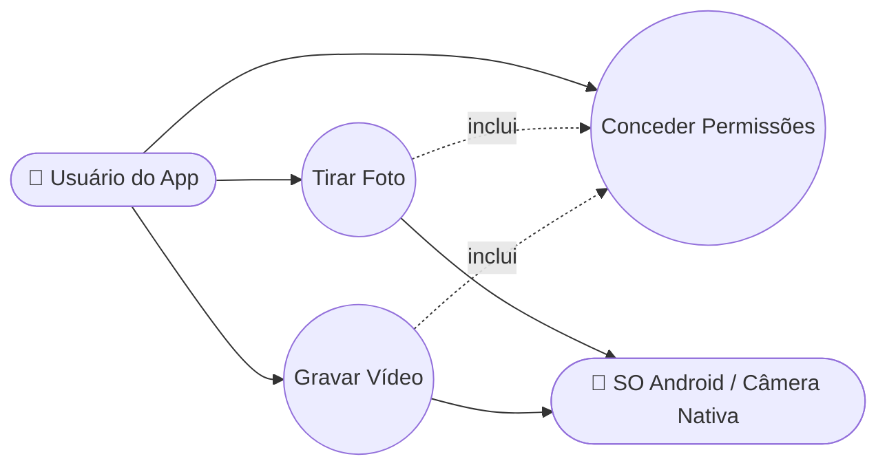

### 2.2 Diagrama de Classes

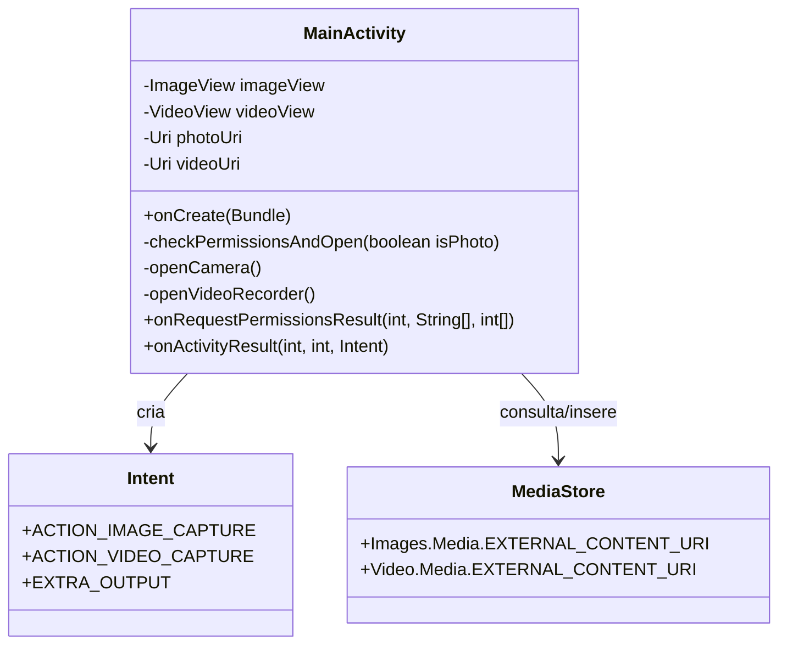

### 2.3 Diagrama de Objetos

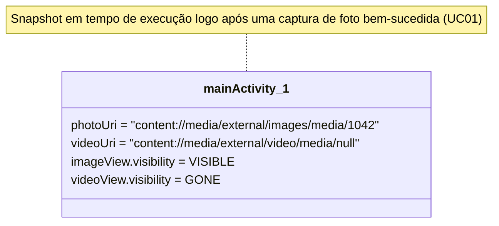

### 2.4 Diagrama de Sequência — Tirar Foto

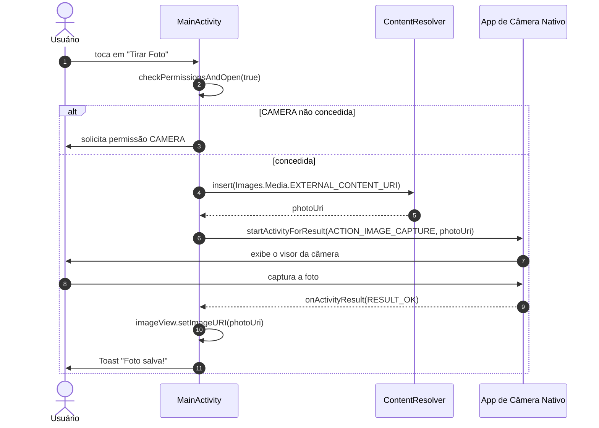

### 2.5 Diagrama de Comunicação

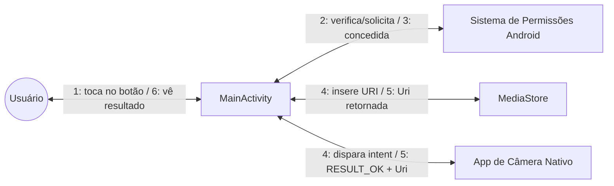

### 2.6 Diagrama de Atividades — `checkPermissionsAndOpen`

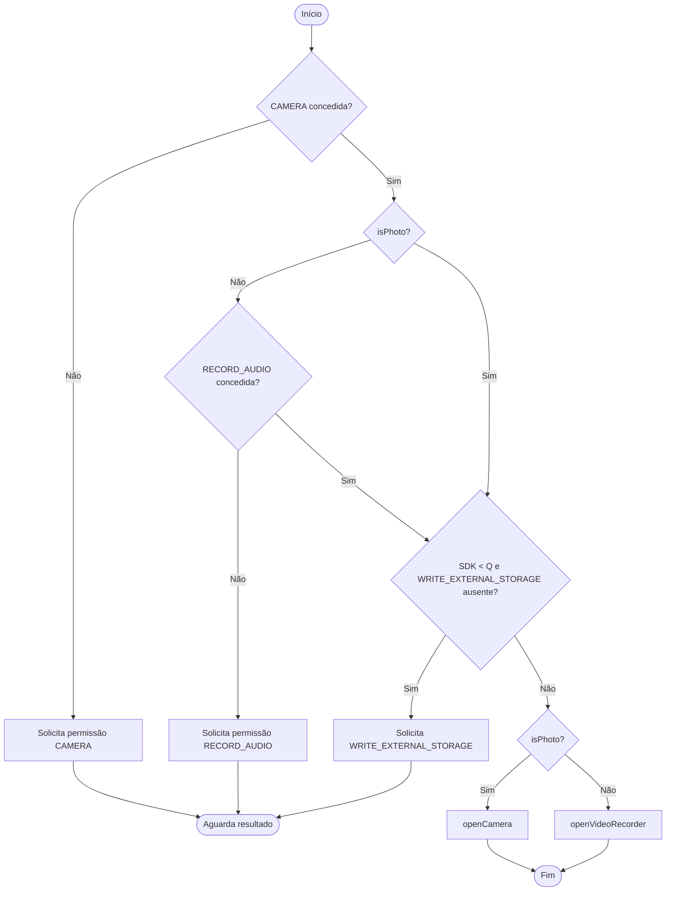

### 2.7 Diagrama de Máquina de Estados — Sessão de Captura

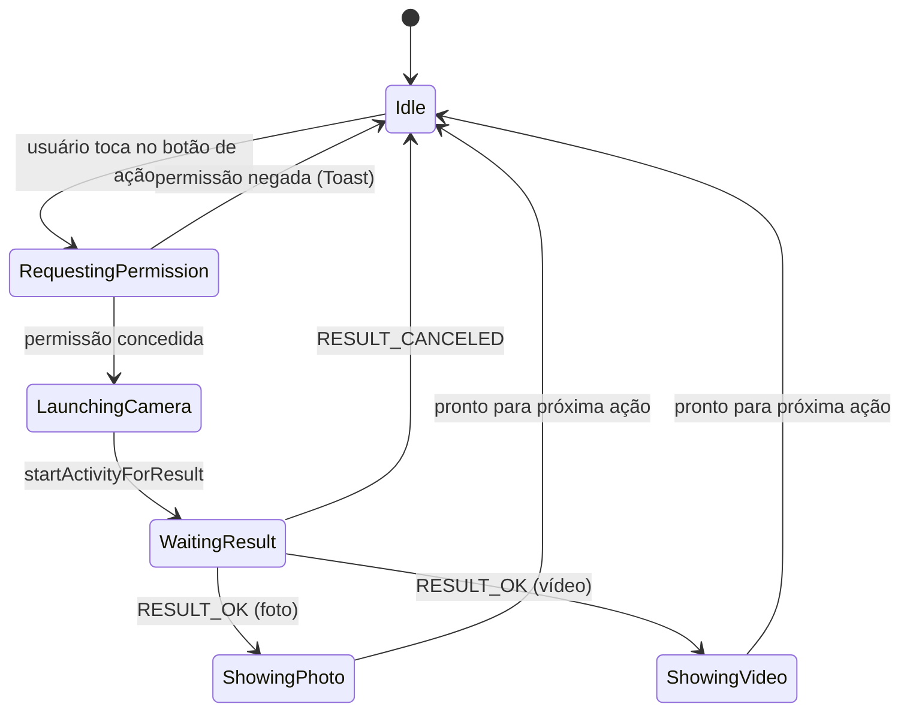

### 2.8 Diagrama de Componentes

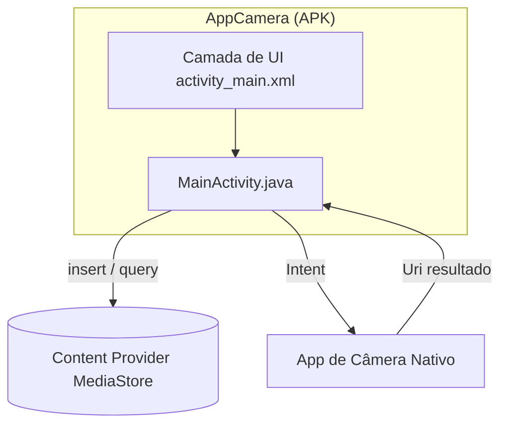

### 2.9 Diagrama de Implantação

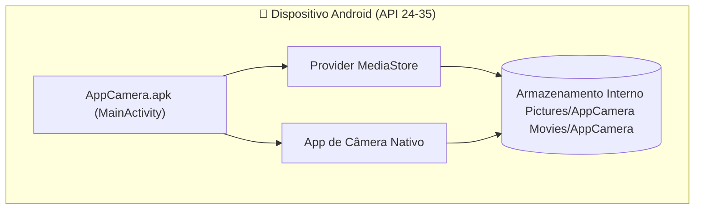

### 2.10 Diagrama de Pacotes

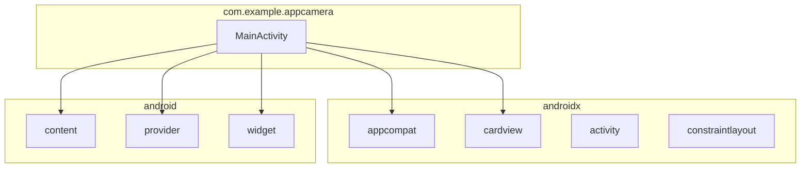

### 2.11 Diagrama de Estrutura Composta — MainActivity

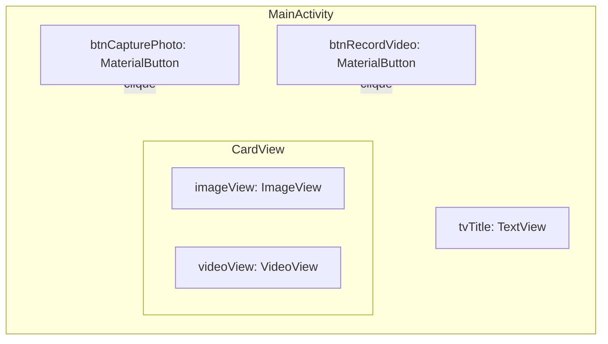

### 2.12 Diagrama de Visão Geral de Interação

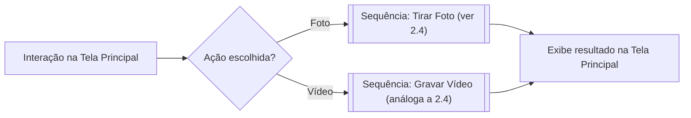

### 2.13 Diagrama de Tempo — Solicitação de Permissão

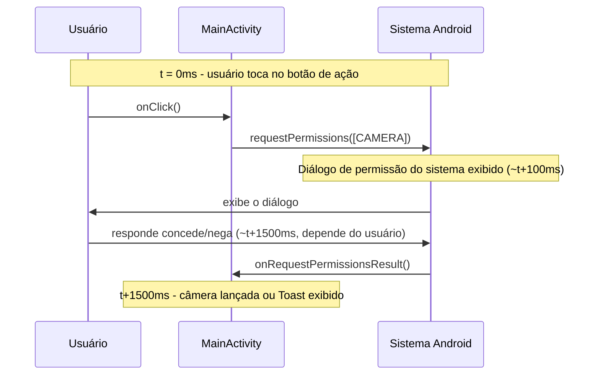

</details>

---

## 3. Modelagem de Dados

<details>
<summary>▶️ <strong>Clique para expandir / recolher esta seção</strong></summary>

> O AppCamera não possui um banco de dados próprio. O "modelo de dados" abaixo descreve os registros do **MediaStore** que o app cria/lê, modelados como se fossem entidades para fins de completude da documentação.

### 3.1 Diagrama Entidade-Relacionamento (DER)

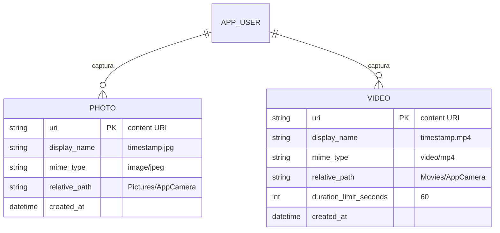

### 3.2 Modelo Conceitual de Dados

- Um **Usuário** captura **Mídias**, especializadas em **Foto** ou **Vídeo**.
- Cada item de **Mídia** pertence a uma **pasta de álbum** (`AppCamera`) dentro da coleção de mídia compartilhada do dispositivo.

### 3.3 Modelo Lógico de Dados

| Entidade | Atributo | Tipo | Notas |
|--------|-----------|------|-------|
| Photo | uri | URI | Identificador primário, gerado por `MediaStore.insert` |
| Photo | display_name | String | `<timestamp>.jpg` |
| Photo | mime_type | String | `image/jpeg` |
| Photo | relative_path | String | `Pictures/AppCamera` |
| Video | uri | URI | Identificador primário, gerado por `MediaStore.insert` |
| Video | display_name | String | `<timestamp>.mp4` |
| Video | mime_type | String | `video/mp4` |
| Video | relative_path | String | `Movies/AppCamera` |
| Video | duration_limit | Integer | 60 (segundos), passado como extra da Intent, não persistido |

### 3.4 Modelo Físico de Dados

No Android Q+, esses dados correspondem a linhas no banco SQLite do `MediaProvider` do sistema (fora do controle do app), acessível via:

```
content://media/external/images/media   (tabela: images)
content://media/external/video/media     (tabela: video)
```

Colunas físicas relevantes usadas pelo app: `DISPLAY_NAME`, `MIME_TYPE`, `RELATIVE_PATH`. No Android < 10, os arquivos são gravados diretamente em `Environment.DIRECTORY_PICTURES/AppCamera` e `DIRECTORY_MOVIES/AppCamera` no sistema de arquivos de armazenamento externo público.

### 3.5 Dicionário de Dados

| Campo | Origem | Tipo | Formato/Domínio | Descrição |
|-------|--------|------|----------------|-------------|
| `photoUri` | `ContentResolver.insert` | `Uri` | `content://...` | Local de saída para a foto capturada |
| `videoUri` | `ContentResolver.insert` | `Uri` | `content://...` | Local de saída para o vídeo capturado |
| `DISPLAY_NAME` | Coluna do `MediaStore` | String | `<epoch_ms>.jpg` / `.mp4` | Nome do arquivo exibido nas galerias |
| `MIME_TYPE` | Coluna do `MediaStore` | String | `image/jpeg`, `video/mp4` | Tipo de mídia |
| `RELATIVE_PATH` | Coluna do `MediaStore` | String | `Pictures/AppCamera`, `Movies/AppCamera` | Subpasta de armazenamento |
| `EXTRA_VIDEO_QUALITY` | Extra da Intent | Int | `1` (alta) | Qualidade de gravação solicitada |
| `EXTRA_DURATION_LIMIT` | Extra da Intent | Int | `60` | Duração máxima de gravação em segundos |

### 3.6 Diagrama de Fluxo de Dados (DFD)

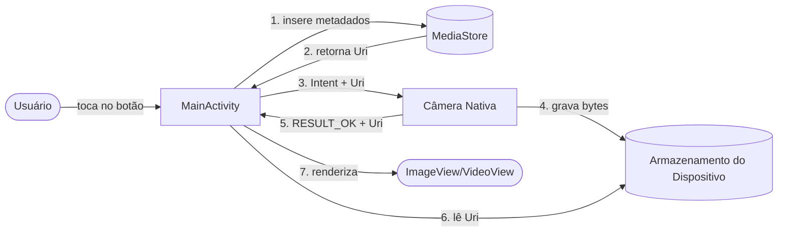

### 3.7 Diagrama de Linhagem de Dados

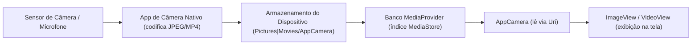

</details>

---

## 4. Arquitetura

<details>
<summary>▶️ <strong>Clique para expandir / recolher esta seção</strong></summary>

### 4.1 Visão Geral da Arquitetura

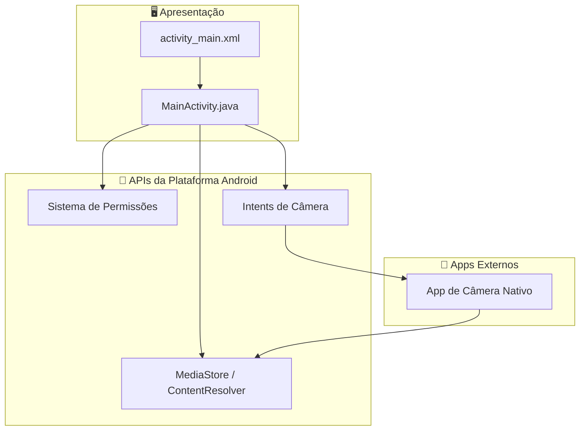

### 4.2 Modelo C4

#### Nível 1 — Contexto

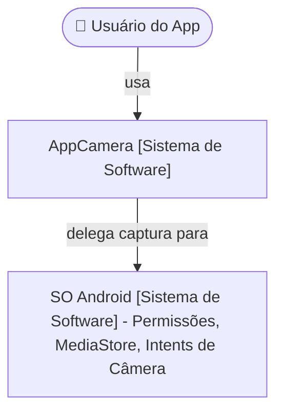

#### Nível 2 — Containers

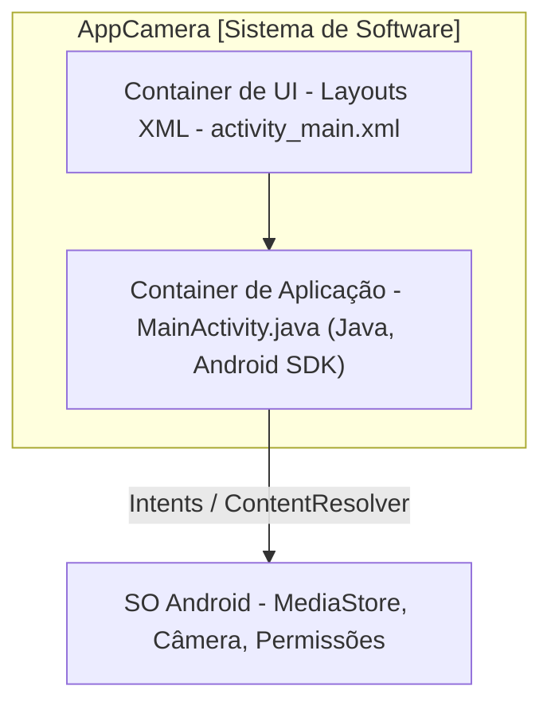

#### Nível 3 — Componentes (MainActivity)

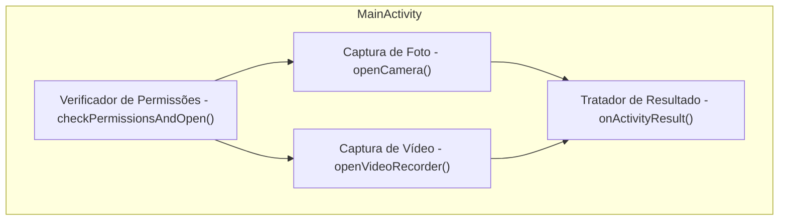

#### Nível 4 — Código (método-chave)

```mermaid
classDiagram
    class MainActivity {
        -openVideoRecorder() void
    }
    note for MainActivity "openVideoRecorder(): 1. Monta ContentValues (nome, mime, path) 2. resolver.insert(Video.Media.EXTERNAL_CONTENT_URI, vals) 3. new Intent(ACTION_VIDEO_CAPTURE) 4. putExtra(EXTRA_OUTPUT, videoUri) 5. putExtra(EXTRA_VIDEO_QUALITY, 1) 6. putExtra(EXTRA_DURATION_LIMIT, 60) 7. startActivityForResult(intent, REQ_CAPTURE_VIDEO)"
```

### 4.3 Diagrama de Arquitetura em Camadas

```mermaid
flowchart TB
    L1["Camada de Apresentação - Layouts XML, Views"] --> L2["Camada de Aplicação - MainActivity (tratamento de eventos)"]
    L2 --> L3["Camada de Integração com a Plataforma - Intents, Permissões, ContentResolver"]
    L3 --> L4["Camada de SO / Hardware - Câmera, Microfone, Armazenamento"]
```

### 4.4 Diagrama de Microsserviços

> **Não aplicável.** O AppCamera é uma aplicação mobile única, offline, sem serviços de backend — não há topologia de microsserviços. Esta seção é documentada por completude em todo o portfólio do autor.

```mermaid
flowchart LR
    Monolith["AppCamera (módulo Android único, sem serviços)"]
```

### 4.5 Diagrama de Infraestrutura / Rede

```mermaid
flowchart LR
    subgraph Device["Dispositivo Android"]
        AppCamera
        OSServices["Serviços do SO (MediaStore, Camera HAL)"]
    end
    AppCamera <--> OSServices
```

> Nenhuma conectividade de rede é exigida pela aplicação.

### 4.6 Diagrama de Implantação em Nuvem

> **Não aplicável em tempo de execução** (app totalmente offline). Diagrama apenas de distribuição:

```mermaid
flowchart LR
    Dev["Máquina do Desenvolvedor (Android Studio)"] -->|gera .apk/.aab| Store["Google Play Console (ou distribuição direta de APK)"]
    Store -->|instala| Device["Dispositivo Android do Usuário Final"]
```

### 4.7 Registros de Decisão de Arquitetura (ADR)

#### ADR-001: Usar Intents de Câmera (MediaStore) em vez de CameraX/Camera2

- **Status:** Aceito
- **Contexto:** O app precisa tirar fotos e gravar vídeos com complexidade mínima.
- **Decisão:** Usar as Intents `ACTION_IMAGE_CAPTURE` / `ACTION_VIDEO_CAPTURE`, delegando ao app de câmera nativo do dispositivo, com a saída redirecionada via `MediaStore`.
- **Consequências:** ✅ Muito menos código, sem gerenciamento de preview/ciclo de vida, compatibilidade automática entre dispositivos. ❌ Menos controle sobre a UI/UX de captura, sem preview ao vivo dentro do app, sem filtros customizados.

#### ADR-002: Scoped Storage via MediaStore para Android Q+

- **Status:** Aceito
- **Contexto:** O Android 10 (API 29) introduziu o Scoped Storage, restringindo o acesso direto a caminhos de arquivo.
- **Decisão:** Usar `ContentResolver.insert()` com `MediaStore.Images/Video.Media.EXTERNAL_CONTENT_URI` na API ≥ 29, recorrendo a `Environment.getExternalStoragePublicDirectory` em versões mais antigas.
- **Consequências:** ✅ Estratégia de armazenamento compatível com versões futuras. ❌ Dois caminhos de código (`if` condicionado por versão) aumentam a complexidade de ramificação.

### 4.8 Diagrama de Integração entre Sistemas

```mermaid
flowchart LR
    AppCamera -->|Intent ACTION_IMAGE_CAPTURE / ACTION_VIDEO_CAPTURE| AndroidCameraSubsystem["Subsistema de Câmera Android"]
    AppCamera -->|ContentResolver.insert/query| MediaStoreSystem["Serviço de Sistema MediaStore"]
    AppCamera -->|requestPermissions| PermissionSystem["Sistema de Permissões Android"]
```

### 4.9 Diagrama de Fluxo de Eventos

```mermaid
flowchart TB
    E1["Evento: onClick (Tirar Foto)"] --> H1["Handler: checkPermissionsAndOpen(true)"]
    H1 --> E2["Evento: onRequestPermissionsResult"]
    E2 --> H2["Handler: openCamera()"]
    H2 --> E3["Evento: onActivityResult (REQ_CAPTURE_PHOTO)"]
    E3 --> H3["Handler: atualiza ImageView + Toast"]
```

### 4.10 Diagrama de Pipeline CI/CD

> Pipeline sugerido (não configurado atualmente no repositório):

```mermaid
flowchart LR
    A[Push para branch main/feature] --> B[CI: build Gradle]
    B --> C[CI: testes unitários - app/src/test]
    C --> D[CI: lint / análise estática]
    D --> E[CI: gerar APK debug]
    E --> F[Manual: instalar em dispositivo/emulador]
    F --> G[Release: gerar AAB assinado]
    G --> H[Publicar no Play Console - Teste Interno]
```

</details>

---

## 5. Processos de Negócio

<details>
<summary>▶️ <strong>Clique para expandir / recolher esta seção</strong></summary>

### 5.1 BPMN — Processo de Captura

```mermaid
flowchart LR
    Start(("Início")) --> T1[/Usuário seleciona tipo de captura/]
    T1 --> G1{Permissões OK?}
    G1 -- Não --> T2[Solicita permissões]
    T2 --> G1
    G1 -- Sim --> T3[Abre câmera nativa]
    T3 --> T4[Usuário captura mídia]
    T4 --> T5[App exibe resultado]
    T5 --> End(("Fim"))
```

### 5.2 Fluxograma — Fluxo Geral do App

```mermaid
flowchart TD
    Open[Abrir AppCamera] --> Choose{Escolher ação}
    Choose -->|Tirar Foto| Photo[Fluxo de captura de foto]
    Choose -->|Gravar Vídeo| Video[Fluxo de captura de vídeo]
    Photo --> Preview[Exibe pré-visualização]
    Video --> Preview
    Preview --> Choose
```

### 5.3 Mapa de Processo As-Is (Antes do AppCamera)

```mermaid
flowchart LR
    A[Usuário quer uma foto/vídeo rápido] --> B[Abre o app de Câmera padrão do SO]
    B --> C[Alterna manualmente entre modo foto/vídeo]
    C --> D[Captura a mídia]
    D --> E[Abre o app de Galeria separadamente para revisar]
```

### 5.4 Mapa de Processo To-Be (Com o AppCamera)

```mermaid
flowchart LR
    A[Usuário quer uma foto/vídeo rápido] --> B[Abre o AppCamera]
    B --> C[Toca no botão dedicado de Foto ou Vídeo]
    C --> D[Câmera nativa abre pré-configurada - vídeo: 60s/alta qualidade]
    D --> E[Resultado exibido automaticamente dentro do AppCamera]
```

### 5.5 SIPOC

| Fornecedores | Entradas | Processo | Saídas | Clientes |
|-----------|--------|---------|---------|-----------|
| SO Android, Hardware de Câmera | Toque do usuário, permissões em tempo de execução | Captura de Foto/Vídeo via Intent | Arquivo de Foto (.jpg) / Vídeo (.mp4) + pré-visualização na tela | Usuário do App |

</details>

---

## 6. UX/UI e Protótipos

<details>
<summary>▶️ <strong>Clique para expandir / recolher esta seção</strong></summary>

### 6.1 Persona

| Atributo | Valor |
|-----------|-------|
| **Nome** | Marcos, 24 |
| **Função** | Estudante de Ciência da Computação / desenvolvedor Android júnior |
| **Objetivo** | Capturar rapidamente uma foto ou vídeo curto para testar/demonstrar uma funcionalidade do app |
| **Frustração** | Bibliotecas de câmera pesadas com curvas de aprendizado acentuadas para necessidades simples de captura |
| **Como o AppCamera ajuda** | Fornece um fluxo de captura mínimo, baseado em Intent e pronto para copiar e colar |

### 6.2 Mapa de Jornada do Usuário

```mermaid
journey
    title Tirar uma Foto com o AppCamera
    section Descoberta
      Abrir o app: 5: Usuário
    section Ação
      Tocar em Tirar Foto: 5: Usuário
      Conceder permissão de Câmera: 3: Usuário
    section Captura
      Câmera nativa abre: 5: Usuário
      Tirar a foto: 5: Usuário
    section Revisão
      Retornar ao AppCamera: 5: Usuário
      Ver pré-visualização da foto e o toast: 5: Usuário
```

### 6.3 Wireframe (ASCII)

```
┌──────────────────────────────┐
│           AppCamera           │
├──────────────────────────────┤
│                                │
│      [ Imagem / Vídeo     ]   │
│      [   Área de Preview  ]   │
│                                │
├──────────────────────────────┤
│   📸  Tirar Foto                │
├──────────────────────────────┤
│   📹  Gravar Vídeo              │
└──────────────────────────────┘
```

### 6.4 Mockup

> Referência de mockup de alta fidelidade: fundo em gradiente (`bg_gradient.xml`), `CardView` de pré-visualização com cantos arredondados (raio de 16dp, elevação de 8dp), botões Material com ícones à esquerda (`ic_camera`, `ic_videocam`) e raio de canto de 24dp, conforme `activity_main.xml`.

### 6.5 Protótipo Navegável

> Não publicado como um arquivo de protótipo externo. O próprio app em execução **é** o protótipo navegável de alta fidelidade — compile e execute via [Como Executar](#-como-executar) para navegar pelo fluxo real (de tela única).

### 6.6 Fluxo de Telas / Mapa de Navegação

```mermaid
flowchart LR
    Main["Tela Principal (MainActivity)"] -->|Tirar Foto| NativeCam1["Câmera do SO (Foto)"]
    Main -->|Gravar Vídeo| NativeCam2["Câmera do SO (Vídeo)"]
    NativeCam1 -->|resultado| Main
    NativeCam2 -->|resultado| Main
```

### 6.7 Design System / Guia de Estilo

| Token | Valor | Uso |
|-------|-------|-------|
| Fundo | `bg_gradient.xml` (drawable em gradiente) | Fundo do layout raiz |
| Cor de texto primária | `@color/textPrimary` | Texto do título |
| Cor de destaque | `@color/buttonAccent` | Tonalidade de fundo dos botões |
| Raio de canto (botões) | `24dp` | `MaterialButton` `app:cornerRadius` |
| Raio de canto (card de preview) | `16dp` | `CardView` `app:cardCornerRadius` |
| Elevação (card de preview) | `8dp` | `CardView` `app:cardElevation` |
| Iconografia | `ic_camera.xml`, `ic_videocam.xml` | Ícones à esquerda dos botões |
| Tipografia | 24sp negrito (título), 16sp (botões) | `tvTitle`, `MaterialButton` |

### 6.8 Card Sorting

> Com uma única tela e duas ações principais, um exercício formal de card sorting não é aplicável. As duas ações ("Tirar Foto" / "Gravar Vídeo") foram agrupadas como **irmãs sob uma única categoria "Captura"**, ambas igualmente proeminentes, o que é o resultado natural que uma sessão de card sorting produziria para este escopo.

### 6.9 Mapa de Empatia

| Quadrante | Conteúdo |
|----------|---------|
| **Diz** | "Eu só quero tirar uma foto rapidamente para testar isso." |
| **Pensa** | "Será que esse app vai pedir um milhão de permissões?" |
| **Faz** | Toca no botão, concede o diálogo de permissão, captura a mídia. |
| **Sente** | Tranquilidade quando a pré-visualização aparece imediatamente e apenas as permissões relevantes são solicitadas. |

### 6.10 Roadmap do Produto

```mermaid
gantt
    title Roadmap do AppCamera
    dateFormat YYYY-MM-DD
    section v1.0 (Atual)
    Captura de foto (Intent)     :done, 2024-01-01, 30d
    Captura de vídeo (Intent)    :done, 2024-01-15, 30d
    Tratamento de permissões     :done, 2024-01-15, 30d
    section v1.1 (Planejado)
    Galeria de mídia interna     :2026-07-01, 30d
    Compartilhar mídia capturada :2026-07-15, 20d
    section v1.2 (Backlog)
    Alternância de câmera frontal/traseira :2026-09-01, 30d
    Modo escuro                  :2026-09-15, 15d
```

</details>

---

## 7. Documentação Técnica

<details>
<summary>▶️ <strong>Clique para expandir / recolher esta seção</strong></summary>

### 7.1 Documentação de API

> O AppCamera não expõe **nenhuma API de rede/REST**. A "superfície de API" relevante é o **contrato de Intent do Android** que ele consome:

| Ação da Intent | Extras Obrigatórios | Retorno |
|---------------|------------------|---------|
| `MediaStore.ACTION_IMAGE_CAPTURE` | `EXTRA_OUTPUT` (Uri) | `RESULT_OK` + foto gravada em `EXTRA_OUTPUT` |
| `MediaStore.ACTION_VIDEO_CAPTURE` | `EXTRA_OUTPUT` (Uri), `EXTRA_VIDEO_QUALITY`, `EXTRA_DURATION_LIMIT` | `RESULT_OK` + vídeo gravado em `EXTRA_OUTPUT` |

### 7.2 Manual do Usuário

1. Abra o app **AppCamera**.
2. Toque em **📸 Tirar Foto** para capturar uma imagem, ou em **📹 Gravar Vídeo** para gravar um clipe (máx. 60s).
3. Conceda as permissões solicitadas no primeiro uso (Câmera e Áudio para vídeo).
4. Use a UI nativa de câmera do dispositivo para capturar e confirmar.
5. Retorne automaticamente ao AppCamera para visualizar o resultado na área de preview.

### 7.3 Manual Técnico / Operacional

| Tópico | Detalhe |
|-------|--------|
| Ferramenta de build | Gradle (Kotlin DSL), via `gradlew` / `gradlew.bat` |
| SDK Min/Target/Compile | 24 / 35 / 35 |
| Versão do Java | 11 |
| Dependências principais | `appcompat`, `material`, `activity`, `constraintlayout` |
| Permissões de runtime exigidas | `CAMERA`, `RECORD_AUDIO`, `WRITE_EXTERNAL_STORAGE` (≤ API 28) |
| Problema comum: câmera não abre | Verificar se a permissão CAMERA foi concedida nas configurações do sistema. |
| Problema comum: vídeo não reproduz | Verificar se a câmera virtual do emulador produziu um `.mp4` válido (alguns AVDs exigem passthrough de webcam habilitado). |

### 7.4 Changelog

```markdown
## [1.0.0] - Versão Inicial
### Adicionado
- Tirar Foto via ACTION_IMAGE_CAPTURE com saída no MediaStore.
- Gravar Vídeo via ACTION_VIDEO_CAPTURE (limite de 60s, alta qualidade).
- Tratamento de permissões em tempo de execução para CAMERA, RECORD_AUDIO, WRITE_EXTERNAL_STORAGE.
- Pré-visualização automática da foto/vídeo capturado em ImageView/VideoView.
- UI customizada com gradiente e ícones vetoriais.
```

### 7.5 Guia de Instalação / Deploy

Veja [Como Executar](#-como-executar) — clone, abra no Android Studio, sincronize o Gradle, execute em dispositivo/emulador, conceda as permissões.

### 7.6 Runbook / Playbook de Operações

| Sintoma | Causa Provável | Ação |
|---------|--------------|--------|
| App trava na abertura | Dependência ausente / falha na sincronização do Gradle | Execute novamente `Build → Sync Project with Gradle Files`; verifique `libs.versions.toml` |
| Toast "Permissão negada" em toda tentativa | Usuário negou permanentemente uma permissão ("Não perguntar novamente") | Habilite manualmente a permissão de Câmera/Microfone em Configurações do Android → Apps → AppCamera |
| Câmera abre mas o resultado fica em branco | Emulador sem câmera virtual configurada | Habilite a webcam/câmera virtual no AVD em `Extended Controls → Camera` |
| Vídeo não reproduz automaticamente | Problema de codec da `VideoView` no emulador | Teste em um dispositivo físico, ou use uma imagem AVD com Google Play Services |

### 7.7 Padrões de Codificação

- Convenções de nomenclatura Java: `PascalCase` para classes (`MainActivity`), `camelCase` para métodos/campos.
- Códigos de requisição definidos como constantes `private static final int` nomeadas (`REQ_CAM`, `REQ_CAPTURE_PHOTO`, etc.).
- Uma `Activity` por tela; UI definida declarativamente em layouts XML, não construída programaticamente.
- Verificações de permissão centralizadas em um único método (`checkPermissionsAndOpen`) para evitar duplicação.

### 7.8 Documentação do Banco de Dados

> Não há banco de dados gerenciado pela aplicação. Todo o estado persistido vive no **MediaStore** (`MediaProvider`) gerenciado pelo SO, acessado exclusivamente via `ContentResolver`. Veja [3. Modelagem de Dados](#3-modelagem-de-dados) para os campos de esquema relevantes.

</details>

---

## 8. Gestão de Projeto

<details>
<summary>▶️ <strong>Clique para expandir / recolher esta seção</strong></summary>

### 8.1 Termo de Abertura do Projeto (Project Charter)

| Item | Descrição |
|------|-------------|
| Nome do Projeto | AppCamera |
| Patrocinador | Projeto de aprendizado autodirigido (portfólio) |
| Gerente de Projeto / Desenvolvedor | Victor H. J. Santiago |
| Objetivo | Construir uma referência funcional para captura de foto/vídeo no Android via Intents |
| Critérios de Sucesso | O app compila, executa, e ambos os fluxos de captura funcionam em emulador/dispositivo |
| Cronograma | Iteração de desenvolvimento única (ver [Roadmap](#610-roadmap-do-produto)) |

### 8.2 Escopo do Projeto

- **No escopo:** Captura de foto, captura de vídeo (60s/alta qualidade), tratamento de permissões em tempo de execução, pré-visualização do resultado, estilização customizada da UI.
- **Fora do escopo:** Galeria interna, edição, compartilhamento, sincronização em nuvem, suporte a múltiplas câmeras, testes automatizados de UI.

### 8.3 Estrutura Analítica do Projeto (EAP/WBS)

```
1. AppCamera
   1.1 Camada de UI
       1.1.1 Layout activity_main.xml
       1.1.2 Fundo em gradiente e ícones
   1.2 Lógica de Captura
       1.2.1 Tratamento de permissões
       1.2.2 Captura de foto (openCamera)
       1.2.3 Captura de vídeo (openVideoRecorder)
       1.2.4 Tratamento de resultado (onActivityResult)
   1.3 Build e Configuração
       1.3.1 Configuração do Gradle (build.gradle.kts)
       1.3.2 Permissões/recursos do AndroidManifest
   1.4 Documentação
       1.4.1 README (EN/PT/ES)
```

### 8.4 Cronograma (Gantt)

```mermaid
gantt
    title AppCamera - Cronograma de Desenvolvimento
    dateFormat YYYY-MM-DD
    section Configuração Inicial
    Estruturação do projeto         :done, 2024-01-01, 5d
    section Núcleo
    Layout de UI                    :done, 2024-01-06, 5d
    Tratamento de permissões        :done, 2024-01-11, 4d
    Captura de foto                 :done, 2024-01-15, 5d
    Captura de vídeo                :done, 2024-01-20, 5d
    section Encerramento
    Testes manuais no emulador      :done, 2024-01-25, 3d
    Documentação                    :active, 2026-06-13, 3d
```

### 8.5 Plano de Gerenciamento de Riscos

| Risco | Probabilidade | Impacto | Mitigação |
|------|------------|--------|------------|
| Permissão negada permanentemente pelo usuário | Média | Alto (funcionalidade inutilizável) | Exibir Toast claro explicando a permissão necessária; documentar no manual do usuário |
| Emulador sem câmera virtual | Média | Médio (impossível testar) | Documentar a configuração de câmera do AVD no [Runbook](#76-runbook--playbook-de-operações) |
| Fragmentação de versões Android (API de armazenamento) | Baixa | Médio | Caminho de código condicionado por versão (`Build.VERSION.SDK_INT >= Q`) |

### 8.6 Matriz de Riscos

```mermaid
quadrantChart
    title Matriz de Riscos
    x-axis Baixo Impacto --> Alto Impacto
    y-axis Baixa Probabilidade --> Alta Probabilidade
    quadrant-1 Monitorar
    quadrant-2 Mitigar Urgentemente
    quadrant-3 Aceitar
    quadrant-4 Mitigar
    Permissao negada permanentemente: [0.7, 0.5]
    Camera do emulador ausente: [0.4, 0.5]
    Fragmentacao da API de armazenamento: [0.5, 0.2]
```

### 8.7 Plano de Comunicação

| Público | Canal | Frequência |
|----------|---------|-----------|
| Recrutadores / avaliadores | README do GitHub (este documento) | Sob demanda |
| Futuros contribuidores | Issues / PRs do GitHub | Conforme necessário |

### 8.8 Matriz RACI

| Atividade | Desenvolvedor (Victor) | Revisor | Usuário Final |
|----------|:---:|:---:|:---:|
| Projetar UI | R/A | C | I |
| Implementar lógica de captura | R/A | C | I |
| Testar em emulador/dispositivo | R/A | I | I |
| Aprovar documentação | R/A | C | I |

> R = Responsável, A = Aprovador, C = Consultado, I = Informado

### 8.9 Análise SWOT

| Forças | Fraquezas |
|-----------|------------|
| Abordagem simples e bem compreendida baseada em Intents; dependências mínimas | Sem preview/UX de câmera customizado; limitado à UI da câmera nativa |

| Oportunidades | Ameaças |
|----------------|---------|
| Extensível para funcionalidades de galeria/compartilhamento; bom exemplo didático | Mudanças em APIs do SO (Scoped Storage) podem exigir atualizações futuras |

### 8.10 Business Case

Uma demonstração de esforço mínimo e alta clareza dos fundamentos de captura de mídia no Android, útil como: (1) artefato de portfólio mostrando competência em tratamento de Intents/permissões, (2) template inicial para apps que precisam de funcionalidade rápida de captura sem a sobrecarga de bibliotecas de câmera.

### 8.11 Análise de Viabilidade / ROI

| Fator | Avaliação |
|--------|------------|
| Viabilidade técnica | Alta — depende inteiramente de APIs Android estáveis e bem documentadas |
| Esforço (ROI) | Esforço muito baixo (Activity única) para alto valor educacional/demo |
| Custo de manutenção | Baixo — sem backend, sem serviços externos |

### 8.12 Plano de Gestão de Mudanças

- Todas as alterações são propostas via branches de feature e Pull Requests (ver [Como Contribuir](#-como-contribuir)).
- Mudanças que impactem o fluxo de permissões ou os contratos de Intent devem atualizar [1.1 Requisitos Funcionais](#11-requisitos-funcionais-rf) e o [Changelog](#74-changelog).

### 8.13 Plano de Contingência

| Cenário | Contingência |
|----------|-------------|
| App de câmera nativo indisponível no dispositivo | O app não pode prosseguir (sem implementação de câmera alternativa); documentado como limitação conhecida. |
| `MediaStore.insert` retorna `null` | Recomenda-se uma verificação defensiva antes de disparar a Intent (atualmente não implementada — ver [Backlog do Produto](#114-backlog-do-produto) para o item de dívida técnica). |

### 8.14 Lições Aprendidas

- Delegar a apps de câmera nativos via Intents reduz drasticamente a complexidade de implementação em comparação a CameraX/Camera2.
- O Scoped Storage exige lógica explícita condicionada por versão (`Build.VERSION_CODES.Q`) — um padrão recorrente em apps de mídia Android.
- Centralizar verificações de permissão em um único método evita lógica de permissões duplicada e propensa a erros em múltiplos pontos de entrada.

</details>

---

## 9. Análise de Negócio

<details>
<summary>▶️ <strong>Clique para expandir / recolher esta seção</strong></summary>

### 9.1 Business Model Canvas

| Bloco | Conteúdo |
|-------|---------|
| **Parcerias Principais** | SO Android / apps de câmera dos fabricantes (OEM) |
| **Atividades-Chave** | Manutenção do fluxo de captura baseado em Intent, tratamento de permissões |
| **Proposta de Valor** | Implementação de referência mínima e confiável para captura de foto/vídeo |
| **Relacionamento com Clientes** | Repositório open-source, orientado por documentação |
| **Segmentos de Clientes** | Desenvolvedores Android, estudantes, avaliadores de portfólio |
| **Recursos-Chave** | Conhecimento em Java/Android SDK, APIs do MediaStore |
| **Canais** | Repositório GitHub |
| **Estrutura de Custos** | Apenas tempo do desenvolvedor (sem custo de infraestrutura) |
| **Fontes de Receita** | Não comercial (portfólio/educacional) |

### 9.2 Análise de Stakeholders

| Stakeholder | Interesse | Influência |
|-------------|----------|-----------|
| Desenvolvedor (Victor H. J. Santiago) | Construir portfólio, demonstrar habilidades Android | Alta |
| Recrutadores / Avaliadores | Avaliar qualidade do código e documentação | Média |
| Usuários Finais / Estudantes | Aprender com / reutilizar a implementação | Baixa |

### 9.3 Análise de Impacto

| Mudança | Áreas Afetadas |
|--------|-----------------|
| Adicionar uma galeria interna | Layout de UI, nova Activity/Fragment, lógica de consulta ao MediaStore |
| Aumentar o `minSdk` | Remoção do caminho de código de armazenamento pré-Q, lógica de permissões simplificada |
| Adicionar backup em nuvem | Nova permissão (INTERNET), atualização da política de privacidade, revisão LGPD/GDPR |

### 9.4 Modelo de Capacidades de Negócio

```mermaid
flowchart TB
    subgraph Capabilities["Capacidades do AppCamera"]
        C1[Captura de Mídia]
        C2[Gestão de Permissões]
        C3[Apresentação de Mídia]
    end
    C1 --> C3
    C2 --> C1
```

</details>

---

## 10. Segurança e Compliance

<details>
<summary>▶️ <strong>Clique para expandir / recolher esta seção</strong></summary>

### 10.1 Modelagem de Ameaças (STRIDE)

| Categoria de Ameaça | Aplicável? | Notas / Mitigação |
|------------------|-------------|---------------------|
| **S**poofing (Falsificação) | Baixa | Não existe subsistema de autenticação. |
| **T**ampering (Adulteração) | Baixa | Arquivos de mídia armazenados via `MediaStore`, regidos pelas permissões de arquivo do SO. |
| **R**epudiation (Repúdio) | N/A | App local de usuário único, sem requisitos de auditoria. |
| **I**nformation Disclosure (Divulgação de Informação) | Média | Fotos/vídeos capturados podem conter dados pessoais sensíveis; armazenados sem criptografia em armazenamento compartilhado (`Pictures/AppCamera`, `Movies/AppCamera`), legíveis por outros apps com permissões de mídia. |
| **D**enial of Service (Negação de Serviço) | Baixa | Sem componente de servidor; apenas esgotamento de recursos locais (armazenamento do dispositivo cheio). |
| **E**levation of Privilege (Elevação de Privilégio) | Baixa | O app solicita apenas as permissões mínimas que usa (`CAMERA`, `RECORD_AUDIO`, `WRITE_EXTERNAL_STORAGE`). |

### 10.2 Matriz de Controle de Acesso / Permissões (estilo RBAC)

| "Papel" | CAMERA | RECORD_AUDIO | WRITE_EXTERNAL_STORAGE |
|--------|:---:|:---:|:---:|
| Usuário do App (concede em tempo de execução) | ✅ obrigatório para qualquer captura | ✅ obrigatório apenas para vídeo | ✅ obrigatório na API ≤ 28 |
| AppCamera (declarado no Manifest) | ✅ | ✅ | ✅ (maxSdkVersion 28) |
| Outros apps | ❌ sem acesso ao estado de runtime do AppCamera | ❌ | ⚠️ podem ler `Pictures/AppCamera` se possuírem permissões de armazenamento/mídia (armazenamento compartilhado) |

### 10.3 Política de Segurança da Informação (Nível de Projeto)

- O app deve solicitar apenas as permissões estritamente necessárias para as funcionalidades em uso ([1.1 RF](#11-requisitos-funcionais-rf)).
- Nenhum SDK de telemetria, analytics ou transmissão em rede da mídia capturada está incluído.
- A mídia capturada permanece sob controle do usuário em locais padrão de armazenamento compartilhado, removível via o app de Galeria/Arquivos do dispositivo como qualquer outra mídia.

### 10.4 Notas de Conformidade LGPD / GDPR

| Aspecto | Status |
|--------|--------|
| Dados pessoais coletados | Imagens/áudio capturados pelo usuário via câmera/microfone do dispositivo (potencialmente contendo dados pessoais do usuário ou de terceiros). |
| Controlador de dados | O usuário final (os dados permanecem no dispositivo dele — o AppCamera não os transmite nem processa no lado do servidor). |
| Base legal | Não aplicável no sentido tradicional — captura puramente local, iniciada pelo usuário, sem processamento pelo desenvolvedor do app. |
| Direitos do usuário (acesso/exclusão) | Totalmente disponíveis via o app de Galeria/Arquivos do SO, já que os dados são armazenados como arquivos de mídia padrão. |
| Recomendação se funcionalidades em nuvem forem adicionadas | Reavaliar esta seção; adicionar fluxos de consentimento explícito, política de privacidade e divulgações de Segurança de Dados no Play Console. |

### 10.5 Plano de Resposta a Incidentes

| Etapa | Ação |
|------|--------|
| 1. Detecção | Problema reportado via GitHub Issues (ex.: um bug de permissão/segurança). |
| 2. Triagem | O desenvolvedor avalia a severidade (ex.: expõe a mídia do usuário de forma inesperada?). |
| 3. Contenção | Revertido/desabilitado o caminho de código problemático via branch de hotfix. |
| 4. Remediação | Patch lançado, [Changelog](#74-changelog) atualizado. |
| 5. Post-mortem | Adicionar entrada em [Lições Aprendidas](#814-lições-aprendidas). |

</details>

---

<div align="center">

*Feito com 📸 e Java por **Victor H. J. Santiago***

</div>
