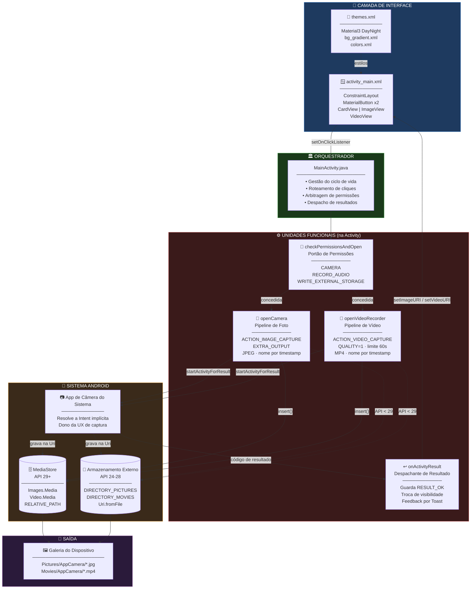
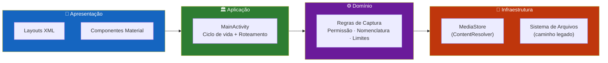
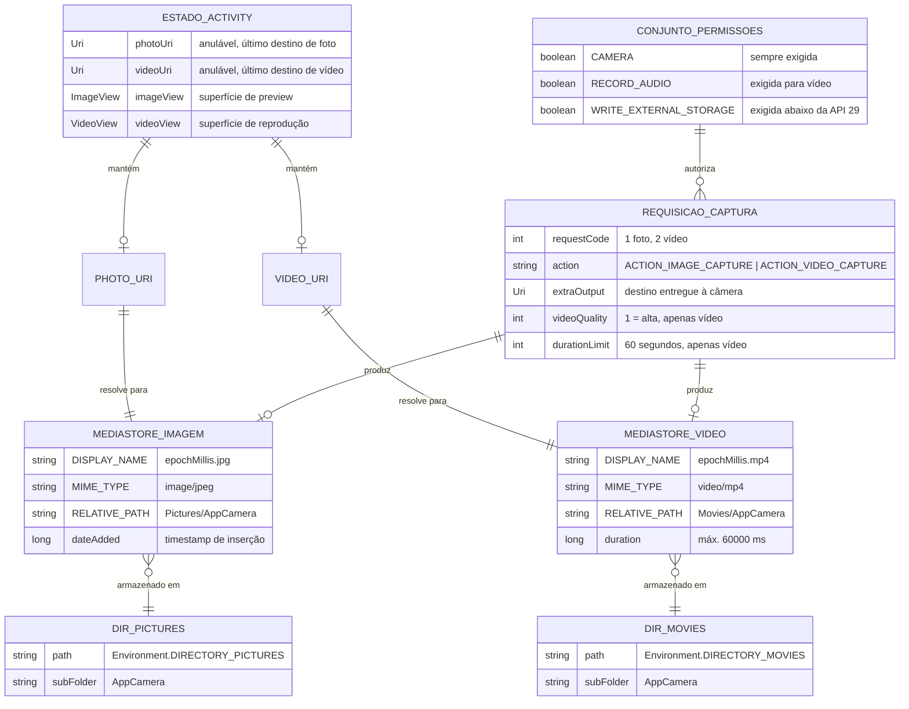
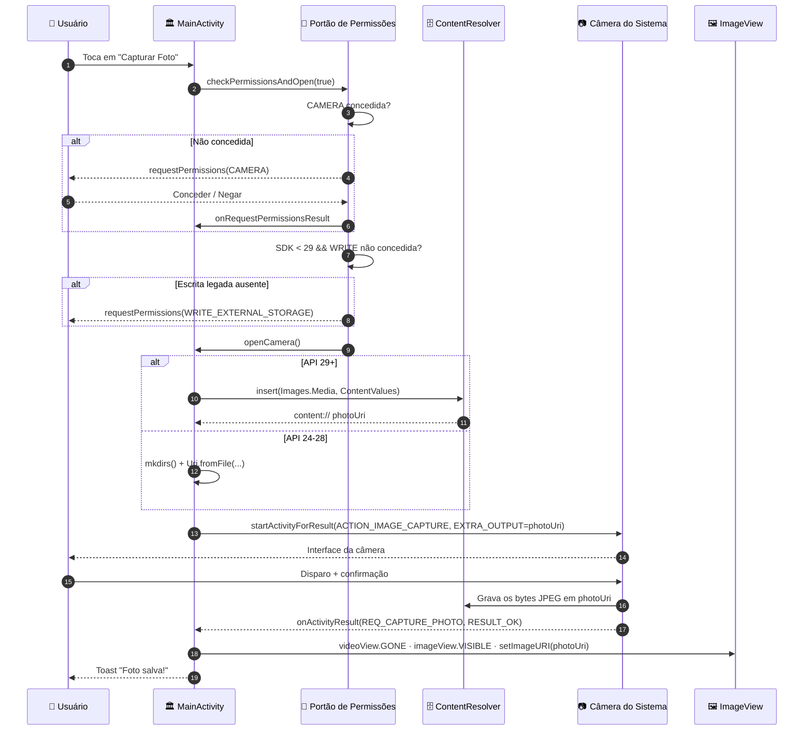
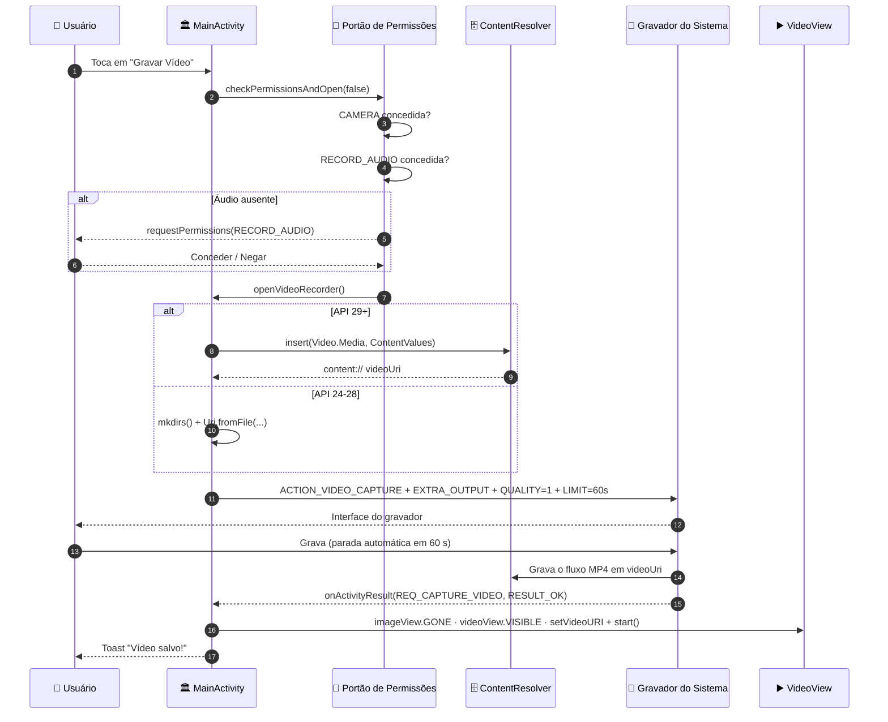
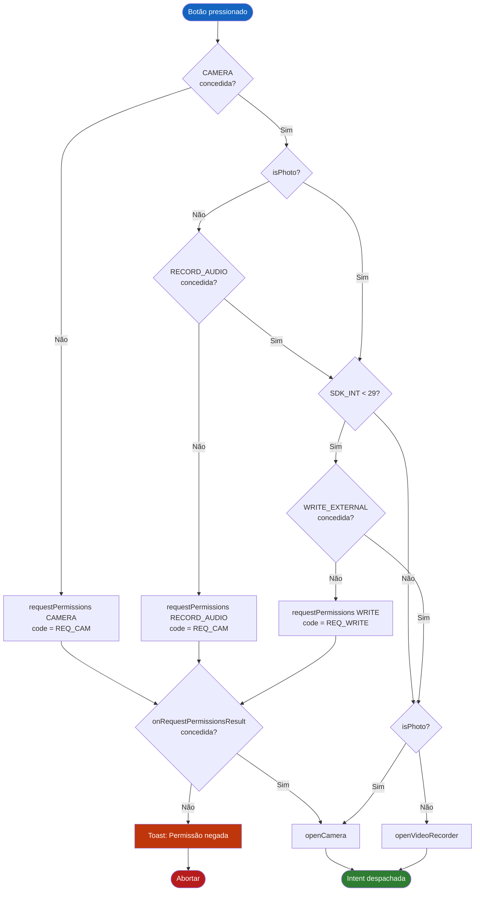
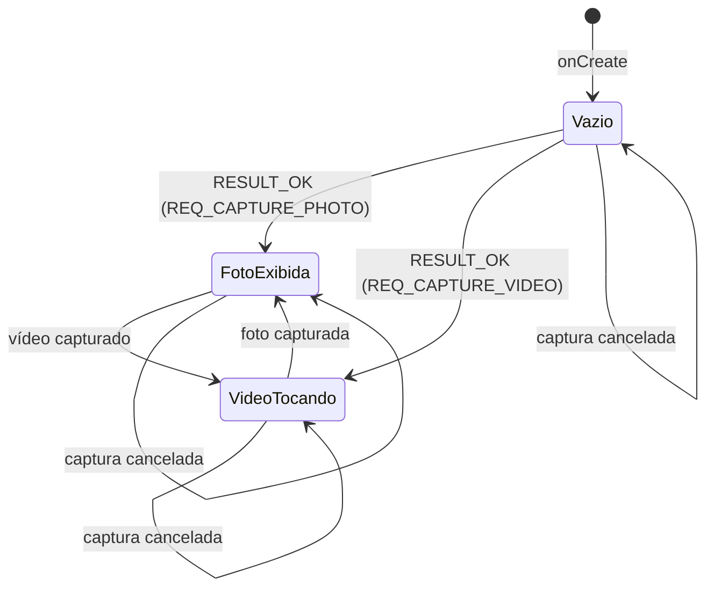
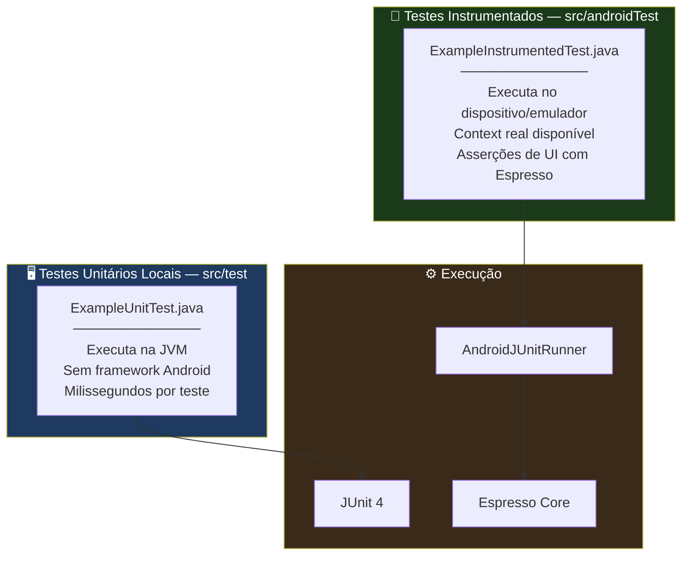

<div align="center">

**🌐 Choose Language / Selecione o Idioma / Elija el Idioma**

[](README.md)&nbsp;&nbsp;&nbsp;[](README_PT.md)&nbsp;&nbsp;&nbsp;[](README_ES.md)

</div>

---

<div align="center">

```
 █████╗ ██████╗ ██████╗  ██████╗ █████╗ ███╗   ███╗███████╗██████╗  █████╗
██╔══██╗██╔══██╗██╔══██╗██╔════╝██╔══██╗████╗ ████║██╔════╝██╔══██╗██╔══██╗
███████║██████╔╝██████╔╝██║     ███████║██╔████╔██║█████╗  ██████╔╝███████║
██╔══██║██╔═══╝ ██╔═══╝ ██║     ██╔══██║██║╚██╔╝██║██╔══╝  ██╔══██╗██╔══██║
██║  ██║██║     ██║     ╚██████╗██║  ██║██║ ╚═╝ ██║███████╗██║  ██║██║  ██║
╚═╝  ╚═╝╚═╝     ╚═╝      ╚═════╝╚═╝  ╚═╝╚═╝     ╚═╝╚══════╝╚═╝  ╚═╝╚═╝  ╚═╝
            Aplicativo Android Nativo de Captura de Foto e Vídeo
```

---

[](https://developer.android.com/)
[](https://openjdk.org/)
[](https://gradle.org/)
[](https://m3.material.io/)
[](https://developer.android.com/training/data-storage/shared/media)
[]()
[]()

<br/>

> **Um aplicativo Android nativo para capturar fotos e gravar vídeos**
> construído sobre delegação por Intent, permissões em tempo de execução e armazenamento escopado via MediaStore.

<br/>


-10B981?style=flat-square)
-FF6B35?style=flat-square)


</div>

---

## 📑 Índice

<details>
<summary>▶️ <strong>Clique para expandir / recolher esta seção</strong></summary>

<table>
<tr>
<td valign="top" width="50%">

**🏗️ Sistema**
- [Visão Geral](#-visão-geral)
- [Arquitetura do Sistema](#️-arquitetura-do-sistema)
- [Stack Tecnológica](#️-stack-tecnológica)
- [Padrões de Projeto](#-padrões-de-projeto-aplicados)
- [Estrutura do Projeto](#-estrutura-do-projeto)

**📦 Módulos**
- [MainActivity — Orquestrador](#️-mainactivity--orquestrador-principal)
- [Portão de Permissões](#-portão-de-permissões--autorização-em-runtime)
- [Captura de Foto](#-captura-de-foto--pipeline-de-imagem)
- [Captura de Vídeo](#-captura-de-vídeo--pipeline-de-gravação)
- [Pré-visualização de Mídia](#️-pré-visualização-de-mídia--superfície-de-reprodução)
- [Adaptador de Armazenamento](#️-adaptador-de-armazenamento--mediastore--legado)
- [Tema e Recursos](#-tema-e-recursos--material-design-3)

</td>
<td valign="top" width="50%">

**💼 Negócio**
- [Regras de Negócio](#-regras-de-negócio)
- [Requisitos Funcionais](#-requisitos-funcionais)
- [Requisitos Não Funcionais](#-requisitos-não-funcionais)

**📐 Design**
- [Modelo de Dados](#️-modelo-de-dados)
- [Fluxos do Sistema](#-fluxos-do-sistema)
- [Fluxo de Captura de Foto](#fluxo-de-captura-de-foto)
- [Fluxo de Captura de Vídeo](#fluxo-de-captura-de-vídeo)
- [Fluxo de Permissões](#fluxo-de-solicitação-de-permissões)

**🔐 Segurança & Operação**
- [Segurança](#-segurança)
- [Instalação & Execução](#-instalação--execução)
- [Testes Automatizados](#-testes-automatizados)
- [Métricas & Monitoramento](#-métricas--monitoramento)
- [Limitações Conhecidas](#️-limitações-conhecidas)

</td>
</tr>
</table>

---

</details>

## 🌟 Visão Geral

<details>
<summary>▶️ <strong>Clique para expandir / recolher esta seção</strong></summary>

O **AppCamera** é um aplicativo Android nativo escrito em **Java** que captura fotografias e grava vídeos delegando a operação ao aplicativo de câmera do sistema por meio de **Intents implícitas**, e então persiste a mídia resultante na galeria pública utilizando a API **MediaStore**.

Em vez de reimplementar uma pilha de preview de câmera (CameraX/Camera2), o aplicativo adota deliberadamente o **modelo de delegação por Intent**: o app de câmera do sistema — já otimizado, já confiável para o usuário, já responsável por autofoco, HDR, estabilização e seleção de lente — realiza a captura, e o AppCamera é dono do *destino*, do *contrato de permissões* e da *superfície de pré-visualização*.

O resultado é um aplicativo pequeno, com poucas dependências, compatível com **Android 7.0 (API 24) até Android 15 (API 35)** e correto em relação às regras de **armazenamento escopado** introduzidas no Android 10 (API 29).

### 🎯 Objetivos do Sistema

| Objetivo | Descrição |
|----------|-----------|
| 📸 **Captura de Foto** | Capturar imagens estáticas em resolução plena via `ACTION_IMAGE_CAPTURE` |
| 🎥 **Gravação de Vídeo** | Gravar vídeo com limite de 60 segundos e perfil de alta qualidade via `ACTION_VIDEO_CAPTURE` |
| 🔐 **Permissões em Runtime** | Solicitação sequencial e não bloqueante de `CAMERA`, `RECORD_AUDIO` e `WRITE_EXTERNAL_STORAGE` legado |
| 🗄️ **Armazenamento Escopado** | Persistência em caminho duplo: `MediaStore` na API 29+, I/O direto de `File` nas APIs 24–28 |
| 🖼️ **Pré-visualização Imediata** | Exibição no app da foto capturada (`ImageView`) ou reprodução da gravação (`VideoView`) |
| 🎨 **Material Design 3** | Componentes Material, fundo em gradiente, ícones adaptativos, temas claro e escuro |
| 📁 **Integração com a Galeria** | Mídia gravada em `Pictures/AppCamera` e `Movies/AppCamera`, visível a qualquer app de galeria |
| 🧪 **Qualidade** | Estrutura de testes instrumentados e unitários com JUnit 4 e Espresso |

---

</details>

## 🏗️ Arquitetura do Sistema

<details>
<summary>▶️ <strong>Clique para expandir / recolher esta seção</strong></summary>

### Diagrama de Módulos


```mermaid
flowchart TB
    subgraph UI["📱  CAMADA DE INTERFACE"]
        direction LR
        LAYOUT["🪟 activity_main.xml\n─────────────\nConstraintLayout\nMaterialButton x2\nCardView | ImageView\nVideoView"]
        THEME["🎨 themes.xml\n─────────────\nMaterial3 DayNight\nbg_gradient.xml\ncolors.xml"]
    end

    subgraph ORCH["🏛️  ORQUESTRADOR"]
        MAIN["MainActivity.java\n─────────────────────\n• Gestão do ciclo de vida\n• Roteamento de cliques\n• Arbitragem de permissões\n• Despacho de resultados"]
    end

    subgraph CORE["⚙️  UNIDADES FUNCIONAIS  (na Activity)"]
        direction TB
        PERM["🔐 checkPermissionsAndOpen\nPortão de Permissões\n────────────\nCAMERA\nRECORD_AUDIO\nWRITE_EXTERNAL_STORAGE"]
        PHOTO["📸 openCamera\nPipeline de Foto\n────────────\nACTION_IMAGE_CAPTURE\nEXTRA_OUTPUT\nJPEG · nome por timestamp"]
        VIDEO["🎥 openVideoRecorder\nPipeline de Vídeo\n────────────\nACTION_VIDEO_CAPTURE\nQUALITY=1 · limite 60s\nMP4 · nome por timestamp"]
        RESULT["↩️ onActivityResult\nDespachante de Resultado\n────────────\nGuarda RESULT_OK\nTroca de visibilidade\nFeedback por Toast"]
    end

    subgraph SYS["🤖  SISTEMA ANDROID"]
        direction LR
        CAMAPP["📷 App de Câmera do Sistema\n─────────────\nResolve a Intent implícita\nDono da UX de captura"]
        MSTORE[("🗄️ MediaStore\nAPI 29+\n─────────────\nImages.Media\nVideo.Media\nRELATIVE_PATH")]
        FILESYS[("📂 Armazenamento Externo\nAPI 24-28\n─────────────\nDIRECTORY_PICTURES\nDIRECTORY_MOVIES\nUri.fromFile")]
    end

    subgraph OUT["💾  SAÍDA"]
        GALLERY["🖼️ Galeria do Dispositivo\n──────────────────────\nPictures/AppCamera/*.jpg\nMovies/AppCamera/*.mp4"]
    end

    LAYOUT -->|"setOnClickListener"| MAIN
    THEME -.->|"estilos"| LAYOUT
    MAIN --> PERM
    PERM -->|"concedida"| PHOTO & VIDEO
    PHOTO -->|"startActivityForResult"| CAMAPP
    VIDEO -->|"startActivityForResult"| CAMAPP
    PHOTO -->|"insert()"| MSTORE
    VIDEO -->|"insert()"| MSTORE
    PHOTO -.->|"API < 29"| FILESYS
    VIDEO -.->|"API < 29"| FILESYS
    CAMAPP -->|"grava na Uri"| MSTORE & FILESYS
    CAMAPP -->|"código de resultado"| RESULT
    RESULT -->|"setImageURI / setVideoURI"| LAYOUT
    MSTORE --> GALLERY
    FILESYS --> GALLERY

    style UI fill:#1e3a5f,color:#fff,stroke:#4a90d9
    style ORCH fill:#1a3a1a,color:#fff,stroke:#4caf50
    style CORE fill:#3a1a1a,color:#fff,stroke:#e57373
    style SYS fill:#3a2a1a,color:#fff,stroke:#ffb74d
    style OUT fill:#2a1a3a,color:#fff,stroke:#ce93d8
```

### Camadas da Arquitetura


```mermaid
flowchart LR
    subgraph L1["📱 Apresentação"]
        A1["Layouts XML"]
        A2["Componentes Material"]
    end
    subgraph L2["🏛️ Aplicação"]
        B1["MainActivity\nCiclo de vida + Roteamento"]
    end
    subgraph L3["⚙️ Domínio"]
        C1["Regras de Captura\nPermissão · Nomenclatura · Limites"]
    end
    subgraph L4["💾 Infraestrutura"]
        D1["MediaStore\n(ContentResolver)"]
        D2["Sistema de Arquivos\n(caminho legado)"]
    end

    L1 --> L2 --> L3 --> L4

    style L1 fill:#1565C0,color:#fff
    style L2 fill:#2E7D32,color:#fff
    style L3 fill:#6A1B9A,color:#fff
    style L4 fill:#BF360C,color:#fff
```

---

</details>

## 🛠️ Stack Tecnológica

<details>
<summary>▶️ <strong>Clique para expandir / recolher esta seção</strong></summary>

<table>
<thead>
<tr>
<th>Camada</th>
<th>Tecnologia</th>
<th>Versão</th>
<th>Finalidade</th>
</tr>
</thead>
<tbody>
<tr>
<td rowspan="2"><strong>🧠 Linguagem</strong></td>
<td>Java</td>
<td>11</td>
<td>Linguagem-fonte da aplicação (<code>sourceCompatibility</code> / <code>targetCompatibility</code>)</td>
</tr>
<tr>
<td>XML</td>
<td>—</td>
<td>Layouts, temas, cores, drawables, manifesto</td>
</tr>
<tr>
<td rowspan="3"><strong>🤖 Plataforma</strong></td>
<td>Android SDK</td>
<td>compile 35</td>
<td>Alvo de compilação (Android 15)</td>
</tr>
<tr>
<td>SDK Mínimo</td>
<td>24</td>
<td>Piso Android 7.0 Nougat</td>
</tr>
<tr>
<td>SDK Alvo</td>
<td>35</td>
<td>Adesão aos comportamentos do Android 15</td>
</tr>
<tr>
<td rowspan="4"><strong>🎨 Interface</strong></td>
<td>Material Components</td>
<td>Material 3</td>
<td><code>MaterialButton</code>, tematização, ripple, elevação</td>
</tr>
<tr>
<td>ConstraintLayout</td>
<td>mais recente</td>
<td>Hierarquia de layout plana e responsiva</td>
</tr>
<tr>
<td>CardView</td>
<td>AndroidX</td>
<td>Contêiner elevado da pré-visualização</td>
</tr>
<tr>
<td>EdgeToEdge</td>
<td>androidx.activity</td>
<td>Insets de janela imersivos ponta a ponta</td>
</tr>
<tr>
<td rowspan="3"><strong>💾 Armazenamento</strong></td>
<td>MediaStore</td>
<td>API 29+</td>
<td>Inserções em armazenamento escopado via <code>ContentResolver</code></td>
</tr>
<tr>
<td>Environment / File</td>
<td>API 24–28</td>
<td>Escritas legadas em diretórios públicos</td>
</tr>
<tr>
<td>ContentValues</td>
<td>—</td>
<td>Metadados <code>DISPLAY_NAME</code>, <code>MIME_TYPE</code>, <code>RELATIVE_PATH</code></td>
</tr>
<tr>
<td rowspan="2"><strong>🔧 Build</strong></td>
<td>Gradle</td>
<td>Kotlin DSL</td>
<td><code>build.gradle.kts</code> + catálogo de versões</td>
</tr>
<tr>
<td>Catálogo de Versões</td>
<td><code>libs.versions.toml</code></td>
<td>Coordenadas de dependências centralizadas</td>
</tr>
<tr>
<td rowspan="2"><strong>🧪 Testes</strong></td>
<td>JUnit</td>
<td>4</td>
<td>Testes unitários locais (<code>src/test</code>)</td>
</tr>
<tr>
<td>Espresso + AndroidX Test</td>
<td>mais recente</td>
<td>Testes de UI instrumentados (<code>src/androidTest</code>)</td>
</tr>
</tbody>
</table>

---

</details>

## 🎨 Padrões de Projeto Aplicados

<details>
<summary>▶️ <strong>Clique para expandir / recolher esta seção</strong></summary>

| Padrão | Onde | Justificativa |
|--------|------|---------------|
| 🎯 **Delegação** | `openCamera()` / `openVideoRecorder()` | A captura é delegada ao app de câmera do sistema em vez de reimplementada |
| 🧭 **Facade** | `checkPermissionsAndOpen(boolean)` | Um único ponto de entrada esconde verificações, ramificação por SDK e construção da Intent |
| 🔀 **Strategy (ramificação em runtime)** | `Build.VERSION.SDK_INT >= Q` | Estratégia MediaStore vs. estratégia `File` legada, escolhida em tempo de execução |
| 👂 **Observer / Callback** | `setOnClickListener`, `onActivityResult`, `onRequestPermissionsResult` | Reação orientada a eventos de UI e do sistema |
| 🚦 **Guard Clause** | Portão de permissões, `if (res != RESULT_OK) return;` | A saída antecipada mantém o caminho feliz plano e legível |
| 🏷️ **Registro de Constantes** | `REQ_CAM`, `REQ_WRITE`, `REQ_CAPTURE_PHOTO`, `REQ_CAPTURE_VIDEO` | Códigos nomeados tornam o despacho de callbacks autoexplicativo |
| 🔄 **Alternância de Estado** | Troca de visibilidade `ImageView` / `VideoView` | Um único espaço de preview alterna entre dois tipos de mídia |
| 🧱 **Recurso-Template** | `themes.xml` + `values-night/themes.xml` | O mesmo nome de tema resolve de forma diferente conforme a aparência do sistema |

---

</details>

## 📁 Estrutura do Projeto

<details>
<summary>▶️ <strong>Clique para expandir / recolher esta seção</strong></summary>

```
AppCamera/
│
├── 📄 build.gradle.kts                  # Script de build raiz (declaração de plugins)
├── 📄 settings.gradle.kts               # Inclusão de módulos + configuração de repositórios
├── 📄 gradle.properties                 # Argumentos da JVM, flags AndroidX
├── 📄 local.properties                  # Caminho local do SDK (não versionado)
├── 📄 gradlew / gradlew.bat             # Lançadores do Gradle Wrapper
│
├── 📂 gradle/
│   ├── 📄 libs.versions.toml            # Catálogo de versões — fonte única de verdade
│   └── 📂 wrapper/
│       ├── gradle-wrapper.jar
│       └── gradle-wrapper.properties    # Distribuição Gradle fixada
│
├── 📂 app/
│   ├── 📄 build.gradle.kts              # Build do módulo: SDKs, buildTypes, dependências
│   ├── 📄 proguard-rules.pro            # Regras de retenção R8/ProGuard (release)
│   │
│   └── 📂 src/
│       ├── 📂 main/
│       │   ├── 📄 AndroidManifest.xml    # Permissões, features, registro da Activity
│       │   │
│       │   ├── 📂 java/com/example/appcamera/
│       │   │   └── 📄 MainActivity.java  # ★ Toda a lógica da aplicação (161 linhas)
│       │   │
│       │   └── 📂 res/
│       │       ├── 📂 layout/
│       │       │   └── activity_main.xml       # ConstraintLayout raiz + preview + botões
│       │       ├── 📂 drawable/
│       │       │   ├── bg_gradient.xml         # Fundo de janela em gradiente
│       │       │   ├── ic_camera.xml           # Ícone vetorial do botão de foto
│       │       │   ├── ic_videocam.xml         # Ícone vetorial do botão de vídeo
│       │       │   ├── ic_launcher_background.xml
│       │       │   └── ic_launcher_foreground.xml
│       │       ├── 📂 mipmap-anydpi-v26/
│       │       │   ├── ic_launcher.xml         # Ícone adaptativo (API 26+)
│       │       │   └── ic_launcher_round.xml
│       │       ├── 📂 mipmap-{m,h,xh,xxh,xxxh}dpi/
│       │       │   └── ic_launcher*.webp       # Ícones raster por densidade
│       │       ├── 📂 values/
│       │       │   ├── colors.xml              # Tokens de paleta
│       │       │   ├── strings.xml             # Strings de UI externalizadas
│       │       │   └── themes.xml              # Tema claro (Material 3)
│       │       ├── 📂 values-night/
│       │       │   └── themes.xml              # Sobrescrita do tema escuro
│       │       └── 📂 xml/
│       │           ├── backup_rules.xml        # Regras de inclusão do Auto Backup
│       │           └── data_extraction_rules.xml # Regras de transferência (API 31+)
│       │
│       ├── 📂 test/java/com/example/appcamera/
│       │   └── ExampleUnitTest.java      # Teste unitário local na JVM
│       │
│       └── 📂 androidTest/java/com/example/appcamera/
│           └── ExampleInstrumentedTest.java  # Teste instrumentado no dispositivo
│
├── 📄 README.md                          # 🇺🇸 Inglês (principal)
├── 📄 README_PT.md                       # 🇧🇷 Português
└── 📄 README_ES.md                       # 🇪🇸 Espanhol
```

---

</details>

## 📦 Módulos do Sistema

<details>
<summary>▶️ <strong>Clique para expandir / recolher esta seção</strong></summary>

### 🏛️ MainActivity — Orquestrador Principal

A única `Activity` da aplicação. É dona do ciclo de vida, resolve as referências de views, conecta os listeners de clique e despacha todos os callbacks do sistema.

| Responsabilidade | Implementação |
|------------------|---------------|
| Entrada do ciclo de vida | `onCreate(Bundle)` — habilita edge-to-edge, infla `activity_main` |
| Vinculação de views | `findViewById` para `imageView`, `videoView`, `btnCapturePhoto`, `btnRecordVideo` |
| Roteamento de cliques | Listeners lambda → `checkPermissionsAndOpen(true \| false)` |
| Callback de permissão | `onRequestPermissionsResult(int, String[], int[])` |
| Callback de resultado | `onActivityResult(int, int, Intent)` |
| Estado retido | `Uri photoUri`, `Uri videoUri` — o destino entregue ao app de câmera |

**Registro de códigos de requisição**

| Constante | Valor | Significado |
|-----------|-------|-------------|
| `REQ_CAM` | `100` | Requisição de permissão de câmera / áudio |
| `REQ_WRITE` | `101` | Requisição de permissão de armazenamento legado |
| `REQ_CAPTURE_PHOTO` | `1` | Resultado da activity de captura de foto |
| `REQ_CAPTURE_VIDEO` | `2` | Resultado da activity de captura de vídeo |

---

### 🔐 Portão de Permissões — Autorização em Runtime

`checkPermissionsAndOpen(boolean isPhoto)` implementa uma **cadeia sequencial de guardas**. Cada verificação ou retorna cedo para solicitar a permissão faltante, ou segue para a próxima.

| Ordem | Permissão | Condição | Código |
|-------|-----------|----------|--------|
| 1 | `Manifest.permission.CAMERA` | Sempre exigida | `REQ_CAM` |
| 2 | `Manifest.permission.RECORD_AUDIO` | Apenas quando `isPhoto == false` | `REQ_CAM` |
| 3 | `Manifest.permission.WRITE_EXTERNAL_STORAGE` | Apenas quando `SDK_INT < Q` (API 29) | `REQ_WRITE` |

Uma vez satisfeita toda a cadeia, o controle segue para `openCamera()` ou `openVideoRecorder()`.

> [!NOTE]
> A cadeia solicita **uma permissão por invocação**. O usuário vê, portanto, os diálogos um de cada vez, e o fluxo é retomado a partir de `onRequestPermissionsResult`.

---

### 📸 Captura de Foto — Pipeline de Imagem

`openCamera()` prepara um destino gravável e o entrega à câmera do sistema.

| Etapa | API 29+ (Escopado) | API 24–28 (Legado) |
|-------|--------------------|--------------------|
| Metadados | `ContentValues` com `DISPLAY_NAME`, `MIME_TYPE`, `RELATIVE_PATH` | — |
| Nome do arquivo | `System.currentTimeMillis() + ".jpg"` | `System.currentTimeMillis() + ".jpg"` |
| Tipo MIME | `image/jpeg` | implícito |
| Local | `Environment.DIRECTORY_PICTURES + "/AppCamera"` | `getExternalStoragePublicDirectory(DIRECTORY_PICTURES)/AppCamera` |
| Origem da Uri | `contentResolver.insert(Images.Media.EXTERNAL_CONTENT_URI, vals)` | `Uri.fromFile(file)` |
| Criação de diretório | Feita pelo MediaStore | `dir.mkdirs()` quando ausente |

A Intent é então despachada:

```java
Intent i = new Intent(MediaStore.ACTION_IMAGE_CAPTURE);
i.putExtra(MediaStore.EXTRA_OUTPUT, photoUri);
startActivityForResult(i, REQ_CAPTURE_PHOTO);
```

Como `EXTRA_OUTPUT` é fornecido, a câmera grava a imagem em **resolução plena** na `Uri` informada, em vez de devolver uma miniatura reduzida na Intent de resultado.

---

### 🎥 Captura de Vídeo — Pipeline de Gravação

`openVideoRecorder()` espelha o pipeline de foto sobre a coleção de vídeo e acrescenta duas restrições de gravação.

| Parâmetro | Valor | Efeito |
|-----------|-------|--------|
| Ação | `MediaStore.ACTION_VIDEO_CAPTURE` | Abre o gravador do sistema |
| `EXTRA_OUTPUT` | `videoUri` | Destino do arquivo codificado |
| `EXTRA_VIDEO_QUALITY` | `1` | Perfil de alta qualidade (`0` seria baixa) |
| `EXTRA_DURATION_LIMIT` | `60` | Parada obrigatória aos 60 segundos |
| Nome do arquivo | `System.currentTimeMillis() + ".mp4"` | Sem colisão e ordenável cronologicamente |
| Tipo MIME | `video/mp4` | Registrado no MediaStore |
| Local | `Movies/AppCamera` | Diretório visível à galeria |

---

### 🖼️ Pré-visualização de Mídia — Superfície de Reprodução

`onActivityResult` é o único ponto em que a mídia capturada se torna visível. Ele aplica primeiro uma guarda — `if (res != RESULT_OK) return;` — de modo que uma captura cancelada deixa a pré-visualização anterior intacta.

| Requisição | View exibida | View oculta | Ação | Feedback |
|------------|--------------|-------------|------|----------|
| `REQ_CAPTURE_PHOTO` | `imageView` (`VISIBLE`) | `videoView` (`GONE`) | `imageView.setImageURI(photoUri)` | Toast: *Foto salva!* |
| `REQ_CAPTURE_VIDEO` | `videoView` (`VISIBLE`) | `imageView` (`GONE`) | `setVideoURI(videoUri)` + `start()` | Toast: *Vídeo salvo!* |

As duas views ocupam o mesmo espaço dentro de um `CardView`; somente uma fica visível, o que mantém estável a altura do layout.

---

### 🗄️ Adaptador de Armazenamento — MediaStore / Legado

A ramificação por SDK é duplicada deliberadamente nos dois métodos de captura, de modo que cada pipeline seja dono da sua própria URI de coleção e constante de diretório.

| Aspecto | API 29+ | API 24–28 |
|---------|---------|-----------|
| Permissão necessária para gravar | Nenhuma (inserções do próprio app) | `WRITE_EXTERNAL_STORAGE` |
| Coleção (foto) | `MediaStore.Images.Media.EXTERNAL_CONTENT_URI` | `Environment.DIRECTORY_PICTURES` |
| Coleção (vídeo) | `MediaStore.Video.Media.EXTERNAL_CONTENT_URI` | `Environment.DIRECTORY_MOVIES` |
| Mecanismo de subpasta | Coluna `RELATIVE_PATH` | `File` físico + `mkdirs()` |
| Indexação pelo media scanner | Automática | Automática na maioria das builds de OEM |
| Esquema de Uri | `content://` | `file://` |

---

### 🎨 Tema e Recursos — Material Design 3

| Recurso | Arquivo | Papel |
|---------|---------|-------|
| Tema claro | `values/themes.xml` | Pai Material 3 DayNight, cores da marca |
| Tema escuro | `values-night/themes.xml` | Sobrescritas resolvidas automaticamente pelo sistema |
| Paleta | `values/colors.xml` | Tokens de cor nomeados compartilhados pelos dois temas |
| Strings | `values/strings.xml` | Rótulos externalizados — prontos para tradução |
| Fundo | `drawable/bg_gradient.xml` | Gradiente vetorial aplicado ao layout raiz |
| Ícones | `drawable/ic_camera.xml`, `ic_videocam.xml` | Glifos vetoriais dos botões, sensíveis a tint |
| Launcher | `mipmap-anydpi-v26/ic_launcher.xml` | Ícone adaptativo (camadas de fundo + frente) |
| Política de backup | `xml/backup_rules.xml`, `xml/data_extraction_rules.xml` | Declara o que entra no Auto Backup / transferência de dispositivo |

---

</details>

## 💼 Regras de Negócio

<details>
<summary>▶️ <strong>Clique para expandir / recolher esta seção</strong></summary>

### 📸 Regras de Captura

| # | Regra | Aplicação |
|---|-------|-----------|
| RN-01 | Captura de foto exige a permissão `CAMERA` | A cadeia de guardas retorna antes do despacho da Intent |
| RN-02 | Gravação de vídeo exige `CAMERA` **e** `RECORD_AUDIO` | A segunda guarda se aplica somente quando `isPhoto == false` |
| RN-03 | Na API < 29, gravar também exige `WRITE_EXTERNAL_STORAGE` | Terceira guarda, condicionada ao SDK |
| RN-04 | A `Uri` de destino deve existir **antes** do despacho da Intent | `photoUri` / `videoUri` atribuídos no mesmo método |
| RN-05 | Gravações de vídeo são limitadas a 60 segundos | `EXTRA_DURATION_LIMIT = 60` |
| RN-06 | O vídeo é gravado no perfil de alta qualidade | `EXTRA_VIDEO_QUALITY = 1` |
| RN-07 | Captura cancelada ou falha não deve alterar a pré-visualização | `if (res != RESULT_OK) return;` |
| RN-08 | Pré-visualizações de foto e vídeo são mutuamente exclusivas | Troca de visibilidade em `onActivityResult` |

### 🏷️ Regras de Nomenclatura de Arquivos

| # | Regra | Detalhe |
|---|-------|---------|
| RN-09 | Nomes de arquivo são timestamps em milissegundos de época | `System.currentTimeMillis()` |
| RN-10 | A extensão de foto é sempre `.jpg`, MIME `image/jpeg` | Fixado pelo pipeline |
| RN-11 | A extensão de vídeo é sempre `.mp4`, MIME `video/mp4` | Fixado pelo pipeline |
| RN-12 | Fotos residem em `Pictures/AppCamera` | Via `RELATIVE_PATH` ou pasta física |
| RN-13 | Vídeos residem em `Movies/AppCamera` | Via `RELATIVE_PATH` ou pasta física |
| RN-14 | A colisão é evitada por tempo monotônico, não por contador | Duas capturas no mesmo milissegundo são consideradas improváveis |

### 🔐 Regras de Negação de Permissão

| # | Regra | Comportamento |
|---|-------|---------------|
| RN-15 | Qualquer negação produz uma mensagem visível ao usuário | `Toast` — *Permissão negada* |
| RN-16 | A negação aborta a tentativa de captura | Nenhuma Intent é despachada |
| RN-17 | O usuário pode tentar de novo apenas pressionando o botão novamente | O portão é reavaliado a cada clique |

---

</details>

## ✅ Requisitos Funcionais

<details>
<summary>▶️ <strong>Clique para expandir / recolher esta seção</strong></summary>

| ID | Requisito | Prioridade | Status |
|----|-----------|------------|--------|
| **RF-01** | O sistema deve apresentar uma tela principal com botão de foto e botão de vídeo | 🔴 Alta | ✅ Implementado |
| **RF-02** | O sistema deve solicitar a permissão `CAMERA` em runtime antes de qualquer captura | 🔴 Alta | ✅ Implementado |
| **RF-03** | O sistema deve solicitar a permissão `RECORD_AUDIO` antes de gravar vídeo | 🔴 Alta | ✅ Implementado |
| **RF-04** | O sistema deve solicitar `WRITE_EXTERNAL_STORAGE` em níveis de API abaixo de 29 | 🟡 Média | ✅ Implementado |
| **RF-05** | O sistema deve abrir o aplicativo de câmera do dispositivo para captura estática | 🔴 Alta | ✅ Implementado |
| **RF-06** | O sistema deve abrir o gravador do dispositivo para captura de vídeo | 🔴 Alta | ✅ Implementado |
| **RF-07** | O sistema deve persistir fotos em `Pictures/AppCamera` | 🔴 Alta | ✅ Implementado |
| **RF-08** | O sistema deve persistir vídeos em `Movies/AppCamera` | 🔴 Alta | ✅ Implementado |
| **RF-09** | O sistema deve nomear cada arquivo com um timestamp em milissegundos | 🟡 Média | ✅ Implementado |
| **RF-10** | O sistema deve exibir a foto capturada dentro do app imediatamente | 🔴 Alta | ✅ Implementado |
| **RF-11** | O sistema deve reproduzir automaticamente o vídeo gravado dentro do app | 🔴 Alta | ✅ Implementado |
| **RF-12** | O sistema deve ocultar a view de pré-visualização inativa | 🟢 Baixa | ✅ Implementado |
| **RF-13** | O sistema deve limitar gravações a 60 segundos | 🟡 Média | ✅ Implementado |
| **RF-14** | O sistema deve solicitar o perfil de vídeo de alta qualidade | 🟢 Baixa | ✅ Implementado |
| **RF-15** | O sistema deve confirmar cada gravação bem-sucedida com um toast | 🟢 Baixa | ✅ Implementado |
| **RF-16** | O sistema deve notificar o usuário quando uma permissão for negada | 🟡 Média | ✅ Implementado |
| **RF-17** | O sistema deve ignorar resultados cujo código não seja `RESULT_OK` | 🟡 Média | ✅ Implementado |
| **RF-18** | O sistema deve renderizar ponta a ponta sob as barras de status e navegação | 🟢 Baixa | ✅ Implementado |
| **RF-19** | O sistema deve seguir a configuração clara/escura do dispositivo | 🟢 Baixa | ✅ Implementado |
| **RF-20** | O sistema deve expor a mídia capturada a aplicativos de galeria de terceiros | 🔴 Alta | ✅ Implementado |

---

</details>

## ⚡ Requisitos Não Funcionais

<details>
<summary>▶️ <strong>Clique para expandir / recolher esta seção</strong></summary>

| ID | Categoria | Requisito | Meta |
|----|-----------|-----------|------|
| **RNF-01** | ⚡ Desempenho | Partida a frio até a tela principal interativa | < 1,5 s em hardware intermediário |
| **RNF-02** | ⚡ Desempenho | Toque no botão até o app de câmera visível | < 800 ms |
| **RNF-03** | 📦 Tamanho | Tamanho do APK instalado | < 5 MB (sem minificação) |
| **RNF-04** | 🧠 Memória | Heap residente durante a pré-visualização | < 60 MB |
| **RNF-05** | 🔋 Bateria | Sem serviço em segundo plano, sem wake lock | 0 de consumo em background |
| **RNF-06** | 📱 Compatibilidade | Faixa de versões do Android | API 24 → API 35 |
| **RNF-07** | 📱 Compatibilidade | Suporte de tela | Telefone em retrato, responsivo por ConstraintLayout |
| **RNF-08** | 🎨 Usabilidade | Controles alcançáveis com uma das mãos | Botões ancorados na metade inferior |
| **RNF-09** | 🎨 Usabilidade | Toda ação produz feedback visível | Toast em sucesso e em negação |
| **RNF-10** | ♿ Acessibilidade | Todas as views acionáveis possuem content description | Meta de 100 % de cobertura |
| **RNF-11** | 🌍 Internacionalização | Strings de UI externalizadas em `strings.xml` | Prontas para tradução |
| **RNF-12** | 🔐 Privacidade | Nenhuma permissão de rede declarada | A mídia nunca sai do dispositivo |
| **RNF-13** | 🔐 Privacidade | Sem analytics, sem telemetria, sem SDK de terceiros | Zero coleta de dados |
| **RNF-14** | 🧱 Manutenibilidade | Lógica em arquivo único, sem framework de arquitetura externo | < 200 linhas de Java |
| **RNF-15** | 🔧 Build | Builds reproduzíveis via Gradle Wrapper + catálogo de versões | Distribuição fixada |
| **RNF-16** | 🧪 Testabilidade | Conjuntos de fontes unitário e instrumentado presentes | JUnit 4 + Espresso |

---

</details>

## 🗄️ Modelo de Dados

<details>
<summary>▶️ <strong>Clique para expandir / recolher esta seção</strong></summary>

### Diagrama Entidade-Relacionamento


```mermaid
erDiagram
    ESTADO_ACTIVITY ||--o| PHOTO_URI : "mantém"
    ESTADO_ACTIVITY ||--o| VIDEO_URI : "mantém"
    PHOTO_URI ||--|| MEDIASTORE_IMAGEM : "resolve para"
    VIDEO_URI ||--|| MEDIASTORE_VIDEO : "resolve para"
    MEDIASTORE_IMAGEM }o--|| DIR_PICTURES : "armazenado em"
    MEDIASTORE_VIDEO }o--|| DIR_MOVIES : "armazenado em"
    CONJUNTO_PERMISSOES ||--o{ REQUISICAO_CAPTURA : "autoriza"
    REQUISICAO_CAPTURA ||--o| MEDIASTORE_IMAGEM : "produz"
    REQUISICAO_CAPTURA ||--o| MEDIASTORE_VIDEO : "produz"

    ESTADO_ACTIVITY {
        Uri photoUri "anulável, último destino de foto"
        Uri videoUri "anulável, último destino de vídeo"
        ImageView imageView "superfície de preview"
        VideoView videoView "superfície de reprodução"
    }

    CONJUNTO_PERMISSOES {
        boolean CAMERA "sempre exigida"
        boolean RECORD_AUDIO "exigida para vídeo"
        boolean WRITE_EXTERNAL_STORAGE "exigida abaixo da API 29"
    }

    REQUISICAO_CAPTURA {
        int requestCode "1 foto, 2 vídeo"
        string action "ACTION_IMAGE_CAPTURE | ACTION_VIDEO_CAPTURE"
        Uri extraOutput "destino entregue à câmera"
        int videoQuality "1 = alta, apenas vídeo"
        int durationLimit "60 segundos, apenas vídeo"
    }

    MEDIASTORE_IMAGEM {
        string DISPLAY_NAME "epochMillis.jpg"
        string MIME_TYPE "image/jpeg"
        string RELATIVE_PATH "Pictures/AppCamera"
        long dateAdded "timestamp de inserção"
    }

    MEDIASTORE_VIDEO {
        string DISPLAY_NAME "epochMillis.mp4"
        string MIME_TYPE "video/mp4"
        string RELATIVE_PATH "Movies/AppCamera"
        long duration "máx. 60000 ms"
    }

    DIR_PICTURES {
        string path "Environment.DIRECTORY_PICTURES"
        string subFolder "AppCamera"
    }

    DIR_MOVIES {
        string path "Environment.DIRECTORY_MOVIES"
        string subFolder "AppCamera"
    }
```

### Especificação do Registro no MediaStore

| Coluna | Valor de foto | Valor de vídeo | Observações |
|--------|---------------|----------------|-------------|
| `DISPLAY_NAME` | `<epochMillis>.jpg` | `<epochMillis>.mp4` | Definido pelo AppCamera |
| `MIME_TYPE` | `image/jpeg` | `video/mp4` | Definido pelo AppCamera |
| `RELATIVE_PATH` | `Pictures/AppCamera` | `Movies/AppCamera` | Definido pelo AppCamera (API 29+) |
| `_ID` | automático | automático | Atribuído pelo MediaStore |
| `DATE_ADDED` | automático | automático | Atribuído pelo MediaStore |
| `SIZE` | automático | automático | Escrito pelo app de câmera |
| `WIDTH` / `HEIGHT` | automático | automático | Extraído pelo media scanner |
| `DURATION` | — | automático | ≤ 60 000 ms |
| `OWNER_PACKAGE_NAME` | `com.example.appcamera` | `com.example.appcamera` | Concede direitos de exclusão/atualização |

### Especificação de Arquivo Legado (API 24–28)

| Propriedade | Foto | Vídeo |
|-------------|------|-------|
| Diretório base | `getExternalStoragePublicDirectory(DIRECTORY_PICTURES)` | `getExternalStoragePublicDirectory(DIRECTORY_MOVIES)` |
| Subdiretório | `AppCamera` (criado com `mkdirs()`) | `AppCamera` (criado com `mkdirs()`) |
| Esquema de Uri | `file://` | `file://` |
| Propriedade | Nível de sistema de arquivos, sobrevive à desinstalação | Nível de sistema de arquivos, sobrevive à desinstalação |

---

</details>

## 🔄 Fluxos do Sistema

<details>
<summary>▶️ <strong>Clique para expandir / recolher esta seção</strong></summary>

### Fluxo de Captura de Foto


```mermaid
sequenceDiagram
    autonumber
    participant U as 👤 Usuário
    participant A as 🏛️ MainActivity
    participant P as 🔐 Portão de Permissões
    participant R as 🗄️ ContentResolver
    participant C as 📷 Câmera do Sistema
    participant V as 🖼️ ImageView

    U->>A: Toca em "Capturar Foto"
    A->>P: checkPermissionsAndOpen(true)
    P->>P: CAMERA concedida?
    alt Não concedida
        P-->>U: requestPermissions(CAMERA)
        U-->>P: Conceder / Negar
        P->>A: onRequestPermissionsResult
    end
    P->>P: SDK < 29 && WRITE não concedida?
    alt Escrita legada ausente
        P-->>U: requestPermissions(WRITE_EXTERNAL_STORAGE)
    end
    P->>A: openCamera()
    alt API 29+
        A->>R: insert(Images.Media, ContentValues)
        R-->>A: content:// photoUri
    else API 24-28
        A->>A: mkdirs() + Uri.fromFile(...)
    end
    A->>C: startActivityForResult(ACTION_IMAGE_CAPTURE, EXTRA_OUTPUT=photoUri)
    C-->>U: Interface da câmera
    U->>C: Disparo + confirmação
    C->>R: Grava os bytes JPEG em photoUri
    C-->>A: onActivityResult(REQ_CAPTURE_PHOTO, RESULT_OK)
    A->>V: videoView.GONE · imageView.VISIBLE · setImageURI(photoUri)
    A-->>U: Toast "Foto salva!"
```

### Fluxo de Captura de Vídeo


```mermaid
sequenceDiagram
    autonumber
    participant U as 👤 Usuário
    participant A as 🏛️ MainActivity
    participant P as 🔐 Portão de Permissões
    participant R as 🗄️ ContentResolver
    participant C as 🎥 Gravador do Sistema
    participant V as ▶️ VideoView

    U->>A: Toca em "Gravar Vídeo"
    A->>P: checkPermissionsAndOpen(false)
    P->>P: CAMERA concedida?
    P->>P: RECORD_AUDIO concedida?
    alt Áudio ausente
        P-->>U: requestPermissions(RECORD_AUDIO)
        U-->>P: Conceder / Negar
    end
    P->>A: openVideoRecorder()
    alt API 29+
        A->>R: insert(Video.Media, ContentValues)
        R-->>A: content:// videoUri
    else API 24-28
        A->>A: mkdirs() + Uri.fromFile(...)
    end
    A->>C: ACTION_VIDEO_CAPTURE + EXTRA_OUTPUT + QUALITY=1 + LIMIT=60s
    C-->>U: Interface do gravador
    U->>C: Grava (parada automática em 60 s)
    C->>R: Grava o fluxo MP4 em videoUri
    C-->>A: onActivityResult(REQ_CAPTURE_VIDEO, RESULT_OK)
    A->>V: imageView.GONE · videoView.VISIBLE · setVideoURI + start()
    A-->>U: Toast "Vídeo salvo!"
```

### Fluxo de Solicitação de Permissões


```mermaid
flowchart TD
    START([Botão pressionado]) --> CAM{CAMERA<br/>concedida?}
    CAM -- Não --> REQCAM[requestPermissions CAMERA<br/>code = REQ_CAM]
    REQCAM --> CB{onRequestPermissionsResult<br/>concedida?}
    CB -- Não --> TOAST[Toast: Permissão negada]
    TOAST --> END([Abortar])
    CB -- Sim --> OPEN
    CAM -- Sim --> ISPHOTO{isPhoto?}
    ISPHOTO -- Não --> AUD{RECORD_AUDIO<br/>concedida?}
    AUD -- Não --> REQAUD[requestPermissions RECORD_AUDIO<br/>code = REQ_CAM]
    REQAUD --> CB
    AUD -- Sim --> SDK
    ISPHOTO -- Sim --> SDK{SDK_INT < 29?}
    SDK -- Não --> BRANCH
    SDK -- Sim --> WRT{WRITE_EXTERNAL<br/>concedida?}
    WRT -- Não --> REQWRT[requestPermissions WRITE<br/>code = REQ_WRITE]
    REQWRT --> CB
    WRT -- Sim --> BRANCH
    BRANCH{isPhoto?} -- Sim --> OPEN[openCamera]
    BRANCH -- Não --> OPENV[openVideoRecorder]
    OPEN --> DONE([Intent despachada])
    OPENV --> DONE

    style START fill:#1565C0,color:#fff
    style DONE fill:#2E7D32,color:#fff
    style END fill:#B71C1C,color:#fff
    style TOAST fill:#BF360C,color:#fff
```

### Fluxo de Seleção da Estratégia de Armazenamento

```mermaid
flowchart LR
    IN([Captura solicitada]) --> Q{Build.VERSION.SDK_INT<br/>>= Q (29)?}
    Q -- Sim --> CV[Montar ContentValues<br/>DISPLAY_NAME · MIME_TYPE · RELATIVE_PATH]
    CV --> INS[contentResolver.insert]
    INS --> URI1[Uri content://]
    Q -- Não --> DIR[getExternalStoragePublicDirectory]
    DIR --> MK{Pasta existe?}
    MK -- Não --> MKD[mkdirs]
    MKD --> FL
    MK -- Sim --> FL[new File dir, epochMillis.ext]
    FL --> URI2[Uri file://]
    URI1 --> OUT([EXTRA_OUTPUT])
    URI2 --> OUT

    style IN fill:#1565C0,color:#fff
    style OUT fill:#2E7D32,color:#fff
```

### Máquina de Estados da Pré-visualização


```mermaid
stateDiagram-v2
    [*] --> Vazio: onCreate
    Vazio --> FotoExibida: RESULT_OK (REQ_CAPTURE_PHOTO)
    Vazio --> VideoTocando: RESULT_OK (REQ_CAPTURE_VIDEO)
    FotoExibida --> VideoTocando: vídeo capturado
    VideoTocando --> FotoExibida: foto capturada
    FotoExibida --> FotoExibida: outra foto
    VideoTocando --> VideoTocando: outro vídeo
    Vazio --> Vazio: captura cancelada
    FotoExibida --> FotoExibida: captura cancelada
    VideoTocando --> VideoTocando: captura cancelada
```

---

</details>

## 🔐 Segurança

<details>
<summary>▶️ <strong>Clique para expandir / recolher esta seção</strong></summary>

### Controles Implementados

| Controle | Implementação | Efeito |
|----------|---------------|--------|
| 🔐 **Modelo de permissão em runtime** | `ContextCompat.checkSelfPermission` + `ActivityCompat.requestPermissions` | Câmera e microfone nunca são acessados sem consentimento explícito |
| 🚦 **Portão fail-closed** | Toda guarda retorna antes do despacho da Intent | Permissão ausente aborta a operação em vez de degradá-la |
| 🗄️ **Armazenamento escopado** | Inserções no MediaStore na API 29+ | O app nunca detém acesso amplo ao sistema de arquivos no Android moderno |
| 🏷️ **Registros com dono** | `OWNER_PACKAGE_NAME` definido implicitamente na inserção | Somente o AppCamera pode modificar ou excluir suas próprias linhas sem consentimento extra |
| 🌐 **Sem permissão de rede** | `INTERNET` ausente do manifesto | A mídia capturada é fisicamente incapaz de sair do dispositivo por este app |
| 📵 **Sem SDK de terceiros** | Conjunto de dependências limitado a AndroidX + Material | Nenhuma saída de dados para analytics, anúncios ou relatórios de falha |
| 🧾 **Política de backup declarada** | `backup_rules.xml`, `data_extraction_rules.xml` | Controle explícito sobre o que o Auto Backup e a transferência podem copiar |
| ✅ **Validação de resultado** | `if (res != RESULT_OK) return;` | Resultados malformados ou cancelados não conseguem alterar o estado da UI |
| 🔒 **Captura delegada** | A câmera do sistema é dona da sessão do sensor | O AppCamera nunca mantém um handle de câmera aberto que possa vazar |

### Limitações de Segurança Conhecidas

> [!WARNING]
> Os itens a seguir são inerentes ao design atual e devem ser compreendidos antes de qualquer reuso em contexto de produção.

| Limitação | Risco | Caminho de mitigação |
|-----------|-------|----------------------|
| 🗂️ **Mídia em coleções públicas** | Qualquer app com permissão de leitura de mídia pode ler os arquivos capturados | Gravar em `getExternalFilesDir()` ou armazenamento privado do app se houver exigência de confidencialidade |
| 🔓 **Sem criptografia em repouso** | Os arquivos são JPEG/MP4 em texto claro no armazenamento compartilhado | Criptografar com Jetpack Security (`EncryptedFile`) antes de persistir |
| 🧭 **Uri `file://` na API < 29** | Esquema legado; risco de `FileUriExposedException` ao compartilhar com outro app | Adotar `FileProvider` para compartilhamento entre apps em dispositivos legados |
| 🔁 **Negação permanente não detectada** | "Não perguntar novamente" produz o mesmo toast de uma negação comum | Chamar `shouldShowRequestPermissionRationale` e direcionar às configurações do app |
| 🕳️ **Sem guarda `resolveActivity`** | Um dispositivo sem app de câmera lançaria `ActivityNotFoundException` | Verificar `intent.resolveActivity(packageManager) != null` antes do despacho |
| 🧹 **Linhas órfãs no MediaStore** | Uma captura cancelada deixa uma linha vazia inserida na API 29+ | Excluir a `Uri` pendente quando `res != RESULT_OK` |
| 🔏 **Sem flag `IS_PENDING`** | Outros apps podem observar a linha enquanto ela ainda está sendo escrita | Definir `MediaStore.MediaColumns.IS_PENDING = 1` durante a escrita e limpar depois |
| 🧬 **Build de release sem minificação** | `isMinifyEnabled = false` publica bytecode legível | Habilitar o R8 usando o `proguard-rules.pro` já existente |

---

</details>

## 🚀 Instalação & Execução

<details>
<summary>▶️ <strong>Clique para expandir / recolher esta seção</strong></summary>

### Pré-requisitos

```bash
# Java Development Kit 11 ou superior
java -version        # esperado 11+

# Android SDK Platform 35 + Build-Tools
# Instale pelo Android Studio > SDK Manager, ou pela CLI sdkmanager:
sdkmanager "platforms;android-35" "build-tools;35.0.0" "platform-tools"

# Um dispositivo físico (recomendado — emuladores têm suporte de câmera limitado)
# com depuração USB habilitada, ou um emulador com câmera virtual configurada.
adb devices          # confirme que o dispositivo está listado
```

Crie `local.properties` na raiz do projeto se o Android Studio ainda não o tiver feito:

```properties
sdk.dir=/caminho/absoluto/para/Android/Sdk
```

### Build

```bash
# Gerar o APK de debug
./gradlew assembleDebug
# Saída: app/build/outputs/apk/debug/app-debug.apk

# Gerar o APK de release (sem assinatura por padrão)
./gradlew assembleRelease

# Limpar todos os artefatos de build
./gradlew clean

# Verificação completa: compilação + lint + testes unitários
./gradlew build
```

### Execução

```bash
# Compilar e instalar no dispositivo conectado em um único passo
./gradlew installDebug

# Iniciar a activity principal
adb shell am start -n com.example.appcamera/.MainActivity

# Ou simplesmente pressione ▶ Run no Android Studio.
```

**Uso no aplicativo**

1. Abra o **AppCamera**.
2. Pressione **Capturar Foto** → conceda `CAMERA` se solicitado → a câmera do sistema abre.
3. Tire a foto e confirme → a imagem aparece no cartão de pré-visualização.
4. Pressione **Gravar Vídeo** → conceda `RECORD_AUDIO` se solicitado → o gravador abre.
5. Grave (para automaticamente em 60 s) e confirme → o vídeo é reproduzido no cartão.
6. Abra a galeria do dispositivo e inspecione `Pictures/AppCamera` e `Movies/AppCamera`.

### Alvos do Gradle

| Alvo | Finalidade |
|------|------------|
| `./gradlew tasks` | Listar todas as tarefas disponíveis |
| `./gradlew assembleDebug` | Gerar o APK de debug |
| `./gradlew assembleRelease` | Gerar o APK de release |
| `./gradlew installDebug` | Compilar + instalar no dispositivo conectado |
| `./gradlew uninstallDebug` | Remover a build de debug do dispositivo |
| `./gradlew test` | Executar testes unitários locais na JVM |
| `./gradlew connectedAndroidTest` | Executar testes instrumentados em um dispositivo |
| `./gradlew lint` | Executar a análise estática do Android Lint |
| `./gradlew clean` | Excluir os diretórios `build/` |

### Configuração de Build

| Configuração | Valor | Declarada em |
|--------------|-------|--------------|
| `namespace` | `com.example.appcamera` | `app/build.gradle.kts` |
| `applicationId` | `com.example.appcamera` | `app/build.gradle.kts` |
| `compileSdk` | `35` | `app/build.gradle.kts` |
| `minSdk` | `24` | `app/build.gradle.kts` |
| `targetSdk` | `35` | `app/build.gradle.kts` |
| `versionCode` / `versionName` | `1` / `1.0` | `app/build.gradle.kts` |
| `sourceCompatibility` | `JavaVersion.VERSION_11` | `compileOptions` |
| `isMinifyEnabled` (release) | `false` | `buildTypes.release` |
| `testInstrumentationRunner` | `androidx.test.runner.AndroidJUnitRunner` | `defaultConfig` |

---

</details>

## 🧪 Testes Automatizados

<details>
<summary>▶️ <strong>Clique para expandir / recolher esta seção</strong></summary>

### Arquitetura de Testes


```mermaid
flowchart TB
    subgraph LOCAL["🖥️ Testes Unitários Locais — src/test"]
        U1["ExampleUnitTest.java\n─────────────\nExecuta na JVM\nSem framework Android\nMilissegundos por teste"]
    end
    subgraph INSTR["📱 Testes Instrumentados — src/androidTest"]
        I1["ExampleInstrumentedTest.java\n─────────────\nExecuta no dispositivo/emulador\nContext real disponível\nAsserções de UI com Espresso"]
    end
    subgraph RUNNER["⚙️ Execução"]
        R1["JUnit 4"]
        R2["AndroidJUnitRunner"]
        R3["Espresso Core"]
    end

    U1 --> R1
    I1 --> R2 --> R3

    style LOCAL fill:#1e3a5f,color:#fff
    style INSTR fill:#1a3a1a,color:#fff
    style RUNNER fill:#3a2a1a,color:#fff
```

| Conjunto de fontes | Localização | Runtime | Dependência |
|--------------------|-------------|---------|-------------|
| Unitário | `app/src/test/java/com/example/appcamera/` | JVM local | `junit:junit:4` |
| Instrumentado | `app/src/androidTest/java/com/example/appcamera/` | Dispositivo / emulador | `androidx.test.ext:junit`, `androidx.test.espresso:espresso-core` |

### Executando os Testes

```bash
# Testes unitários locais na JVM — não requer dispositivo
./gradlew test

# Testes instrumentados — requer dispositivo conectado ou emulador em execução
./gradlew connectedAndroidTest

# Relatórios HTML
# Unitário:      app/build/reports/tests/testDebugUnitTest/index.html
# Instrumentado: app/build/reports/androidTests/connected/index.html
```

### Checklist Manual de Aceitação

| # | Cenário | Resultado esperado |
|---|---------|--------------------|
| 1 | Primeira abertura → tocar em foto | Aparece o diálogo de `CAMERA` |
| 2 | Conceder câmera → app de câmera abre | Câmera do sistema em tela cheia |
| 3 | Tirar foto → confirmar | Cartão de preview mostra a imagem, toast *Foto salva!* |
| 4 | Abrir a galeria | Arquivo presente em `Pictures/AppCamera` |
| 5 | Tocar em vídeo (primeira vez) | Aparece o diálogo de `RECORD_AUDIO` |
| 6 | Gravar 5 s → confirmar | Vídeo reproduz automaticamente no cartão, toast *Vídeo salvo!* |
| 7 | Gravar além de 60 s | A gravação para automaticamente no limite |
| 8 | Cancelar uma captura | A pré-visualização anterior permanece inalterada, sem toast |
| 9 | Negar a permissão de câmera | Toast *Permissão negada*, nenhuma câmera abre |
| 10 | Alternar o modo escuro do sistema | As cores invertem conforme `values-night/themes.xml` |
| 11 | Foto e depois vídeo | `ImageView` some, `VideoView` aparece |
| 12 | Girar o dispositivo | O app permanece utilizável (reset de estado é esperado) |

---

</details>

## 📊 Métricas & Monitoramento

<details>
<summary>▶️ <strong>Clique para expandir / recolher esta seção</strong></summary>

### Métricas da Base de Código

| Métrica | Valor |
|---------|-------|
| Arquivos-fonte Java | 1 de produção + 2 de teste |
| Linhas de Java (produção) | 161 |
| Activities | 1 |
| Arquivos de layout | 1 |
| Recursos drawable | 5 vetores |
| Variantes de tema | 2 (claro, noturno) |
| Permissões de runtime declaradas | 3 |
| Dependências diretas | 4 de implementação + 3 de teste |
| Ponto de maior complexidade | `checkPermissionsAndOpen` — 4 ramificações |

### Sinais de Runtime

| Sinal | Origem | Onde observar |
|-------|--------|---------------|
| Concessão/negação de permissão | `onRequestPermissionsResult` | Toast + `adb logcat` |
| Sucesso da captura | `onActivityResult` com `RESULT_OK` | Toast + troca de preview |
| Cancelamento da captura | `onActivityResult` com `RESULT_CANCELED` | Silencioso (sem mudança de estado) |
| Inserção no MediaStore | Retorno de `ContentResolver.insert` | `adb shell content query --uri content://media/external/images/media` |
| Ciclo de vida do app | Framework Android | `adb logcat -s ActivityManager` |

### Comandos ADB Úteis

```bash
# Acompanhar apenas os logs da aplicação
adb logcat --pid=$(adb shell pidof -s com.example.appcamera)

# Inspecionar as permissões concedidas no momento
adb shell dumpsys package com.example.appcamera | grep -A 20 "runtime permissions"

# Listar as fotos capturadas no dispositivo
adb shell ls -l /sdcard/Pictures/AppCamera/

# Listar os vídeos capturados no dispositivo
adb shell ls -l /sdcard/Movies/AppCamera/

# Redefinir todas as permissões para o estado de primeira abertura
adb shell pm reset-permissions com.example.appcamera
```

### Códigos de Retorno Padronizados

| Código | Constante | Significado |
|--------|-----------|-------------|
| `-1` | `RESULT_OK` | Captura concluída e gravada na Uri de destino |
| `0` | `RESULT_CANCELED` | Usuário voltou ou o app de câmera abortou |
| `100` | `REQ_CAM` | Requisição de permissão de câmera / áudio em andamento |
| `101` | `REQ_WRITE` | Requisição de permissão de armazenamento legado em andamento |
| `1` | `REQ_CAPTURE_PHOTO` | Canal de resultado da captura de foto |
| `2` | `REQ_CAPTURE_VIDEO` | Canal de resultado da captura de vídeo |

---

</details>

## ⚠️ Limitações Conhecidas

<details>
<summary>▶️ <strong>Clique para expandir / recolher esta seção</strong></summary>

> [!IMPORTANT]
> Este aplicativo foi desenvolvido com finalidade educacional, para demonstrar o modelo de captura por delegação de Intent no Android e o tratamento correto de armazenamento escopado.

| Categoria | Problema | Status |
|-----------|----------|--------|
| 🔄 **API depreciada** | `startActivityForResult` / `onActivityResult` estão depreciados em favor da Activity Result API | ⚠️ Aberto — migrar para `registerForActivityResult(ActivityResultContracts.TakePicture())` |
| 💾 **Linhas órfãs** | Uma captura cancelada na API 29+ deixa um registro vazio no MediaStore | ⚠️ Aberto — excluir a Uri pendente em `RESULT_CANCELED` |
| 🔁 **Callback de permissão** | `onRequestPermissionsResult` sempre chama `openCamera()`, mesmo quando o usuário estava gravando vídeo | ⚠️ Aberto — lembrar o modo solicitado e retomar a ramificação correta |
| 📱 **Rotação** | `photoUri` / `videoUri` não são gravados em `onSaveInstanceState`; uma mudança de configuração durante a captura perde o destino | ⚠️ Aberto — persistir ambas as Uris no bundle de estado salvo |
| 🕳️ **Resolução de Intent** | Nenhuma verificação `resolveActivity` antes do despacho | ⚠️ Aberto — proteger contra dispositivos sem app de câmera |
| 🌍 **Strings fixas no código** | As mensagens de toast são literais em português dentro de `MainActivity.java` | ⚠️ Aberto — mover para `strings.xml` com variantes de locale |
| 🧬 **Minificação** | Builds de release saem com o R8 desabilitado | ⚠️ Aberto — alterar para `isMinifyEnabled = true` |
| 🧪 **Cobertura de testes** | Existem apenas os testes de exemplo gerados | ⚠️ Aberto — adicionar cobertura Espresso para os fluxos de permissão e preview |
| 📐 **Arquitetura** | Toda a lógica vive na Activity — sem ViewModel, sem repositório | ➕ Intencional — o escopo do projeto é o próprio mecanismo de captura |

> [!TIP]
> A modernização de maior valor é migrar para a **Activity Result API**, que ao mesmo tempo remove a depreciação, corrige o bug de ramificação no callback de permissão e sobrevive a mudanças de configuração sem gerenciamento manual de estado.

</details>

---

<div align="center">

---

### 📸 AppCamera

*Delegue a captura, seja dono do destino*

[](https://developer.android.com/)
[](https://openjdk.org/)
[](https://m3.material.io/)
[](https://developer.android.com/training/data-storage/shared/media)
[]()

<br/>

```
"A melhor câmera é a que está com você —
 e o melhor código de câmera é o que você não precisou escrever."
```

</div>
